# Sprawozdanie 1
Szymon Krzykwa
Inżynieria Obliczeniowa gr 2

## Cel laboratorium

Celem tych laboratoriów było przygotowanie oraz zaznajomienie się z obsługą git'a oraz Docker'a. Dowiedzieliśmy się jak wygenerować klucz SSH, stworzyć oraz poruszać się pomiędzy gałęziami repozytorium, co to hooki git'a, a na koniec zainstalowaliśmy oraz uruchomiliśmy Docker'a.

## Wykonanie

### 1. Zainstalowanie git'a oraz obsługa SSH

Przed przystąpieniem do laboratoriów zainstalowałem maszynę wirtualna, a na niej umieściłem serwer Ubuntu. W jej trakcie zaznaczyłem opcję, która pobrała OpenSSH. Git jest standardową częścią Linuxa, więc w celu sprawdzenia, czy aby na pewno wszystko jest dobrze uruchomiłem komendę pokazującą akutalną wersję git'a:

    git --version

Dodatkowo, aby sprawdzić czy na pewno zostało pobrane OpenSSH wpsiałem do terminala:

    ssh -V

Informacje wypisane w terminalu udawadniaja nam zainsatlowanie klienta oraz możliwość obsługi kluczy SSH.

### 2. Sklonowanie repozytorium przy pomocy HTTPS'a

Aby sklonować repozytorium przy pomocy HTTPS'a należy wejść na github'a na repozytorium, a następnie skopiować z odpowiedniej zakładki specjalny link. W terminalu należy podać następującą komendę.

    git clone https://github.com/InzynieriaOprogramowaniaAGH/MDO2024_INO.git

Zanim przejdziemy do wpisania naszej komendy do terminala musimy potwierdzić, że klonowanie repozytorium następuje przez nas. W moim przypadku używam VSCode'a, a w nim rozszerzenie Remote SSH, które pozwala mi na wpisanie swoich danych wewnątrz pliku 
.gitconfig.

Kiedy dokonaliśmy wymaganych zmian możemy przejśc to wpisania komendy podanej wyżej. Poprawnie przeprowadzone klonowanie prowadzi do pojawienia się w konsoli poniższych komunikatów:

### 3. Sklonowanie repozytorium przy pomocy SSH / Generowanie klucza SSH

- Utworzenie kluczy SSH

Klucze SSH pozwalają nam na połączenie zdalne z githubem. Dzięki nim edycja plików nie musi następować dopiero na stronie, lecz poprzez podanie do terminala odpowiednich komend, które przesyłają zmienione przez nas pliki do naszego repozytorium. Generowanie takiego klucza następuje poprzez komendę:

    ssh-keygen

Każdy wygenerowany klucz ma swoje dwie wersje (publiczną i prywatną). Publiczna wersja klucza służy nam właśnie do nawiązania wspomnianego wcześniej połączenia. 

Wpisałem komendy do wygenerowania kluczy:

    ssh-keygen -t ecdsa -C "szkrzykwa02@gmail.com"
    ssh-keygen -t ed25519 -C "szkrzykwa02@gmail.com"

Dla jednego z nich dodałem hasło, które należy podać w momencie ich generowania. Prywatne wersje kluczy należy dodać do ssh-agent'a, który zarządza tymi kluczami. Dokonujemy tego poprzez komendy:

    eval "$(ssh-agent -s)"

Słuzącej nam do wygenerowania numeru PID.

    ssh-add ~/.ssh/id_ecdsa
    ssh-add ~/.ssh/id_ed25519

Które dodają nasze klucze do agenta.

Zrzut ekranu generowania jednego z kluczy:

Wszystkie wygenerowane przez nas klucze znajdują się w folderze .ssh.

- Konfiguracja z GitHub'em

Kopiujemy zawartość naszego pliku z kluczem publicznym. Możemy się do niej dostać poprzez wejście do pliku z kluczem znadującym się w folderze .ssh lub przy pomocy komendy:

    cat ~/.ssh/id_ed25519.pub

Po skopiowaniu udajemy się do ustawień naszego konta na GitHub'ie i w zakładce SSH and GPG keys dodajemy nasz nowy klucz poprzez nadanie mu nazwy oraz wklejenie zawartości naszego klucza. Poprawnie dodany klucz powinien pokazywać się w następujący sposób:

- Sklonowanie repozytorium przy użyciu SSH

Podobnie jak w przypadku użycia HTTPS wchodzimy do naszego repozytorium i z odpowiedniej zakładki kopiujemy link SSH. Klonujemy nasze repozytorium:

    git clone git@github.com:InzynieriaOprogramowaniaAGH/MDO2024_INO.git

Zrzut ekranu z poprawnie sklonowanego repozytorium

### 4. Tworzenie własnej gałęzi

Gałęzie (branch) w Git'ie służą nam do możliowści pracy nad jednym repozytorium przez wiele osób w sposób zsynchornizowany. Po wejściu do folderu ze sklonowanym repozytorium możemy sprawdzić jakie są istniejące gałęzie. Dokonujemy tego poprzez wpisanie komendy:

    git branch 

lub dla dokładniejszego poglądu:

    git branch --all

Początkowo znajdujemy się w gałęzi main, lecz wedle polecenia laboratorium przenosimy się do gałęzi GCL2 (gałęzi mojej grupy). Dokonujemy tego poprzez komendę:

    git checkout GCL2

Po przejściu do gałęzi grupy należało stworzyć swoją własną gałąź. Jej składnia to (INICJAŁY)(NUMER_INDEKSU). Gałąź tworzona jest w następujący sposób:

    git checkout -b SK412907

Będąc już w swojej gałęzi stowrzyłem folder o takiej samej składni, a w nim folder lab1, gdzie znajduje się to sprawozdanie.    

### 5. Napisanie Git Hooke'a

Napisałem Git Hooke'a, który sprawdza czy każdy wykonwany przeze mnie commit ma na początku swojej wiadomości napisane SK412907. Wewnątrz folderu .git/hooks znajdują szablony przykładowych hook'ów i z posród nich skorzystałem z commit-msg.sample, który wypisuje do terminala określoną przez nas informację. 

    COMMIT_MSG_FILE=$1

    if ! grep -q '^SK412907' "$COMMIT_MSG_FILE"; then
        echo >&2 "Brak 'SK412907'na poczatku commita."
        exit 1
    fi

Zapis '^SK412907' sprawdza czy na początku commit'a znajduje się odpowiedni zapis i w przypadku niepowodzenia tej operacji zwraca nam informację o niepoprawności. Aby stworzony przez nas hooke działał należy umieścić go we wspominianym wcześniej folderze .git/hooks

### 6. Commit przeprowadzonych zmian

Sprawdzamy czy wykonany przez nas hooke działa poprawnie:

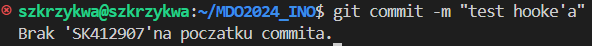

Jak widać operacja nie doszła do skutku i pojawiła nam się informacja o błędzie.

Poprawnie wykonany commit:

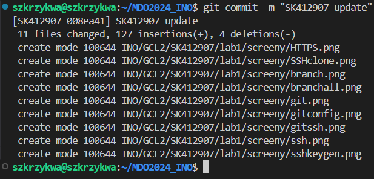

### 7. Próba wciągnięcia swojej gałęzi do gałęzi grupowej GCL2

Aby wciągnąć swoją gałąź do gałęzi nadrzędnej (grupowej) należy najpierw przenieść się na tą gałąź:

    git checkout GCL2

### 8. Zainstalowanie Docker'a

Docker'a instalujemy za pomocą komendy:

    sudo apt install docker

Następnie, aby usprawnić operowanie nim dodałem go do grupy, w której znajduje się aktualnie używane przeze mnie konto użytkownika. Użyłem do tego komend:

    sudo groupadd docker
    sudo gpasswd -a $USER docker
    newgrp docker

### 9. Pobieranie obrazów

Następnie pobrałem ze strony Docker'a obrazy: hello-world, busybox, ubuntu i mysql. Przed przystąpieniem do tej czynności zarejestrowałem się na stronie Docker'a i przeczytałem informacje dotyczące powyższych obrazów. Pobieranie następuje po podaniu komendy:

    docker pull nazwa_obrazu

Czyli w moim przypadku:

    docker pull hello-world
    docker pull busybox
    docker pull ubuntu
    docker pull mysql

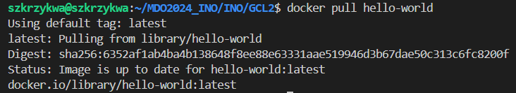

Pobrane obrazy można sprawdzić poprzez użycie komendy 

    docker images

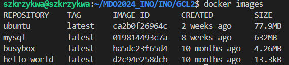

### 10. Uruchamianie kontenerów

Kontenery uruchamiane są przy pomocy komendy:

    docker run nazwa_kontenera

Wedle instrukcji należało uruchomić kontener busybox. Można to zrobić na dwa sposoby:

1. Podstawowy sposób, który od razu kończy działanie uruchamianego kontenera:

    docker run busybox

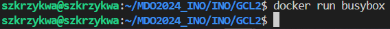

Uruchomienie busybox'a w taki sposób nie wyświetla nic na ekranie jednak przy pomocy komendy:

    docker container list --all

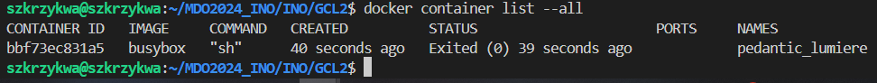

możemy zauważyć, że busybox zakończył swoje działanie.

2. Uruchomienie interaktywnie dopisując -it:

    docker run -it busybox

Uruchamianie interaktywne pozwala nam na poruszanie się wewnątrz kontenera. Do wywołania numeru wersji busybox'a używamy komendy (po odpaleniu busybox'a interaktywnie):

    cat --help

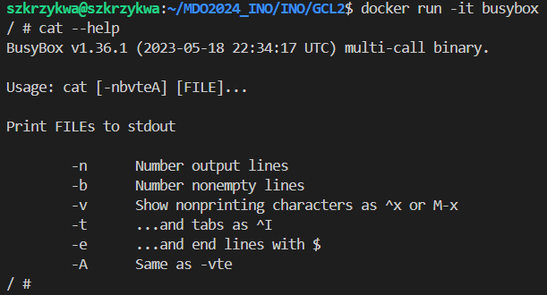

Z kontenera wychodzimy za pomocą:

    exit

Następnie mieliśmy uruchomić "system w kontenerze". W moim przypadku jest to wcześniej pobrane ubuntu. Dla tego etapu uruchomiłem drugi terminal, aby monitorować działanie tego kontenera. Uruchomiłem kontener ubuntu:

    docker run -it ubuntu

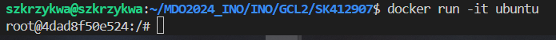

Widok z drugiego terminala po uruchomieniu:

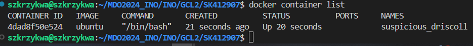

Kolejnym punktem było pokazanie PID1 i zaprezentowanie procesów dockera na hoscie. Do tego wykorzystamy funkcję:

    ps -aux

Poszykiwany przez nas element znajduje się pod numerem procesu 1:

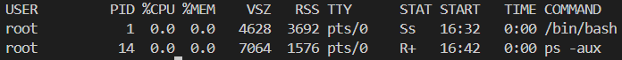

Do sprawdzenia procesów na hoscie wywołujemy listę działąjących kontenerów. Z niej wybieramy ID interesującego nas kontenera i przy pomocy komendy:

    docker top ID_kontenera

otrzymujemy listę procesów.

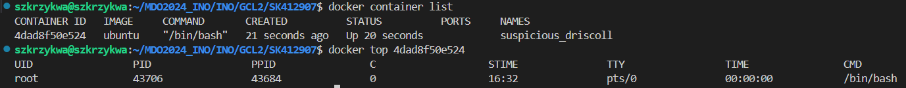

Następnie przeszliśmy do zaaktualizowania pakietów. Dokonujemy tego poprzez wpisanie komend:

    apt update

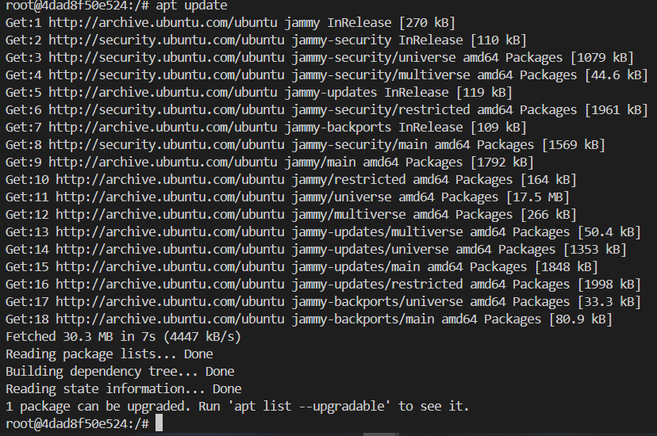

która pokazuje nam możliwe aktalizacje. Potem wpisujemy:

    apt upgrade

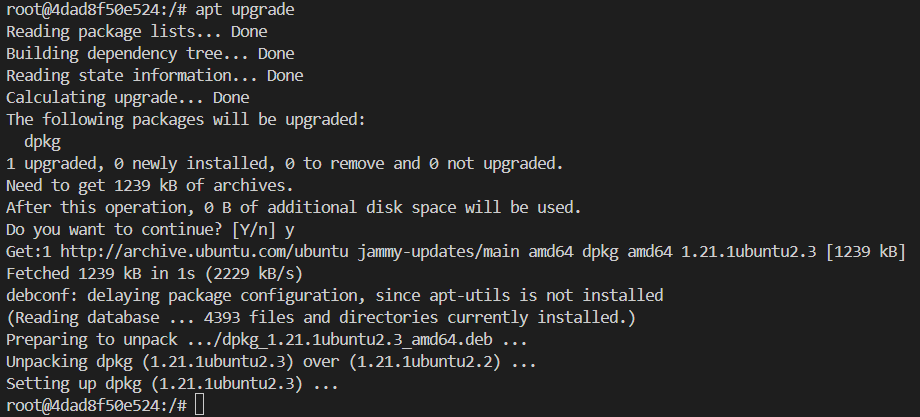

i potwiedzamy chęć aktualizacji pakietów.

Na koniec wychodzimy z kontenera przy pomocy:

    exit

### 11. Tworzenie pliku Dockerfile

Następnym krokiem naszego laboratorium było stworzenie pliku Dockerfile bazującym na wybranyn systemie, który ma sklonować nasze repoztyorium. W moim przypadku będzie to również ubuntu. Przed przystąpieniem do jakichkolwiek działań informacje o dobrych praktykach z linku umieszczonego w opisie zadania.

Na początku naszego pliku umieszczamy zapis:

    FROM ubuntu:latest

który sprawia, że wykorzystujemy ostatnią wersję ubuntu.

Następnie aktualizujemy pakiety i zapwniamy, aby obraz miał git'a. W tym celu dodajemy komendę:

     RUN apt-get update && apt-get install -y git ssh

### 12. Czyszczenie kontenerów i obrazów

Wykonywane jest poprzez komendę:

    docker rmi $(docker images -a -q)

### 13. Wystawienie Pull Request'a

Pull request'a wykonałem po wykonananiu wszystkich wymaganych kroków. Przy tej operacji ważne jest, aby jako gałąź, do której wystawiamy zapytanie wybrać gałąź swojej grupy.