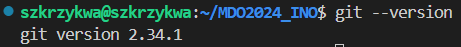
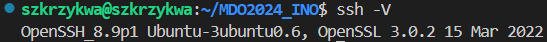
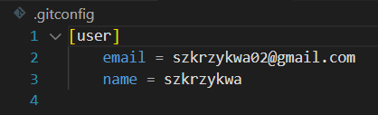
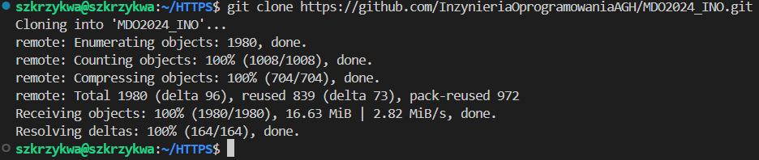
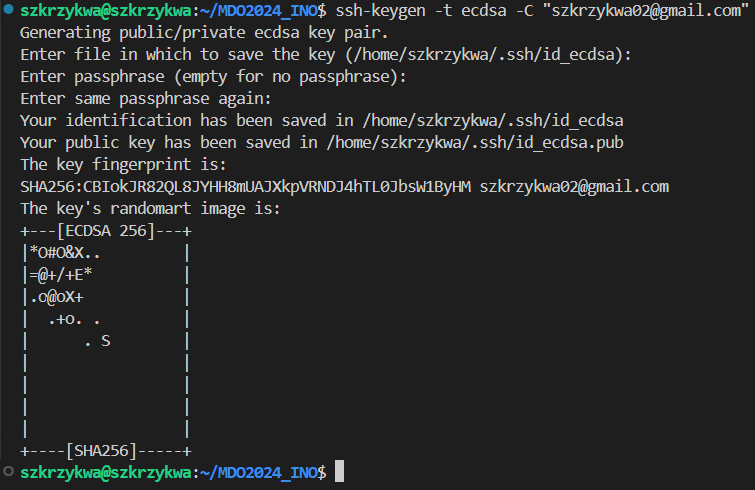
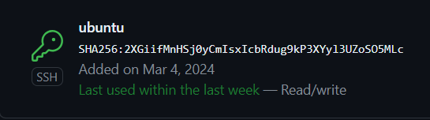
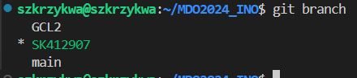
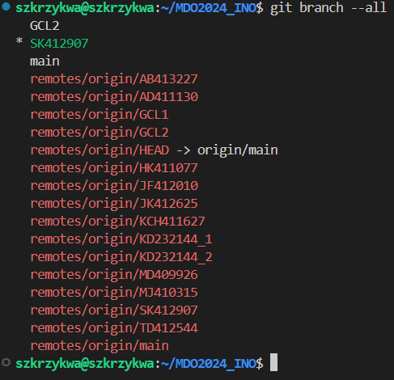

# Sprawozdanie 1
Szymon Krzykwa
Inżynieria Obliczeniowa gr 2

## Cel laboratorium

Celem tych laboratoriów było przygotowanie oraz zaznajomienie się z obsługą git'a oraz Docker'a. Dowiedzieliśmy się jak wygenerować klucz SSH, stworzyć oraz poruszać się pomiędzy gałęziami repozytorium, co to hooki git'a, a na koniec zainstalowaliśmy oraz uruchomiliśmy Docker'a.

## Wykonanie

### 1. Zainstalowanie git'a oraz obsługa SSH

Przed przystąpieniem do laboratoriów zainstalowałem maszynę wirtualna, a na niej umieściłem serwer Ubuntu. W jej trakcie zaznaczyłem opcję, która pobrała OpenSSH. Git jest standardową częścią Linuxa, więc w celu sprawdzenia, czy aby na pewno wszystko jest dobrze uruchomiłem komendę pokazującą akutalną wersję git'a:

    git --version

Dodatkowo, aby sprawdzić czy na pewno zostało pobrane OpenSSH wpsiałem do terminala:

    ssh -V

Informacje wypisane w terminalu udawadniaja nam zainsatlowanie klienta oraz możliwość obsługi kluczy SSH.

### 2. Sklonowanie repozytorium przy pomocy HTTPS'a

Aby sklonować repozytorium przy pomocy HTTPS'a należy wejść na github'a na repozytorium, a następnie skopiować z odpowiedniej zakładki specjalny link. W terminalu należy podać następującą komendę.

    git clone https://github.com/InzynieriaOprogramowaniaAGH/MDO2024_INO.git

Zanim przejdziemy do wpisania naszej komendy do terminala musimy potwierdzić, że klonowanie repozytorium następuje przez nas. W moim przypadku używam VSCode'a, a w nim rozszerzenie Remote SSH, które pozwala mi na wpisanie swoich danych wewnątrz pliku 
.gitconfig.

Kiedy dokonaliśmy wymaganych zmian możemy przejśc to wpisania komendy podanej wyżej. Poprawnie przeprowadzone klonowanie prowadzi do pojawienia się w konsoli poniższych komunikatów:

### 3. Sklonowanie repozytorium przy pomocy SSH / Generowanie klucza SSH

- Utworzenie kluczy SSH

Klucze SSH pozwalają nam na połączenie zdalne z githubem. Dzięki nim edycja plików nie musi następować dopiero na stronie, lecz poprzez podanie do terminala odpowiednich komend, które przesyłają zmienione przez nas pliki do naszego repozytorium. Generowanie takiego klucza następuje poprzez komendę:

    ssh-keygen

Każdy wygenerowany klucz ma swoje dwie wersje (publiczną i prywatną). Publiczna wersja klucza służy nam właśnie do nawiązania wspomnianego wcześniej połączenia. 

Wpisałem komendy do wygenerowania kluczy:

    ssh-keygen -t ecdsa -C "szkrzykwa02@gmail.com"
    ssh-keygen -t ed25519 -C "szkrzykwa02@gmail.com"

Dla jednego z nich dodałem hasło, które należy podać w momencie ich generowania. Prywatne wersje kluczy należy dodać do ssh-agent'a, który zarządza tymi kluczami. Dokonujemy tego poprzez komendy:

    eval "$(ssh-agent -s)"

Słuzącej nam do wygenerowania numeru PID.

    ssh-add ~/.ssh/id_ecdsa
    ssh-add ~/.ssh/id_ed25519

Które dodają nasze klucze do agenta.

Zrzut ekranu generowania jednego z kluczy:

Wszystkie wygenerowane przez nas klucze znajdują się w folderze .ssh.

- Konfiguracja z GitHub'em

Kopiujemy zawartość naszego pliku z kluczem publicznym. Możemy się do niej dostać poprzez wejście do pliku z kluczem znadującym się w folderze .ssh lub przy pomocy komendy:

    cat ~/.ssh/id_ed25519.pub

Po skopiowaniu udajemy się do ustawień naszego konta na GitHub'ie i w zakładce SSH and GPG keys dodajemy nasz nowy klucz poprzez nadanie mu nazwy oraz wklejenie zawartości naszego klucza. Poprawnie dodany klucz powinien pokazywać się w następujący sposób:

- Sklonowanie repozytorium przy użyciu SSH

Podobnie jak w przypadku użycia HTTPS wchodzimy do naszego repozytorium i z odpowiedniej zakładki kopiujemy link SSH. Klonujemy nasze repozytorium:

    git clone git@github.com:InzynieriaOprogramowaniaAGH/MDO2024_INO.git

Zrzut ekranu z poprawnie sklonowanego repozytorium

### 4. Tworzenie własnej gałęzi

Gałęzie (branch) w Git'ie służą nam do możliowści pracy nad jednym repozytorium przez wiele osób w sposób zsynchornizowany. Po wejściu do folderu ze sklonowanym repozytorium możemy sprawdzić jakie są istniejące gałęzie. Dokonujemy tego poprzez wpisanie komendy:

    git branch 

lub dla dokładniejszego poglądu:

    git branch --all

Początkowo znajdujemy się w gałęzi main, lecz wedle polecenia laboratorium przenosimy się do gałęzi GCL2 (gałęzi mojej grupy). Dokonujemy tego poprzez komendę:

    git checkout GCL2

Po przejściu do gałęzi grupy należało stworzyć swoją własną gałąź. Jej składnia to (INICJAŁY)(NUMER_INDEKSU). Gałąź tworzona jest w następujący sposób:

    git checkout -b SK412907

Będąc już w swojej gałęzi stowrzyłem folder o takiej samej składni, a w nim folder lab1, gdzie znajduje się to sprawozdanie.    

### 5. Napisanie Git Hooke'a

Napisałem Git Hooke'a, który sprawdza czy każdy wykonwany przeze mnie commit ma na początku swojej wiadomości napisane SK412907. Wewnątrz folderu .git/hooks znajdują szablony przykładowych hook'ów i z posród nich skorzystałem z commit-msg.sample, który wypisuje do terminala określoną przez nas informację. 

    COMMIT_MSG_FILE=$1

    if ! grep -q '^SK412907' "$COMMIT_MSG_FILE"; then
        echo >&2 "Brak 'SK412907'na poczatku commita."
        exit 1
    fi

Zapis '^SK412907' sprawdza czy na początku commit'a znajduje się odpowiedni zapis i w przypadku niepowodzenia tej operacji zwraca nam informację o niepoprawności. Aby stworzony przez nas hooke działał należy umieścić go we wspominianym wcześniej folderze .git/hooks

### 6. Commit przeprowadzonych zmian

Sprawdzamy czy wykonany przez nas hooke działa poprawnie

### 7. Instalacja Docker'a