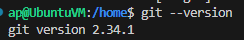
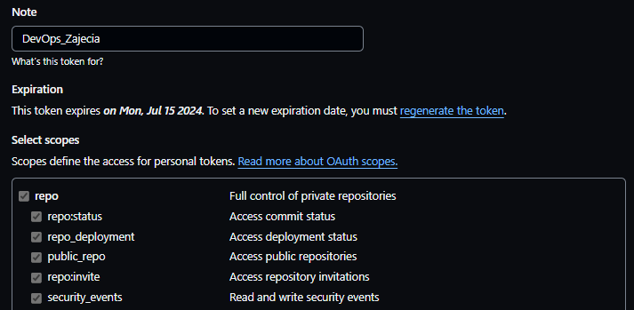
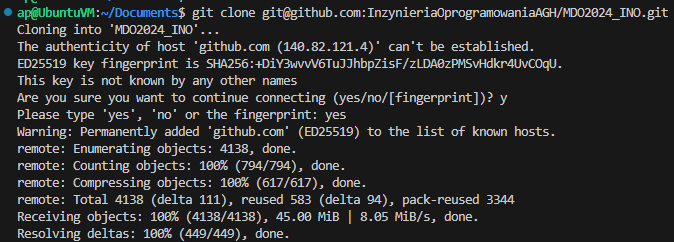
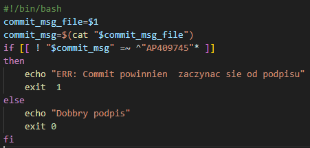

# Sprawozdanie 1
Andrzej Piotrowski, IT
DevOps GCL4

## Cel Zajęć
Celem pierwszych dwóch zajęć było przygotowanie środowiska pracy na którym w dalszym toku programu przedmiotu będzie pracować - w tym celu zainstalowano, zkonfigurowano i zapoznano się z działaniem Git'a i Docker'a.

## Streszczenie

Pierwsze zajęcia przeznaczono na zapoznanie się z klientem Git - w tym celu pobraliśmy obraz maszyny wirutalnej, klienta Git, skonfigurowaliśmy mu dostęp i wykonaliśmy kilka prostych zadań w celu zaznajomienia się z jego najważniejszymi komendami.
Drugie zajęcia natomiast zostały przeznaczone na przygotowanie kontenerów w ramach platformy Docker - XXXXXXXXXXX

## Przygotowanie Git'a i pobranie repozytorium
Zajęcia rozpocząłem od pobrania obrazu maszyny wirtualnej jaką jest system Ubuntu w wersji 22.04.4 LTS dla hiperwizora VirtualBox. W swojej decyzji kierowałem się popularnością obydwu rozwiązań, jak i też wcześniejszym doświaczeniem z obydwiema technologiami. Łącze z maszyną przebiegało poprzez wtyczkę Remote-SSH będącą rozszerzeniem do VS Code.
Jako, że klient SSH był już zainstalowany na obrazie maszyny, musiałem pobrać jedynie klienta Git. Użyłem do tego wbudwanego systemu zarządzania pakietami APT poprzez polecenie:
````
sudo apt install git
````
A następnie sprawdziłem poprawność instalacji wywołując komendę sprawdzającą numer zainstalowanej wersji
````
git --version
````

Jako, że instalacja poszła pomyślnie, przeszedłem do klonowania repozytorium przedmiotowego za pomocą protokołu HTTPS oraz personal access token. Token był tworzony na stronie GitHub'a, po wejściu w ustawienia Konta (Settings) > developer settings > Personal access tokens > Tokens (classic). Wymagał on zdefiniowania jego terminu ważności oraz tego na jakie akcje mógł pozwalać.

Po wygenerowaniu tokenu, przeszedłem do pobrania repozytorium za pomocą komendy git clone. Trzeba tu zaznaczyć, że klonowane repozytorium jest kopiowane do aktualnego katalogu w którym się znajdujemy, dlatego wcześniej należało przygotować odpowiedni folder zajęciowy, żeby repozytorium nie wymieszzło się z innymi danymi.
````
git clone https://github.com/InzynieriaOprogramowaniaAGH/MDO2024_INO.git
````

Następnie należało pobrać repozytorium przy pomocy kluczy SSH, w tym celu wygenerowałem dwa klucze Ed25519 poniższymi komendami, dodałem nie-zahasłowany klucz do GitHub'a(zakładka Settings > SSH and GPG keys)
````
ssh-keygen -t ed25519 -b 4096
ssh-keygen -t ed25519 -b 4096 -N 'haslo123'
````
`-t` wybór algorytmu dla klucza
`-b` jego długość (bit)
`-N` passpphrase klucza (hasło)

Następnie za pomocą SSH sklonowałem repozytorium przedmiotowe. 
Jako, że pobieranie się udało, miałem teraz dwa razy sklonowane repozytorium przedmiotowe. Było to zbędne więc usunąłem repozytorium pobrane przez SSH i dalszą pracę wykonywałem na repozoytorium pobranym przez HTTPS.



## Przygotowanie gałęzi lokalnej i praca na niej
Gałęzie (Branch) w Gitcie to różne linie rozwoju projektu, które pozwalają programistom pracować niezależnie nad różnymi funkcjami lub poprawkami. Moi zadaniem w tej części było przełączenie się między gałziami, a ostatecznie stworzenie własnej. W celu sprawdzenia wszystkich istniejących gałęzi skorzystałem z polecenia
````
git branch --all
````
Zwróciło mi ono nazwy dostępnych gałęzi, abym następnie mógł poleceniem `git checkout [gałąź]` przełączyć się najpierw do gałęzi main, następnie do gałęzi labolatoryjnej, a ostatecznie utworzyć własną, tym razem używając `git checkout -b [Iniciały+NumerIndeksu]`. Użycie `-b` powoduje, że przełączymy się do nowo postwałej gałęzi o podanej nazwie.

Wewnątrz swojej gałęzi utworzyłem katalogi domowy, sprawozdania i zdjęciowy komendą `mkdir` oraz stworzyłem odpowiedni plik na sprawzodanie - README.md komendą `touch`.

Kiedy to już zostało ukończone, należało stworzyć własnego git-hook'a który miał za zadanie spawdzać czy commit-message zaczynał się od połączenia inicjałów i numeru indeksu. W tym celu zmodyfikowana przykładowy skrypt zawartego w pliku `commit-msg` w katalogu `.git/hooks`.


Niestety natrafiłem tutaj na problem podczas testowania, choć skrypt który napisałem był w bash'u to oznaczyłem go jako skrypt powłoki. W wyniku prób testowania tego skryptu powstało kilkanaście commitów testowych, zanim udało mi się go poprawić. (Problemem był sposób w jaki obydwa skrypty widziału podwójny nawias [[]])
