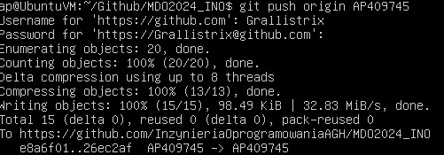
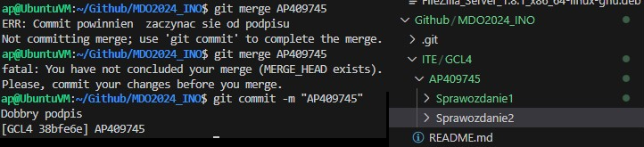
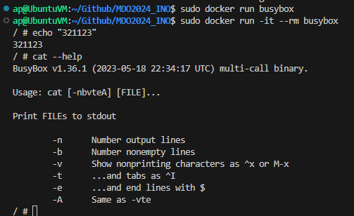
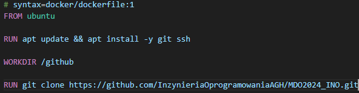
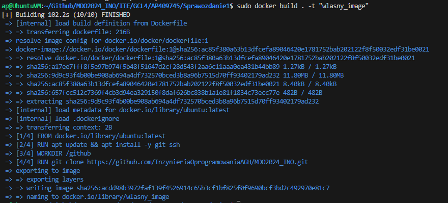
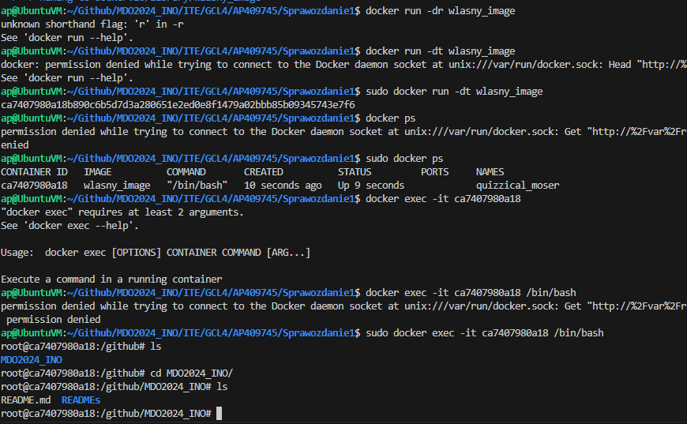
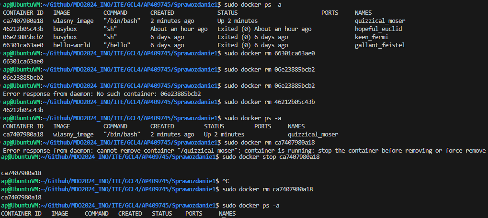

# SPRAWOZDANIE 1
Andrzej Piotrowski, IT
DevOps GCL4

## Cel Zajęć
Celem pierwszych dwóch zajęć było przygotowanie środowiska pracy na którym w dalszym toku programu przedmiotu będzie pracować - w tym celu zainstalowano, skonfigurowano i zapoznano się z działaniem Gita i Dockera.

## Streszczenie Zajęć
Pierwsze zajęcia przeznaczono na zapoznanie się z klientem Git - w tym celu pobraliśmy obraz maszyny wirutalnej, klienta Git, skonfigurowaliśmy mu dostęp do zdalnego repozytorium i wykonaliśmy kilka prostych zadań w celu zaznajomienia się z jego najważniejszymi komendami i zasadą działania gałęzi.
Drugie zajęcia natomiast zostały przeznaczone na przygotowanie platformy Docker - jej zainstalowanie, rejestrację w DockerHubie, pobranie kilku obrazów kontenerów i ich uruchomieniu, a ostatecznie zbudowanie i przetestowanie własnego obrazu.

# CZĘŚĆ 1 - GIT
## Przygotowanie Gita i pobranie repozytorium
Zajęcia rozpocząłem od pobrania obrazu maszyny wirtualnej jaką jest system Ubuntu w wersji 22.04.4 LTS dla hiperwizora VirtualBox. W swojej decyzji kierowałem się popularnością obydwu rozwiązań, jak i też wcześniejszym doświadczeniem z obydwiema technologiami. Łącze z maszyną przebiegało poprzez wtyczkę Remote-SSH będącą rozszerzeniem do VS Code. Adres IP do łączenia się z maszyną uzyskałem poprzez komendę `ip a`, która to zwróciła jego wartość dla interfejsu sieciowego enp0s3 (ethernet network peripheral 0 serial 3).

Jako, że klient SSH był już zainstalowany na obrazie maszyny, musiałem pobrać jedynie klienta Git. Użyłem do tego wbudwanego systemu zarządzania pakietami APT poprzez polecenie:
````
sudo apt install git
````
A następnie sprawdziłem poprawność instalacji wywołując komendę sprawdzającą numer zainstalowanej wersji
````
git --version
````

Jako, że instalacja poszła pomyślnie, przeszedłem do klonowania repozytorium przedmiotowego za pomocą protokołu HTTPS oraz personal access token. Token był tworzony na stronie GitHuba, po wejściu w ustawienia Konta (Settings) > developer settings > Personal access tokens > Tokens (classic). Wymagał on zdefiniowania jego terminu ważności oraz tego na jakie akcje mógł pozwolić.

Po wygenerowaniu tokenu, przeszedłem do pobrania repozytorium za pomocą komendy git clone. Trzeba tu zaznaczyć, że sklonowane repozytorium jest kopiowane do aktualnego katalogu w którym się znajdujemy, dlatego wcześniej należało przygotować odpowiedni folder zajęciowy, żeby repozytorium nie wymieszało się z innymi danymi.
````
git clone https://github.com/InzynieriaOprogramowaniaAGH/MDO2024_INO.git
````

Następnie należało pobrać repozytorium przy pomocy kluczy SSH, w tym celu wygenerowałem dwa klucze Ed25519 poniższymi komendami, dodałem nie-zahasłowany klucz do GitHuba(zakładka Settings > SSH and GPG keys)
````
ssh-keygen -t ed25519 -b 4096
ssh-keygen -t ed25519 -b 4096 -N 'haslo123'
````
- `-t` wybór algorytmu dla klucza
- `-b` jego długość (bit)
- `-N` passphrase klucza (hasło)

Następnie za pomocą SSH sklonowałem repozytorium przedmiotowe.
Jako, że pobieranie się udało, miałem teraz dwa razy sklonowane repozytorium przedmiotowe. Było to zbędne więc usunąłem repozytorium pobrane przez SSH i dalszą pracę wykonywałem na repozytorium pobranym przez HTTPS.


## Przygotowanie gałęzi lokalnej i praca na niej
Gałęzie (Branch) w Gitcie to różne linie rozwoju projektu, które pozwalają programistom pracować niezależnie nad różnymi funkcjami lub poprawkami. Moi zadaniem w tej części było przełączenie się między gałziami, a ostatecznie stworzenie własnej. W celu sprawdzenia wszystkich istniejących gałęzi skorzystałem z polecenia
````
git branch --all
````
Zwróciło mi ono nazwy dostępnych gałęzi, abym następnie mógł poleceniem `git checkout [gałąź]` przełączyć się najpierw do gałęzi main, następnie do gałęzi laboratoryjnej, a ostatecznie utworzyć własną, tym razem używając `git checkout -b [Iniciały+NumerIndeksu]`. Użycie `-b` powoduje, że przełączymy się do nowo powstałej gałęzi o podanej nazwie.

Wewnątrz swojej gałęzi utworzyłem katalogi: domowy, sprawozdania i zdjęciowy komendą `mkdir` oraz stworzyłem odpowiedni plik na sprawzodanie - README.md komendą `touch`.

Kiedy to już zostało ukończone, należało stworzyć własnego git-hooka który miał za zadanie sprawdzać czy commit-message zaczynał się od połączenia inicjałów i numeru indeksu. W tym celu zmodyfikowana przykładowy skrypt zawartego w pliku `commit-msg` w katalogu `.git/hooks`.


Niestety natrafiłem tutaj na problem podczas testowania, choć skrypt który napisałem był w bashu to oznaczyłem go jako skrypt powłoki. W wyniku prób testowania tego skryptu powstało kilkanaście commitów testowych, zanim udało mi się go poprawić. (Problemem był sposób w jaki obydwa skrypty rozumiały podwójny nawias [[]])

Następnie należało wysłać zmiany do swojej gałęzi lokalnej. W tym celu należało te zmiany dodać do śledzonych, zcommitować je i wypchnąć na swoją gałąź, odpowiednio tymi trzema komendami.
````
git add
git commit
git push
````


Ostatnim krokiem było wciągnięcie zmian ze swojej gałęzi na gałąź grupy. W tym celu użyto `git checkout` do przełączenia się między gałęziami do gałęzi GCL4 i komendy `git merge [NazwaGałęziOsobistej]` w celu ich scalenia. W związku z tym do zsynchronizowano lokalną wersję gałęzi grupowej z moją osobistą gałęzią.


# CZĘŚĆ 2 -  DOCKER
## Instalacja Dockera i obrazów
Zajęcia zaczęto od przygotować repozytorium Dockera dla systemu zarządzania pakietami `apt`. W tym celu dodano pobrano jego klucze poprzez klienta URL `cURL` w sposób zgodny z dokumentacją Dockera, gdyż nie wchodzi on w skład domyślnie śledzonych pakietów.
````
sudo apt-get update
sudo apt-get install ca-certificates curl
sudo install -m 0755 -d /etc/apt/keyrings
sudo curl -fsSL https://download.docker.com/linux/ubuntu/gpg -o /etc/apt/keyrings/docker.asc
sudo chmod a+r /etc/apt/keyrings/docker.asc
sudo apt-get update
````
Po dodaniu Dockera do repozytorium, użyto `apt` do właściwego pobrania pakietów Dockera.


Po zainstalowaniu Dockera, założyłem konto na DockerHubie i zaznajomiłem się z obrazami z którymi będę pracował:
- `hello-world` - najprostszy możliwy kontener, służy do testowania czy Docker działa poprawnie.
- `busybox` - zestaw najważniejszych narzędzi UNIXowych, używany najczęściej do tworzenia kontenerów testujących i automatyzujących.
- `mysql` - kontener bazy danych MySQL.
- `ubuntu` - obraz symulujący środowisko systemu Ubuntu.


## Uruchamianie obrazów
Po zainstalowaniu Dockera i zaznajomieniu się z obrazami na DockerHubie ściągnąłem określone w instrukcji obrazy za pomocą komendy `docker pull [nazwaObrazu]`. Pobrano obrazy: `hello-world`, `busybox`, `mysql`, `ubuntu` oraz `fedora`. Po pobraniu uruchomiono `hello-world` w celu sprawdzenia czy instalacja przebiegła pomyślnie. Warto tutaj nadmienić, że używanie Dockera domyślnie musi odbywać się poprzez poprzedzenie komend `sudo`. Jest to spowodowane tym, że demon Dockera łączy się z socketem `/var/run/docker.sock`, którego właścicielem jest root. Oznacza to, że domyślnie tylko root (albo osoba z jego uprawnieniami) może korzystać z Dockera. Aby to zmienić trzeba utworzyć grupę `docker` i dodać do niej użytkowników. Wtedy demon (który jednak nadal działa jako root) będzie nadawał uprawnienia dostępu do socketu użytkownikom tylko podczas uruchomienia, eliminując problem przywilejów.


Po pomyślnym teście, uruchomiłem kontener `busybox` dwukrotnie - raz bez żadnej ingerencji (`docker run busybox`), a raz interaktywnie (z flagą `-it`). W przypadku zwykłego kontener natychmiast po uruchomieniu się wyłącza. Jest to spowodowane faktem, że kontener nie dostał żadnej instrukcji - więc kończy swoje działanie. W wersji interaktywnej użyto komendy `cat --help` w celu dostania informacji o wersji, gdyż pierwsza linijka opisu flagi `--help` zawiera notatkę o wersji Busyboxa. Wyjście z niego możliwe jest albo przez użycie komendy `exit` albo skrótu `Ctrl+D`.
Warto tu też wspomnieć o używaniu flagi --rm, która sprawia, że po zakończeniu pracy kontenera jest on usuwany, oszczędzając tym samym miejsce na dysku. Jest to niezwykle przydatne przy pracy z kontenerami, które mają za zadanie istnieć tylko przez krótki okres czasu.


Następnie uruchomiono kontener na bazie obrazu `ubuntu`, także z flagami `-it` oraz `--rm`. Użyto komendy `ps` w celu wyświetlenia aktywnym procesów, w tym procesu `PID1`. Zaktualizowałem pakiety przy użyciu `apt update`, i ostatecznie zakończyłem działanie kontenera poprzez `exit`.


## Własnoręcznie zbudowany Dockerfile
Kolejnym krokiem było utworzenie własnego, prostego pliku Dockerfile bazującego na systemie Ubuntu i użycie go do sklonowania repozytorium laboratoryjnego. Kierując się dobrymi praktykami [opisanymi pod tym linkiem](https://docs.docker.com/develop/develop-images/dockerfile_best-practices/). Najpierw aktualizował on wszystko swoje pakiety, potem instalował SSH i Gita, tworzył katalog roboczy `/github` a następnie w nim klonował repozytorium.


Obraz został zbudowany przy pomocy komendy `docker build [lokalizacjaDockerfile] -t "NazwaNaszegoObrazu`, z czego flaga `-t` odpowiedzialna była za otagowanie obrazu wybraną przez siebie nazwą. Jako, że plik Dockerfile został utworzony w tej samej lokalizacji w której przebywałem, to mogłem użyć `.` jako znacznika lokalizacji. Po zbudowaniu, uruchomiłem go z flagą `-d` (detached), przez co kontener został odpalony w tle. Po odczekaniu kilku minut, uruchomiłem kontener w trybie interaktywnym poprzez `docker exec -it [IdKontenera]` i sprawdziłem czy repozytorium zostało pobrane - co jak najbardziej się udało.




Po wyjściu z tego kontenera, komendą `docker ps -a` sprawdziłem listę uruchomionych kontenerów - jako że większość czasu korzystałem z flagi `-rm`, to było ich tylko 4. Trzy z nich były zdezaktywowane, więc można je było prosto usunąć komendą `docker rm [IdKontenera]`, ale kontener ubuntu nadal działał. Trzeba go była najpierw zastopować komendą `docker stop [IdKontenera]`, a dopiero potem usunąć.


Ostatnim krokiem było usunięcie wszystkich obrazów. W tym celu najpierw wypisałem ich listę poprzez `docker images`, zawierała wszystkie pobrane obrazy oraz osobiście zbudowany. Samo usuwanie odbywało się komendą `docker rmi $(docker images -a -q)`. Samo `docker rmi [IdObrazu]` usuwa obraz o danym ID, a `$(docker images -a -q)` zwraca listę ID wszystkich istniejących obrazów jako zmienną "do usunięcia".
