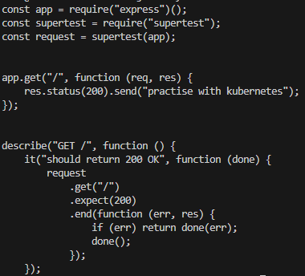
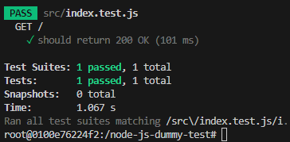
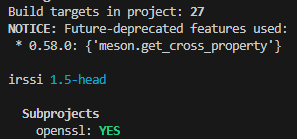
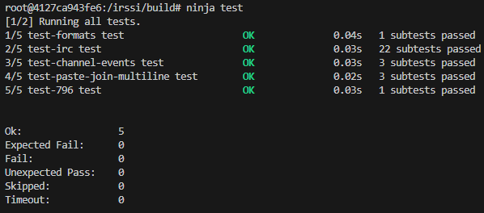
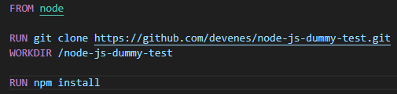
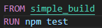
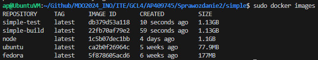
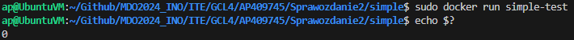
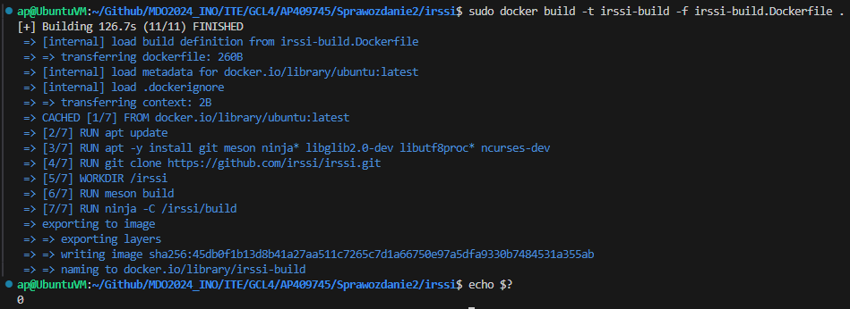
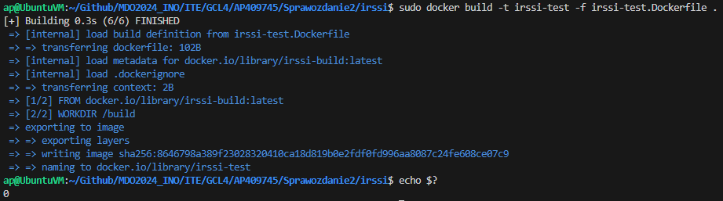

# SPRAWOZDANIE 2
Andrzej Piotrowski, IT
DevOps GCL4

## Cel Zajęć
Labolatoria koncentrowały się na przeprowadzeniu operacji build i testowania dla dwóch programów, poprzez tworzenie plików Dockerfile automatyzujących te procesy; tworzeniu woluminów i komunikacji między kontenerami.

# CZĘŚĆ 1 - DOCKERFILE, BUILD, TEST
## Wybór programów
Do pracy na zajęciach wybrano dwa programy jakimi były:
    - Irssi - https://github.com/irssi/irssi
    - Simple To Do - https://github.com/devenes/node-js-dummy-test

Wybrałem te repozytoria ze względu na ich otwarte licencje (GNU GENERAL PUBLIC LICENSE dla Irssi oraz Apache License Version 2.0 dla Simple To Do), obydwa mogłby być budowane i testowane przez odpowiednie narzędzia (meson i ninja dla Irssi oraz NPM dla Simple To Do) oraz zawierały zestaw testów do sprawdzenia poprawności.

## Simple To Do - ręcznie
Jako, że program Simple To Do jest programem node'owym, wymagało to pobrania obrazu najnowszej wersji node'a poprzez `docker pull node`
Następnie uruchomiono kontener przez `sudo docker un --rm -it node /bin/bash`. 
Zaktualizowano wszystkie pkaiety oraz pobrano gita komendami `apt update` oraz `apt install git`
Sklonowano repozytorium `git clone https://github.com/devenes/node-js-dummy-test.git`
Przeszedłem do folderu ze sklonowanym repozytorium `cd simple-js-dummy-test` oraz zainstlowałem jego zależności przez `npm install`
Ostatecznie uruchomiłem test za pomocą komendy `npm run test`, która to uruchomiła skrypt testowy "test" zdefiniowany w package.json. Skrpt ten uruchamiał poniższy kod:

Jak widać poniżej, test przeszedł pomyślnie


## Irssi - ręcznie
Jako aplikacja napisana w C, środowiskiem uruchomienia Irssi był obraz Ubuntu, zainstalowany na poprzednich zajęciach, który uruchomiono komendą `sudo docker run --rm -it ubuntu`
Tak jak wcześniej, zaktualizowano pakiety i zainstalowano git'a, ninja oraz meson poprzez `apt install git meson ninja* gcc`
Sklonowano repozytorium Irssi `git clone https://github.com/irssi/irssi` i próbowano zbudować aplikację przez `meson build`, co neistety spotkało się z błędem związanym z brakiem odpowiednich zależności

Zgodnie z błędem, należało doinstalować glib-2.0 oraz pkg-config. Tak jak wcześniej, użytu `apt install` do ich zainstalowania i jeszcze raz zbudowano.
Niestety nadal brakowało kilku zależności, po sprwadzeniu dokumentacji instalacji (pliku INSTALL), zainstalowano je wszystkie komendą `apt -y install libglib2.0-dev libutf8proc* ncurses-dev`
Następnie pomyślnie zbuodwano i przetestowano zbudowany program poprzez następujący ciąg komend. Testo przeszedł pomyślnie
```
meson build
ninja -C build
cd build/
ninja test
```



## Simple To Do - automatyzacja przy pomocy Dockerfile
W celu automatyzacji całego porceus utworzyłem dwa pliki - simple-build.Dockerfile oraz simple-test.Dockerfile. Pierwszy z nich ma słuzyć do budowania, a drugi do testowania.
Pierwszym był simple-build.Dockerfile

`FROM` - wymusza użycie danego obrazu środowiska (w tym przypadku Node.js)
`RUN` - określa instrukcję do wywołania podczas tworzenia kontenera
`WORKDIR` - wyznacza folder roboczy

Drugi plik simple-test.Dockerfile 

`FROM simple-build` oznacza, że używamy obrazu simple-build

Następnie stowrzono obraz budujący `sudo docker build -t simple-build -f simple-build.Dockerfile .` oraz testujący `sudo docker build -t simple-test -f simple-test.Dockerfile .`


W celu sprawdzenia czy obrazy zostały stworzone poprawnie, używma `docker run [obraz]` w celu przetestowania obydwu. Jednak, nie zwracają one wyniku na konsolę, więc musze posłużyć się `echo $?` w tym celu. Jako, że ubydwa kontenery testujący zwrócił zero, można założyć, że obydwa działają prawidłowo.


## Irssi - automatyzacja przy pomocy Dockerfile

Dla Irssi działamy analogicznie, tworząc dwa pliki Dockerfile - irssi-build oraz irssi-test.
```
sudo docker build -t irssi-build -f irssi-build.Dockerfile .
sudo docker build -t irssi-test -f irssi-test.Dockerfile .
```
Jak można zauważyć, obydwa kontenery zwrócił prawidłowy wynik - zatem doszło do poprwanego zbudowania programu i jego przetestowania



# CZĘŚĆ 2 -  WOLUMINY, PORT I JENKINS
