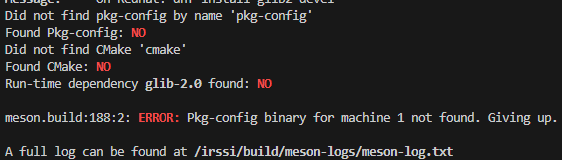
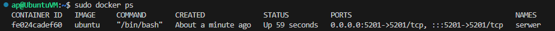

# SPRAWOZDANIE 2
Andrzej Piotrowski, IT
DevOps GCL4

## Cel Zajęć
Laboratoria koncentrowały się na przeprowadzeniu operacji build i testowania dla dwóch programów, poprzez tworzenie plików Dockerfile automatyzujących te procesy; tworzeniu woluminów i komunikacji między kontenerami.

# CZĘŚĆ 1 - DOCKERFILE - BUDWOANIE I TESTOWANIE
## Wybór programów
Do pracy na zajęciach wybrano dwa programy jakimi były:
    - Irssi - https://github.com/irssi/irssi
    - Simple To Do - https://github.com/devenes/node-js-dummy-test

Wybrałem te repozytoria ze względu na ich otwarte licencje (GNU GENERAL PUBLIC LICENSE dla Irssi oraz Apache License Version 2.0 dla Simple To Do), obydwa mogłby być budowane i testowane przez odpowiednie narzędzia (meson i ninja dla Irssi oraz NPM dla Simple To Do) oraz zawierały zestaw testów do sprawdzenia poprawności.

## Simple To Do - ręcznie
Jako, że program Simple To Do jest programem node'owym, wymagało to pobrania obrazu najnowszej wersji node'a poprzez `docker pull node`
Następnie uruchomiono kontener przez `sudo docker un --rm -it node /bin/bash`. 
Zaktualizowano wszystkie pakiety oraz pobrano gita komendami `apt update` oraz `apt install git`
Sklonowano repozytorium `git clone https://github.com/devenes/node-js-dummy-test.git`
Przeszedłem do folderu ze sklonowanym repozytorium `cd simple-js-dummy-test` oraz zainstalowałem jego zależności przez `npm install`
Ostatecznie uruchomiłem test za pomocą komendy `npm run test`, która to uruchomiła skrypt testowy "test" zdefiniowany w package.json. Skrypt ten uruchamiał poniższy kod:

Jak widać poniżej, test przeszedł pomyślnie


## Irssi - ręcznie
Jako aplikacja napisana w C, środowiskiem uruchomienia Irssi był obraz Ubuntu, zainstalowany na poprzednich zajęciach, który uruchomiono komendą `sudo docker run --rm -it ubuntu`
Tak jak wcześniej, zaktualizowano pakiety i zainstalowano git'a, ninja oraz meson poprzez `apt install git meson ninja* gcc`
Sklonowano repozytorium Irssi `git clone https://github.com/irssi/irssi` i próbowano zbudować aplikację przez `meson build`, co niestety spotkało się z błędem związanym z brakiem odpowiednich zależności

Zgodnie z błędem, należało doinstalować glib-2.0 oraz pkg-config. Tak jak wcześniej, użyto `apt install` do ich zainstalowania i jeszcze raz zbudowano.
Niestety nadal brakowało kilku zależności, po sprawdzeniu dokumentacji instalacji (pliku INSTALL), zainstalowano je wszystkie komendą `apt -y install libglib2.0-dev libutf8proc* ncurses-dev`
Następnie pomyślnie zbudowano i przetestowano zbudowany program poprzez następujący ciąg komend. Test przeszedł pomyślnie
```
meson build
ninja -C build
cd build/
ninja test
```


## Simple To Do - automatyzacja przy pomocy Dockerfile
W celu automatyzacji całego procesu utworzyłem dwa pliki - simple-build.Dockerfile oraz simple-test.Dockerfile. Pierwszy z nich ma służyć do budowania, a drugi do testowania.
Pierwszym był simple-build.Dockerfile

`FROM` - wymusza użycie danego obrazu środowiska (w tym przypadku Node.js)
`RUN` - określa instrukcję do wywołania podczas tworzenia kontenera
`WORKDIR` - wyznacza folder roboczy

Drugi plik simple-test.Dockerfile 

`FROM simple-build` oznacza, że używamy obrazu simple-build

Następnie stworzono obraz budujący `sudo docker build -t simple-build -f simple-build.Dockerfile .` oraz testujący `sudo docker build -t simple-test -f simple-test.Dockerfile .`


W celu sprawdzenia czy obrazy zostały stworzone poprawnie, używając `docker run [obraz]` w celu przetestowania obydwu. Jednak, nie zwracają one wyniku na konsolę, więc musze posłużyć się `echo $?` w tym celu. Jako, że obydwa kontenery testujący zwrócił zero, można założyć, że obydwa działają prawidłowo.


## Irssi - automatyzacja przy pomocy Dockerfile

Dla Irssi działamy analogicznie, tworząc dwa pliki Dockerfile - irssi-build oraz irssi-test.
```
sudo docker build -t irssi-build -f irssi-build.Dockerfile .
sudo docker build -t irssi-test -f irssi-test.Dockerfile .
```
Jak można zauważyć, obydwa kontenery zwrócił prawidłowy wynik - zatem doszło do poprwanego zbudowania programu i jego przetestowania


# CZĘŚĆ 2 -  WOLUMINY, PORT I JENKINS
## Tworzenie woluminow wejsciowych, ich montowanie i budowa programu
Tą część labolatoriów zaczęto od utworzenia dwóch woluminów - wejścoiiwego nazwanego vin oraz wyjściowego nazwanego vout, stworzono je za pomocą
```
docker volume create vin
docker volume create vout
```


Stworzyłem także kontener pomocniczy, w celu sklonowania projektu i jego zależności. W tym celu uruchomiłem kontener pomocniczy z obrazu ubuntu, montując do niego wolumin vin do katalaogu /irssi
`docker run --rm -it --mount source=vin,destination=/irssi ubuntu bash`
A następnie poprzez `git clone` klonuję repozytorium do katalogu irssi/ woluminu. Następnie uruchamiam kontener bazowy, podpinając obydwa katalogi wejściowy i wyjściowy.
`docker run --rm -it --mount source=vin,destination=/irssi --mount source=vout,destination=/irssi/build ubuntu bash`. Jak widać, po podpięciu jest dostępny katalog z woluminu vin.

Następnie zaktualizowałem pakiety i zainstalowałem wszelkie potrzebne zależności do Irssi, przeszedłem od katalogu i zbudowałem aplikację
```
apt update
apt -y install git meson ninja* libglib2.0-dev libutf8proc* ncurses-dev
cd irssi
meson build/
ninja -C /irssi/build
```
W celu sprawdzenia czy proces przeszedł pomyślnie, uruchamiam kontener z zamontowanym kontenerem wyjściowym. Jak widać, znajduje się w nim zbudowana aplikacja.
`docker run --rm -it --mount source=vout,destination=/irssi/build ubuntu bash`


## Eksponowanie portu
W celu wyeksponowania portu, uruchomiłem kontener z obrazu ubuntu `sudo docker run -it --rm --name iperf-serv ubuntu /bin/bash` i zainstalowałem na nim iperf3 poprzez `apt install iperf3`. Uruchomiłem go za pomocą `iperf3 -s`, a program zaczął nasłuchiwać na swoim domyślnym porcie - 5201. Uruchomiłem także kontener klienta, również bazujący na ubuntu `sudo docker run -it --rm --name iperf-klient ubuntu /bin/bash`, nak tórym również zainstalowałem iperf3.
Wykorzystałem komendę `docker inspect iperf-serv` w celu sprawdzenia ustawień sieciowych by wiedzeić pod jaki adres się od niego połączyć za pomocą `iperf -c <adres>`


## Połączenie kontenerów dedykowaną siecią
Dedykowaną sieć należało utworzyć komendą `docker network create -d bridge <nazwa>`. Utworzona przeze mnie siec miała nazwę `lokalna`.
Następnie uruchomiłem dwa kontenery z obrazu ubuntu, podłączone do tej sieci
```
docker run --rm -it --network lokalna --name serwer ubuntu /bin/bash
docker run --rm -it --network lokalna --name klient ubuntu /bin/bash
```
Sprawdziłem także stan sieci komendą `docker network inspect lokalna` po uruchomieniu obydwu kontenerów.

Inspekcja sieci pokazała, że jak najbardziej kontenery zostały z nią połączone, otrzymując adresy IP z jej puli (172.18.0.X). Docker automatycznie konfiguruje w takim przypadku sieć, pozwalając nam łączyć się pomiędzy kontenerami za pomocą ich nazw, zamiast adresów sieci.

## Połączenie Kontener z hostem
Jeśli urucomimiy kontener z funkcją przekierowywania portów, umożliwi to serwerowi iperf na połączenia z hostem, jednak będziemy się wtedy łączyć za pomocą IP hosta, a nie kontenera.




<table>
    <tr>
        <th>Połączenie</th>
        <th>Prędkość</th>
    </tr>
    <tr>
        <td>Domyślna Sieć Docker</td>
        <td>16.6 Gbits/sec</td>
    </tr>
    <tr>
        <td>Sieć Bridge</td>
        <td>19.4 Gbits/sec</td>
    </tr>
    <tr>
        <td>Host i Kontener</td>
        <td>21.9 Mbits/sec</td>
    </tr>
</table>

## Logi
W celu wyciągnięcia logów, można się posłużyć komendą `docker logs <nazwa kontenera>`, albo również zamontować wolumin do którego zapisywane byłyby logi. W tym celu utworzyłem kontener z zamonotwanym woluminem na logi `sudo docker run --rm -it --name serwer -p 5201:5201 -v logi:/logs ubuntu /bin/bash`, połączyłem się z nim, a logi przekierowałem do woluminu poprzez `iperf3 -s > /logs/iperf3.log`. Następnie zamknąłem kontener serwera, uruchomiłem kolejny i sprawdziłem czy logi zostały zapisane.


## Jenkins
W celu zainstalowani Jenkinsa, należy najpierw stworzyć dla niego sieć w ramach Dockera., a następnie użyć komendy `docker run` w celu konfiguracji i instalacj
.
Następnie należało tworzyc plik Dockerfile do tworzenia obrazu Jenkinsa
```
FROM jenkins/jenkins:2.440.2-jdk17
USER root
RUN apt-get update && apt-get install -y lsb-release
RUN curl -fsSLo /usr/share/keyrings/docker-archive-keyring.asc \
  https://download.docker.com/linux/debian/gpg
RUN echo "deb [arch=$(dpkg --print-architecture) \
  signed-by=/usr/share/keyrings/docker-archive-keyring.asc] \
  https://download.docker.com/linux/debian \
  $(lsb_release -cs) stable" > /etc/apt/sources.list.d/docker.list
RUN apt-get update && apt-get install -y docker-ce-cli
USER jenkins
RUN jenkins-plugin-cli --plugins "blueocean docker-workflow"
```
Zbudować obraz z pliku poprzez `sudo docker build -t myjenkins-blueocean:2.440.21 .` w katalogu z plikiem Dockerfile dla Jenkinsa. I ostatecznie uruchamiamy go.

```
docker run \
 --name jenkins-blueocean \
 --restart=on-failure \
 --detach \
 --network jenkins \
 --env DOCKER_HOST=tcp://docker:2376 \
 --env DOCKER_CERT_PATH=/certs/client \
 --env DOCKER_TLS_VERIFY=1 \
 --publish 8080:8080 \
 --publish 50000:50000 \
 --volume jenkins-data:/var/jenkins_home \
 --volume jenkins-docker-certs:/certs/client:ro \
 myjenkins-blueocean:2.440.21
 ```
Po zainstalowaniu i uruchomieniu możeby się połączyć ze stroną Jenkinsa, w celu odblokowania i zalogowania się. Hasła uzyskamy uzywając komendą `sudo docker exec <ID_Kontenera> cat /var/jenkins_home/secrets/initialAdminPassword`


