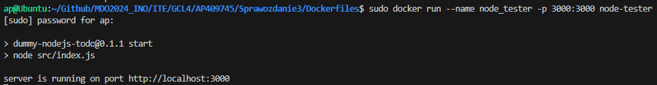
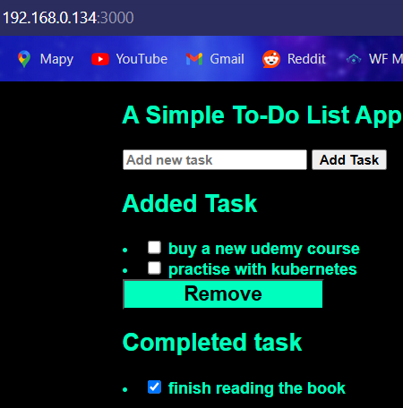
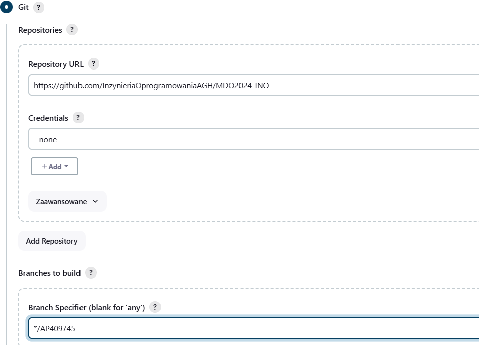
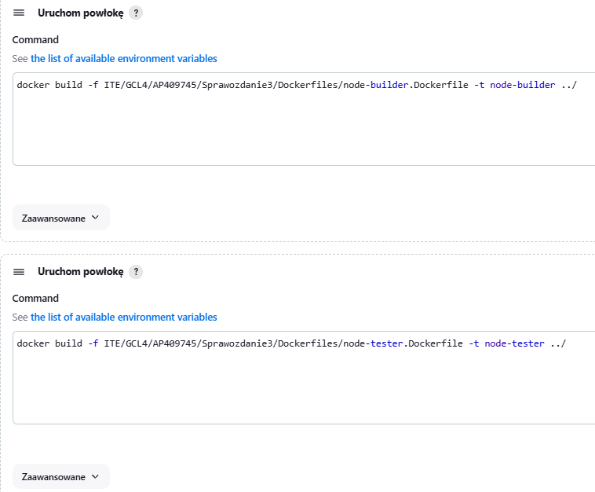
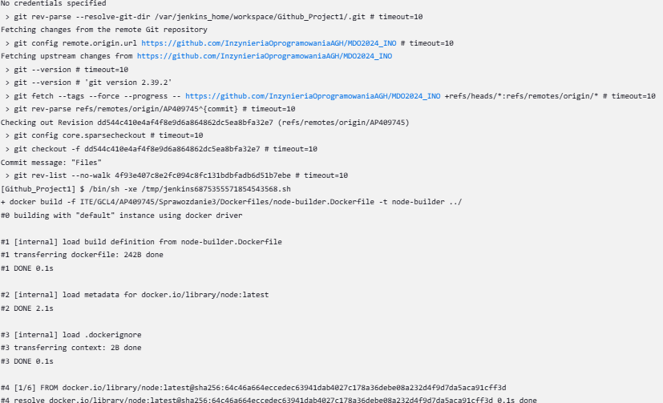
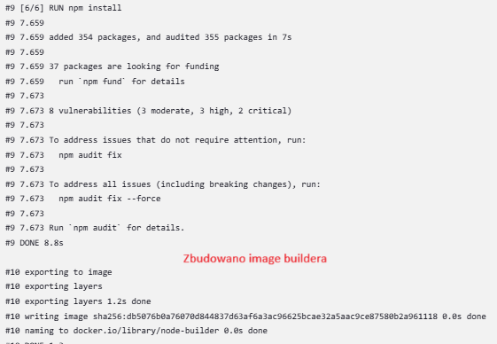
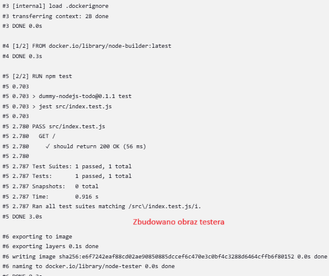
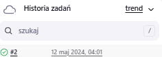
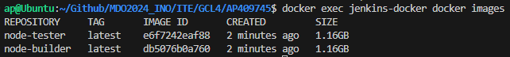
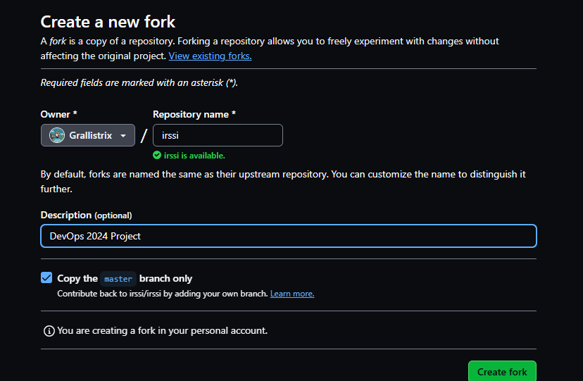

# SPRAWOZDANIE 3
Andrzej Piotrowski, IT
DevOps GCL4

## Cel Zajęć
Laboratoria koncentrowały się na stworzeniu pipeline'u przy użyciu oprogramowania Jenkins, w celu budowania, testowanai i wdrożenia wybranych aplikacji.

# Przygotowanie Środowiska
## Przygotowanie jenkinsa i Instalacja DIND
Labolatoria były prowadzone na maszynie wirutalnej typu Oracle VM Virtual Box, na systemie Ubuntu 22.
Aplikacjami wybranymi od realizacji labolatoriów, były wykorzystane już w ramach poprzednich zajęć Irssi oraz Node JS Dummy Test. Są to programy o otwartych licnecjach, zapewniające swobodę w ich używaniu i wykorzystywaniu.

LAbolatoria zaczęto od przygotowania Jenkinsa. Najpier pobrano obraz Docker Inside Docker (DinD) komendą `docker image pull docker:dind` i go uruchomiono z wyekspozycjonowanym portem 2376, by Jenkins mógł się z nim porozumieć. Instalacja DIND jest krytyczna, by móc za pomocą Jenkinsa wykonywać operacje w ramach dockera.
```
docker run \
  --name jenkins-docker \
  --rm \
  --detach \
  --privileged \
  --network jenkins \
  --network-alias docker \
  --env DOCKER_TLS_CERTDIR=/certs \
  --volume jenkins-docker-certs:/certs/client \
  --volume jenkins-data:/var/jenkins_home \
  --publish 2376:2376 \
  docker:dind \
  --storage-driver overlay2
```
Następnie należało utworzyć obraz Jenkinsa, w tym celu stworzyłem odpowiedni Dockerfile.

A następnie zbudowałem obraz `docker build -t myjenkins-blueocean:2.440.3-1 .` i uruchomiłem, eksponując port 8080, by móc przy pomocy przeglądarki mieć dostęp do interfejsu graficznego Jenkinsa oraz port 50000 by agent TCP mógł się łączyć z dockerem.
```
docker run \
  --name jenkins-blueocean \
  --restart=on-failure \
  --detach \
  --network jenkins \
  --env DOCKER_HOST=tcp://docker:2376 \
  --env DOCKER_CERT_PATH=/certs/client \
  --env DOCKER_TLS_VERIFY=1 \
  --publish 8080:8080 \
  --publish 50000:50000 \
  --volume jenkins-data:/var/jenkins_home \
  --volume jenkins-docker-certs:/certs/client:ro \
  myjenkins-blueocean:2.440.3-1
```

Po wejściu w przeglądarke (z poza maszyny wirutalnej) na stronę `IP_maszyny:8080`, pojawiła się interfejs Jenkins'a. Przeszedłem instlaację z rekomendowanymi wtyczkami i utworzyłem konto `admin`. Jako, że Jenkins generuje przypadkowe hasło dla swojego pierwszego administratora, musiałem je wydobyć z kontenera Jenkinsa. W tym celu na terminalu systemu (maszyny wirutalnej) użyłem komendy `docker exec [nazwa_konteneru_jenkinsa] cat /var/jenkins_home/secrets/initialAdminPassword` by na kontenerze jenkinsa wykonać operację `cat` w celu odczytu hasła.


## Testowanie Jenkinsa

Następnie przeszedłem do testowania poprawności działania Jenkinsa, w tym celu stworzyłem dwa proste projekty - jeden wyświetlający uname, drugi zwracający błąd gdy godzina jest nieparzysta. 

W tym celu tworzymy dwa nowe projekty

Dla obydwu, dodając w krokach budowania uruchomienie powłoki z odpowiednim kodem, a następnie uruchomiłem projekty z poziomu Jenkinsa. Po sprwadzeniu logów konsoli możemy stwierdzić, że Jenkins działa poprawnie i pomyślnie wykonywać zadanie mu polecenia - pracowaliśmy na systemie z rodziny Linux, a godzina 5 jest nieparzysta.


# Pipeline'y

## Projekt kopiowania repozytorium i budowania obrazów
Kolejnym krokiem było utworzenie projektu klonującego gałąź repozytorium i budującej obraz z pomocą pliku dockerfile. Niestety w trakcie pracy napotkałem problem z server bisheaving i pomimo długich starań nie udało mi się go naprawić, wymusiły to na mnie próbę reinstalacji systemu, konfiguracji i ponownego wykonania całości labolatoriów do tego momentu.

Ze względów na brak pewności, czy po reinstalacji systemu, wszystko się poprawnie wkonuje dla pewności spróbowałem zbudować obraz przy użyciu stworzonych plików Dockerfile (node-builder oraz node-tester), z wyeksponowanym portem 3000. Na szczęście wszystko działało poprawnie, więc mogłem ich użyć do utworzenia projektu klonującego repozytorium, i utworzenia obrazu budującego i testującego.




W tym celu stowrzyłem nowy projekt. Ustawiłem kopiowane repozytorium na własny branch repozytorium przedmiotowego, gdzie wcześniej umieściłem odpowiednie pliki dockerfile dla aplikacji, a także dodałem do projektu 2 kroki: uruchomienie powłoki i wywołanie komend budujących obrazy - najpierw budujący, potem testowy.



W trakcie wykonywania się programu, śledziłem logi z poziomu Jenkins'a. Doszło do pomyślnego zaciągnięcia repozytorium oraz budowy.





Dla jeszcze większej pewności, wykonałem jeszcze komendę `docker exec [Nazwa kontenera DIND] docker images` w celu sprawdzenia, czy aby napewno wszystkie obrazy się zbudowały i zostały zapisane. Jak najbardziej obrazy znajdowały się w kontenerze, a nawet możliwe było ich poprawne uruchomienie.


## Pipeline Irssi

W dalszej części laboloatoriów należało stworzyć pipeline dla wybrane jdla siebie aplikacji. W moim przypadku było to Irssi - tekstowy klient czatu, na otwartej licencji GNU General Public License, z którym to już pracowałem wcześniej. W celu uproszczenia sobie pracy, wykonałem fork repozytorium [Irssi](https://github.com/Grallistrix/irssi)
, w którym zamieściłem pliki Dockerfile oraz skrypt czyszczący obrazy i kontenery. 



