# SPRAWOZDANIE 3
Andrzej Piotrowski, IT
DevOps GCL4

## Cel Zajęć
Laboratoria koncentrowały się na stworzeniu pipeline'u przy użyciu oprogramowania Jenkins, w celu budowania, testowanai i wdrożenia wybranych aplikacji.

# Przygotowanie Środowiska
## Przygotowanie jenkinsa i Instalacja DIND
Labolatoria były prowadzone na maszynie wirutalnej typu Oracle VM Virtual Box, na systemie Ubuntu 22.
Aplikacjami wybranymi od realizacji labolatoriów, były wykorzystane już w ramach poprzednich zajęć Irssi oraz Node JS Dummy Test. Są to programy o otwartych licnecjach, zapewniające swobodę w ich używaniu i wykorzystywaniu.

Wstępny projekt pipeline'u wyglądał następująca:

Labolatoria zaczęto od przygotowania Jenkinsa. Najpier pobrano obraz Docker Inside Docker (DinD) komendą `docker image pull docker:dind` i go uruchomiono z wyekspozycjonowanym portem 2376, by Jenkins mógł się z nim porozumieć. Instalacja DIND jest krytyczna, by móc za pomocą Jenkinsa wykonywać operacje w ramach dockera.
```
docker run \
  --name jenkins-docker \
  --rm \
  --detach \
  --privileged \
  --network jenkins \
  --network-alias docker \
  --env DOCKER_TLS_CERTDIR=/certs \
  --volume jenkins-docker-certs:/certs/client \
  --volume jenkins-data:/var/jenkins_home \
  --publish 2376:2376 \
  docker:dind \
  --storage-driver overlay2
```
Następnie należało utworzyć obraz Jenkinsa, w tym celu stworzyłem odpowiedni Dockerfile.

A następnie zbudowałem obraz `docker build -t myjenkins-blueocean:2.440.3-1 .` i uruchomiłem, eksponując port 8080, by móc przy pomocy przeglądarki mieć dostęp do interfejsu graficznego Jenkinsa oraz port 50000 by agent TCP mógł się łączyć z dockerem.
```
docker run \
  --name jenkins-blueocean \
  --restart=on-failure \
  --detach \
  --network jenkins \
  --env DOCKER_HOST=tcp://docker:2376 \
  --env DOCKER_CERT_PATH=/certs/client \
  --env DOCKER_TLS_VERIFY=1 \
  --publish 8080:8080 \
  --publish 50000:50000 \
  --volume jenkins-data:/var/jenkins_home \
  --volume jenkins-docker-certs:/certs/client:ro \
  myjenkins-blueocean:2.440.3-1
```

Po wejściu w przeglądarke (z poza maszyny wirutalnej) na stronę `IP_maszyny:8080`, pojawiła się interfejs Jenkins'a. Przeszedłem instlaację z rekomendowanymi wtyczkami i utworzyłem konto `admin`. Jako, że Jenkins generuje przypadkowe hasło dla swojego pierwszego administratora, musiałem je wydobyć z kontenera Jenkinsa. W tym celu na terminalu systemu (maszyny wirutalnej) użyłem komendy `docker exec [nazwa_konteneru_jenkinsa] cat /var/jenkins_home/secrets/initialAdminPassword` by na kontenerze jenkinsa wykonać operację `cat` w celu odczytu hasła.


## Testowanie Jenkinsa

Następnie przeszedłem do testowania poprawności działania Jenkinsa, w tym celu stworzyłem dwa proste projekty - jeden wyświetlający uname, drugi zwracający błąd gdy godzina jest nieparzysta. 

W tym celu tworzymy dwa nowe projekty
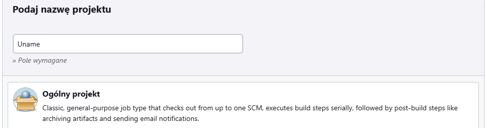
Dla obydwu, dodając w krokach budowania uruchomienie powłoki z odpowiednim kodem, a następnie uruchomiłem projekty z poziomu Jenkinsa. Po sprwadzeniu logów konsoli możemy stwierdzić, że Jenkins działa poprawnie i pomyślnie wykonywać zadanie mu polecenia - pracowaliśmy na systemie z rodziny Linux, a godzina 5 jest nieparzysta.
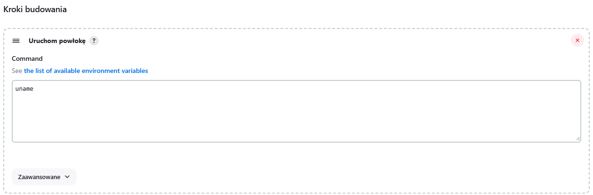
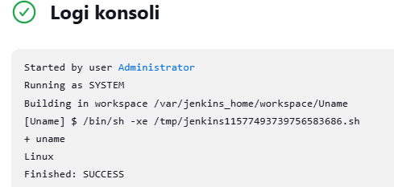
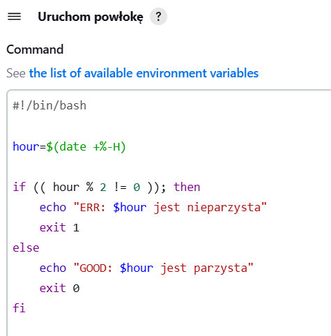
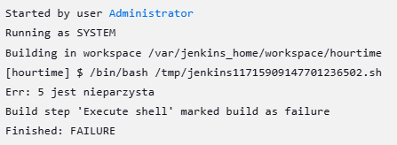

# Pipeline'y

## Mini-pipeline: projekt kopiowania repozytorium i budowania obrazów
Kolejnym krokiem było utworzenie projektu klonującego gałąź repozytorium i budującej obraz z pomocą pliku dockerfile. Niestety w trakcie pracy napotkałem problem z server misbehaving i pomimo długich starań nie udało mi się go naprawić, wymusiły to na mnie próbę reinstalacji systemu, konfiguracji i ponownego wykonania całości labolatoriów do tego momentu, tym razem w oparciu jendak o system Fedora 39.

Ze względów na brak pewności, czy po reinstalacji systemu, wszystko się poprawnie wkonuje dla pewności spróbowałem zbudować obraz przy użyciu stworzonych plików Dockerfile (node-builder oraz node-tester), z wyeksponowanym portem 3000. Na szczęście wszystko działało poprawnie, więc mogłem ich użyć do utworzenia projektu klonującego repozytorium, i utworzenia obrazu budującego i testującego.

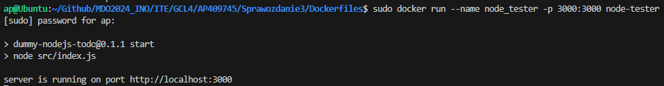
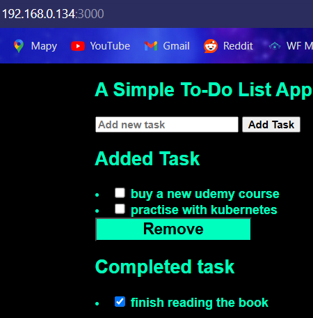

W tym celu stowrzyłem nowy projekt. Ustawiłem kopiowane repozytorium na własny branch repozytorium przedmiotowego, gdzie wcześniej umieściłem odpowiednie pliki dockerfile dla aplikacji, a także dodałem do projektu 2 kroki: uruchomienie powłoki i wywołanie komend budujących obrazy - najpierw budujący, potem testowy.
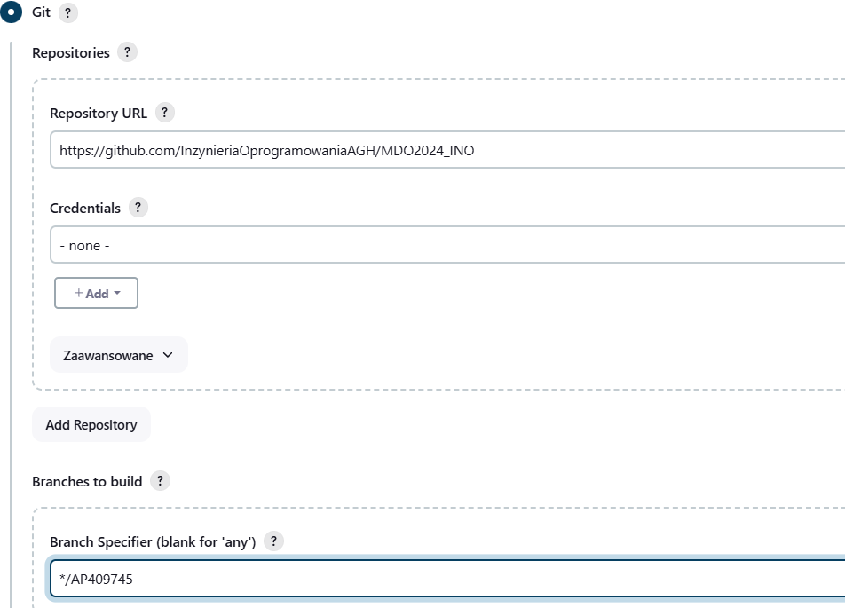
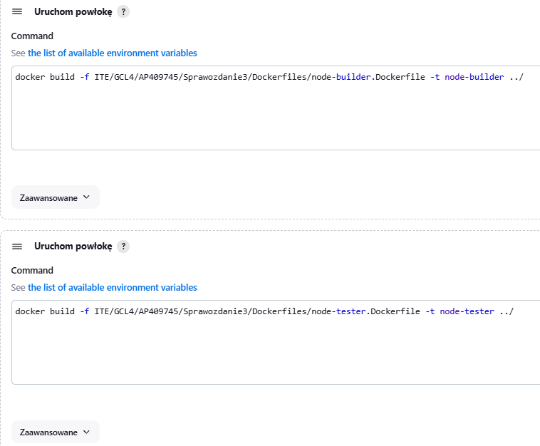

W trakcie wykonywania się programu, śledziłem logi z poziomu Jenkins'a. Doszło do pomyślnego zaciągnięcia repozytorium oraz budowy.
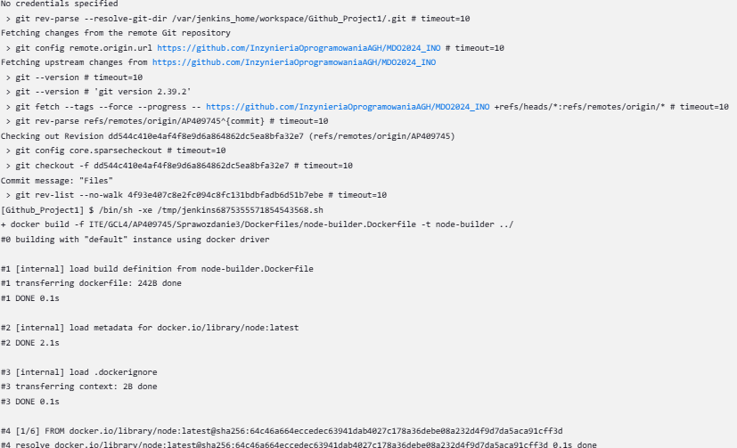
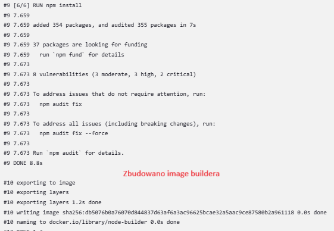


Dla jeszcze większej pewności, wykonałem jeszcze komendę `docker exec [Nazwa kontenera DIND] docker images` w celu sprawdzenia, czy aby napewno wszystkie obrazy się zbudowały i zostały zapisane. Jak najbardziej obrazy znajdowały się w kontenerze, a nawet możliwe było ich poprawne uruchomienie.
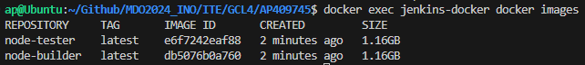

## Pipeline Irssi

W dalszej części laboloatoriów należało stworzyć pipeline dla wybrane jdla siebie aplikacji. W moim przypadku było to Irssi - tekstowy klient czatu, na otwartej licencji GNU General Public License, z którym to już pracowałem wcześniej. W celu uproszczenia sobie pracy, wykonałem fork repozytorium [Irssi](https://github.com/Grallistrix/irssi), w którym zamieściłem pliki Dockerfile.

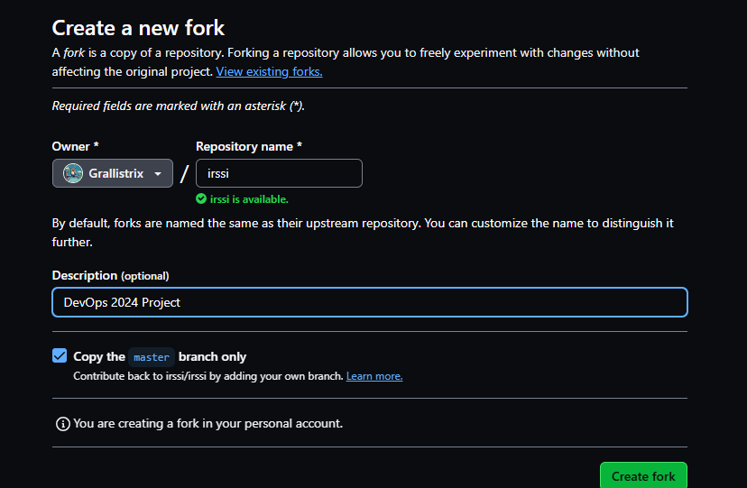

Skrypt Jenkinsfile także zostaje umieszczony w zforkowanym repozytorium, i to z niego go zaciągamy.

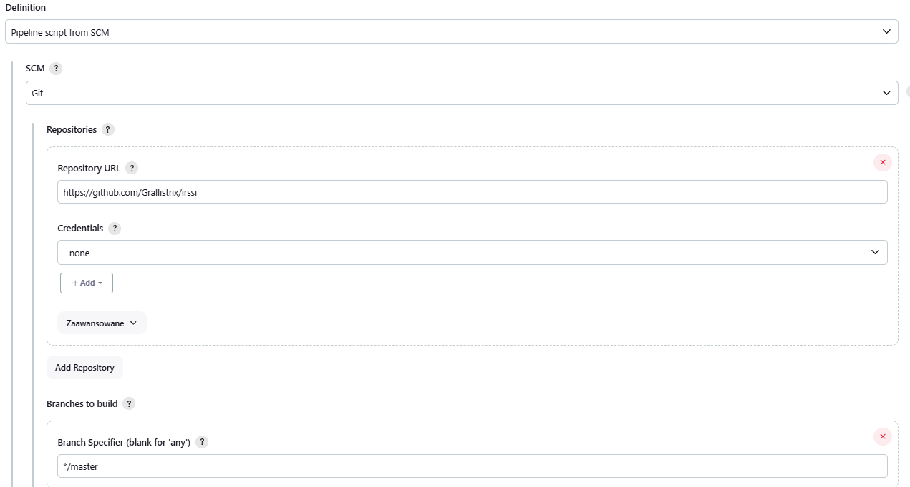

Pierwszą próbą było zbudowanie trzech pierwszych etapów: etapu przygotowującego (Prepare), budującego (Build) oraz testującego (Test). Za podstawę do etapów Build oraz Test posłużyły mi Dockerfile z poprzednich zajęć.

Pierwszym krokiem był stage Prepare, który usuwał pozostałości poprzedniego repozytorium przed pobraniem njego najnowszej wersji.
```
        stage('Prepare') {
            steps {
                sh 'rm -rf irssi'
                sh 'git clone https://github.com/Grallistrix/irssi.git'
            }
        }
```
Drugim krokiem był etap "Build" polegający na usunięciu poprzedniego obrazu budującego i zbudowaniu w oparciu o zamieszczony Dockerfile kolejny.
```
        stage('Build') {
            steps {
                sh 'docker rmi -f irssi-builder'
                dir('irssi/Dockerfiles'){
                    sh 'docker build -t irssi-builder -f irssi-builder.Dockerfile .'
                }
            }
        }
```
Trzeci krok to krok tworzący kontener testujący, by sprawdzić czy poprzednie kroki wykonały się prawidłowo.
```
        stage('Test') {
            steps {
                dir('irssi/Dockerfiles'){
                    sh 'docker build -f irssi-test.Dockerfile .'
                }
            }
        }
```
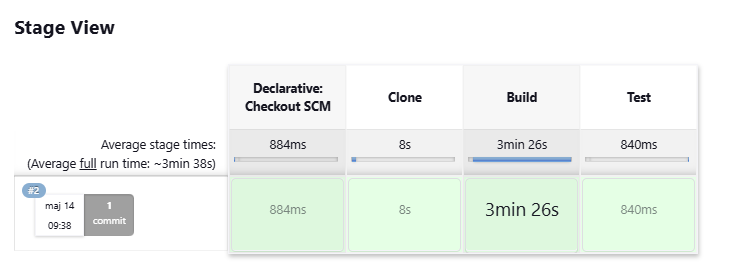

## Deploy i Publish
Jako, że program pomyślnie się budował i testował, kolejnym krokiem było utworzenie dwóch ostatnich kroków - Deploy oraz Publish. 

Krok Deploy jest odpowiedzialny za próbę wdrożenia programu na danym systemie, a krok Publish za jego udostępnienie dalej. Ze względu na użycie systemu Fedora, za sposób rozprowadzania wybrałem pakiet w ramach RPM Packet Manager.

Jako, że w takim typie dystrybucji mamy do czynienia z instalacją poprzez pakiet tworzony w kroku Publish, wymaga to wykonania go wcześniej od kroku Deploy. Obraz deployera tworzymy w oparciu o obraz wykorzystany w kroku Build.

```
#Bazujemy na builderze
FROM irssi-builder
#instalujemy depenencies RPMu
RUN  dnf install -y gcc rpm-build rpm-devel rpmlint make python bash coreutils diffutils patch rpmdevtools

#Pakujemy nasz build do archiwum .tar
WORKDIR /
RUN rpmdev-setuptree
RUN tar -cvzf irssi.tar.gz irssi
RUN cp irssi.tar.gz /root/rpmbuild/SOURCES/

WORKDIR /root/rpmbuild/SPECS

#Kopiujemy plik specyfikacji i w oparciu o niego budujemy paczkę RPM
COPY ./irssi.spec .
RUN rpmbuild -bs irssi.spec
RUN rpmlint irssi.spec
RUN rpmlint ../SRPMS/irssi-fc39.src.rpm
RUN mkdir -p /source_rpm
RUN mv /root/rpmbuild/SRPMS/irssi-fc39.src.rpm /source_rpm
```
```
        stage('Publish') {
            steps {
                dir('irssi/Dockerfiles'){
                    sh 'docker build -t irssi-publish -f irssi-publish.Dockerfile .'
                }
            }
        }
```

Kiedy już mamy gotową paczkę, możemy przejść do kroku Deploy, żeby sprawdzić jak zachowuje się po instalacji.
```
FROM irssi-publish
#Instalujemy zaleznosci
RUN dnf -y install cmake openssl-devel

WORKDIR /source_rpm
#Przebudowujemy pakiet i instalujemy go
RUN rpmbuild --rebuild --nodebuginfo irssi-1-1.src.rpm 
RUN dnf -y install /root/rpmbuild/RPMS/x86_64/irssi-1-1.x86_64.rpm

FROM fedora:39 AS deploy 

#Kopiujemy zpakowane Irssi z obrazu publishowego, do aktualnego
RUN mkdir -p /rpm
RUN mkdir -p /source_rpm
COPY --from=irssi-publish /source_rpm /source_rpm
COPY --from=irssi-publish /root/rpmbuild/RPMS/x86_64/irssi-1-1.x86_64.rpm /rpm/

#Instalujemy zależności, czyścimy cache i instalujemy nasze RPMowe Irssi
RUN dnf -y install glib2-devel perl ncurses-libs utf8proc openssl-devel
RUN dnf clean all
RUN dnf -y install /rpm/irssi-1-1.x86_64.rpm

#Ustawiamy Entrypoint kontenera i wysyłamy komendę sprawdzenia wersji
ENTRYPOINT irssi
CMD ["--version"]
```
```
        stage('Deploy') {
            steps {
                dir('irssi/Dockerfiles'){
                    sh 'docker build -t irssi-deployer -f irssi-deploy.Dockerfile .'
                    sh "docker run -it -d --name irssi-deployed irssi-deployer"
                    sh "docker exec irssi-deployed irssi --version"
                    sh "docker logs irssi-deployed"
                }
            }
        }
```


Tak stworzony pipeline przechodzi przez wszystkie etapy pomyślnie, tworząc artefakt w postaci pakietu RPM, który następnie możemy udostępniać na zewnątrz.

# Wnioski i uwagi
- Jenkins w połączeniu z Docker in Docker (DIND) stanowi efektywne narzędzie do budowania łańcuchów akcji, obejmujących proces budowania, testowania oraz publikowania/deployowania oprogramowania.
- Wdrażanie metodologii DevOps, której częścią jest automatyzacja procesów CI/CD za pomocą Pipeline'ów, może przyczynić się do zwiększenia efektywności, jakości oraz przewidywalności dostarczania oprogramowania.
- Pierwotny model Pipeline'ów, inspirowany UML'em, uległ zmianie w praktyce. Przykładowo, procesy Deploy i Publish mają odwróconą kolejność. Zmiana ta wynika z innego podejścia do 
- Pliki Jenkinsfile są przydatne, ponieważ uUmożliwiają definiowanie i zarządzanie procesem CI/CD jako zautomatyzowanym kodem, co zapewnia jednolitość i powtarzalność w procesie budowania, testowania i wdrażania aplikacji, a także umożliwiają łatwe udostępnianie i ponowne wykorzystanie konfiguracji między projektami.