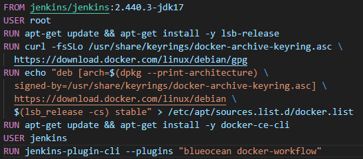
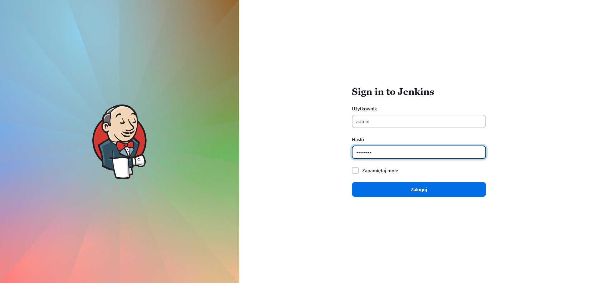
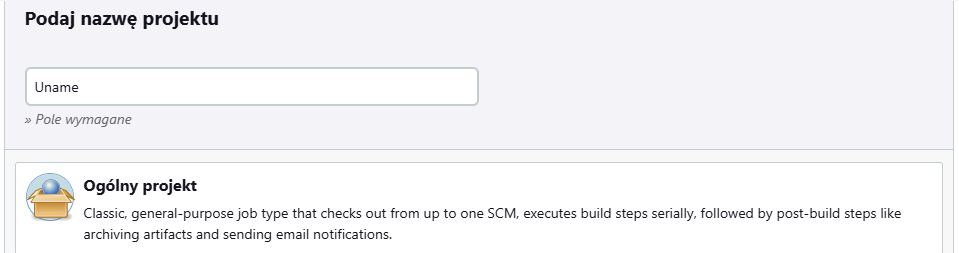
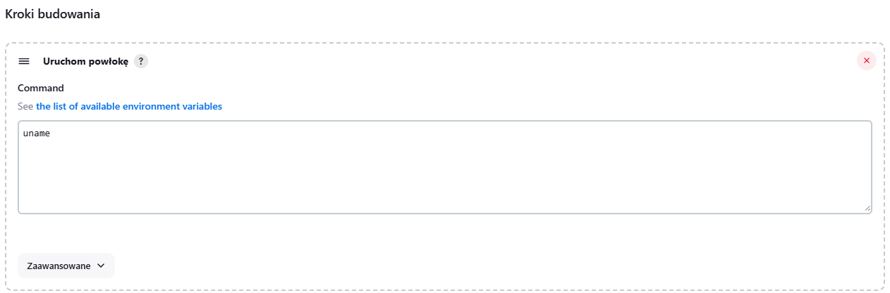
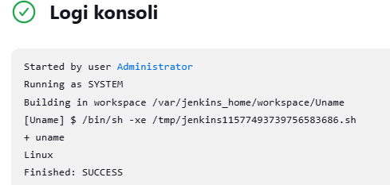
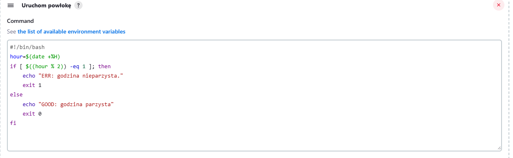
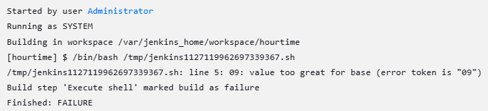
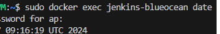

# SPRAWOZDANIE 3
Andrzej Piotrowski, IT
DevOps GCL4

## Cel Zajęć
Laboratoria koncentrowały się na stworzeniu pipeline'u przy użyciu oprogramowania Jenkins, w celu budowania, testowanai i wdrożenia wybranych aplikacji.

# Przygotowanie Środowiska
## Przygotowanie jenkinsa i Instalacja DIND
Labolatoria były prowadzone na maszynie wirutalnej typu Oracle VM Virtual Box, na systemie Ubuntu 22.
Aplikacjami wybranymi od realizacji labolatoriów, były wykorzystane już w ramach poprzednich zajęć Irssi oraz Node JS Dummy Test. Są to programy o otwartych licnecjach, zapewniające swobodę w ich używaniu i wykorzystywaniu.
Jako, że Jenkins został już zainstalowany w ramach ostatnich zajęć, do jego poprawnego działania należało tylko pobrać obraz DIND (Docker in Docker) komendą `docker image pull docker:dind` i go uruchomić.
```
docker run \
  --name jenkins-docker \
  --rm \
  --detach \
  --privileged \
  --network jenkins \
  --network-alias docker \
  --env DOCKER_TLS_CERTDIR=/certs \
  --volume jenkins-docker-certs:/certs/client \
  --volume jenkins-data:/var/jenkins_home \
  --publish 2376:2376 \
  docker:dind \
  --storage-driver overlay2
```
Następnie należało utworzyć obraz Jenkinsa, w tym celu stworzyłem odpowiedni Dockerfile.

A następnie zbudowałem go `docker build -t myjenkins-blueocean:2.440.3-1 .` i uruchomiłem, eksponując port 8080.
```
docker run \
  --name jenkins-blueocean \
  --restart=on-failure \
  --detach \
  --network jenkins \
  --env DOCKER_HOST=tcp://docker:2376 \
  --env DOCKER_CERT_PATH=/certs/client \
  --env DOCKER_TLS_VERIFY=1 \
  --publish 8080:8080 \
  --publish 50000:50000 \
  --volume jenkins-data:/var/jenkins_home \
  --volume jenkins-docker-certs:/certs/client:ro \
  myjenkins-blueocean:2.440.3-1
```

Po wejściu w przeglądarke (z poza maszyny) na stronę `IP_maszyny:8080`, pojawiła się interfejs Jenkins'a. Jako że korzystałem z obrazu przygotowanego nieco wcześniej, to miałem już utworzone konto `admin`, na które się zalogowałem. W przypadku gdybym zaczynał bez konta, musiałbym wydobyć hasło do niego z pliku komendą `docker exec [nazwa_obrazu_jenkinsa] [ścieżka_woluminu_jenkinsa]/secrets/initialAdminPassword`


## Testowanie Jenkinsa

Następnie przeszedłem do testowania poprawności działania Jenkinsa, w tym celu stworzyłem dwa proste pipeline'y - jeden wyświetlający uname, drugi zwracający błąd gdy godzina jest nieparzysta. 

W tym celu tworzymy dwa nowe projekty

Dla obydwu, dodając w krokach budowania uruchomienie powłoki z odpowiednim kodem, a następnie uruchamiany projekty z poziomu Jenkinsa. Po sprwadzeniu logów konsoli możemy stwierdzić, że Jenkins jest w stanie komunikować się z Dockerem DIND i pomyślnie wykonywać zadanie mu polecenia. W przypadku błędu ze skryptem godzinowym, był on spowodowany tym, że traktował on godzinę 9 jako tekst 09, zatem nie mógł wykonać operacji, jednak sam fakt pojawienia się takich log'ów pokazuje, że doszło do komunikacji na linii jenkins-docker.






## "Prawdziwy" Projekt
Kolejnym krokiem było utworzenie projektu klonującego gałąź repozytorium i budującej obraz z pomocą pliku dockerfile. Niestety w trakcie pracy napotkałem problem z server bisheaving i pomimo długich starań nie udało mi się go naprawić, wymusiły to na mnie próbę reinstalacji systemu i ponownego wykonania całości labolatoriów. TEST3

## Irssi


## Aplikacja Node'owa

## Irssi - automatyzacja przy pomocy Dockerfile


