# SPRAWOZDANIE 4
Andrzej Piotrowski, IT
DevOps GCL4

## Cel Zajęć
Laboratoria koncentrowały się na automatyzacji i zdalnym wykonywaniu poleceń za pomocą oprogramowania Ansible.

## Przygotowanie nowej maszyny
W celu przygotowania nowej maszyny pobrałem plik ISO zawierający system Fedora 39 (czyli ten sam co na głównej maszynie). Przeprowadziłem następnie instalację minimalną, w celu zapewnienia jak najmniejszego zbioru zainstalowanego oprogramowania. 
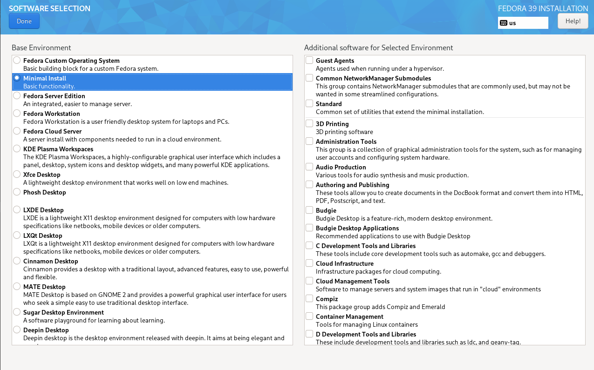

Następnie próbowałem zainstalować OpenSSH oraz program archiwizacyjny TAR, ale były już one zainstalowane. Następnie poprzez komendę `sudo hostnamectl set-hostname ansible-target` zmieniłem hostname maszyny. 
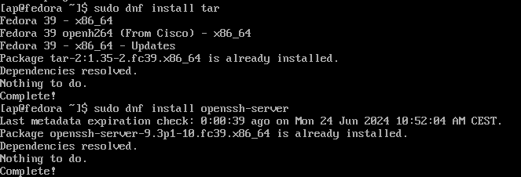


Następnie utworzyłem nowego użytkownika zwanego ansible komendą `adduser [nazwa]`, opatrzyłem go hasłem i przełączyłem się na niego i stworzyłem migawkę
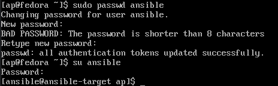
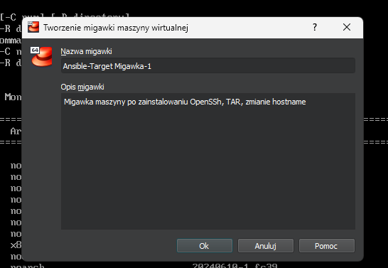

W międzyczasie na głównej maszynie, zainstalowałem oprogramowanie ansible.
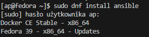

Następnie wymieniłem klucze SSH pomiędzy użytkownikami obydwu maszyn, tak żeby dalsze logowanei przez SSH nie wymagało podawania haseł.
```
ssh-keygen -t rsa -b 4096                            # na obydwu maszynach
ssh-copy-id -i ~/.ssh/id_rsa ansible@ansible-target  # na głównej
ssh-copy-id -i ~/.ssh/id_rsa ap@fedora               # na ansible-target
```

## Inwentaryzacja

Obydwie maszyny zostały odpowiednio nazwane - maszyna główna jako `fedora` natomiast maszyna docelowa jako `ansible-target`.

W celu rozpoznawania nazw maszyn, musiałem zmodyfikować plik `/etc/hosts` ręcznie. Dzięki temu możliwe było teraz łączenie się podając nazwe zamiast tylko adresów IP. Krok ten wykonałem w trakcie wymiany kluczy.

Przeprowadziłem próbę łączności w obie strony - logowanie jak i przesyłanie pakietów przebiegło pomyślnie.

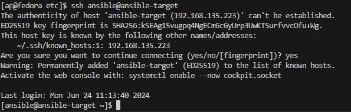
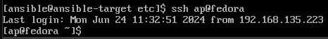
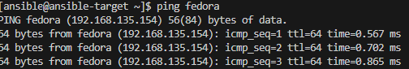
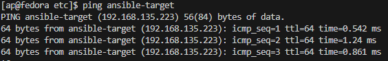

Następnie utworzyłem plik inwentaryzacji `inventory.ini`, w którym zawarłem dwie sekcje - Orchestrators, zawierający maszyny kontrolujący porcesy na endpointach (maszyna fedora), oraz Endpoints, zawierający maszyny na których te procesy będą wykonywane (maszyna ansible-target)
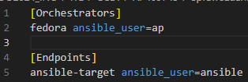

Następnie komendą `ansible -i inventory.ini all -m ping` wymusiłem wykonanie ping'u do wszystkich hostach. Warto tu zaznaczyć, zę ping w Ansible to nie jest jego standardowa implementacja którą wcześniej wykorzystałem, ale ich własna implementacja. Jako, że wszystkie pingi zwróciły "pong", można potwierdzić łączność do wszystkich hostów.

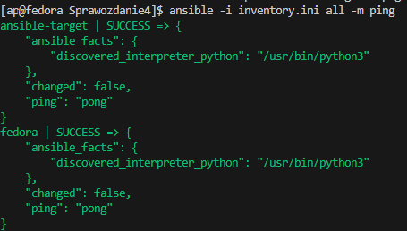

## Zdalne Wykonywanie Procedur

W celu zdalnego wywoływania procedur stowrzyłem playbook Ansible, który: 
- zpinguje wszystkie maszyny (wykorzystałem do tego wbudowany ping Ansible)
- skopiuje plik inwentaryzacyjny `inventory.ini` do maszyn endpointowych
- ponowi operację porównując różnice na wyjściu
- zaktualizuje pakiety systemowe
- zrestartuje usługę `sshd`

```yaml
- name: Ping
  hosts: all
  tasks:
   - name: Pingowanie hostow
     ansible.builtin.ping:

- name: Copy
  hosts: Endpoints
  remote_user: ansible
  tasks:
   - name: kopiowanie inventory.ini
     copy:
      src: ./inventory.ini
      dest: /home/ansible/

- name: Update
  hosts: Endpoints
  remote_user: ansible
  tasks:
   - name: aktualizacja pakietow
     ansible.builtin.dnf:
      name: "*"
      state: latest
     become: true

- name: Restart SSH
  hosts: Endpoints
  become: true
  tasks:
  - name: restar demona przez systemd
    systemd:
      name: sshd
      state: restarted
```

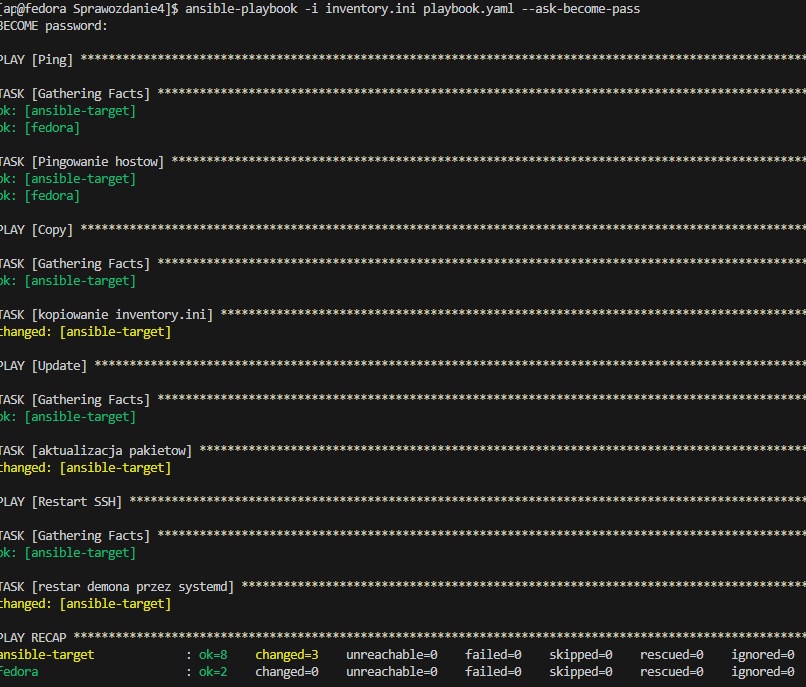

Status `changed` mówi nam, że doszło do zmian na maszynie docelowej, tj. pomyślnie skopiowano pliki, zaktualizowano pakiety i zrestartowano demona.
Pozostałe możliwe stany to:
- ok - mówi że zadanie zostało wykonane poprawnie, bez spowodowania żadnych zmian
- failed - zadanie z jakiegoś powodu nie powiodło się
- unreachable - Ansible nie mógł połączyć się z maszyną docelową
- skipped - zadanie zostało pominięte, ponieważ nie spełniało określonych założeń. Ansible pozwala zdefiniować w swoich playbookach warunek `when`, określający w jakich warunkach przejść do wykonywania tasku. Przykładowo ` when: ansible_facts['os_family'] == "Debian"` spowoduje, że task wykona się tylko na maszynach z systemem Debian.
- rescue - Ansible pozwala na definiowanie bloków rescue, które wykonają się w przypadku gdy poprzedni blok zakończy się niepowodzeniem
- ignored - Ansible daje użytkownikom do dyspozycji dyrektywę `ignore_errors` która pozwala na zignorowanie niepowodzenia zadania i wykonanie reszty zadań w ramach tasku.

Po wykonaniu playbook'u zmieniłem go tak, by zawierał tylko operację kopiowania i wykonałem playbook jeszcze raz. Status `ok` spowodowany był faktem, że plik został już wcześniej skopiowany i istniał na maszynie ansible-target. Oznacza to, że nie doszło do żadnych zmian (status `changed`).

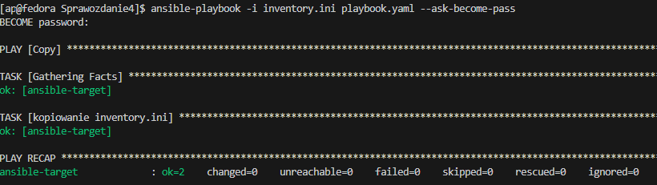

Następnie próbowałem uruchomić playbook względem maszyny z wyłączonym serwerem SSH i odpiętą kartą sieciową. W tym celu zmieniłem ustawienia maszyny wirtualnej, a następnie wyłączyłem usługę komendą `systemctl disable sshd`. 
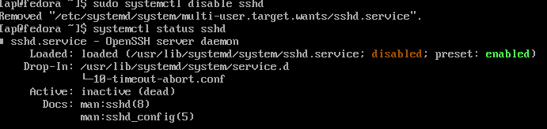
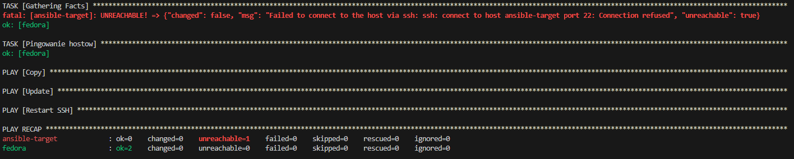

W tym wypadku maszyna ansible-target była `unreachable` tj. niemożliwe było połączenie się z nią, a wszystkie zadania jakie miała wykonać zostały pominięte.

## Zarządzanie Kontenerem

Ta część laboratoriów polegała na uruchomieniu kontenera pobranego z DockerHub, podłączeniu storage oraz wyprowadzeniu portu za pomocą playbook'a Ansible. Jako, że artefakt z poprzednich zajęć przyjął formę pakietu RPM, za obraz wybrałem obraz NGINX opracowany w ramach kolejnych laboratoriów (więcej o nim w sprawozdaniu 5).

W tym celu zainstalowałem na maszynie docelowej (ansible-target) Dockera `sudo dnf install docker` i przygotowałem playbook służący do pobrania i uruchomienia aplikacji NGINX `nginx.yaml`

```yaml
- name: Download and Run Image
  hosts: Endpoints
  tasks:
    - name: Download NGINX
      community.docker.docker_image:
        name: apiotrow/nginx-img
        tag: "0.1"
        source: pull
    
    - name: Run NGINX
      community.docker.docker_container:
        name: nginx-img
        image: apiotrow/nginx-img
        state: started
        interactive: yes
        tty: yes
```

Pierwsza próba pobrania zakończyła się niepowodzeniem, było to spowodowane faktem, że demon Dockera nie został uruchomiony (załączono go komendą `systemctl start docker`), co uniemożliwiało wykonanie playbook'a. Pobieranie obrazu jest wykonywane właśnie przez Dockera, więc jeśli nie działa to niemożliwym jest pobranie w ten sposób obrazów z DockerHub'a. 
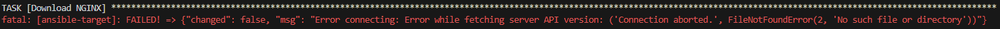

Po włączeniu go, pojawił się kolejny błąd - brak permisji. Domyślnie Docker potrzebuje poprzedzenia swoich komend przez `sudo` w celu ich wykonania, można ten fakt ominąć poprzez utworzenie nowej grupy `docker` i dodanie do użytkownika. Dzięki temu dostęp do demona jest możliwy bez uprawnień.
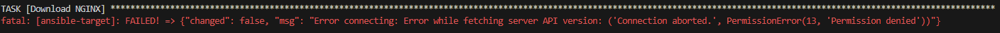

Tym razem udało się pobrać obraz, ale przez brak specyfikacji tagu obrazu, nie udało się pomyślnie uruchomić obrazu. Po małej zmianie, jednak się udało. Warto tutaj zaznaczyć, że status pobrania to `ok` zamiast changed - z faktu że już istnieje pobrany obraz, nie zachodzi potrzeba pobierania go kolejny raz.
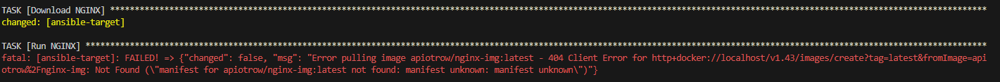
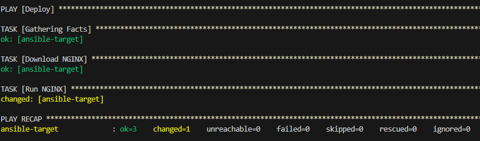

Teraz gdy miałem pewność, że obraz się pobiera i uruchamia, zmodyfikowałem playbook tak żeby dodatkowo tworzył i podłączał wolumin oraz eksponował port.
```yaml
- name: Deploy Nginx Docker Container
  hosts: Endpoints
  tasks:
    - name: Download NGINX
      community.docker.docker_image:
        name: apiotrow/nginx-img
        tag: "0.1"
        source: pull

    - name: Create Volume
      community.docker.docker_volume:
        name: nginx_data
        state: present

    - name: Run NGINX
      community.docker.docker_container:
        name: nginx
        image: apiotrow/nginx-img:0.1
        state: started
        ports:
          - "80:80"
        volumes:
          - nginx_data:/usr/share/nginx/html
```
Jak widać, kontener z aplikacją działał z wyeksponowanym portem, a po odpowiednim zforwardowaniu portów, możliwe było nawet połączenie się ze stroną i wyświetlenie przepisu na nachosy. Kontener jak i obraz następnie usunąłem. 

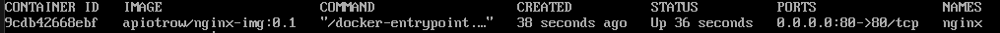
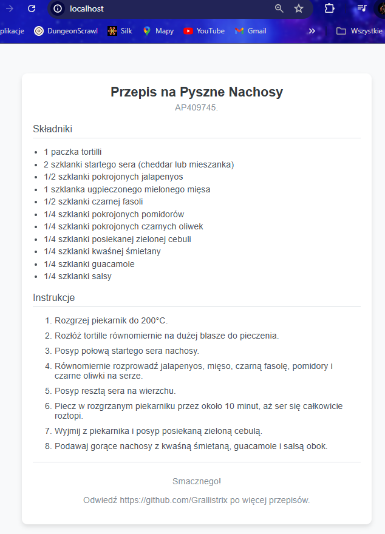

Ostatnim krokiem było ubranie powyższych kroków w role za pomocą szkieletowania ansible-galaxy. W tym celu komendą `ansible-galaxy init [nazwa]` utworzyliśmy rolę, którą nazwałem nginx-role. Spwodowało to też utworzenie folderu o tej samej nazwie w strukturze folderu w którym się znajdowałem.

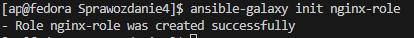
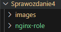

Wewnątrz folderu roli, wewnątrz folderu `tasks` znalazłem plik `main.yaml`, który ma zawierać zadania do wykonania, przekleiłem tylko zadania zawarte w `nginx.yaml`. 
W celu skorzystania z tej roli, stworzyłem trzeci playbook `rolebook.yaml`, w którym zdefiniowałem hosty (endpoints) oraz role jakie mają przyjąć (nginx-role).
```yaml
- name: ApplyRoles
  hosts: Endpoints
  roles:
    - nginx-role
```
Następnie uruchomiłem ten playbook - kontener został pomyślnie stworzony i uruchomiony.

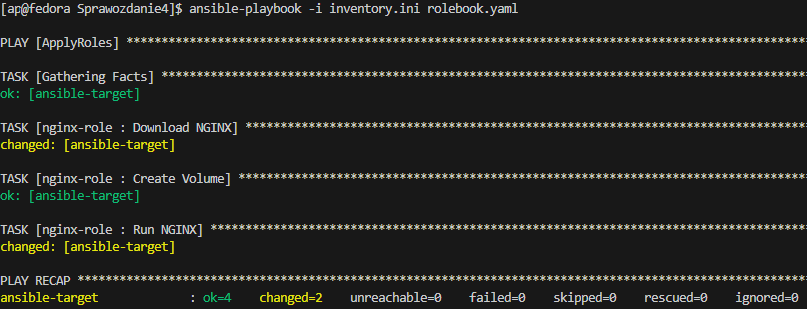
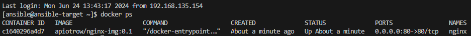

## Pliki odpowiedzi dla wdrożeń nienadzorowanych

Ta część laboratoriów polegała na instalacji systemu Fedora z użyciem odpowiednio skonfigurowanego pliku odpowiedzi, tak by mógł od razu uruchomić wybraną aplikację. W dalszej części postanowiłem działać z dockerowym obrazem NGINX.

W tym celu pobrałem plik ISO systemu Fedora 40 (Network Install) i przeszedłem podstawową instalację systemu. 
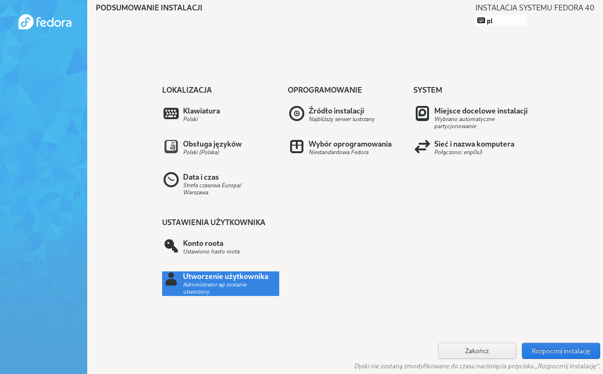
Następnie wyciągnęłem zawartość pliku odpowiedzi anaconda-ks.cfg oraz zmodyfikowałem go o potrzebne wymagania:
- `network --hostname=fedorafedora` ustawiłem hostname jako `fedorafedora`
- `clearpart --all` wyczyściłem partycję
- `url --mirrorlist=http://mirrors.fedoraproject.org/mirrorlist?repo=fedora-40&arch=x86_64 repo --name=update --mirrorlist=http://mirrors.fedoraproject.org/mirrorlist?repo=updates-released-f40&arch=x86_64` Dodałem potrzebne repozytoria systemowe

```
# Generated by Anaconda 40.22.3
# Generated by pykickstart v3.52
#version=DEVEL
# Use graphical install
graphical

# Keyboard layouts
keyboard --vckeymap=pl --xlayouts='pl'
# System language
lang pl_PL.UTF-8

%packages
@^custom-environment

%end

# Run the Setup agent on first boot
firstboot --enable
# Generated using Blivet version 3.8.1
ignoredisk --only-use=sda
autopart
# Partition clearing information
clearpart --all
network --hostname=fedorafedora

# System timezone
timezone Europe/Warsaw --utc
# Root password
rootpw --iscrypted --allow-ssh $y$j9T$oyefBIcvMik9qjXHPij1VQ0p$KxIQ1Ghkt222iTXGDhP5VZQR07qEFYuX/QnEI5gTjR7
user --groups=wheel --name=ap --password=$y$j9T$MbCTEDqMhUPNhy3BiBlfKeBT$o4trJoihU3vftMlf6JbDAfGh2hxdsiYakOSIMHGB1C7 --iscrypted --gecos="ap"

url --mirrorlist=http://mirrors.fedoraproject.org/mirrorlist?repo=fedora-40&arch=x86_64
repo --name=update --mirrorlist=http://mirrors.fedoraproject.org/mirrorlist?repo=updates-released-f40&arch=x86_64

%post
dnf -y install docker
systemctl start docker
systemctl enable docker
sudo usermod -aG docker root
ExecStart=/usr/bin/docker pull apiotrow/nginx-img:0.1
ExecStart=/usr/bin/docker run --name nginx-img apiotrow/nginx-img:0.1
%end
```
 Aby instalacja zadziałała poprawnie potrzebny jest adres do pliku. Plik znajduje się we własnym repozytorium pod [adresem](https://raw.githubusercontent.com/Grallistrix/temp/main/anaconda-ks.cfg).

 Ostatnia część pliku (od %post do %end) definiuje serię komend potrzebnych do pobrania i uruchomienia aplikacji - instalację dockera, pobranie obrazu i jego uruchomienie.

 Następnie przeprowadziłem instalację przy pomocy tego pliku - podczas instalacji wcisnąłem przycisk E w celu wywołania menu ustawieć instalacji i tam podałem link. Następnie wcisnąłem kobinację ctrl+x w celu rozpoczęcia bootowania systemu. Instalacja zaczęła się automatycznie. Na samym końcu sprawdziłem czy kontener Docker'a się uruchomił - tak, uruchomił się. 
 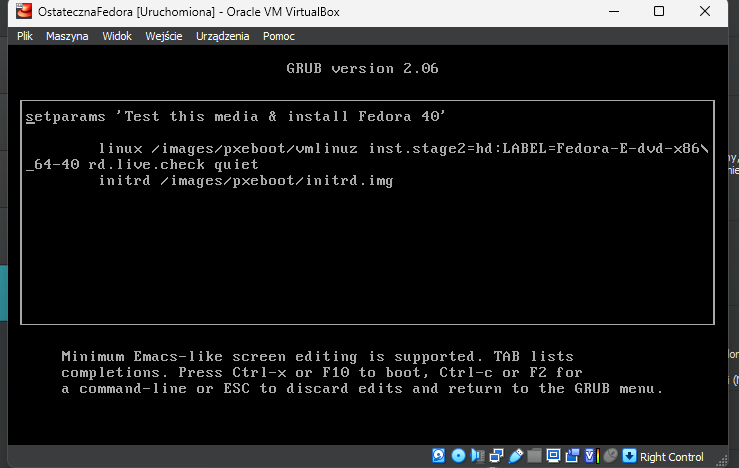
 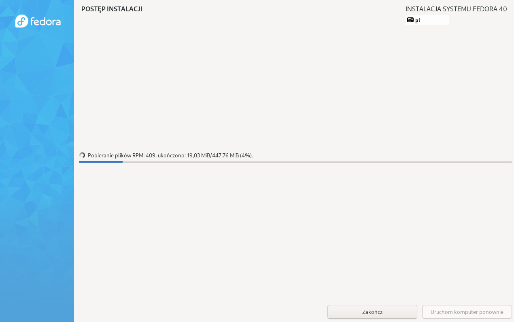

 ## Wnioski
Ansible pozwala na zautomatyzowanie konfiguracji serwerów i zarządzania infrastrukturą. Dzięki Ansible możemy w łatwy sposób definiować stan infrastruktury i zapewniać jej spójność. Dzięki playbookom Ansible umożliwia również szybkie wdrażanie aplikacji na wielu serwerach jednocześnie, a język YAML, który służy do definiowania zadań sprawia, że te pliki są łatwe do odczytania i modyfikacji.
Własne pliki Anaconda (anaconda-ks.cfg) pozwalają na pełną automatyzację procesu instalacji systemu operacyjnego, co znacząco przyspiesza wdrożenia nowych środowisk