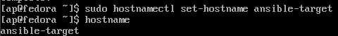

# SPRAWOZDANIE 4
Andrzej Piotrowski, IT
DevOps GCL4

## Cel Zajęć
Laboratoria koncentrowały się na automatyzacji i zdalnym wykonywaniu poleceń za pomocą oprogramowania Ansible.

## Przygotowanie nowej maszyny
W celu przygotowania nowej maszyny pobrałem plik ISO zawierający system Fedora 39 (czyli ten sam co na głównej maszynie). Przeprowadziłem następnie instalację minimalną, w celu zapewnienia jak najmniejszego zbioru zainstalowanego oprogramowania. 


Następnie próbowałem zainstalować OpenSSH oraz program archiwizacyjny TAR, ale były już one zainstalowane. Następnie poprzez komendę `sudo hostnamectl set-hostname ansible-target` zmieniłem hostname maszyny. 



Następnie utworzyłem nowego użytkownika zwanego ansible komendą `adduser [nazwa]`, opatrzyłem go hasłem i przełączyłem się na niego i ztworzyłem migawkę


W międzyczasie na głównej maszynie, zainstalowałem oprogramowanie ansible.


Następnie wymieniłem klucze SSH pomiędzy użytkownikami obudwu maszyn, tak żeby dalsze logowanei przez SSH nie wymagało podawania haseł.
```
ssh-keygen -t rsa -b 4096                            # na obydwu maszynach
ssh-copy-id -i ~/.ssh/id_rsa ansible@ansible-target  # na głównej
ssh-copy-id -i ~/.ssh/id_rsa ap@fedora               # na ansible-target
```

## Inwentaryzacja

Obydwie maszyny zostały odpowiednio nazwane - maszyna główna jako `fedora` natomiast maszyna docelowa jako `ansible-target`.

W celu rozpoznawania nazw maszyn, musiałem zmodyfikować plik `/etc/hosts` ręcznie. Dzięki temu możliwe było teraz łączenie się podając nazwe zamiast tylko adresów IP. Krok ten wykonałem w trakcie wymiany kluczy.

Przeprowadziłem próbę łączności w obie strony - logowanie jak i przesyłanie pakietów przebiegło pomyślnie.


