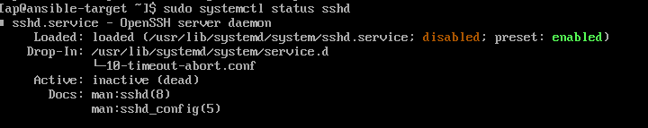

# SPRAWOZDANIE 4
Andrzej Piotrowski, IT
DevOps GCL4

## Cel Zajęć
Laboratoria koncentrowały się na automatyzacji i zdalnym wykonywaniu poleceń za pomocą oprogramowania Ansible.

## Przygotowanie nowej maszyny
W celu przygotowania nowej maszyny pobrałem plik ISO zawierający system Fedora 39 (czyli ten sam co na głównej maszynie). Przeprowadziłem następnie instalację minimalną, w celu zapewnienia jak najmniejszego zbioru zainstalowanego oprogramowania. 


Następnie próbowałem zainstalować OpenSSH oraz program archiwizacyjny TAR, ale były już one zainstalowane. Następnie poprzez komendę `sudo hostnamectl set-hostname ansible-target` zmieniłem hostname maszyny. 


Następnie utworzyłem nowego użytkownika zwanego ansible komendą `adduser [nazwa]`, opatrzyłem go hasłem i przełączyłem się na niego i ztworzyłem migawkę


W międzyczasie na głównej maszynie, zainstalowałem oprogramowanie ansible.


Następnie wymieniłem klucze SSH pomiędzy użytkownikami obudwu maszyn, tak żeby dalsze logowanei przez SSH nie wymagało podawania haseł.
```
ssh-keygen -t rsa -b 4096                            # na obydwu maszynach
ssh-copy-id -i ~/.ssh/id_rsa ansible@ansible-target  # na głównej
ssh-copy-id -i ~/.ssh/id_rsa ap@fedora               # na ansible-target
```

## Inwentaryzacja

Obydwie maszyny zostały odpowiednio nazwane - maszyna główna jako `fedora` natomiast maszyna docelowa jako `ansible-target`.

W celu rozpoznawania nazw maszyn, musiałem zmodyfikować plik `/etc/hosts` ręcznie. Dzięki temu możliwe było teraz łączenie się podając nazwe zamiast tylko adresów IP. Krok ten wykonałem w trakcie wymiany kluczy.

Przeprowadziłem próbę łączności w obie strony - logowanie jak i przesyłanie pakietów przebiegło pomyślnie.


Następnie utworzyłem plik inwentaryzacji `inventory.ini`, w którym zawarłem dwie sekcje - Orchestrators, zawierający maszyny kontrolujący porcesy na endpointach (maszyna fedora), oraz Endpoints, zawierający maszyny na których te procesy będą wykonywane (maszyna ansible-target)


Następnie komendą `ansible -i inventory.ini all -m ping` wymusiłem wykonanie ping'u do wszystkich hostach. Warto tu zaznaczyć, zę ping w Ansible to nie jest jego standardowa implementacja którą wcześniej wykorzystałem, ale ich własna implementacja. Jako, że wszystkie pingi zwróciły "pong", można potwierdzić łączność do wszystkich hostów.


# Zdalne Wykonywanie Procedur

W celu zdalnego wywoływania procedur stowrzyłem playbook Ansible, który: 
- zpinguje wszystkie maszyny (wykorzystałem do tego wbudowany ping Ansible)
- skopiuje plik inwentaryzacyjny `inventory.ini` do maszyn endpointowych
- ponowi operację porónując różnice na wyjściu
- zaktualizuje pakiety systemowe
- zrestartuje usługi `sshd` oraz `rngd`

```yaml
- name: Ping
  hosts: all
  tasks:
   - name: Pingowanie hostow
     ansible.builtin.ping:

- name: Copy
  hosts: Endpoints
  remote_user: ansible
  tasks:
   - name: kopiowanie inventory.ini
     copy:
      src: ./inventory.ini
      dest: /home/ansible/

- name: Update
  hosts: Endpoints
  remote_user: ansible
  tasks:
   - name: aktualizacja pakietow
     ansible.builtin.dnf:
      name: "*"
      state: latest
     become: true

- name: Restart SSH
  hosts: Endpoints
  become: true
  tasks:
  - name: restar demona przez systemd
    systemd:
      name: sshd
      state: restarted
```


Status `changed` mówi nam, że doszło do zmian na maszynie docelowej, tj. pomyślnie skopiowano pliki, zaktualizowano pakiety i zrestartowano demona.
Pozostałe możliwe stany to:
- ok - mówi że zadanie zostało wykonane poprawnie, bez spowodowania żadnych zmian
- failed - zadanie z jakiegoś powodu nie powiodło się
- unreachable - Ansible nie mógł połączyć się z maszyną docelową
- skipped - zadanie zostało pominięte, ponieważ nie spełniało określonych założeń. Ansible pozwala zdefiniować w swoich playbookach warunek `when`, określający w jakich warunkach przejść do wykonywania tasku. Przykładowo ` when: ansible_facts['os_family'] == "Debian"` spowoduje, że task wykona się tylko na maszynach z systemem Debian.
- rescue - Ansible pozwala na definiwanie bloków rescure, które wykonają się w przypadku gdy poprzedni blok zakończy się niepowodzeniem
- ignored - Ansible daje użytkownikom do dyspozycji dyrektywę `ignore_errors` która pozwala na zignorowanie niepowodzenia zadania i wykonanie reszty zadań w ramach tasku.

Po wkonaniu playbook'u zmieniłem go tak, by zawierał tylko operację kopiowania i wykonałem playbook jeszcze raz. Status `ok` spowodowany był faktem, że plik został już wcześniej skopiowany i istniał na maszynie ansible-target. Oznacza to, że nie doszło do żadnych zmian (status `changed`).


Następnie próbowałem uruchomić playbook względem maszyny z wyłączonym serwerem SSH i odpietą kartą sieciową. W tym celu zmieniłem ustawienia maszyny wirutalnej, a następnie wyłączyłem usługę komendą `systemctl disable sshd`.
