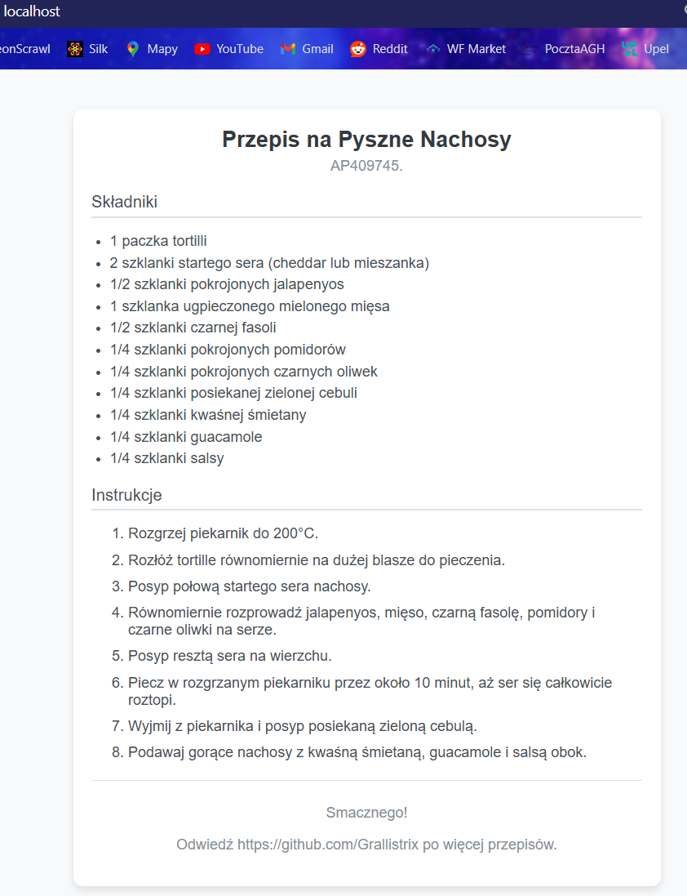
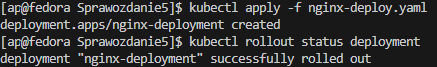
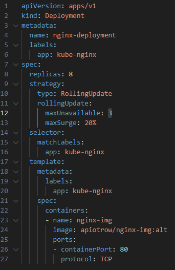
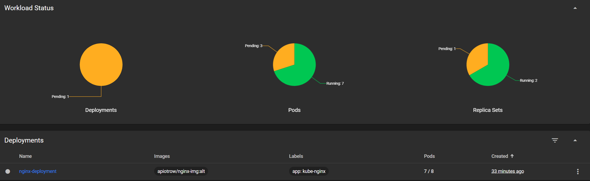

# SPRAWOZDANIE 5
Andrzej Piotrowski, IT
DevOps GCL4

## Cel Zajęć
Laboratoria koncentrowały się na zarządzaniu kontenerami w ramach technologii Kubernetes.

# Przygotowanie Kubernetes
Najpierw należało zainstalować implementację stosu k8s, jaką jest `minikube`
W tym celu na [stronie](https://minikube.sigs.k8s.io/docs/start/?arch=%2Flinux%2Fx86-64%2Fstable%2Frpm+package)
 wybrano odpowiedni pakiet dla maszyny na której pracowano (system Linux, architektura procesora x86, instacja jako pakiet RPM). Wymagało to pobrania pakietu i instalacji za pomocą poniższych komend:.
```
curl -LO https://storage.googleapis.com/minikube/releases/latest/minikube-latest.x86_64.rpm
sudo rpm -Uvh minikube-latest.x86_64.rpm
```
Następnie zaopatrzono się w polecenie kubectl w wariancie minikube. W tym celu utworzono alias `alias kubectl="minikube kubectl --"`, po czym uruchomiono Kubernetes. Minikube automatycznie pobrał najnowszą wersję Kubernetes (Wersja 1.30 Uwubernetes) i ją uruchomił.

Do zarządzania nim przy pomocy interfejsu graficznego potrzebne było uruchomienie Dashboard'a, który daje możliwość zarządzania z poziomu przeglądarki. Dashboard uruchomiono komendą `minikube dashboard`. Jako, że korzystałem ze środowiska VSCode, VSC automatycznie przekierował port, pozwalając połączyć się z zewnątrz maszyny wirtualnej.


## Przygotowanie Aplikacji
Niestety okazało się, że aplikacja z tkórej chciałem wcześniej skorzystać (klient Irssi), nie nadawała się do tych labolatoriów. Nie działała ona w trybie ciągłym, wymagała do tego uruchamiania interaktywnego. Z tego powodu zmuszony byłem wykorzystać inną aplikację. Wybrałem NGINX, serwer webowy.

W celu rozpoczęcia prac nad wdrażaniem NGINX'a w ramach Kubernetes, musiałem najpierw stworzyć obraz lokalny, z własną konfiguracją, więc stworzyłem prosty plik HTML z przepisem na nachosy jako stronę, oraz plik Dockerfile do tworzenia obrazu.


Dockerfile definiuje nam pobranie NGINX w wersji 1.26.0 oraz podmienienie domyślnego pliku strony index.html na nasz własny. Następnie należało utworzyć obraz i uruchomić w celu sprawdzenia czy nasza aplikacja działa. Kontener uruchomiono, eksponując go na (przekierowanym w VS Code) porcie 80.

```
docker build -f nginx.Dockerfile -t nginx-img .
docker run -d -p 80:80 --name nginx-cont nginx-img
```



Jak widać, nasza strona została uruchomiona jako kontener, i możliwym było połączenie się z nią w celu wyświetlenia przepisu.

Następnie, jako że chcemy uruchomić nasz kontener na stosie K8s, musimy go opublikować na DockerHub'ie, gdyż domyślnie Kubernetes obrazy pobiera. Alternatywnie możliwe jest skorzystanie z lokalnych obrazów, poprzez ustawienie odpowiednich zmiennych środowiskowych oraz polityki pobierania, ale wybrałem DockerHub'a gdyż był bardziej przystępny w implementacji.

W tym celu zalogowałem się do swojego konta, otagowałem obraz oraz opublikowałem go w repozytorium.
```
docker login
docker tag [nazwa obrazu] [nowa nazwa : tag]
docker push [repozytorium]
```


Następnie testuję czy uda się uruchomić obraz ściągająć z DockerHub'a. Kontener się uruchamia i nie zamyka i można odwiedzić witrynę.
`docker run -d --rm -p 80:80 --name nginx-dockerhub apiotrow/nginx-img:0.1`


## Uruchamianie oprogramowania

Następnie należało uruchomić kontener na stosie k8s. W tym celu użyłem wcześniej zamieszczonych danych z DockerHub'u.

W tym celu uruchomiłem pod z obrazem, wyeksponowałem jego port 80, a nastepnie zforwardowałem go na port 2133 maszyny. Dzięki temu możliwy był dostęp do strony zawartej w podzie z poziomu zewnętrznej przeglądarki.

```
kubectl run kube-nginx-01 --image=apiotrow/nginx-img:0.1 --port=80 --labels app=kube-nginx-01
kubectl expose pod kube-nginx-01 --port=80 --target-port=80 --name=kube-nginx-01
kubectl port-forward pod/kube-nginx-01 2133:80
```


## Automatyzacja wdrożenia przy pomocy plików YAML

W celu automatyzacji wdrożenia, stworzyłem plik YAML zawierający specyfikację wdrożenia. Tworzył on cztery repliki z otwartym portem 80.

```yaml
apiVersion: apps/v1
kind: Deployment
metadata:
  name: nginx-deployment
  labels:
    app: kube-nginx
spec:
  replicas: 4
  selector:
    matchLabels:
      app: kube-nginx
  template:
    metadata:
      labels:
        app: kube-nginx
    spec:
      containers:
      - name: nginx-img
        image: apiotrow/nginx-img:0.1
        ports:
        - containerPort: 80
          protocol: TCP
```
Wdrażanie deploymentu odbyło się przy pomocy komendy `kubectl apply -f [plik.yaml]`, a następnie sprawdzenia statusu przez `kubectl rollout status`



## Budowa nowego obrazu

Przygotowałem również dwa kolejne obrazy - jeden, zawierający domyślną konfiguracją NGINX (nginx-alt) oraz taki, który zwraca błąd (nginx-alt-negative). Otagowałem je odpowienio jako 'alt' oraz 'neg' i wstawiłem na DockerHub'a.


## Zmiany w Deploymencie
Następnie zaczęłem pracę nad monitorowaniem zachowania przy zmianach w deploymencie, zmiany polegały na zmianach liczby replik oraz wersji używanych obrazów.

- 8 replik


- redukcja do 1 repliki


- redukcja do 0 replik - deployment nadal istnieje, ale nie zawiera żadnych podów


- zmiana na nowszy obraz


- zmiana na fałszywy obraz - część się zmieniła swój obraz ale wystąpił error (CrashLoopBackOff), część nie zmieniła. W przypadku uruchomienia deploymentu od zera wszystkie niepomyślnie zakończyły działanie z powodu błędu. Kubernetes próbuje je restartować, aż uda się im pomyśłnie uruchomić.


- powrót do starego deploymentu - przy użyciu `kubectl rollout history` możemy sprawdzić historię poprzednich deploymentów, oraz powód ich zmiany. Wrócenie do poprzedniego rollout'u dokonujemy przez `kubectl rollout undo deployment/[deployment-name]` w przypadku braku specyfikacji deploymentu i pojedyńczego deploymentu, cofnięty zostanie istniejący deployment. Możliwa jest też specyfikacja dokładnie do której rewizji chcemy się wrócić poprzez `kubectl rollout undo deployment/[deployment-name] --to-revision=[numer]`


## Kontrola wdrożenia
Najpierw napisałem skrypt bash, który pozwalał uruchomić określone wdrożenie z podanego pliku oraz podawał aktualny stan. W przypadku gdy skrypt wykonywał się ponad minutę, podawał on błąd. W celu testowym wykonałem go na dwóch wdrożeniach - błędnym i tym z 8 replikami.

```bash
#!/bin/bash

DEPLOYMENT_NAME="nginx-deployment"
TIMEOUT=60
INTERVAL=10

# alias
kubectl() {
  minikube kubectl -- "$@"
}

# IF no arugment - EXIT
if [ -z "$1" ]; then
  echo "ERR: $0 skrypt powinnien miec arugment"
  exit 1
fi

DEPLOYMENT_FILE=$1

# Apply deployment
kubectl apply -f $DEPLOYMENT_FILE

start_time=$(date +%s)

for (( i=0; i<TIMEOUT; i+=INTERVAL )); do
  current_time=$(date +%s)
  elapsed_time=$((current_time - start_time))
  elapsed_formatted=$(date -u -d @$elapsed_time +%H:%M:%S)

  echo "In Progress - Time Passed: $elapsed_formatted"
  
  READY_PODS=$(kubectl get deployment $DEPLOYMENT_NAME -o jsonpath='{.status.readyReplicas}')
  TOTAL_PODS=$(kubectl get deployment $DEPLOYMENT_NAME -o jsonpath='{.status.replicas}')
  
  if [[ "$READY_PODS" -eq "$TOTAL_PODS" ]]; then
    echo "Wdrożenie SUCCESSFUL"
    echo "Time spent: $elapsed_formatted"
    exit 0
  fi
  
  sleep $INTERVAL
done

elapsed_time=$(( $(date +%s) - start_time ))
elapsed_formatted=$(date -u -d @$elapsed_time +%H:%M:%S)

echo "ERR: spent to much time: $elapsed_formatted."
exit 1

```


Jak widać, wdrożenie "z błędem" spowodowało, że skrypt zakończył się zwracając informację o przekroczeniu limitu czasowego, jest to spowodowane tym, że pod'y cały czas kończyły się w stanie 'FAILED', a następnie się resetowały i nigdy nie ilość gotowych nie osiagała ilości docelowej. W przypadku wdrożenia z 8 replikami, skrpyt monitorujący zakończył się pomyślnie, gdyż nie napotkał żadnych problemów.

## Strategie
Strategie Tworzymy poprzez ich specyfikację w części spec pliku yaml. Przykładowo
```
spec:
  strategy:
    type: [typ strategii]
```
- Recreate

Strategia Recreate polega na usunięciu wszystkich istniejących podów, zanim zaczniemy tworzyć nowe. Pozwala nam to upenić się, że nie pozostanie żaden pod z poprzedniej wersji. Jest to przydatne w pozbyciu się pewnego zjawiska które zaobserwowałem - otóz podczas próby redukcji ilości podów, jeśli nowe zacznązwracać błędy, to Kubernetes skupi się na ich ciągłym restartowaniu, pozwalając pod'ow z poprzedniego deploymentu nadal pracować, co widać na poniższym zdjęciu.


- Rolling Update (z parametrami `maxUnavailable` > 1, `maxSurge` > 20%)

Ten typ wdrożenia dokonuje się powoli, wymieniając pody starej generacji na nowe. Pozwala to zminimalizować problem z nagłą redukcją działających serwisów. Dzięki parametrom `maxUnaviable` i `maxSurge` możemy kontrolować tempo tej wymiany



- Canary Deployment 
Ten typ wdrożenia polega na wdrożeniu nowej wersji dla pewnego pewnego zbioru użytkowników, a nie dla ich całości. Pozwala to przetestować jej funkcjonalność na mniejszej liczbie urządzeń, zamiast powodować całkowity rollout zmian.
