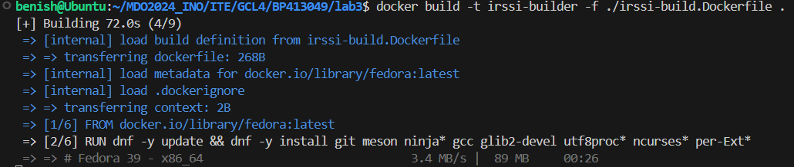
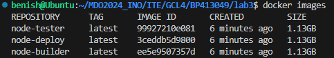

# Sprawozdanie 2 
## Benjamin Pacuta [BP413049]

---
Repozytoria programów:
- https://github.com/irssi/irssi
- https://github.com/devenes/node-js-dummy-test

---

### Przeprowadzenie buildu w kontenerze (irssi)

1. Izolacja środowiska uruchomieniowego w kontenerze. Klonujemy repozytorium.
```
git clone https://github.com/irssi/irssi.git
```


2. Instalacja potrzebnych zależności
```
sudo apt-get install cmake
sudo apt-get install pkg-config
sudo apt-get install libglib2.0-dev
sudo apt-get install libssl-dev
sudo apt-get install libutf8proc-dev
sudo apt-get install libncurses-dev
```


3. Zbudowanie aplikacji i uruchomienie testów.

```
meson Build
```
W katalogu irssi/Build
```
ninja test
```


---
Testy nie uruchomiły zbudowanego programu. 

Testy jednostkowe, czyli takie, które koncentrują się na pojedynczych funkcjach lub modułach programu, nie wymagają uruchamiania całego oprogramowania, aby mogły być przeprowadzone. Są one istotnym elementem weryfikacji działania konkretnych części programu bez potrzeby angażowania całej aplikacji.

Same testy nie oznaczają automatycznego uruchomienia programu. Mogą one jedynie zweryfikować poprawność kodu lub działanie określonych jego fragmentów bez faktycznego uruchomienia skompilowanej aplikacji.

Aby zapewnić, że nasze oprogramowanie jest budowane z wykorzystaniem tylko i wyłącznie określonych bibliotek i w środowisku, które nie wprowadza zakłóceń mogących wpłynąć na proces budowania, zaleca się wykorzystanie kontenerów. Konteneryzacja umożliwia izolację środowiska budowania, co przekłada się na spójność procesu oraz eliminację niepożądanych zależności czy różnic wynikających z różnorodności środowisk developerskich.

---

1. Uruchomienie kontenera Docker na bazie obrazu Fedora i otwarcie powłoki Bash do interaktywnego korzystania z tego kontenera.


```
docker run -it --rm fedora bash 
```


Doinstalowanie gita
```
dnf -y update ; dnf -y install git meson ninja*gcc
```


Sklonowanie repozytorium
```
git clone https://github.com/irssi/irssi.git
```


Próba zbudowania aplikacji.
```
meson Build
```


Doinstalowanie potrzebnych zależności.
```
dnf -y install glib2-devel
```
Tak samo z resztą zależności bo sa w systemie ale nie ma ich w wersji 
developerskich
```
dnf -y install glib2-devel utf8proc* ncurses* per-Ext*
```


```
meson Build
ninja -C /irssi/Build
```


---

Utworzenie pliku irssi-build.Dockerfile - do budowania aplikacji.

```
FROM fedora

RUN dnf -y update && dnf -y install git meson ninja* gcc glib2-devel utf8proc* ncurses* perl-Ext*

RUN git clone https://github.com/irssi/irssi.git
WORKDIR /irssi
RUN meson Build
RUN ninja -C /irssi/Build

```

Utworzenie pliku irssi-test.Dockerfile - do tworzenia obrazu z uruchomionymi testami.

```
FROM irssi-builder

WORKDIR /irssi/Build
RUN ninja test
```

Do zbudowania obrazu kontenera używamy polecenia
```
docker build -t irssi-builder -f ./irssi-build.Dockerfile .
```
Po wykonaniu tego polecenia, Docker tworzy obraz na podstawie pliku irssi-build.Dockerfile, który zawiera instrukcje potrzebne do zbudowania naszej aplikacji. Obraz ten oznaczamy tagiem irssi-builder.

Sprawdzając dostępne obrazy za pomocą docker images, zobaczymy, że zbudowaliśmy obraz kontenera.



Z zbudowanego obrazu możemy uruchomić kontener poleceniem:
```
docker run irssi-builder
```
Jednak, zgodnie z naszą konfiguracją, kontener ten zakończy działanie od razu po uruchomieniu, ponieważ nie został zaprojektowany do długotrwałego działania czy interaktywnego użytkowania. Obraz ten ma służyć wyłącznie do zbudowania naszej aplikacji, a nie do jej uruchomienia czy użytkowania.

Aby przetestować naszą aplikację, tworzymy inny obraz Docker, tym razem z przeznaczeniem do uruchamiania testów. Do tego celu używamy innego Dockerfile:

```
docker build -t irssi-tester -f ./irssi-test.Dockerfile .
```

Tym sposobem zbudowany obraz irssi-tester jest przeznaczony do uruchamiania testów (np. przy użyciu ninja test). Podobnie jak w przypadku budowania, obraz ten jest specjalnie zaprojektowany do wykonania testów i nie jest przeznaczony do długotrwałego działania jako kontener.


Dzięki takiej konfiguracji, mamy oddzielne obrazy dla procesu budowania (irssi-builder) i testowania (irssi-tester) naszej aplikacji. Obrazy te są używane wyłącznie do swoich dedykowanych zadań. Uruchomienie kontenera z tych obrazów bezpośrednio nie uruchomi aplikacji ani testów automatycznie. Akcje te wykonujemy tylko poprzez proces budowania Dockera z odpowiednim Dockerfile.

---

### Aplikacja w node

Uruchomienie interaktywne kontenera poleceniem:
```
sudo docker run --rm -it node /bin/bash
```
Aktualizacja listy dostępnych pakietów i ich wersji:
```
apt-get update
```
Sklonowanie repozytorium:
```
git clone https://github.com/devenes/node-js-dummy-test
```
W katalogu node-js-dummy-test instalujemy potrzebne zależności:
```
npm install
```
Uruchomienie testów:
```
npm run test
```


---

#### Automatyzacja procesu korzystając z plików Dockerfile

- Utworzenie plików *node-build.Dockerfile, node-test.Dockerfile* oraz *node-deploy.Dockerfile*

**node-build.Dockerfile**
```
FROM node

RUN git clone https://github.com/devenes/node-js-dummy-test
WORKDIR /node-js-dummy-test

RUN npm install
```
**node-test.Dockerfile**
```
FROM node-builder

RUN npm test
```

**node-deploy.Dockerfile**
```
FROM node-builder

CMD ["npm","start"]
```

Budowanie obrazów:
```
docker build -t node-builder -f ./node-build.Dockerfile .
docker build -t node-tester -f ./node-test.Dockerfile .
docker build -t node-deploy -f ./node-deploy.Dockerfile .
```


Uruchomienie aplikacji:
```
docker run --rm node-deploy
```


---

### Lab 04

Zbudowanie obrazu kontenera z poprzednich labów.


#### Zachowywanie stanu

1. Przygotowanie woluminów wejściowego i wyjściowego oraz podłączenie ich do kontenera bazowego.

```
docker volume create name
```


2. Uruchomienie kontenera

```
docker run -it --name base-cont -v input_volume:/input -v output_volume:/output node-base bash
```
3. Skopiowanie repozytorium do wolumina wejściowego
```
docker cp /home/benish/Downloads/node-js-dummy-test base-cont:/input
```


4. Instalacja zależności i testowanie

```
npm install
```


```
npm test
```


5. Przeniesienie zbudowanego programu do woluminu wyjściowego

```
cp -r /input/node-js-dummy-test/ /output/
```


---

#### Eksponowanie portu

1. Pobranie i uruchomienie obrazu
```
docker pull networkstatic/iperf3
```


```
docker run -it --name=perfcont -p 5201:5201 networkstatic/iperf3 -s
```


2. Zbadanie ruchu

```
docker inspect perfcont
```


3. Podłączenie się z drugiego kontenera

```
docker run -it --name=drugi networkstatic/iperf3 -c 172.17.0.2
```


4. Pobranie iperf3
```
sudo apt install iperf3
```


5. Łączenie się z hosta i zbadanie ruchu
```
iperf3 -c localhost -p 5201
```


6. Połączenie się spoza hosta i zbadanie ruchu

```
.\iperf3.exe -c 192.168.68.42 -p 5201
```


7. Wyciągnięcie logów

```
docker logs perfcont > logs.txt
```


---

#### Instancja Jenkins

1. Wykonanie kolejno instrukcji instalacji Jenkinsa

```
docker network create jenkins
```


```
docker run \
  --name jenkins-docker \
  --rm \
  --detach \
  --privileged \
  --network jenkins \
  --network-alias docker \
  --env DOCKER_TLS_CERTDIR=/certs \
  --volume jenkins-docker-certs:/certs/client \
  --volume jenkins-data:/var/jenkins_home \
  --publish 2376:2376 \
  docker:dind \
  --storage-driver overlay2
```
2. Utworzenie dockerfile 
```dockerfile
FROM jenkins/jenkins:2.440.2-jdk17
USER root
RUN apt-get update && apt-get install -y lsb-release
RUN curl -fsSLo /usr/share/keyrings/docker-archive-keyring.asc \
  https://download.docker.com/linux/debian/gpg
RUN echo "deb [arch=$(dpkg --print-architecture) \
  signed-by=/usr/share/keyrings/docker-archive-keyring.asc] \
  https://download.docker.com/linux/debian \
  $(lsb_release -cs) stable" > /etc/apt/sources.list.d/docker.list
RUN apt-get update && apt-get install -y docker-ce-cli
USER jenkins
RUN jenkins-plugin-cli --plugins "blueocean docker-workflow"
```
3. Stworzenie kontenera
```
docker build -t myjenkins-blueocean:2.440.2-1 .
```


```
docker run \
  --name jenkins-blueocean \
  --restart=on-failure \
  --detach \
  --network jenkins \
  --env DOCKER_HOST=tcp://docker:2376 \
  --env DOCKER_CERT_PATH=/certs/client \
  --env DOCKER_TLS_VERIFY=1 \
  --publish 8080:8080 \
  --publish 50000:50000 \
  --volume jenkins-data:/var/jenkins_home \
  --volume jenkins-docker-certs:/certs/client:ro \
  myjenkins-blueocean:2.440.2-1
```


4. Działające kontenery


5. Po wejściu na localhost:8080 okno jenkinsa wymagajace hasla


Uzyskanie hasła za pomocą komendy
```
docker exec jenkins-blueocean cat /var/jenkins_home/secrets/initialAdminPassword
```

Po wpisaniu hasła zainstalowanie wtyczek


Utworzenie konta i rozpoczecie pracy z Jenkins


