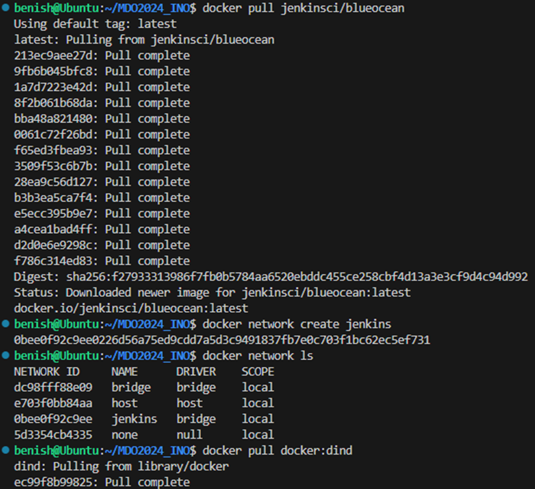
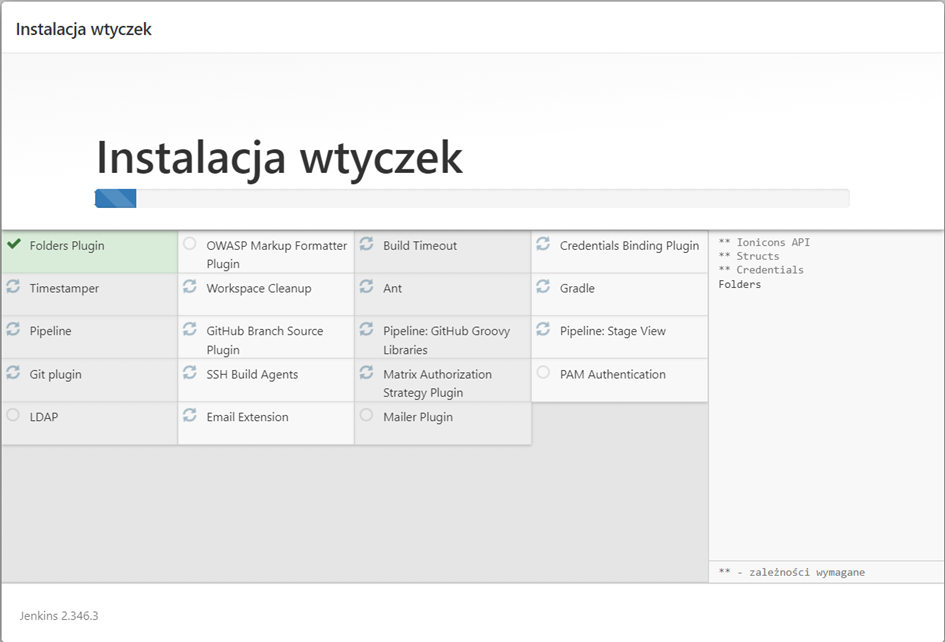

# Sprawozdanie 3
## Benjamin Pacuta [BP413049]
---

#### Przygotowanie

- Pobieranie obrazu Docker dla Jenkins Blue Ocean:
W pierwszym kroku pobrałem najnowszy obraz Jenkinsa z dodatkiem Blue Ocean, używając polecenia docker pull jenkinsci/blueocean:latest. Proces ten zakończył się sukcesem, co potwierdza lista "Pull complete" dla każdej z warstw obrazu Docker.

- Tworzenie sieci Docker:
Następnie, aby umożliwić komunikację między kontenerami, stworzyłem dedykowaną sieć Docker o nazwie "jenkins". Użyłem do tego polecenia docker network create jenkins, a sprawdzenie listy dostępnych sieci za pomocą docker network ls potwierdziło, że nowa sieć została poprawnie utworzona.

- Uruchomienie Jenkinsa w Dockerze:
Uruchomiłem kontener Jenkinsa z dodatkiem Blue Ocean w trybie odłączonym (--detach), korzystając z nowo utworzonej sieci "jenkins". W trakcie uruchamiania zastosowałem różne opcje, takie jak tryb uprzywilejowany (--privileged), przekierowanie portów oraz montowanie lokalnych woluminów na potrzeby przechowywania danych Jenkinsa i certyfikatów Docker.

- Budowa własnego obrazu Jenkins Blue Ocean:
W kolejnym etapie zbudowałem własną wersję obrazu Jenkins Blue Ocean (tag: myjenkins-blueocean:2.440.3-1). Proces ten obejmował załadowanie definicji z Dockerfile.

*dockerfile*
```
FROM jenkins/jenkins:2.440.3-jdk17

USER root

RUN apt-get update && apt-get install -y lsb-release

RUN curl -fsSLo /usr/share/keyrings/docker-archive-keyring.asc \
    https://download.docker.com/linux/debian/gpg

RUN echo "deb [arch=$(dpkg --print-architecture) signed-by=/usr/share/keyrings/docker-archive-keyring.asc] \
    https://download.docker.com/linux/debian \
    $(lsb_release -cs) stable" > /etc/apt/sources.list.d/docker.list

RUN apt-get update && apt-get install -y docker-ce-cli

USER jenkins

RUN jenkins-plugin-cli --plugins "blueocean docker-workflow"
```



- Uruchomienie skonfigurowanego obrazu Jenkins Blue Ocean:
Uruchomiłem skonfigurowany obraz Jenkins Blue Ocean (własna wersja obrazu myjenkins-blueocean:2.440.3-1). W tym celu wykorzystałem polecenie docker run, określając szczegółowe parametry konfiguracyjne, takie jak sieć Docker (jenkins), porty (30080 dla HTTP i 50000 dla JNLP), ścieżki do certyfikatów TLS oraz opcje dotyczące woluminów danych Jenkinsa i certyfikatów. Dodatkowo ustawiłem opcję automatycznego restartu kontenera na wypadek jego awarii (--restart-on-failure).

- Pobranie hasła administratora Jenkinsa:
Po uruchomieniu kontenera użyłem polecenia docker exec do wykonania komendy wewnątrz kontenera, aby pobrać początkowe hasło administratora z pliku, co jest konieczne do dalszej konfiguracji Jenkinsa. To hasło jest przechowywane w lokalizacji /var/jenkins_home/secrets/initialAdminPassword.

- Instalacja wtyczek w Jenkinsie:
Następnie przeszedłem do etapu instalacji wtyczek w Jenkinsie.




---
#### Uruchomienie

- Utworzenie projektu wyświetlającego informacje systemowe (uname):
Utworzyłem projekt w Jenkinsie, którego zadaniem było wykonanie polecenia uname -a w celu wyświetlenia informacji o systemie. Projekt ten zakończył się sukcesem, co zostało potwierdzone w logach konsoli, gdzie wynik polecenia uname -a pokazał szczegóły dotyczące używanego jądra Linuxa i konfiguracji systemu.


- Utworzenie projektu sprawdzającego parzystość godziny:
Kolejny projekt, który zrealizowałem, polegał na uruchomieniu skryptu bash, który sprawdzał, czy aktualna godzina jest parzysta. Skrypt kończył się niepowodzeniem, gdy godzina była nieparzysta, co było widoczne w logach jako błąd "Failure: The hour is odd." 


- Konfiguracja i wykonanie skryptu Jenkins Pipeline:
Zaimplementowałem pipeline w Jenkinsie za pomocą skryptu Groovy, który definiuje dwa główne etapy:
Klonowanie repozytorium: Ustawiłem Jenkinsa, aby klonował nasze repozytorium z GitHuba. Skonfigurowałem go, aby używał mojego brancha BP413049.
Budowanie obrazów Docker: Zdefiniowałem krok w pipeline, który buduje obraz Docker używając Dockerfile znajdującego się w repozytorium. Wykorzystałem komendę docker build, aby stworzyć obraz o nazwie obraz_build.


- Monitoring wykonania zadań:
Po konfiguracji, Jenkins uruchomił zdefiniowane etapy, co było widoczne w "Stage View" Jenkinsa, gdzie czas wykonania poszczególnych etapów oraz statusy były klarownie przedstawione. Klonowanie repozytorium zajęło około 2 minuty i 6 sekund, a budowanie obrazów Docker zajęło 56 sekund.


- Analiza wyników wykonania pipeline:
W logach konsoli Jenkinsa były widoczne wszystkie wykonane kroki, w tym klonowanie repozytorium i szczegółowe informacje o wykonaniu komendy git. Podczas budowania obrazów Docker, logi wskazały na pomyślne zakończenie tego procesu. 


- Różnice pomiędzy DIND, a budowaniem bezpośrednio w kontenerze CI

Budowanie w środowisku DIND (Docker-in-Docker):
Budowanie w dedykowanym środowisku DIND polega na uruchamianiu każdego zadania budowania w osobnym kontenerze Docker, który działa wewnątrz innego kontenera Docker. Ta metoda oferuje kompleksową izolację, co jest korzystne, gdy wymagany jest dostęp do pełnego stosu funkcji Docker. Jednakże, konfiguracja takiego środowiska może być bardziej skomplikowana, wiążąc się z potrzebą dostosowania odpowiednich ustawień bezpieczeństwa i wydajności.

Budowanie bezpośrednio w kontenerze CI:
Z kolei budowanie bezpośrednio w kontenerze CI nie wymaga stosowania DIND ani zarządzania dodatkowymi warstwami kontenerów. Kontener CI działa bezpośrednio na hoście, co często przekłada się na lepszą wydajność i mniejsze zużycie zasobów. Mimo że ta metoda może oferować mniejszą izolację w porównaniu do DIND, dla wielu zastosowań może okazać się całkowicie wystarczająca.

---
#### Pipeline

```
pipeline {
    agent any

    stages {
        stage('Prepare') {
            steps {
                sh '''
                    rm -rf MDO2024_INO
                    git clone https://github.com/InzynieriaOprogramowaniaAGH/MDO2024_INO.git
                    cd MDO2024_INO
                    git checkout BP413049
                '''
            }
        }

        stage('Logs') {
            steps {
                dir('MDO2024_INO/ITE/GCL4/BP413049/lab3'){
                    sh 'touch build.log'
                    sh 'touch test.log'
                }
            }
        }

        stage('Build') {
            steps {
                dir('MDO2024_INO/ITE/GCL4/BP413049/lab3') {
                    sh 'docker build -t node-builder -f node-build.Dockerfile . | tee build.log'
                    archiveArtifacts artifacts: "build.log"
                }
            }
        }

        stage('Tests') {
            steps {
                dir('MDO2024_INO/ITE/GCL4/BP413049/lab3') {
                    sh 'docker build -t node-test -f node-test.Dockerfile . | tee test.log'
                    archiveArtifacts artifacts: "test.log"
                }
            }
        }

        stage('Deploy') {
            steps {
                sh 'docker network create my_network || true'
                dir('MDO2024_INO/ITE/GCL4/BP413049/lab3') {
                    sh 'docker build -t node-deploy -f node-deploy.Dockerfile .'
                    sh 'docker rm -f app || true'
                    sh 'docker run -d -p 8081:8080 --name app --network my_network node-deploy'
                }
                sleep(10) // Ensure proper time for the deployment to stabilize
            }
        }

        stage('Publish') {
            steps {
                dir('MDO2024_INO/ITE/GCL4/BP413049/lab3') {
                    archiveArtifacts artifacts: "artifacts/art.tar"
                    sh 'docker system prune --all --volumes --force'
                }
            }
        }
    }
    
    post {
        always {
            echo 'Cleaning up...'
            sh 'docker rmi node-builder node-test node-deploy'
        }
    }
}

```

- Prepare
Pierwszy etap jest potrzebny do przygotowania środowiska projektu. Należy usunąć stary katalog, sklonować odpowiednie repozytorium, a następnie przejść na odpowiednią gałąź.


- Logs
Logi zawierają informacje o krokach procesu budowania, takich jak kompilacja kodu źródłowego, kopiowanie plików, instalacja zależności oraz wynikach testów jednostkowych, integracyjnych i testów wydajnościowych. Dzięki zapisywaniu tych informacji w plikach dziennika, użytkownicy mogą prześledzić historię procesu budowania i testowania, zidentyfikować i rozwiązać problemy oraz ocenić jakość i wydajność projektu. Pliki build.log i test.log są wykorzystywane do rejestrowania logów związanych z procesem budowania i testowania.

- Build
Proces budowania jest kluczowym elementem w cyklu życia oprogramowania, pozwalającym na automatyzację kompilacji, testowania i wdrażania aplikacji.

- Tests
Ten fragment kodu definiuje etap testów, który jest kluczowym krokiem w procesie zapewniania jakości oprogramowania poprzez automatyzację testowania aplikacji.

- Deploy
Po pomyślnym zakończeniu testów, etap deploy automatycznie wdraża zbudowaną aplikację lub oprogramowanie na odpowiednie środowisko, takie jak środowisko deweloperskie, testowe, stagingowe lub produkcyjne. Automatyzacja tego procesu eliminuje potrzebę ręcznego wdrażania, co z kolei przyspiesza cykl dostarczania oprogramowania. Etap ten ma na celu zwiększenie efektywności i skuteczności procesu wdrażania poprzez eliminację ludzkich błędów oraz zapewnienie spójności między różnymi środowiskami.

- Publish
Etap ma na celu udostępnienie wytworzonych artefaktów, takich jak biblioteki, moduły, pliki konfiguracyjne, aby były dostępne do użycia przez inne aplikacje lub zespoły. Udostępnienie tych artefaktów umożliwia innym projektom korzystanie z gotowych komponentów zamiast implementowania ich od zera. Może być on również używany do zarządzania wersjami artefaktów.


W trakcie implementacji pipeline'a w Jenkinsie, który miał za zadanie zbudować obraz Dockera, wystąpił błąd uniemożliwiający połączenie się z serwerem Docker. Problem objawił się podczas próby wykonania operacji budowania obrazu Docker oraz kolejnych operacji z nim związanych.

Komunikat błędu w konsoli:
`ERROR: error during connect: Head "https://docker:2376/_ping": dial tcp: lookup docker on 127.0.0.11:53: server misbehaving`

Po sprawdzeniu konfiguracji Docker daemon  i upewnieniu się że działa na odpowiednich portach oraz nadaniu użytkownikowi odpowiednich uprawnień do komunikacji z demonem Docker odpaliłem ponownie projekt.


Wszystkie testy przeszły prawidłowo.