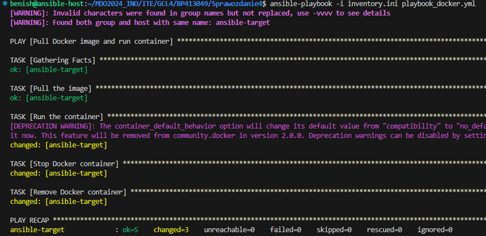

# Sprawozdanie 4
## Benjamin Pacuta [BP413049]

---


##### Cel laboratorium
Celem laboratorium było zapoznanie się z narzędziem Ansible, które jest stosowane do automatyzacji zarządzania konfiguracją, wdrażania aplikacji i orkiestracji zadań. Ansible jest narzędziem open-source i bezagentowym, co oznacza, że nie wymaga instalacji dodatkowego oprogramowania na maszynach docelowych — komunikuje się przez SSH.

---
### Instalacja Zarządcy Ansible
1. Utworzenie drugiej maszyny wirtualnej o systemie operacyjnym tym samym co "główna" maszyna. Nadanie maszynie hostname `ansible-target`.


2. Proces instalacji OpenSSH i tar na nowo utworzonej maszynie wirtualnej.

- Instalacja tar: Potrzebny do pakowania i rozpakowywania archiwów.


- Instalacja klienta OpenSSH: Niezbędny do zdalnego dostępu do maszyny.


- Instalacja narzędzi sieciowych: Przydatne do diagnozowania połączeń sieciowych.


3. Proces instalacji Ansible na głównej maszynie za pomocą komendy `sudo apt install ansible`.


4. Utworzenie migawki drugiej maszyny.


5. Proces generowania kluczy SSH na głównej maszynie oraz na maszynie docelowej. Komenda `ssh-keygen -t rsa -f ~/.ssh/ansible` została użyta na obu maszynach do stworzenia par kluczy (publicznego i prywatnego), co jest kluczowe dla bezpiecznego połączenia SSH.


6. Edycja `etc/hosts`ansible-target.
*192.168.64.153 ansible-target*: 
Adres IP skojarzony z nazwą hosta ansible-target, co umożliwia odwoływanie się do maszyny po tej nazwie zamiast po adresie IP. Jest to istotne dla usprawnienia zarządzania i komunikacji w środowiskach gdzie używane jest Ansible, gdyż pozwala to na łatwiejsze i bardziej intuicyjne odnoszenie się do hostów w skryptach i konfiguracjach.


7. Skopiowanie klucza publicznego SSH z głównej maszyny wirtualnej na maszynę docelową, umożliwiając logowanie bez użycia hasła.


8. Sprawdzenie statusu serwisu ssh.


9.  Logowanie do maszyny *ansible@ansible-target* bez konieczności wprowadzania hasła, co potwierdza sukces wymiany kluczy.

10. Zmiana nazwy hosta na głównej maszynie na ansible-host za pomocą polecenia `hostnamectl set-hostname ansible-host`.

11. Aktualizacja pliku /etc/hosts po zmianie hostname.

12. Weryfikacja łączności. Potwierdzenie skuteczności konfiguracji sieci i zdolność komunikacji pomiędzy maszynami.


---

### Inwentaryzacja
Ansible Inventory, inaczej inwentarz, to kluczowy element, który umożliwia Ansible identyfikowanie i grupowanie hostów, na których mają być wykonane zadania automatyzacyjne. Inwentarz definiuje hosty zarówno poprzez ich adresy IP, jak i nazwy DNS. 

1. Struktura pliku inventory.ini

Orchestrators: Grupa maszyn zarządzających, z których wysyłane są instrukcje do innych hostów. Tutaj mamy host Ubuntu z użytkownikiem benish, który pełni rolę nadzorcy.
Endpoints: Węzły końcowe, czyli maszyny docelowe, które otrzymują i wykonują polecenia. W naszym scenariuszu jest to maszyna ansible-target z użytkownikiem ansible.

2. Po skonfigurowaniu inwentarza, hosty są gotowe do komunikacji i wykonania zadań. Jako pierwsze zadanie próbowałem wykonać pingowanie wszystkich hostów przy użyciu komendy:

Podczas próby wykonania polecenia ping za pomocą Ansible na zdalny host, otrzymałem komunikat o błędzie, który informował o braku możliwości połączenia z hostem ansible-host oraz o tym, że klucz publiczny hosta nie został wcześniej zaakceptowany, a dostęp został ostatecznie odrzucony (Permission denied).
- Początkowo spróbowałem sprawdzić zawartość pliku authorized_keys za pomocą polecenia cat, ale otrzymałem komunikat, że plik nie istnieje.
- Utworzyłem katalog .ssh z odpowiednimi uprawnieniami za pomocą polecenia mkdir -p ~/.ssh a następnie nadałem mu uprawnienia chmod 700 ~/.ssh.
- Następnie stworzyłem pusty plik authorized_keys poleceniem touch ~/.ssh/authorized_keys i nadałem mu uprawnienia chmod 600 ~/.ssh/authorized_keys.

Wykorzystałem polecenie ssh-copy-id do skopiowania klucza publicznego na zdalny host, co umożliwiło dodanie klucza do pliku authorized_keys i ułatwiło autoryzację przy kolejnych próbach połączenia.

Aby upewnić się, że klucze zostały poprawnie zainstalowane i tylko one zostały dodane, zalogowałem się na zdalną maszynę za pomocą SSH bez użycia hasła. Pomyślne logowanie bez żądania hasła potwierdziło, że problem z autoryzacją został skutecznie rozwiązany.


---
### Zdalne wywoływanie procedur
W ramach dalszych działań związanych z zarządzaniem infrastrukturą za pomocą Ansible, przeprowadziłem serię operacji zdalnego wywoływania procedur, wykorzystując do tego playbooki Ansible. Playbooki umożliwiają automatyzację zadań na zdalnych maszynach, co znacząco usprawnia procesy administracyjne. 
1. Playbook: Pingowanie Wszystkich Maszyn
```
- name: Ping all machines
  hosts: all
  tasks:
    - name: Ping all machines
      ping:
```

Po uruchomieniu tego playbooka (playbook.yml) za pomocą polecenia:
```
ansible-playbook -i inventory.ini playbook.yml
```
uzyskałem następujący rezultat:
Zadanie zbierania faktów (Gathering Facts) oraz zadanie pingowania (Ping all machines) zostały wykonane pomyślnie na obu maszynach (ansible-target oraz ubuntu), co potwierdza ich dostępność i odpowiedź na ping.

2. Playbook: Kopia Pliku Inwentaryzacyjnego
```
- name: Copy inventory file to Endpoints
  hosts: Endpoints
  tasks:
    - name: Copy inventory.ini to Endpoints
      copy:
        src: /home/benish/MD02024_INO/ITE/GCL4/BP413049/Sprawozdanie4/inventory.ini
        dest: /home/ansible/
```
Po uruchomieniu tego playbooka (playbook_copy.yml) za pomocą polecenia:
```
ansible-playbook -i inventory.ini playbook_copy.yml
```
uzyskałem wynik, gdzie:

Zadanie zbierania faktów (Gathering Facts) oraz kopiowania pliku (Copy inventory.ini to Endpoints) zostały wykonane pomyślnie, co widać na podstawie statusu changed, oznaczającego, że plik został skopiowany na zdalną maszynę.

Wynik ponownego wywołania playbooka.

Kiedy playbook został uruchomiony po raz drugi, system Ansible sprawdził, czy plik inventory.ini na maszynie docelowej różni się od pliku źródłowego. Ponieważ plik na zdalnym hoście już istniał i nie różnił się od pliku źródłowego (nie zostały wprowadzone żadne zmiany od pierwszego kopiowania), Ansible zidentyfikował, że nie jest wymagana żadna zmiana.

- Sprawdzenie czy plik istnieje na maszynie docelowej:


3. Aktualizacja Pakietów na Maszynach Docelowych

*playbook_update.yml*
```
- name: Update packages on target system
  hosts: Endpoints
  tasks:
    - name: Upgrade all packages
      ansible.builtin.apt:
        name: "*"
        state: latest
      become: true
```
Ten playbook ma na celu zaktualizowanie wszystkich pakietów do najnowszych dostępnych wersji na zdalnych maszynach docelowych. Został uruchomiony za pomocą polecenia:
```
ansible-playbook -i inventory.ini playbook_update.yml
```

Zadanie aktualizacji pakietów (Upgrade all packages) zakończyło się pomyślnie, choć wskazuje na brak zmian (changed=0), co może oznaczać, że wszystkie pakiety były już aktualne.

4. Restart Usług sshd i rngd

*playbook_restart.yml*
```
- name: Restart sshd and rngd services
  hosts: Endpoints
  become: true
  tasks:
    - name: Install rng-tools
      ansible.builtin.apt:
        name: rng-tools
        state: present
    - name: Restart sshd service
      ansible.builtin.service:
        name: sshd
        state: restarted
    - name: Restart rngd service
      ansible.builtin.service:
        name: rng-tools
        state: restarted

```
Kolejny krok polegał na zainstalowaniu narzędzi rng-tools, a następnie zrestartowaniu usług sshd oraz rngd. Playbook został uruchomiony poleceniem:
```
ansible-playbook -i inventory.ini playbook_restart.yml
```

Zainstalowanie rng-tools (Install rng-tools) oraz restart obu usług (Restart sshd service i Restart rngd service) zakończył się sukcesem, co potwierdza odpowiednie wpisy changed, wskazujące na dokonanie zmian.

Weryfikacja działania playbooka


5. Sprawdzenie wyników działania playbooka dla wyłączonej usługi SSH oraz przy odpięciu karty sieciowej.

- Wyłączenie usługi SSH
Wynik polecenia systemctl status sshd wskazywał, że usługa SSH jest nieaktywna (dead), co było spodziewanym wynikiem po jej wyłączeniu.

Próba wykonania playbooka skończyła się niepowodzeniem z wiadomością o błędzie: "Failed to connect to the host via ssh: connect to host ansible-target port 22: Connection refused", co wskazuje, że Ansible nie był w stanie nawiązać połączenia SSH z hostem ze względu na wyłączoną usługę SSH.

- Odłączenie karty sieciowej

Próba wykonania playbooka również zakończyła się niepowodzeniem, ale z inną wiadomością o błędzie: "Failed to connect to the host via ssh: ssh: connect to host ansible-target port 22: Connection timed out", co sugeruje, że Ansible próbował nawiązać połączenie przez dłuższy czas, ale ostatecznie operacja zakończyła się niepowodzeniem z powodu braku odpowiedzi z hosta – wynikającej z odłączonej karty sieciowej.

---
### Zarządzanie kontenerem
W ramach laboratorium z Ansible przeprowadzono działania związane z zarządzaniem kontenerami Docker, które obejmowały pobieranie obrazów z Docker Hub, uruchamianie i zarządzanie kontenerami, a także ich późniejsze zatrzymywanie i usuwanie.
1. Logowanie do docker hub

2. Playbook: Pobranie i uruchomienie kontenera Docker
```
- name: Pull Docker image and run container
  hosts: Endpoints
  become: yes
  tasks:
    - name: Pull the image
      community.docker.docker_image:
        name: benishhh/spring
        tag: "deploy"
        source: pull

    - name: Run the container
      community.docker.docker_container:
        name: spring
        image: benishhh/spring:deploy
        state: started
        interactive: yes
        tty: yes

```

Wynik: Obraz został pomyślnie pobrany i uruchomiony jako kontener. Kontener został skonfigurowany do pracy interaktywnej z przydzielonym terminalem (TTY).

Po uruchomieniu kontenera, wykonano polecenie sudo docker ps na ansible-target aby potwierdzić, że kontener działa poprawnie. Wynik pokazał działający kontener z aplikacją nasłuchującą na porcie 8080.

3. Playbook: Zatrzymywanie i usuwanie kontenera Docker

Uzupełnienie *playbook_docker.yml*
```
    - name: Stop Docker container
      community.docker.docker_container:
        name: spring
        state: stopped

    - name: Remove Docker container
      community.docker.docker_container:
        name: spring
        state: absent
```


Wynik: Kontener został pomyślnie zatrzymany i usunięty, co zapewnia sprzątanie zasobów po zakończeniu potrzebnych operacji.


Podsumowanie
Zarządzanie kontenerami Docker za pomocą Ansible demonstrowało wysoką efektywność i automatyzację w deploymentach aplikacji. Użycie playbooków Ansible do zarządzania cyklem życia kontenerów umożliwia nie tylko szybką i skuteczną implementację, ale również elastyczne zarządzanie zasobami, co jest kluczowe w dynamicznie zmieniających się środowiskach IT. Wszystkie działania zostały udokumentowane za pomocą screenshotów, które potwierdzają poprawność wykonania poszczególnych kroków, od logowania po zarządzanie kontenerami.

---
### Instalacje nienadzorowane

1. Instalacja systemu Fedora na nowo utworzonej wirtualnej maszynie


2. Uzyskanie dostępu do pliku `anaconda-ks.cfg`
```
sudo nano root/anaconda-ks.cfg
```
Zmodyfikowanie pliku:
```
#version=F38
# Use graphical install
graphical

# Keyboard layouts
keyboard --vckeymap=pl --xlayouts='pl'
# System language
lang pl_PL.UTF-8

%packages
@^server-product-environment
@core
wget
docker
curl
%end

# Run the Setup Agent on first boot
firstboot --enable

# Generated using Blivet version 3.7.1
ignoredisk --only-use=sda
autopart
# Partition clearing information
clearpart --all --initlabel

#repozytoria
url --mirrorlist=http://mirrors.fedoraproject.org/mirrorlist?repo=fedora-38&arch=x86_64
repo --name=update --mirrorlist=http://mirrors.fedoraproject.org/mirrorlist?repo=updates-released-f38&arch=x86_64

# System timezone
timezone Europe/Warsaw --utc

# Root password
rootpw --iscrypted $y$j9T$PDe7kXdg9DeuRikHJccIUe$4E4s/xY/NszaXoh8hvLgSUyeRIU7PSc7rlIcE2AuRq6zZcG/
user --groups=wheel --name=benishhh --password=$y$j9T$9HhBmCc0/16nRFimlTEuWu$qsSjL2uS6LnZn1X51qFyQbHUZXIUAdWuUWk7QfgOgJh18XPxDfA --iscrypted --gecos="Benjamin Pacuta"

%post
rootpw --log=/root/ks-post.log
yum install -y docker
systemctl enable docker
systemctl start docker
docker login -u benish -p 
docker pull benishhh/spring:deploy
docker run -p benishhh/spring:deploy
%end
```

Wyodrębnienie pliku anbaconda-ks.cfg z Fedory za pomocą metody współdzielonego folderu.
Uruchomienie servera pythin i umieszczenie tam pliku konfiguracyjnego.


Utworzenie nowej maszyny wirtualnej z Fedorą:


Modyfikacja konfiguracji GRUB


Uruchomienie instalacji:

Po uruchomieniu maszyny ta ściągnęła i uruchomiła obraz:
