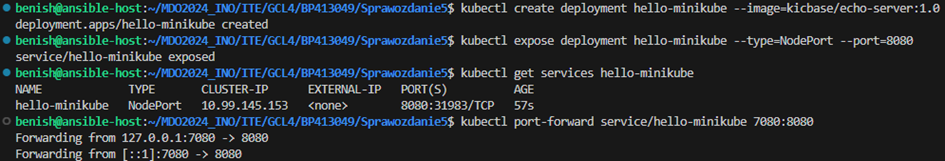
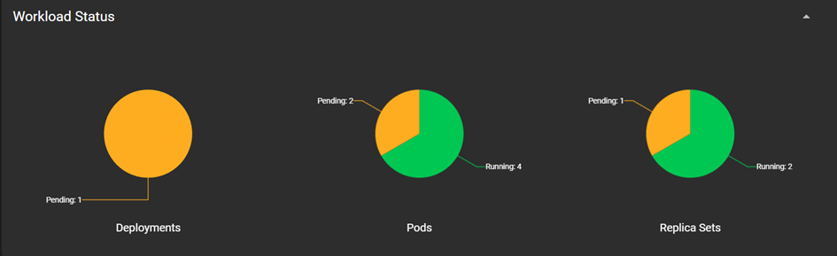

# Sprawozdanie 5
## Benjamin Pacuta [BP413049]

---

### Wdrażanie na zarządzalne kontenery: Kubernetes (1)

#### Instalacja klastra Kubernetes

1.  Instalacja i Uruchomienie Minikube

- Pobranie Minikube
```
curl -LO https://storage.googleapis.com/minikube/releases/latest/minikube-linux-amd64
```
- Instalacja Minikube
```
sudo install minikube-linux-amd64 /usr/local/bin/minikube
```
- Uruchomienie Minikube
```
minikube start
```


Minikube to narzędzie, które pozwala na uruchomienie klastera Kubernetes lokalnie na komputerze deweloperskim. Proces instalacji i uruchomienia obejmuje pobranie binarnego pliku Minikube, instalację go w systemie, a następnie uruchomienie klastra. Minikube automatycznie konfiguruje klaster z pojedynczym węzłem, co jest idealne do celów deweloperskich i testowych.

2. Instalacja Kubectl
```
sudo snap install kubectl --classic
```


Kubectl jest narzędziem wiersza poleceń dla Kubernetes, które pozwala na zarządzanie klastrem, wdrożeniami i usługami.

3. Uruchomienie Dashboardu Kubernetes
```
minikube dashboard
```


Po uruchomieniu, Minikube automatycznie konfiguruje i otwiera Dashboard w domyślnej przeglądarce internetowej. Dashboard jest przydatnym narzędziem, które zapewnia graficzny interfejs do monitorowania i zarządzania zasobami klastra, takimi jak podsy, deploymenty i usługi, a także pozwala na diagnozowanie i rozwiązywanie problemów z aplikacjami.

4. Tworzenie, wsponowanie Deploymentu i przekierowanie portów

Tworzenie deploymentu hello-minikube ma na celu wdrożenie prostej aplikacji echo serwera w środowisku Kubernetes, używając Minikube jako lokalnego klastra. W ten sposób sprawdzam czy Kubernetes działa poprawnie.


```
kubectl create deployment hello-minikube --image=kicbase/echo-server:1.0
```
Komenda kubectl create deployment służy do tworzenia nowego deploymentu w klastrze Kubernetes. Parametr --image=kicbase/echo-server:1.0 określa obraz Docker, który będzie używany przez pody w ramach tego deploymentu. W tym przypadku, jest to prosty serwer echo, który odpowiada na zapytania HTTP, zwracając informacje przesłane do serwera.

```
kubectl expose deployment hello-minikube --type=NodePort --port=8080
```
Używając kubectl expose, tworzysz obiekt Service, który umożliwia dostęp do aplikacji z zewnątrz klastra. --type=NodePort oznacza, że usługa będzie dostępna na zewnętrznym porcie na węźle klastra, co jest idealne do testów w Minikube.

```
kubectl port-forward service/hello-minikube 7080:8080
```
Komenda kubectl port-forward umożliwia dostęp do usług w klastrze poprzez przekierowanie ruchu z lokalnego portu (np. 7080) na port usługi w klastrze (8080). Dzięki temu można przeglądać i testować aplikację lokalnie.



5. Sprawdzenie poprawności działania usługi.


Po przekierowaniu portów i otwarciu localhost:7080 w przeglądarce, użytkownik może zobaczyć odpowiedź serwera echo, która zawiera szczegółowe informacje o żądaniu HTTP wysłanym przez przeglądarkę.

6. Monitorowanie stanu deploymentu


W dashboardzie Kubernetes można zobaczyć, że deployment hello-minikube posiada jeden działający pod, co potwierdza, że wdrożenie i ekspozycja usługi przebiegły pomyślnie.

7. Usunięcie poda poprzez dashboard


#### Wdrożenie własnego kontenera 

- Uruchomienie kontenera 

Celem było uruchomienie lokalnego kontenera Docker, aby testować działanie aplikacji Spring Boot w izolowanym środowisku.

```
docker run --name test-app -p 8080:8080 benishhh/spring
```


- Testowanie aplikacji


Sprawdzenie, czy aplikacja odpowiednio działa po uruchomieniu w kontenerze Docker.

---
#### Uruchamianie oprogramowania

- Uruchomienie poda z aplikacją
```
kubectl run spring-deploy --image=benishhh/spring:deploy --port=8080 --labels app=spring-deploy
```


Panel Kubernetes Dashboard pokazuje, że pod spring-deploy działa poprawnie (status "Running"), co potwierdza, że wdrożenie i konfiguracja są prawidłowe i aplikacja jest zdolna do obsługi ruchu sieciowego.


- Przekierowanie portów
```
kubectl port-forward pod/spring-deploy 8080:8080
```


- Sprawdzenie, czy aplikacja działa poprawnie po jej wdrożeniu w środowisku Kubernetes.


---
#### Konwersja wdrożenia ręcznego na wdrożenie deklaratywne YAML

- Wdrożenie z pliku YAML
```
apiVersion: apps/v1
kind: Deployment
metadata:
  name: my-app-deployment
spec:
  replicas: 2
  selector:
    matchLabels:
      app: my-app
  template:
    metadata:
      labels:
        app: my-app
    spec:
      containers:
      - name: my-app
        image: benishhh/spring:deploy
        ports:
        - containerPort: 8080
---
apiVersion: v1
kind: Service
metadata:
  name: my-app-service
spec:
  type: NodePort
  ports:
  - port: 8080
    nodePort: 30001
    protocol: TCP
  selector:
    app: my-app

```
-  Zaktualizowanie deploymentu w Kubernetes z pliku konfiguracyjnego YAML.

```
kubectl apply -f deployment.yaml
```
Ta komenda zaaplikowała zmiany zdefiniowane w pliku YAML, skutecznie konfigurując deployment z żądanymi czterema replikami aplikacji.


- Monitorowanie podów i usług
```
kubectl get pods
```
Komenda ta pokazuje listę wszystkich podów wraz z ich statusami. Każdy z podów jest w stanie Running, co wskazuje, że aplikacja działa stabilnie bez restartów.

```
kubectl get svc
```


Polecenia te dostarczają informacji o stanie i dostępności podów oraz usług. Widzimy, że pody my-app-deployment są w stanie Running, co wskazuje na ich poprawne działanie.

- Przekierowanie portów

```
kubectl port-forward pod/spring-deploy 8080:8080
```

- Sprawdzenie stanu deploymentu

```
kubectl get deployments
```


- Testowanie aplikacji


Po przekierowaniu portów i otwarciu localhost:8080 w przeglądarce, użytkownik widzi komunikat: "Hello from Azure App Service (in the staging slot)!", co sugeruje, że aplikacja działa poprawnie

---

Aktualizacja pliku deployment.yaml - wzbogacenie obrazu o 4 repliki.

```
spec:
  replicas: 4
  selector:
    matchLabels:
      app: my-app
```


```
kubectl get deployments
```
Ta komenda dostarcza informacji o stanie deploymentów w klastrze, pokazując, że wszystkie cztery repliki deploymentu my-app-deployment są gotowe i działają poprawnie (READY 4/4).


---

#### Nowa wersja obrazu

- Zarejestrowałem nowe wersje obrazu w Docker Hub

```
docker build -t benishhh/spring:error -f dockerfile-blad.Dockerfile .
```
Ta komenda buduje obraz Docker z etykietą error korzystając z pliku Dockerfile, który został nazwany jako dockerfile-blad.Dockerfile. Obraz jest zbudowany tak, aby symulować błąd podczas uruchamiania.

*dockerfile-blad.Dockerfile*
```
# Wybierz obraz bazowy
FROM benishhh/spring:error

# Polecenie, które zostanie uruchomione przy starcie kontenera
CMD ["bash", "-c", "exit 1"]
```

- Uruchomienie obrazu docker z błędem
```
docker run benishhh/spring:error
echo $?
```
Komenda echo $? wyświetla kod wyjścia z ostatniego polecenia uruchomionego w shellu, co pozwala zidentyfikować, czy obraz zakończył działanie błędem.


- Panel Docker Hub z obrazami z różnymi tagami


---
#### Zmiany w deploymencie

- Zwiększenie liczby replik do 8
```
kubectl apply -f deployment.yaml
```
Zmieniłem w pliku deployment.yaml liczbę replik z domyślnej wartości na 8. Po zastosowaniu tej konfiguracji, deployment został zaktualizowany, a Kubernetes stworzył dodatkowe repliki do osiągnięcia żądanej liczby 8.


Mamy 1 aktywny deployment, 9 działających podów (1 uruchomiony ręcznie) 1 aktywna grupa replik.

- Zmniejszenie liczby replik do 1


- Zmniejszenie liczby replik do 0


Kubernetes radzi sobie z dynamicznymi poleceniami skalowania. Dashboard Kubernetes dostarcza wizualnej reprezentacji stanu klastra, co ułatwia zrozumienie, ile podów jest aktualnie zarządzanych przez każdy zestaw replik. Skalowanie w dół do zera efektywnie "wyłącza" deployment bez usuwania konfiguracji, pozwalając na szybkie ponowne skalowanie w górę, gdy jest to potrzebne.

- Zastosowanie nowej wersji obrazu

zmiana w *deployment.yaml*
(spring:deploy -> spring:1.0)
```
spec:
      containers:
      - name: spring
        image: benishhh/spring:1.0
        ports:
        - containerPort: 8080
```


Deployment: Pokazuje, że jeden deployment jest w stanie Pending. Oznacza to, że Kubernetes próbuje zaktualizować pody, ale napotyka trudności, co może wynikać z problemów z pobraniem nowego obrazu lub innych kwestii infrastrukturalnych.
Pods: Widoczny jest diagram kołowy, który prezentuje stany różnych podów:
Running: 4 pody działają prawidłowo.
Failed: 2 pody napotkały błędy, co może sugerować problemy z uruchomieniem aplikacji z nowego obrazu.
Pending: 2 pody czekają na zasoby lub na zakończenie procesów wewnętrznych, aby móc przejść do stanu Running.


Nowy zestaw replik z obrazem benishhh/spring:1.0, który zarządza 4 podami. Wszystkie cztery pody są zaliczone jako działające, co oznacza, że nowy obraz został zaakceptowany i pody są uruchomione.
Stary zestaw replik z obrazem benishhh/spring:deploy, który obecnie nie zarządza żadnymi podami. Jest to zgodne z oczekiwaniami, gdy nowa wersja obrazu zastępuje starą w ramach procesu rolling update.

Natępnie powróciłem do obrazu benishhh/spring:deploy


Replica Sets: Teraz są dwa aktywne zestawy replik. Może to wskazywać na to, że dwa różne zestawy replik zarządzają różnymi wersjami aplikacji w ramach tego samego deploymentu.

Następnie zmieniłem obraz na benishhh/spring:error




Deployments: Wszystkie deploymenty są teraz oznaczone jako Failed, co bezpośrednio wskazuje na niepowodzenie w procesie wdrażania nowego obrazu, który zakończył się błędem.
Pods: Znaczna część podów (2 na 6) jest w stanie Failed, co sugeruje, że próby ich uruchomienia nie powiodły się z powodu błędów związanych z obrazem benishhh/spring:error.
Replica Sets: Podobnie jak wcześniej, jeden zestaw replik jest w stanie Failed, a drugi nadal w stanie Running, co wskazuje, że nie wszystkie pody przeszły na nową, błędną wersję.


Pody z nowym obrazem benishhh/spring:error znajdują się w stanie CrashLoopBackOff, co oznacza, że Kubernetes próbuje wielokrotnie uruchomić te pody, ale każda próba kończy się niepowodzeniem.

- Przegląd historii deploymentu
```
kubectl rollout history deployment/my-app-deployment
```


- Rollback deploymentu
```
kubectl rollout undo deployment/my-app-deployment
```

To polecenie przywróciło poprzednią, stabilną konfigurację deploymentu, co miało na celu przywrócenie działania aplikacji do stanu przed wystąpieniem błędów.

- Stan systemu po cofnięciu


Workload Status: Wszystkie elementy (Deployments, Pods, Replica Sets) pokazują status Running, co wskazuje na to, że wszystkie komponenty działają prawidłowo po przywróceniu poprzedniej wersji.
Deployments: W sekcji deployments, obraz został przywrócony do benishhh/spring:deploy, który jest stabilną wersją używaną przed wprowadzeniem obrazu z błędem.
Pods i Replica Sets: Widać, że wszystkie pody i zestawy replik są aktywne i nie wykazują problemów, co jest potwierdzeniem skuteczności wykonanego rollbacku.

- Szeczegółowy opis deploymentu

```
kubectl describe deployment my-app-deployment
```


Następnie ponownie wykonałem rollback


---
#### Kontrola wdrożenia
- Utworzenie skryptu check_deployment.sh

```
#!/bin/bash

# Nazwa wdrożenia
DEPLOYMENT_NAME="my-app-deployment"

# Czas oczekiwania na wdrożenie w sekundach
TIMEOUT=60

# Początkowy czas (w sekundach od epoki)
START_TIME=$(date +%s)

# Pętla sprawdzająca stan wdrożenia
while true; do
    # Aktualny czas
    CURRENT_TIME=$(date +%s)

    # Oblicz różnicę czasu
    ELAPSED_TIME=$(($CURRENT_TIME - $START_TIME))

    # Przerwij pętlę, jeśli przekroczono limit czasu
    if [ $ELAPSED_TIME -ge $TIMEOUT ]; then
        echo "Timeout reached: Deployment has not completed within ${TIMEOUT} seconds."
        exit 1
    fi

    # Sprawdź status wdrożenia
    if kubectl rollout status deployment/$DEPLOYMENT_NAME --timeout=${TIMEOUT}s; then
        echo "Deployment has successfully rolled out!"
        exit 0
    fi

    # Czekaj 5 sekund przed kolejnym sprawdzeniem
    sleep 5
done

```


Skrypt został uruchomiony, ale wdrożenie nie zostało zakończone pomyślnie w przewidzianym czasie. Zwrócono komunikat o przekroczeniu limitu czasu, co oznacza, że wdrożenie nie zostało zakończone pomyślnie w oczekiwanym okresie 60 sekund. (benishhh/spring:error)

Wróciłem do stabilnej wersji i wdrożenie wykonało się w mniej niż 60 sekund


---
#### Strategie wdrożenia

- Strategia Recreate

```
apiVersion: apps/v1
kind: Deployment
metadata:
  name: recreate-deployment
  labels:
    app: my-app
spec:
  replicas: 8
  strategy:
    type: Recreate
  selector:
    matchLabels:
      app: my-app
  template:
    metadata:
      labels:
        app: my-app
    spec:
      containers:
      - name: my-app
        image: benishhh/spring:spring
        ports:
        - containerPort: 8080
```

Opis: Strategia "Recreate" polega na usunięciu wszystkich istniejących instancji aplikacji przed wdrożeniem nowych. Wprowadza to okres przestoju, ponieważ na krótki czas nie działa żadna instancja aplikacji.
Zastosowanie: Znajduje zastosowanie głównie w środowiskach, gdzie krótki czas przestoju nie wpływa negatywnie na działalność, a wymagana jest pełna wymiana środowiska.
Obserwacje: W Kubernetes możemy zaobserwować, że recreate-deployment miał status 0/3, co oznacza, że wszystkie instancje zostały usunięte przed uruchomieniem nowych.

Liczba replik 3


Liczba replik 8


Na początku procesu, nowe pody znajdują się w stanie ContainerCreating, co wskazuje na to, że Kubernetes dynamicznie przydziela zasoby i uruchamia kontenery.

Liczba replik 1

W wyniku tej zmiany, wszystkie dodatkowe repliki są stopniowo zamykane (Terminating), co można zobaczyć w statusie podów.
W przypadku, gdzie obecnych jest więcej replik niż wymagane, te nadmiarowe są wyłączane, a ich zasoby są zwalniane.

- Strategia Rolling Update

Ta technika pozwala na stopniową aktualizację podów, zastępując starsze wersje nowszymi bez konieczności zatrzymywania całego klastra aplikacji.

```
apiVersion: apps/v1
kind: Deployment
metadata:
  name: rolling-update-deployment
  labels:
    app: my-app
spec:
  replicas: 3
  strategy:
    type: RollingUpdate
    rollingUpdate:
      maxUnavailable: 2
      maxSurge: 25%
  selector:
    matchLabels:
      app: my-app
  template:
    metadata:
      labels:
        app: my-app
    spec:
      containers:
      - name: my-app
        image: benishhh/spring:deploy
        ports:
        - containerPort: 8080

```


- Strategia Canary

Taka strategia pozwala na izolowanie potencjalnych problemów wprowadzanych z nowymi wersjami, minimalizując wpływ na resztę systemu i użytkowników, a także umożliwia szybką reakcję w przypadku wykrycia błędów. 

Nowa wersja obrazu Docker (benishhh/spring:error), która miała prowadzić do awarii, została wdrożona jako osobne wdrożenie (Canary) obok stabilnego wdrożenia (benishhh/spring:deploy).


Następnie na liście podów widoczny jest jeden z podów z wersji Canary, który znajduje się w stanie CrashLoopBackOff, co oznacza, że kontener w ramach tego poda nieustannie próbuje się uruchomić, ale kończy działanie z błędem. 


Stan podów przedstawiony w Workload Status pokazuje, że jedno z wdrożeń zawiodło, co świadczy o problemach z nową wersją. Jednocześnie inne wdrożenia, które korzystają ze stabilnych wersji obrazów, działają poprawnie.

