# Wprowadzenie, Git, Gałęzie, SSH
  Dawid Pacia
## Zadania wykonane
1. Zainstaluj klienta Git i obsługę kluczy SSH

Instalację klienta Git przeprowadzono z wykorzystaniem polecenia:
```
sudo apt install git 
```
Instalację obsługi kluczy SSH przeprowadzono z wykorzystaniem polecenie:
```
sudo apt install openssh-client
```

2. Sklonuj [repozytorium przedmiotowe](https://github.com/InzynieriaOprogramowaniaAGH/MDO2024_INO) za pomocą HTTPS i [*personal access token*](https://docs.github.com/en/authentication/keeping-your-account-and-data-secure/managing-your-personal-access-tokens)
W celu sklonowania repozytorium przedmiotowego uprzednio wygenerowano token na GitHubie zgodnie z poniższą ścieżką:
1. Settings
2. Developer settings
3. Personal access tokens
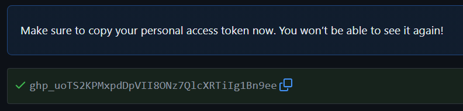
4. Tokens
5. Generate new token

## Klonowanie repozytorium
Do sklonowania repozytorium zastosowano polecenie:
```
git clone [link] [docelowy folder]

```
W tym przypadku uwierzytelnianie nie było wymagane, z uwagi na fakt, iż  Git przechowuje dane lokalnie w sposób chroniony. Ponadto Git automatycznie korzysta z nich, aby połączyć się z usługą repozytorium bez konieczności ponownego podawania loginu i hasła lub tokenu.
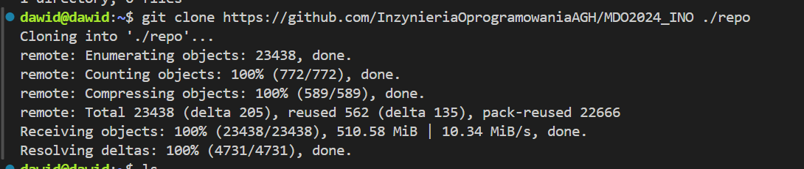

Cache uwierzytelniania w Git okazuje się bardzo wygodnym mechanizmem eliminującym konieczność wielokrotnego wprowadzania danych uwierzytelniających podczas korzystania z repozytorium, jednocześnie zapewniając bezpieczeństwo poprzez przechowywanie tych danych w sposób zabezpieczony na urządzeniu lokalnym. 
![Klonowanie repozytorium]
3. Upewnij się w kwestii dostępu do repozytorium jako uczestnik i sklonuj je za pomocą utworzonego klucza SSH, zapoznaj się [dokumentacją](https://docs.github.com/en/authentication/connecting-to-github-with-ssh/generating-a-new-ssh-key-and-adding-it-to-the-ssh-agent).
   - Utwórz dwa klucze SSH, inne niż RSA, w tym co najmniej jeden zabezpieczony hasłem
   Klucze zostały utworzone z wykorzystaniem algorytmu ed25519 poleceniem:
```
ssh-keygen -t ed25519 -C [adres e-mail]
```
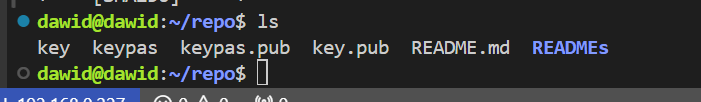
W obu przypadkach wprowadzono nazwę kluczy i opcjonalnie - dla klucza z zabezpieczeniem - hasło.
   - Skonfiguruj klucz SSH jako metodę dostępu do GitHuba
   Po wykonaniu poniższej komendy - po wcześniejszym dodaniu do konta GitHub (1. Settings, 2. SSH and GPG keys, #. New SSH key) prywatnego klucza: 
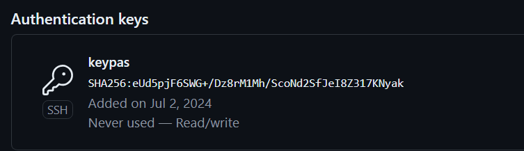
```
ssh-add [ścieżka]
```

pojawił się błąd:
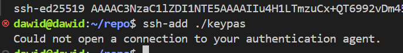
który może wynikać z wielu czynników, między który najpopularniejsze to:
1. Błąd podczas uruchamiania agenta - może wynikać z problemów z uprawnieniami, braku zasobów systemowych, błędów konfiguracji lub konfliktów z innymi programami działającymi w tle;

2. Błędna konfiguracja - konfiguracja środowiska SSH może być nieprawidłowa lub niekompletna, co uniemożliwia poprawne uruchomienie agenta uwierzytelniania;

3. Kolizje z innymi agentami - może wystąpić konflikt z innymi agentami uwierzytelniania SSH działającymi w systemie. Ponadto jeśli istnieje więcej niż jeden agent, mogą wystąpić konflikty dotyczące portów lub zasobów.

W tym przypadku rozwiązaniem problemu okazało się być polecenie:
```
eval $(ssh-agent)
```
Dzięki wykonaniu tego polecenia agent uwierzytelniania SSH zostaje uruchomiony, a środowisko pracy bieżącej powłoki jest odpowiednio skonfigurowane, aby mogło korzystać z tego agenta.
   - Sklonuj repozytorium z wykorzystaniem protokołu SSH
   Klonowanie repozytorium przeprowadzono wykorzystując polecenie:
```
git clone git@github.com:InzynieriaOprogramowaniaAGH/MDO2024_INO.git
```

4. Przełącz się na gałąź ```main```, a potem na gałąź swojej grupy (pilnuj gałęzi i katalogu!)
Po uprzednim wejściu do folderu ze sklonowanym repozytorium. należało przełączyć sie na odpowiednie gałęzie: 
```
git checkout [odpowiednia gałąź]
```

5. Utwórz gałąź o nazwie "inicjały & nr indeksu" np. ```KD232144```. Miej na uwadze, że odgałęziasz się od brancha grupy!
Aby stworzyć nową gałąź wykorzystano polecenie:
```
git branch DP411750
git checkout DP411750
```

6. Rozpocznij pracę na nowej gałęzi
   - W katalogu właściwym dla grupy utwórz nowy katalog, także o nazwie "inicjały & nr indeksu" np. ```KD232144```
   W odpowiedniej lokalizacji utworzono katalog poleceniem 
```
mkdir DP411750
```
o nazwie "inicjały & nr indeksu".

   - Napisz [Git hooka](https://git-scm.com/book/en/v2/Customizing-Git-Git-Hooks) - skrypt weryfikujący, że każdy Twój "commit message" zaczyna się od "twoje inicjały & nr indexu". (Przykładowe githook'i są w `.git/hooks`.)
   Na podstawie pliku commit-msg.sample utworzono skrypt weryfikujący.
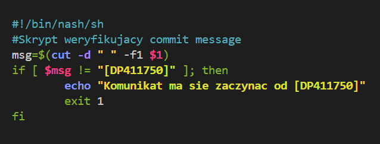
Lokalizacjia pliku:
```
~/MDO2024_INO/.git/hooks/commit-msg.sample
```
   - Dodaj ten skrypt do stworzonego wcześniej katalogu.
   Do katalogu skrypt został dodany z wykorzystaniem polecenia:
```
cp ~/MDO2024_INO/.git/hooks/commit-msg ~/MDO2024_INO/ITE/GCL4/DP411750
```
   - Skopiuj go we właściwe miejsce, tak by uruchamiał się za każdym razem kiedy robisz commita.
   Edycja hooka została wykonana bezpośrednio na pliku z katalogu .git/hooks, stąd brak kopiowania. Mimo to, należało zmienić uprawnienia danego pliku.
```
chmod +x ~/MDO2024_INO/.git/hooks/commit-msg
```

   - Umieść treść githooka w sprawozdaniu.
   ```
#!/bin/bash

msg=$(cut -d " " -f1 $1)
if [ $msg != "[DP411750]" ]; then
   echo "Komunikat ma zaczynac sie od [DP411750]"
   exit 1
fi
```
   - W katalogu dodaj plik ze sprawozdaniem
   ```
cp ~/MDO2024_INO/READMEs/001-Task.md ~/MDO2024_INO/ITE/GCL4/DP411750/Sprawozdanie1/README.md
```


   - Dodaj zrzuty ekranu (jako inline)
Dokonano tego przy użyciu:
```

```
   - Wyślij zmiany do zdalnego źródła
   ```
git add [dane pliki]
git commit -m [commit message]
git push
```
   - Spróbuj wciągnąć swoją gałąź do gałęzi grupowej
   Po uprzednim przejściu na gałąź grupową oraz zmergowaniu jej ze swoją, dokonano pusha. 
```
git checkout GCL4
git merge DP411750
git push
```

# Git, Docker


## Zadania wykonane

## Zestawienie środowiska

1. Zainstaluj Docker w systemie linuksowym
W celu instalacji Docker w systemie linuksowym (ubuntu) zastosowano komendy:
```
apt-get update
apt-get install docker.io 
```
2. Zarejestruj się w [Docker Hub](https://hub.docker.com/) i zapoznaj z sugerowanymi obrazami
3. Pobierz obrazy `hello-world`, `busybox`, `ubuntu` lub `fedora`, `mysql`
Każdy z obrazów pobrano używając komendy:
```
sudo docker pull [nazwa danego obrazu]
```
Z uwagi na brak uprawnień użytkownika do stosowania komendy `docker`, zastosowano sudo - polecenia z uprawnieniami roota.
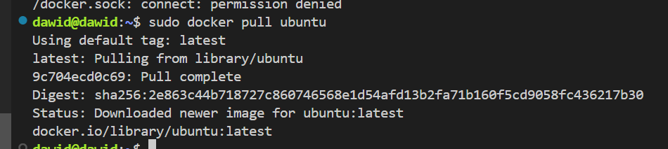
Pobrane obrazy: 
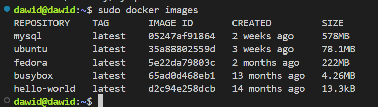
4. Uruchom kontener z obrazu `busybox`
   - Pokaż efekt uruchomienia kontenera
   Kontener uruchomiono używając:
   ```
   sudo docker run [nazwa]
   ```
   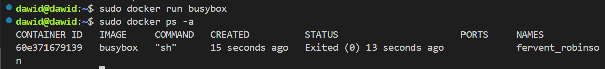
   - Podłącz się do kontenera **interaktywnie** i wywołaj numer wersji
   Do interaktywnego połączenia wykorzysuje się flagę --interactive w docker run
   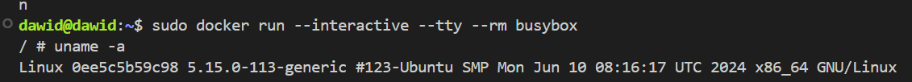
5. Uruchom "system w kontenerze" (czyli kontener z obrazu `fedora` lub `ubuntu`)
   - Zaprezentuj `PID1` w kontenerze i procesy dockera na hoście
   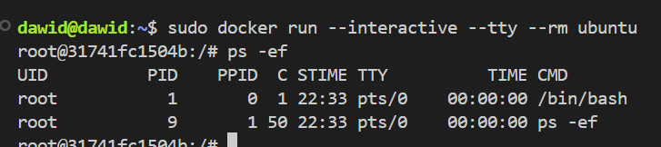
   - Zaktualizuj pakiety
   Wykorzystano tu komendy `apt-get update` oraz `apt-get upgrade`.
   - Wyjdź
   W celu wyjścia należało użyć `exit`.
6. Stwórz własnoręcznie, zbuduj i uruchom prosty plik `Dockerfile` bazujący na wybranym systemie i sklonuj nasze repo.
   - Kieruj się [dobrymi praktykami](https://docs.docker.com/develop/develop-images/dockerfile_best-practices/)
   - Upewnij się że obraz będzie miał `git`-a
   - Uruchom w trybie interaktywnym i zweryfikuj że jest tam ściągnięte nasze repozytorium
   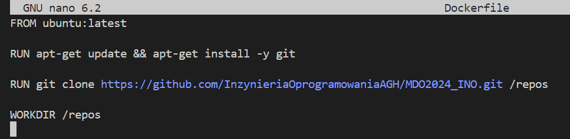
   Znaczenie poszczególnych linijek w Dockerfile:
   `FROM` - używa najnowszej wersji obrazu Ubuntu jako podstawy dla nowego obrazu Docker
   `RUN apt-get update && apt-get install -y git` - aktualizuje listę pakietów dostępnych do instalacji z repozytoriów Ubuntu; instaluje pakiet git w kontenerze
   `RUN git clone https://github.com/InzynieriaOprogramowaniaAGH/MDO2024_INO.git /repos` - klonuje repozytorium z GitHub do katalogu /repos w kontenerze
   `WORKDIR /repos` - ustawia katalog roboczy kontenera na /repos.

   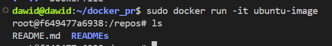
7. Pokaż uruchomione kontenery
`sudo docker ps -a` pozwala na pokazanie uruchomionych kontenerów.
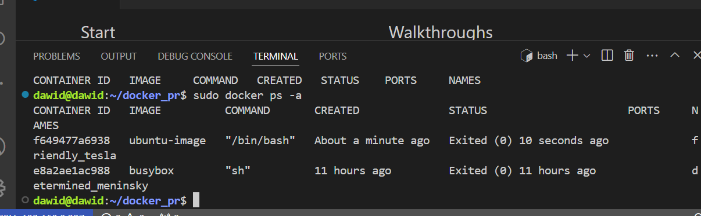
Zatrzymanie i usunięcie kontenerów zostało wykonane dzięki:
```
sudo docker stop $(sudo docker ps -aq)
sudo docker rm $(sudo docker ps -aq)
```
8. Wyczyść obrazy
Obrazy z kolei zostały wyczyszczone z wykorzystaniem komendy
```
sudo docker rmi $(sudo docker images -q)
```
9. Dodaj stworzone pliki `Dockefile` do folderu swojego `Sprawozdanie1` w repozytorium.
