# Sprawozdanie 01
# IT 412497 Daniel Per
---

## Wprowadzenie, Git, Gałęzie, SSH
## Git, Docker
---
Celem tych ćwiczeń była instalacja, przygotowanie i zapoznanie się z podstawowymi narzędziami z których będziemy korzystać, czyli ‘Git’ i ‘Docker’ oraz łączenie się z systemem przez SSH na VSCode.

---

## Wykonane zadania - Lab 1
---
### 1. Zainstaluj klienta Git i obsługę kluczy SSH
Na start aktualizujemy listę pakietów dzięki 
```
sudo dnf update
```
> ‘sudo’ wykorzystujemy, aby korzystać z komend z uprawnieniami administratora.
> Robimy tak, ponieważ powinniśmy zminimalizować korzystanie z konta root’a, więc korzystamy z normalnego użytkownika tylko korzystając z uprawnień.


Gdy to już jest zrobione instalujemy git’a dzięki:
```
sudo dnf install git
```
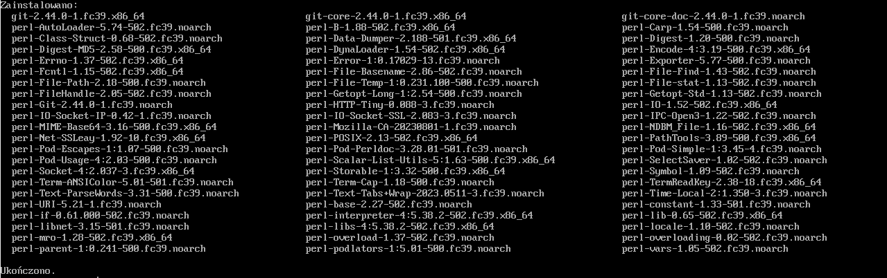

Gdy wszystko jest zainstalowane możemy to sprawdzić. Najprostszym sposobem jest sprawdzenie wersji, więc wpisujemy:
```
git --version
```
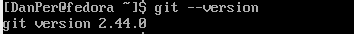


### 2. Sklonuj [repozytorium przedmiotowe](https://github.com/InzynieriaOprogramowaniaAGH/MDO2024_INO) za pomocą HTTPS i [*personal access token*](https://docs.github.com/en/authentication/keeping-your-account-and-data-secure/managing-your-personal-access-tokens)

Zaczynamy od utworzenia naszego tokenu. Aby to zrobić logujemy się na nasze konto na GitHub’ie. Następnie przechodzimy kolejno do: `Settings > Developer Settings > Personal access tokens > Tokens(classic)`. Tu możemy utworzyć nowy klucz klikając `Generate new token`.
Tutaj uzupełniamy podstawowe dane, czyli note, expiration date (datę wygaśniecia tokenu) i scopes (do czego będzie miał uprawnienia). Scopes ustawiamy na zarządzanie repozytoriami, czyli zaznaczamy `repo`. Datę wygaśnięcia ustawiam na datę zakończenia semestru.
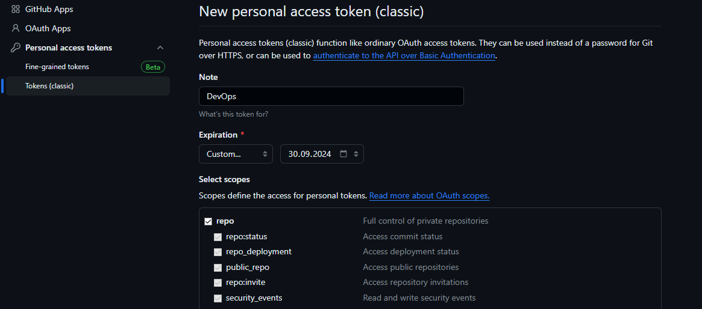 

Uzyskany token zapisujemy w bezpiecznym miejscu, ponieważ nie będzie on ponownie pokazany na GitHubie, w celach bezpieczeństwa.
Kiedy mamy już token możemy pobrać nasze repozytorium, korzystając z:
```
git clone https://<PAT>@github.com/InzynieriaOprogramowaniaAGH/MDO2024_INO.git
```
> PAT - jest to nasz Personal Access Token

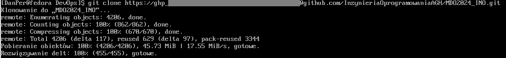 


### 3. Upewnij się w kwestii dostępu do repozytorium jako uczestnik i sklonuj je za pomocą utworzonego klucza SSH, zapoznaj się [dokumentacją](https://docs.github.com/en/authentication/connecting-to-github-with-ssh/generating-a-new-ssh-key-and-adding-it-to-the-ssh-agent).
   - Utwórz dwa klucze SSH, inne niż RSA, w tym co najmniej jeden zabezpieczony hasłem
   - Skonfiguruj klucz SSH jako metodę dostępu do GitHuba
   - Sklonuj repozytorium z wykorzystaniem protokołu SSH

Tworzymy dwa klucze dzięki:
```
ssh-keygen -t ed25519
```
`ed25519` jest to algorytm do klucza, wykorzystujemy inny niż RSA.
(Pierwszy klucz tworzymy bez hasła, drugi zabezpieczamy hasłem)
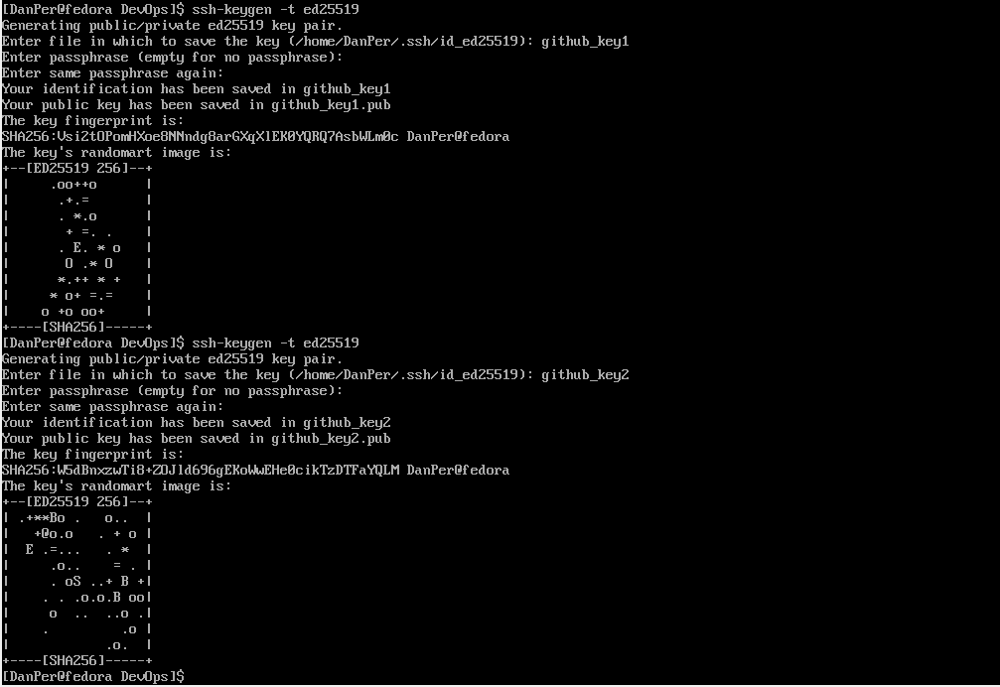 
> Aby korzystać z kluczy muszą być one w odpowiednim folderze `~/.ssh`

Mając gotowy klucz możemy go dodać na naszym GitHub’ie.
Na naszym koncie GitHub ponownie wchodzimy w `Settings` i tym razem w zakładkę `SSH and GPG keys` i klikamy `Nes SSH key`. Wprowadzamy nazwę dla niego oraz nasz publiczny klucz.
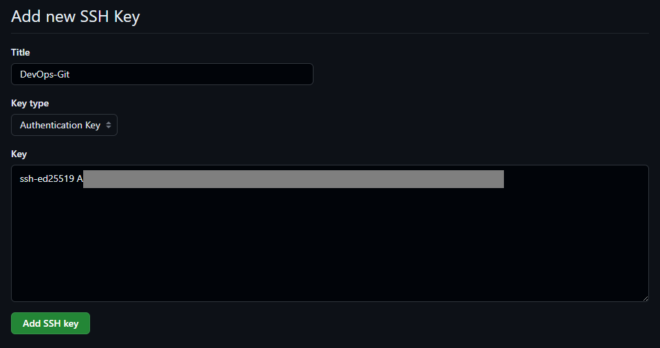 

Teraz jesteśmy gotowi do sklonowania repozytorium z wykorzystaniem protokołu SSH:
```
git clone git@github.com:InzynieriaOprogramowaniaAGH/MDO2024_INO.git
```
> W tym momencie wyskoczy nam błąd, ponieważ taki katalog już istnieje, ponieważ już wcześniej sklonowaliśmy repozytorium przez HTTPS i PAT.
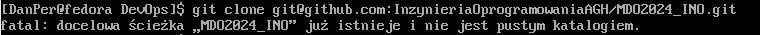 
Usuńmy nasze wcześniej sklonowane repo:
```
rm -r MDO2024_INO
```
I ponówmy próbę aby sprawdzić czy działa jak należy.

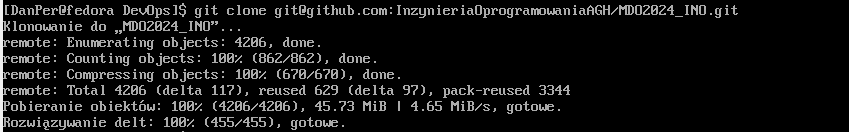 

### 3.5 SSH Connect
Mając już klucze SSH możemy połączyć się z systemem przez VSCode.
Zaczynamy od pobrania wtyczki do VSCode o nazwie `Remote - SSH`
Następnie w folderze .ssh na naszym windowsie wklejamy nasz klucz publiczny.
> Folder znajduje się w naszym folderze użytkownika:  `C:/users/user/.ssh`
W VSCode klikamy w lewym dolnym rogu, aby skorzystać z naszej wtyczki i wybieramy `connect to Host…`, a następnie `+ Add New SSH Host` lub (i tak zaraz wykorzystane) `Configure SSH Hosts` i podajemy nasze dane. Używając configure dostajemy się do pliku config w którym podajemy ścieżkę do naszego klucza:

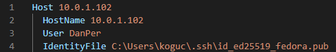 

Teraz możemy spróbować się połączyć z naszym hostem.

Niestety napotkaliśmy błąd:

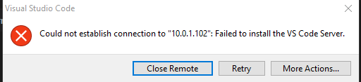

Po przeczytaniu konsoli możemy zobaczyć że problemem okazał się brak możliwości rozpakowania pobranego vscode-server przez brak tar (służące do archiwizoania plików).
Zainstalujmy go na naszym systemie fedora:
```
sudo dnf install tar
```
I spróbujmy ponownie. 

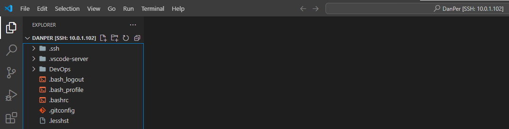

Jak widać tym razem udało nam się połączyć bez problemów.


### 4. Przełącz się na gałąź ```main```, a potem na gałąź swojej grupy (pilnuj gałęzi i katalogu!)

Wchodzimy do naszego sklonowanego katalogu `MDO2024_INO` i przełączamy się na gałąź `main` i następnie na gałąź naszej grupy, czyli `GCL4`

```
git checkout main
git checkout GCL4
```
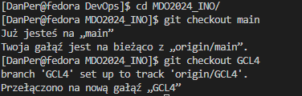

### 5. Utwórz gałąź o nazwie "inicjały & nr indeksu" np. ```KD232144```. Miej na uwadze, że odgałęziasz się od brancha grupy!

Tworzymy nową gałąź o wybranej nazwie. (W moim przypadku ```DP412497```)
```
git checkout -b DP412497
```
> -b powoduje utworzenie gałęzi.

### 6. Rozpocznij pracę na nowej gałęzi
   - W katalogu właściwym dla grupy utwórz nowy katalog, także o nazwie "inicjały & nr indeksu" np. ```KD232144```

Tworzymy katalog ```DP412497```:
```
mkdir DP412497
```
I do niego przechodzimy:
```
cd DP412497
```


   - Napisz [Git hooka](https://git-scm.com/book/en/v2/Customizing-Git-Git-Hooks) - skrypt weryfikujący, że każdy Twój "commit message" zaczyna się od "twoje inicjały & nr indexu". (Przykładowe githook'i są w `.git/hooks`.)
   - Dodaj ten skrypt do stworzonego wcześniej katalogu.

Z podanych przykładowych githook’ów skorzystałem z `commit-msg` i przekopiowałem go do własnego katalogu.

   - Skopiuj go we właściwe miejsce, tak by uruchamiał się za każdym razem kiedy robisz commita.

Umieszczamy kopię naszego hook’a w .git/hooks
```
cp ./ITE/GCL4/DP412497/commit-msg ./.git/hooks/
```

   - Umieść treść githooka w sprawozdaniu.
```
#!/usr/bin/sh
commit_msg=$(cat "$1")
initials="DP412497"

if ! echo "$commit_msg" | grep -q "^$initials"; then
    echo "Commit message must start with '$initials'!"
    exit 1
fi
```
> Podany kod pobiera treść `commit message` i sprawdza czy zaczyna się od naszych inicjałów i numeru. Jeśli nie, to wyrzuci błąd, że nasza wiadomość musi się tak zaczynać i nie wrzuci commit’a.

   - W katalogu dodaj plik ze sprawozdaniem

W naszym katalogu DP412497 tworzymy odpowiednio katalog `Sprawozdanie1`, a w nim plik z naszy sprawozdaniem w formacie Markdown `README.md`

   - Dodaj zrzuty ekranu (jako inline)

Nasze zrzuty ekranu umieszczamy w podfolderze dla porządku i dodajemy do sprawozdania dzięki:
```
> 
> Czyli dla nas:
> 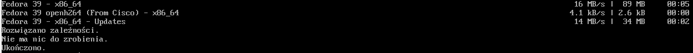
```

   - Wyślij zmiany do zdalnego źródła

```
git add .
git commit -m "Pierwszy commit"
```

> Dodajemy wszystkie pliki do indeksu i commit'ujemy 

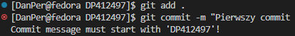
> Jak widać nasz hook działa. Nasza wiadomość nie zaczynała się od naszego indeksu i numeru, więc wyskoczył nasz bład.

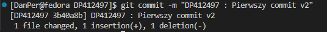
> Teraz po dodaniu odpowiedniego rozpoczęcia wiadomości commit zadziałał.

```
git push origin DP412497
```
> Wysyłamy do zdalnego źródła


   - Spróbuj wciągnąć swoją gałąź do gałęzi grupowej

```
git checkout GCL4
git merge DP412497
```

   - Zaktualizuj sprawozdanie i zrzuty o ten krok i wyślij aktualizację do zdalnego źródła (na swojej gałęzi)

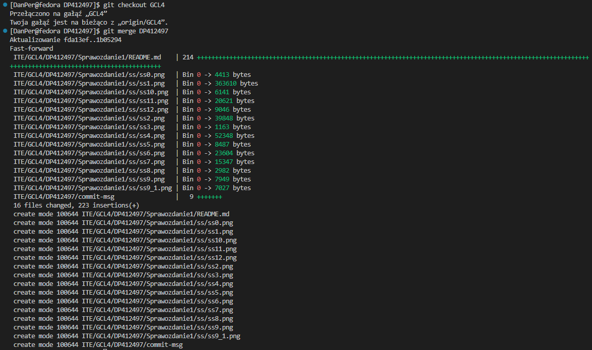


## Wykonane zadania - Lab 2

### 1. Zainstaluj Docker w systemie linuksowym

Zaczynamy od instalacji i uruchomienia dockera dzięki: 
```
sudo dnf install docker
sudo systemctl start docker
```

### 2. Zarejestruj się w [Docker Hub](https://hub.docker.com/) i zapoznaj z sugerowanymi obrazami

W międzyczasie wchodzimy na stronę Docker Hub i rejestrujemy się (lub logujemy jeśli już posiadamy konto).
Przeglądamy sugerowane obrazy.

### 3. Pobierz obrazy `hello-world`, `busybox`, `ubuntu` lub `fedora`, `mysql`

Pobieramy zadane obrazy:
```
sudo docker pull hello-world
sudo docker pull busybox
sudo docker pull fedora
sudo docker pull mysql
```
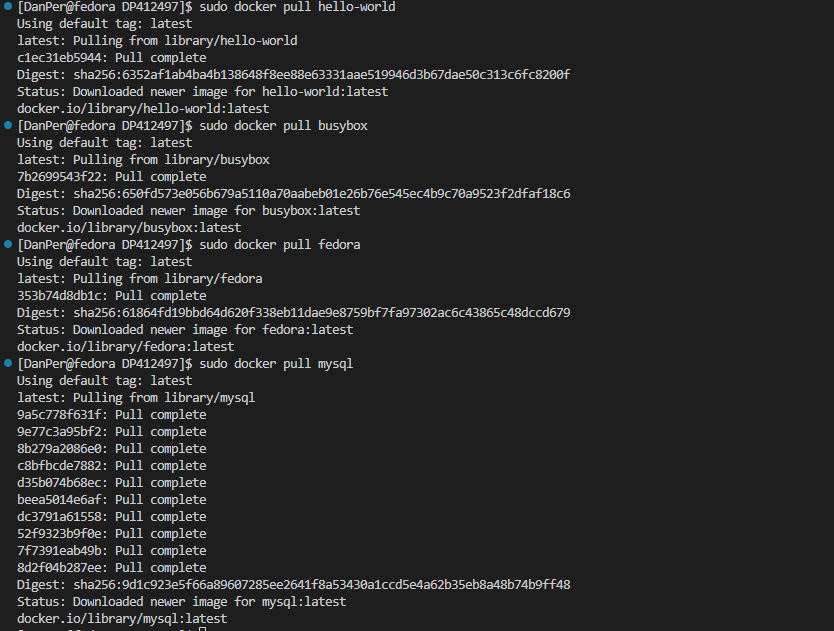

### 4. Uruchom kontener z obrazu `busybox`
   - Pokaż efekt uruchomienia kontenera

Uruchamiamy kontener dzięki:
```
sudo docker run busybox
```
Oraz sprawdzamy czy jest uruchomiony na liście:
```
sudo docker ps -a
```

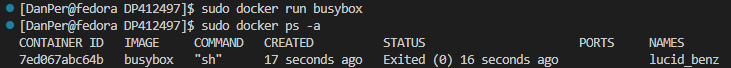

   - Podłącz się do kontenera **interaktywnie** i wywołaj numer wersji

Aby podłączyć się interaktywnie i zobaczyć numer wersji korzystamy z: 
```
sudo docker run -it busybox
busybox --help | head -n 1
```
> -it oznacza połączenie interaktywnie

> --help wyświetla informacje i dostępne funkcje. Nie potrzebujemy wszystkiego a jedynie wersji, która jest w pierwszej linijce, dlatego też korzystamy z `head -n 1`, aby otrzymać tylko tą pierwszą linijkę z wersją.


### 5. Uruchom "system w kontenerze" (czyli kontener z obrazu `fedora` lub `ubuntu`)
   - Zaprezentuj `PID1` w kontenerze i procesy dockera na hoście

Aby sprawdzić `PID1` korzystamy z:
```
ps
```
> Niestety w naszym obrazie nie mamy zainstalowanej usługi z tą komendą, dlatego musimy zrobić to ręcznie:
```
dnf install procps
```
I ponawiamy komendę `ps`

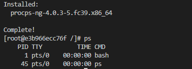

Teraz działa poprawnie.

   - Zaktualizuj pakiety

Aktualizujemy pakiety dzięki:
```
dnf update
```
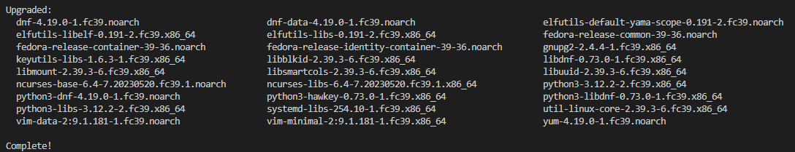

   - Wyjdź

Wychodzimy poleceniem:
```
exit
```

### 6. Stwórz własnoręcznie, zbuduj i uruchom prosty plik `Dockerfile` bazujący na wybranym systemie i sklonuj nasze repo.
   - Kieruj się [dobrymi praktykami](https://docs.docker.com/develop/develop-images/dockerfile_best-practices/)
   - Upewnij się że obraz będzie miał `git`-a
   - Uruchom w trybie interaktywnym i zweryfikuj że jest tam ściągnięte nasze repozytorium

Tworzymy plik Dockerfile: 
```
FROM fedora:latest

RUN dnf -y update && \
    dnf -y install git

WORKDIR /repo

RUN git clone https://github.com/InzynieriaOprogramowaniaAGH/MDO2024_INO.git

CMD ["bash"]
```
> FROM fedora:latest - korzystamy z naszego obrazu systemu fedora.
> RUN dnf -y update && \
    dnf -y install git - uruchamiamy komendy, aby zaktualizować pakiety oraz zainstalować potrzebnego nam git'a
> WORKDIR /repo - ustawiamy nasz katalog roboczy
> RUN git clone https://github.com/InzynieriaOprogramowaniaAGH/MDO2024_INO.git - klonujemy nasze repo do kontenera
> CMD ["bash"] - jak nasz obraz ma rozpocząć.

Dzięki gotowemu plikowi budujemy nasz obraz:
```
sudo docker build -t lab2 .
```
> -t lab2 - określa nazwę naszego obrazu

Gdy wszystko jest gotowe uruchamiamy obraz i sprawdzamy czy nasze repo jest na miejscu:
```
suco docker run -it lab2
# ls -la
```
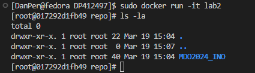

### 7. Pokaż uruchomione ( != "działające" ) kontenery, wyczyść je.

Sprawdzamy listę uruchomionych kontenerów:
```
sudo docker ps -a
```
I następnie je czyścimy: 
```
sudo docker rm -f ID/NAME
```
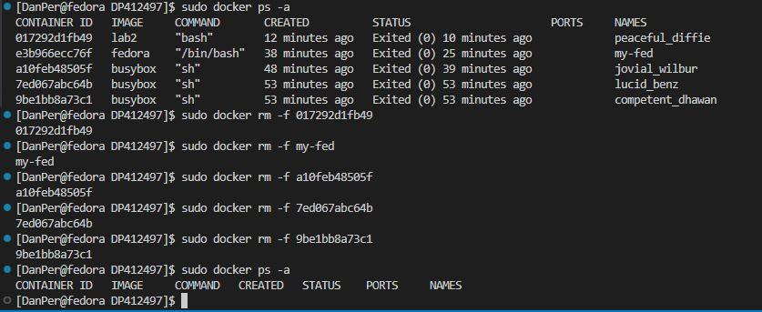
> Do usunięcia możemy dowolne wykorzystać albo id kontenera, albo jego nazwę

### 8. Wyczyść obrazy

Czyścimy wszystkie obrazy, które nie są używane przez żadne kontenery:
```
sudo docker image prune -a
```
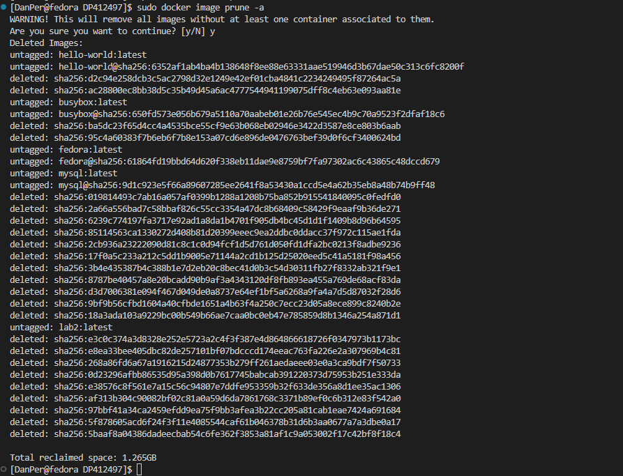

### 9. Dodaj stworzone pliki `Dockefile` do folderu swojego `Sprawozdanie1` w repozytorium.

Nasz plik Dockerfile umieszczamy w katalogu Sprawozdanie1.

### 10. Wystaw *Pull Request* do gałęzi grupowej jako zgłoszenie wykonanego zadania.

Zapisujemy wszystko, commit'ujemy i wysyłamy do głównej gałęzi a następnie wystawiamy Pull Request do gałęzi grupowej.