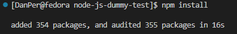

# Sprawozdanie 02
# IT 412497 Daniel Per
---

## Dockerfiles, kontener jako definicja etapu
## Dodatkowa terminologia w konteneryzacji, instancja Jenkins
---
Celem tych ćwiczeń było lepsze zapoznanie się i zrozumienie wykorzystywania kontenerów w projektach.

---

## Wykonane zadania - Lab 3
---
### Wybór oprogramowania na zajęcia
* Znajdź repozytorium z kodem dowolnego oprogramowania, które:
	* dysponuje otwartą licencją
	* jest umieszczone wraz ze swoimi narzędziami Makefile tak, aby możliwe był uruchomienie w repozytorium czegoś na kształt ```make build``` oraz ```make test```. Środowisko Makefile jest dowolne. Może to być automake, meson, npm, maven, nuget, dotnet, msbuild...
	* Zawiera zdefiniowane i obecne w repozytorium testy, które można uruchomić np. jako jeden z "targetów" Makefile'a. Testy muszą jednoznacznie formułować swój raport końcowy (gdy są obecne, zazwyczaj taka jest praktyka)
Odpowiednie repozytoria z kodem oprogramowania które spełnia warunki otrzymaliśmy od prowadzącego.
Są to następujące: 
 - https://github.com/devenes/node-js-dummy-test
 - https://github.com/irssi/irssi

* Sklonuj niniejsze repozytorium, przeprowadź build programu (doinstaluj wymagane zależności)
Klonujemy oba repozytoria korzystając z:
```
git clone https://gihthub.com/nazwa/repozytorium
```


Następnie przeprowadzamy build programów. 
> Do build'a programów musimy znajdować się w katalogu z danym projektem
Pierwszy budujemy za pomocą 
```
npm install
```


> Niestety moduł dla npm nie jest zainstalowany więc musimy go doinstalować: ```sudo dnf install nodejs``` i spróbować ponownie



Jak widać teraz wszystko zadziałało.

Następnie budujemy drugi program dzięki:
```
meson Build
```


> Tak samo musimy doinstalować odpowiednie moduły. 
> ```sudo dnf install meson```
> Oraz dodatkowo: gcc, glib2-devel, utf8proc*, ncurses*, perl-Ext* oraz ninja*

Gdy wszystkie moduły są już doinstalowane możemy przystąpić do budowy.
```
meson Build
ninja -C /home/DanPer/DevOps/MDO2024_INO/ITE/GCL4/DP412497/Zadanie2/RepTest/irssi/Build
```
> `ninja -C /home/... ` zostało nam przedstawione do wykorzystania po udanym wykonaniu `meson Build`


* Uruchom testy jednostkowe dołączone do repozytorium
Dla obu programów uruchamiamy testy (zaczynając z poziomu katalogu projektu):
```
npm test
```


```
cd Build
ninja test
```


### Przeprowadzenie buildu w kontenerze
### 1. Wykonaj kroki `build` i `test` wewnątrz wybranego kontenera bazowego. Tj. wybierz "wystarczający" kontener, np ```ubuntu``` dla aplikacji C lub ```node``` dla Node.js
#### Dla programu `node-js-dummy-test`

* uruchom kontener
* podłącz do niego TTY celem rozpoczęcia interaktywnej pracy

```
docker run -it node bash
```
> Jeśli nie posiadamy obrazu 'node' zostanie automatycznie pobrany jego :latest obraz.

* zaopatrz kontener w wymagania wstępne (jeżeli proces budowania nie robi tego sam)
> Podstawowy obraz node posiada w sobie zainstalowane wszystkie podstawowe moduły potrzebne do pracy na projekcie jak i samego git'a.

* sklonuj repozytorium
```
git clone https://github.com/devenes/node-js-dummy-test
```


* uruchom *build*

```
cd node-js-dummy-test
npm install
```


* uruchom testy

```
npm test
```


Jak widać wszystko bezproblemowo działa w kontenerze.

#### Dla programu `irssi`

* uruchom kontener
* podłącz do niego TTY celem rozpoczęcia interaktywnej pracy

```
docker run -it fedora bash
```
> Jeśli nie posiadamy obrazu 'fedora' zostanie automatycznie pobrany jego :latest obraz.

* zaopatrz kontener w wymagania wstępne (jeżeli proces budowania nie robi tego sam)

Potrzebujemy doinstalować wszystkie wymagane moduły, czyli wszystkie których potrzebowaliśmy doinstalować,
gdy pracowaliśmy na projekcie przed kontenerami, a nawet więcej, gdyż obraz fedory nie posiada w sobie git'a

```
dnf -y install git gcc meson glib2-devel utf8proc* ncurses* perl-Ext* ninja*
```
> -y zaakceptuje automatycznie wszystkie zapytania w trakcie instalacji.

* sklonuj repozytorium

```
git clone https://github.com/irssi/irssi
```


* uruchom *build*

```
cd irssi
mason Build
ninja -C /irssi/Build
```


* uruchom testy

```
cd Build
ninja test
```


Jak widać dla drugiego projektu także wszystko zadziałało poprawnie.

### 2. Stwórz dwa pliki `Dockerfile` automatyzujące kroki powyżej, z uwzględnieniem następujących kwestii:
#### Dla programu `node-js-dummy-test`

* Kontener pierwszy ma przeprowadzać wszystkie kroki aż do *builda*
Plik node-builder.Dockerfile : 
```
FROM node
RUN git clone https://github.com/devenes/node-js-dummy-test
WORKDIR node-js-dummy-test
RUN npm install
```
> FROM node - korzystamy z obrazu node

> RUN git clone ... - klonujemy repozytorium

> WORKDIR node-js-dummy-test - ustawiamy katalog 'node-js-dummy-test' jako katalog roboczy

> RUN npm install - budujemy nasz program

> Polecenie RUN w Dockerfilu wywołuje komendy w trakcie budowania kontenera

* Kontener drugi ma bazować na pierwszym i wykonywać testy
```
FROM node-builder - korzystamy z naszego poprzedniego kontenera
RUN npm test - wykonujemy testy
```

#### Dla programu `irssi`

* Kontener pierwszy ma przeprowadzać wszystkie kroki aż do *builda*

```
FROM fedora
RUN dnf -y update && \
    dnf -y install meson ninja* git gcc glib2-devel utf8proc* ncurses* perl-Ext*
RUN git clone https://github.com/irssi/irssi
WORKDIR /irssi
RUN meson Build
RUN ninja -C /irssi/Build
```

> FROM fedora - korzystamy z obrazu fedory

> RUN dnf -y ... - instalujemy wszystkie potrzebne moduły

> RUN git clone ... - klonujemy repozytorium

> WORKDIR /irssi - ustawiamy katalog 'irssi' jako katalog roboczy

> RUN meson Build

> RUN ninja -C /irssi/Build - budujemy nasz program

> Polecenie RUN w Dockerfilu wywołuje komendy w trakcie budowania kontenera

* Kontener drugi ma bazować na pierwszym i wykonywać testy

```
FROM irssi-builder
WORKDIR /irssi/Build
RUN ninja test
```

### 3. Wykaż, że kontener wdraża się i pracuje poprawnie. Pamiętaj o różnicy między obrazem a kontenerem. Co pracuje w takim kontenerze?

Uruchamiamy nasze Dockerfile'e

```
sudo docker build -t irssi-builder -f irssi-builder.Dockerfile .
sudo docker build -f irssi-tstr.Dockerfile .
```


Jak widać wszystko jest wykonywane w trakcie budowania kontenerów zgodnie z oczekiwanym rezultatem.

> Obraz jest tylko szablonem do odczytu zawierający odpowiednie moduły i biblioteki.
> Kontener jest to działająca instancja zbudowana z obrazu.


> W takim kontenerze nic nie pracuje, ponieważ kończy swoje działania zaraz po starcie gdyż nie ma napisanego żadnego działania.


## Wykonane zadania - Lab 4
---

### Zachowywanie stanu
* Zapoznaj się z dokumentacją https://docs.docker.com/storage/volumes/
* Przygotuj woluminy wejściowy i wyjściowy, o dowolnych nazwach, i podłącz je do kontenera bazowego, z którego rozpoczynano poprzednio pracę
* Uruchom kontener, zainstaluj niezbędne wymagania wstępne (jeżeli istnieją), ale *bez gita*
* Sklonuj repozytorium na wolumin wejściowy (opisz dokładnie, jak zostało to zrobione)
* Uruchom build w kontenerze - rozważ skopiowanie repozytorium do wewnątrz kontenera
* Zapisz powstałe/zbudowane pliki na woluminie wyjściowym, tak by były dostępne po wyłączniu kontenera.
* Pamiętaj udokumentować wyniki.
* Ponów operację, ale klonowanie na wolumin wejściowy przeprowadź wewnątrz kontenera (użyj gita w kontenerze)
* Przedyskutuj możliwość wykonania ww. kroków za pomocą `docker build` i pliku `Dockerfile`. (podpowiedź: `RUN --mount`)

### Eksponowanie portu
* Zapoznaj się z dokumentacją https://iperf.fr/
* Uruchom wewnątrz kontenera serwer iperf (iperf3)
* Połącz się z nim z drugiego kontenera, zbadaj ruch
* Zapoznaj się z dokumentacją `network create` : https://docs.docker.com/engine/reference/commandline/network_create/
* Ponów ten krok, ale wykorzystaj własną dedykowaną sieć mostkową. Spróbuj użyć rozwiązywania nazw
* Połącz się spoza kontenera (z hosta i spoza hosta)
* Przedstaw przepustowość komunikacji lub problem z jej zmierzeniem (wyciągnij log z kontenera, woluminy mogą pomóc)
* Opcjonalnie: odwołuj się do kontenera serwerowego za pomocą nazw, a nie adresów IP
