# Sprawozdanie 03
# IT 412497 Daniel Per
---

## Pipeline, Jenkins, izolacja etapów
## Pipeline: lista kontrolna
## Jenkinsfile: lista kontrolna
---
Celem tych ćwiczeń było zapoznanie się z Jenkins'em i zbudownie dzięki niemu pipeline'u dla naszego programu.

---

## Wykonane zadanie - Lab 005-007
---

### Przygotowanie
* Upewnij się, że na pewno działają kontenery budujące i testujące, stworzone na poprzednich zajęciach
* Zapoznaj się z instrukcją instalacji Jenkinsa: https://www.jenkins.io/doc/book/installing/docker/
  * Uruchom obraz Dockera który eksponuje środowisko zagnieżdżone
  * Przygotuj obraz blueocean na podstawie obrazu Jenkinsa (czym się różnią?)
  * Uruchom Blueocean

Podpunkty instalacji Jenkinsa wykonujemy wprost z instrukcji instalacji, tzn. kolejno:

Tworzymy sieć mostkowaną w dockerze dla naszego Jenkinsa
```
docker network create jenkins
```

Pobieramy i uruchamiany DIND (Docker in Docker):
```
docker run \
  --name jenkins-docker \
  --rm \
  --detach \
  --privileged \
  --network jenkins \
  --network-alias docker \
  --env DOCKER_TLS_CERTDIR=/certs \
  --volume jenkins-docker-certs:/certs/client \
  --volume jenkins-data:/var/jenkins_home \
  --publish 2376:2376 \
  docker:dind \
  --storage-driver overlay2
```

Tworzymy obraz dla naszego Jenkins'a wraz z BlueOcean (interfejsem graficznym ułatwiającym prace z pipeline'ami),
tworząc dla niego Dockerfile'a:
```
FROM jenkins/jenkins:2.440.3-jdk17
USER root
RUN apt-get update && apt-get install -y lsb-release
RUN curl -fsSLo /usr/share/keyrings/docker-archive-keyring.asc \
  https://download.docker.com/linux/debian/gpg
RUN echo "deb [arch=$(dpkg --print-architecture) \
  signed-by=/usr/share/keyrings/docker-archive-keyring.asc] \
  https://download.docker.com/linux/debian \
  $(lsb_release -cs) stable" > /etc/apt/sources.list.d/docker.list
RUN apt-get update && apt-get install -y docker-ce-cli
USER jenkins
RUN jenkins-plugin-cli --plugins "blueocean docker-workflow"
```

I uruchamiając go, aby się zbudował:
```
docker build -t myjenkins-blueocean:2.440.3-1 .
```

Na koniec uruchamiamy nasz kontener z BlueOcean:
```
docker run \
  --name jenkins-blueocean \
  --restart=on-failure \
  --detach \
  --network jenkins \
  --env DOCKER_HOST=tcp://docker:2376 \
  --env DOCKER_CERT_PATH=/certs/client \
  --env DOCKER_TLS_VERIFY=1 \
  --publish 8080:8080 \
  --publish 50000:50000 \
  --volume jenkins-data:/var/jenkins_home \
  --volume jenkins-docker-certs:/certs/client:ro \
  myjenkins-blueocean:2.440.3-1
```

  * Zaloguj się i skonfiguruj Jenkins

Gdy nasz kontener z Jenkins'em jest uruchomiony możemy korzystać z Jenkins'a z poziomu naszego Windows'a. Przechodzimy pod adres `127.0.0.1:8080` lub `localhost:8080`. Przy pierwszym logowaniu przywita nas monit o wpisanie hasła wygenerowanego przez Jenkins'a w celach bezpieczeństwa, czy to my jesteśmy jego administratorem.
> Korzystamy z adresu localhosta dzięki przekierowaniu portu 8080 z naszej maszyny virtualnej

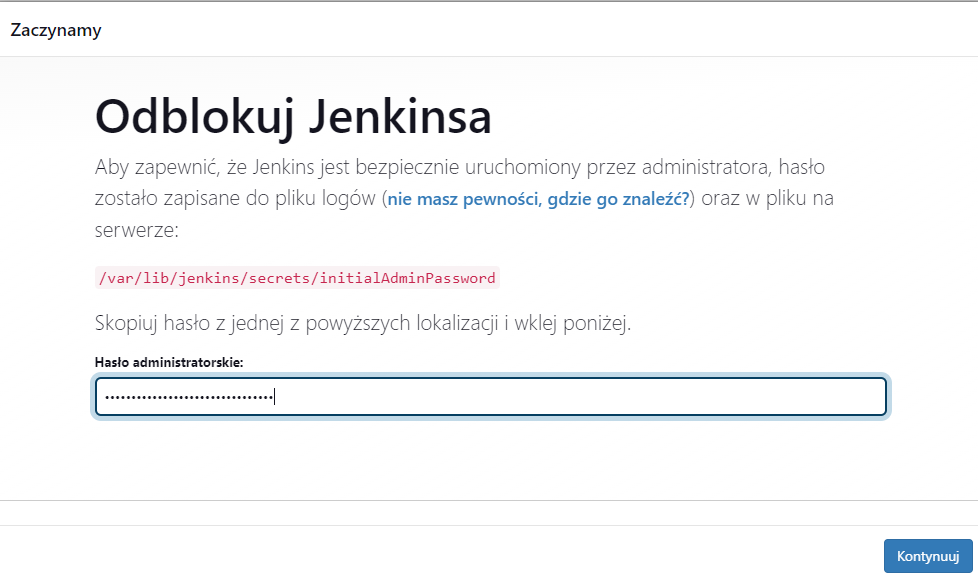

Haslo do jenkinsa dostajemy z podanej ścieżki z pomocą komendy `cat`:
```
sudo cat /var/lib/jenkins/secrets/initialAdminPassword
```

Gdy hasło będzie się zgadzać pobieramy zalecany wtyczki.

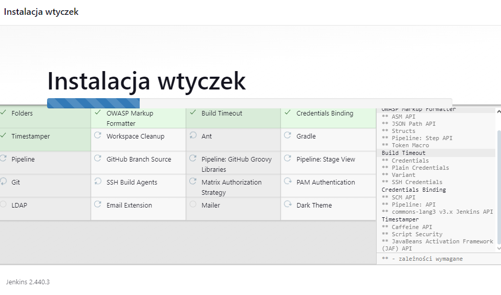

Następnie możemy utworzyć profil naszego pierwszego użytkownika (admina) i się zalogować.
Teraz nasz Jenkins jest gotowy do działania.

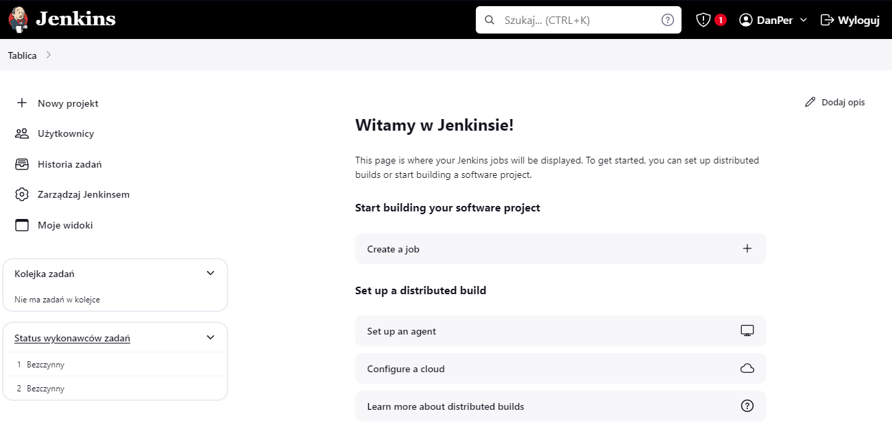


  * Zadbaj o archiwizację i zabezpieczenie logów
Powyższe instrukcje instalacji pokryły zabezpieczenie wszystkiego w odpowiednich wolumach.
  
### Uruchomienie 
* Konfiguracja wstępna i pierwsze uruchomienie
  * Utwórz projekt, który wyświetla uname
Tworzymy nowy projekt, nadajemy mu dowolną nazwę i wybieramy 'Ogólny projekt'

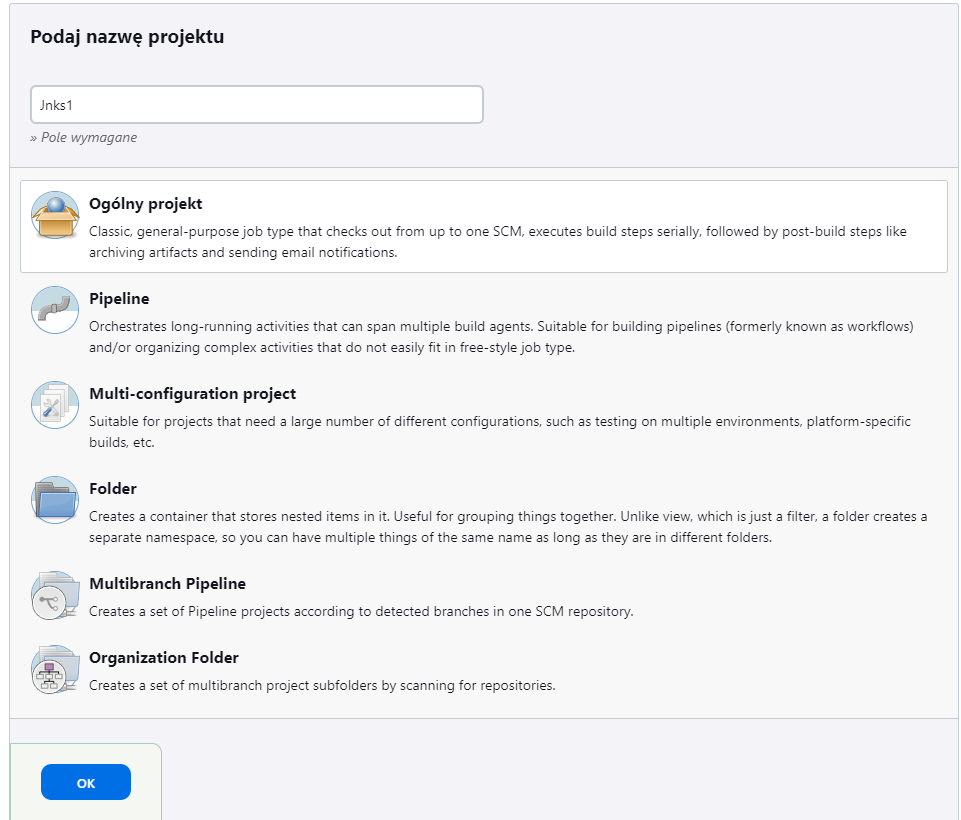

W konfiguracji wybieramy zwykły skrypt i wpisujemy proste polecenia dla testu czy wszystko działa:

```
whoami
pwd
uname -a
hostname
env
docker images
docker pull fedora
```
> whoami: Wyświetla nazwę aktualnie zalogowanego użytkownika. \
pwd: Pokazuje obecną ścieżkę (pełną nazwę katalogu) w systemie plików. \
uname -a: Zwraca informacje o systemie. \
hostname: Wyświetla nazwę hosta systemu. \
env: Pokazuje zmienne środowiskowe systemu. \
docker images: Wyświetla listę obrazów Dockera dostępnych na lokalnej maszynie. \
docker pull fedora: Pobiera obraz systemu Fedora.

Zapisujemy i uruchamiamy nasz projekt. W trakcie działania i po jego ukończeniu możemy zajrzeć w logi aby zobaczyć co się aktualnie dzieje / co zostało już wykonane.

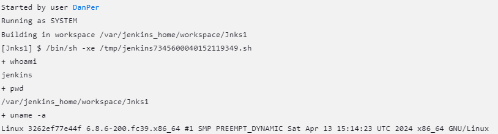
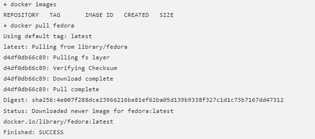

  * Utwórz projekt, który zwraca błąd, gdy... godzina jest nieparzysta
> Pierwszy projekt sprawdził poprawne działanie skryptów w Jenkins'ie

* Utwórz "prawdziwy" projekt, który:
  * klonuje nasze repozytorium
  * przechodzi na osobistą gałąź
  * buduje obrazy z dockerfiles i/lub komponuje via docker-composed

Tworzymy nowy projekt, tym razem typu 'pipeline'. Ponownie przechodzimy do skryptu, gdzie możemy skorzystać z przykładowego skryptu, który wygląda tak:
```
pipeline {
    agent any

    stages {
        stage('Hello') {
            steps {
                echo 'Hello World'
            }
        }
    }
}
```
> Prosto pokazuje nam schemat w jaki należy pisać skrypt dla pipelinu w oddzielnych krokach.

Nasz krok 'Hello' możemy zamienić na 'Prepare', w którym to pobierzemy nasze repo i przejdziemy na osobistą gałąź. 

```
pipeline {
    agent any

    stages {
        stage('Prepare') {
            steps {
                sh 'rm -rf MDO2024_INO'
                sh 'git clone https://github.com/InzynieriaOprogramowaniaAGH/MDO2024_INO.git'
                dir("MDO2024_INO"){
                    sh 'git checkout DP412497'
                }
            }
        }
    }
}
```
> rm -rf MDO2024_INO - służy do usunięcia katalogu jeśli taki już istnieje, aby zapobiec błędom gdy skrypt spróbuje pobrać repozytorium. \
sh 'komenda' - wywołanie komendy
dir("..."){...} - działania w danym katalogu

Następnie dodajemy krok odpowiedzialny za budowanie.

```
        stage('Build') {
            steps {
                echo 'Building'
                sh 'docker rmi irssi-builder'
                dir('MDO2024_INO/ITE/GCL4/DP412497/Sprawozdanie2'){
                    sh 'docker build -t irssi-builder -f irssi-builder.Dockerfile .'
                }
            }
        }
```
> Zadaniem jest usunięcie obrazu, aby mógł się od nowa zbudować oraz uruchomienie naszego Dockerfile'a budującego znajdującego się w naszym repo.

Następny krok będzie dla testowania. Jest analogiczny do poprzedniego z budowaniem:
```
        stage('Test') {
            steps {
                echo 'Testing'
                dir('MDO2024_INO/ITE/GCL4/DP412497/Sprawozdanie2'){
                    sh 'docker build -f irssi-tstr.Dockerfile .'
                }
            }
        }
```

Gdy wszystko jest gotowe

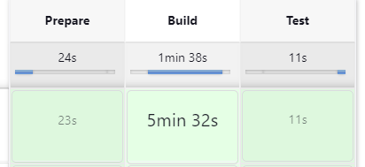
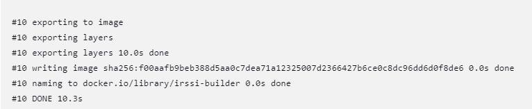
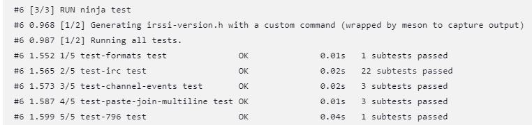

  
### Pipeline
#### Build & Test
* Definiuj pipeline korzystający z kontenerów celem realizacji kroków `build -> test`
* Może, ale nie musi, budować się na dedykowanym DIND, ale może się to dziać od razu na kontenerze CI. Należy udokumentować funkcjonalną różnicę między niniejszymi podejściami
* Docelowo, `Jenkinsfile` definiujący *pipeline* powinien być umieszczony w repozytorium. Optymalnie: w *sforkowanym* repozytorium wybranego oprogramowania

Wcześniej przygotowaliśmy pipeline dla `build -> test`.
Teraz możemy przygotować plik Jenkinsfile, w którym po prostu wkleimy cały wcześniej napisany skrypt i tu go będziemy modyfikować.
Abyśmy mogli korzystać z naszego Jenkinsfile'a musimy konfigurować nasz projekt i zamienić okno skrypty na czytanie skryptu z pliku.
Wybieramy opcję `git` i uzupełniamy repo, branch'a oraz ścieżkę do pliku Jenkinsfile odpowiadającą naszemu ustawieniu

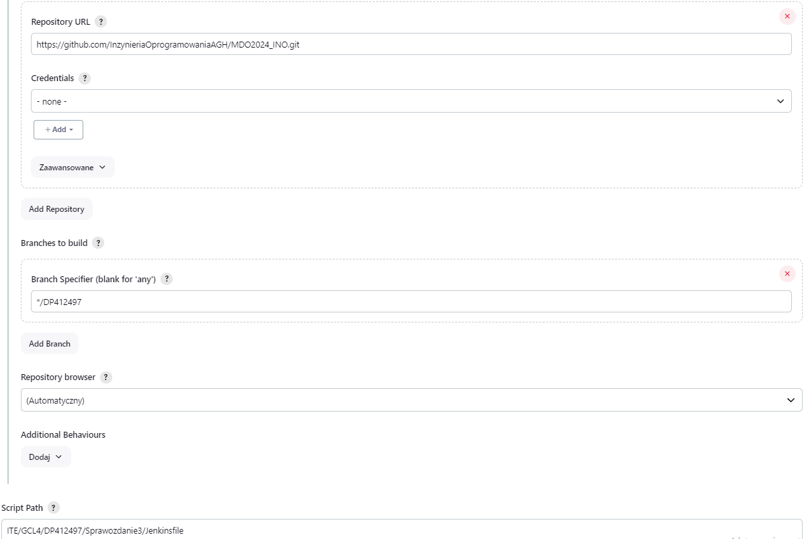

Następnie ponownie uruchamiamy, aby sprawdzić czy nasz Jenkinsfile się wczytuje i wszystko działa.

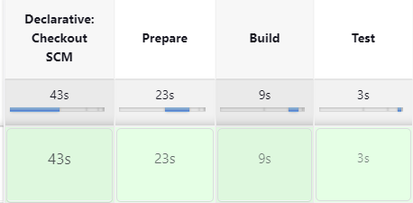


#### Publish
Kolejnym krokiem jest Deploy, ale w nim chcemy sprawdzić naszą aplikację, którą budujemy w kroku `Publish`, dlatego ten krok wykonamy najpierw.
W tym kroku chcemy stworzyć instalator naszego programu. Na naszy systemie fedora będzie to `rpm`. Z pomocą przychodzi nam RPM Packaging Guide z `https://rpm-packaging-guide.github.io`.
Szczegółowo opisuje wszystko krok po kroku jak stworzyć naszego `rpm`.
Bazując na tym tworzymy Dockerfile'a dla kroku publish:
```
FROM irssi-builder
RUN  dnf install -y gcc rpm-build rpm-devel rpmlint make python bash coreutils diffutils patch rpmdevtools
WORKDIR /
RUN rpmdev-setuptree
RUN tar -cvzf irssi.tar.gz irssi
RUN cp irssi.tar.gz /root/rpmbuild/SOURCES/
WORKDIR /root/rpmbuild/SPECS
COPY ./irssi.spec .
RUN rpmbuild -bs irssi.spec
RUN rpmlint irssi.spec
RUN rpmlint ../SRPMS/irssi-fc39.src.rpm
RUN mkdir -p /source_rpm
RUN mv /root/rpmbuild/SRPMS/irssi-fc39.src.rpm /source_rpm
```
> Najpierw zaznaczamy że chcemy korzystać z obrazu irssi-builder \
Następnie instalujemy wszystko co potrzebne dla RPM, zgodnie z zaleceniami z instrukcji. \
Pracę zaczynamy z katalogu startowego. \
Tworzymy drzewo katalogów dla RPM. \
Pakujemy do .tar nasze zbudowane irssi. \
Kopiujemy naszego tar'a do katalogu source'a w stworzonym systemie katalogów. \
Katalog roboczy ustawiamy na katalog w drzewie odpowiedzialny za pliki .spec \
Kopiujemy nasz plik. \
Uruchamiamy go i budujemy naszego RPM. \
Przenosimy gotowy RPM do nowo stworzonego katalogu dla naszego pliku.

Oraz plik typu Spec:
```
Name: irssi
Version: 1
Release: 1
Summary: Project RPM package
License:        GPLv2
URL:            https://irssi.org/
Source0:        https://github.com/InzynieriaOprogramowaniaAGH/MDO2024_INO/tree/DP412497/ITE/GCL4/DP412497/Sprawozdanie3/irssi/releases/irssi.tar.gz

BuildRequires:  meson
BuildRequires:  gcc
BuildRequires:  glib2-devel
BuildRequires:  ncurses-devel
BuildRequires:  ninja-build
BuildRequires:  perl-ExtUtils-Embed
BuildRequires:  utf8proc-devel
BuildRequires:  cmake
BuildRequires:  openssl-devel
Requires:       glib2
Requires:       openssl-devel
Requires:       perl
Requires:       ncurses-libs


%description
RPM package maker for class.

%prep
%setup -n -q irssi

%build
meson Build
ninja -C %{_builddir}/irssi/Build

%install
DESTDIR=%{buildroot} ninja -C Build install
mkdir -p %{buildroot}/usr/local/share/licenses/%{name}/
cp %{_builddir}/irssi/COPYING %{buildroot}/usr/local/share/licenses/%{name}/

%files
%license /usr/local/share/licenses/%{name}/COPYING
/usr/local/bin/%{name}
/usr/local/share/%{name}/
/usr/local/share/doc 
/usr/local/share/man
/usr/local/include/
/usr/local/lib64/
/usr/local/bin/openssl

%changelog
* Tue Apr 30 2024 Daniel Per <perdaniel@student.agh.edu.pl> - 1-1
- 1 version 1 release
```
> Plik budujemy zgodnie z instrukcjami. Podajemy potrzebne informacje, wymagania, etapy wraz z odpowiednimy ścieżkami.

To daje nam gotowy RPM naszego programu, który może sprawdzić w naszym kroku `Deploy`

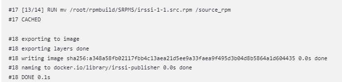

#### Deploy

Dla naszego kroku `Deploy` tworzymy kolejny plik Dockerfile'a:
```
FROM irssi-publisher AS build-on-deploy
RUN dnf -y install cmake openssl-devel
WORKDIR /source_rpm
RUN rpmbuild --rebuild --nodebuginfo irssi-1-1.src.rpm 
RUN dnf -y install /root/rpmbuild/RPMS/x86_64/irssi-1-1.x86_64.rpm
FROM fedora:39 AS deploy 
RUN mkdir -p /rpm
RUN mkdir -p /source_rpm
COPY --from=build-on-deploy /source_rpm /source_rpm
COPY --from=build-on-deploy /root/rpmbuild/RPMS/x86_64/irssi-1-1.x86_64.rpm /rpm/
RUN dnf -y install glib2-devel perl ncurses-libs utf8proc openssl-devel
RUN dnf clean all
RUN dnf -y install /rpm/irssi-1-1.x86_64.rpm
ENTRYPOINT irssi
CMD ["--version"]
```

> FROM irssi-publisher AS build-on-deploy: Tworzy obraz , oznaczając go jako "build-on-deploy". \
RUN dnf -y install cmake openssl-devel: Instaluje pakiety cmake i openssl-devel za pomocą menedżera pakietów dnf. \
WORKDIR /source_rpm: Ustawia katalog roboczy na "/source_rpm". \
RUN rpmbuild --rebuild --nodebuginfo irssi-1-1.src.rpm: Wywołuje komendę rpmbuild do ponownego budowania pakietu RPM z pliku źródłowego "irssi-1-1.src.rpm". \
RUN dnf -y install /root/rpmbuild/RPMS/x86_64/irssi-1-1.x86_64.rpm: Instaluje zbudowany pakiet RPM z lokalizacji "/root/rpmbuild/RPMS/x86_64/irssi-1-1.x86_64.rpm". \
FROM fedora:39 AS deploy: Tworzy nowy obraz bazowy z systemem Fedora 39, oznaczając go jako "deploy". \
RUN mkdir -p /rpm: Tworzy katalog "/rpm". \
RUN mkdir -p /source_rpm: Tworzy katalog "/source_rpm". \
COPY --from=build-on-deploy /source_rpm /source_rpm: Kopiuje zawartość katalogu "/source_rpm" z obrazu "build-on-deploy" do katalogu "/source_rpm" w bieżącym obrazie. \
COPY --from=build-on-deploy /root/rpmbuild/RPMS/x86_64/irssi-1-1.x86_64.rpm /rpm/: Kopiuje zbudowany pakiet RPM z obrazu "build-on-deploy" do katalogu "/rpm" w bieżącym obrazie. \
RUN dnf -y install glib2-devel perl ncurses-libs utf8proc openssl-devel: Instaluje dodatkowe zależności za pomocą menedżera pakietów dnf. \
RUN dnf clean all: Czyści cache menedżera pakietów dnf. \
RUN dnf -y install /rpm/irssi-1-1.x86_64.rpm: Instaluje pakiet RPM Irssi z katalogu "/rpm". \
ENTRYPOINT irssi: Ustawia Irssi jako punkt wejścia kontenera. \
CMD ["--version"]: Ustawia argument domyślny, który zostanie przekazany do komendy irssi przy uruchamianiu kontenera. W tym przypadku wyświetla wersję Irssi.

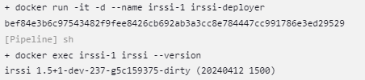


Mając wszystko tak wygląda nasz ostateczny Jenkinsfile:
```
pipeline {
    agent any

    stages {
        stage('Prepare') {
            steps {
                sh 'rm -rf MDO2024_INO'
                sh 'git clone https://github.com/InzynieriaOprogramowaniaAGH/MDO2024_INO.git'
                dir("MDO2024_INO"){
                    sh 'git checkout DP412497'
                }
            }
        }
        stage('Build') {
            steps {
                echo 'Building'
                sh 'docker images'
                sh 'docker rmi -f irssi-builder'
                sh 'docker images'
                dir('MDO2024_INO/ITE/GCL4/DP412497/Sprawozdanie3'){
                    sh 'docker build -t irssi-builder -f irssi-builder.Dockerfile .'
                }
            }
        }
        stage('Test') {
            steps {
                echo 'Testing'
                dir('MDO2024_INO/ITE/GCL4/DP412497/Sprawozdanie3'){
                    sh 'docker build -f irssi-tstr.Dockerfile .'
                }
            }
        }
        stage('Publish') {
            steps {
                echo 'Publishing'
                dir('MDO2024_INO/ITE/GCL4/DP412497/Sprawozdanie3'){
                    echo 'RPM'
                    sh 'docker build -t irssi-publisher -f irssi-publish.Dockerfile .'
                }
            }
        }
        stage('Deploy') {
            steps {
                echo 'Deploying'
                dir('MDO2024_INO/ITE/GCL4/DP412497/Sprawozdanie3'){
                    sh "docker stop -f $(docker ps -a -q)"
                    sh "docker rm -f $(docker ps -a -q)"
                    sh 'docker build -t irssi-deployer -f irssi-deploy.Dockerfile .'
                    sh "docker run -it -d --name irssi-1 irssi-deployer"
                    sh "docker exec irssi-1 irssi --version"
                    sh "docker logs irssi-1"
                }
            }
        }
        
    }
}
```

Tak o to mamy gotowy działający pipeline Jenkins'owy, który końcowo tworzymy nam artefakt w postaci gotowego działającego instalatora RPM. 

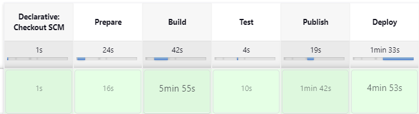