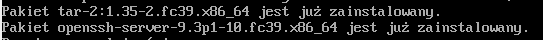
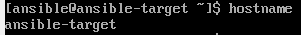
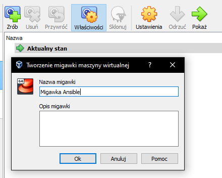
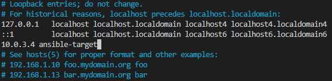
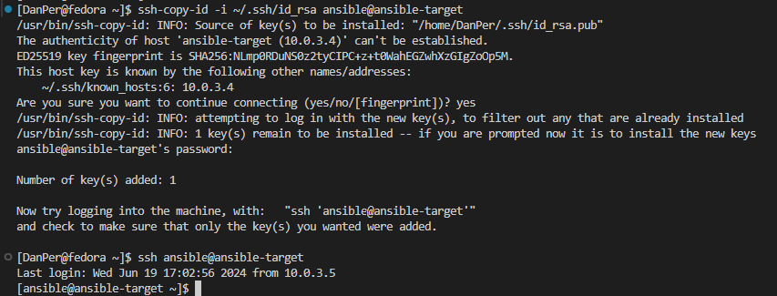
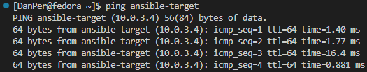
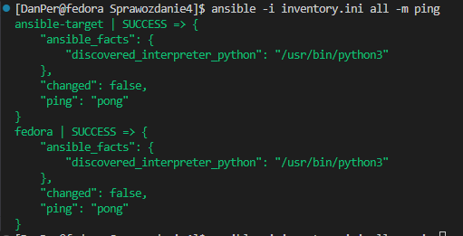
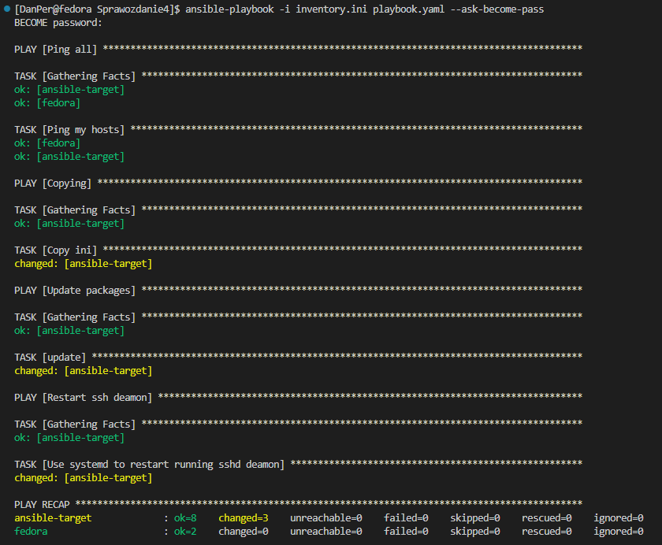
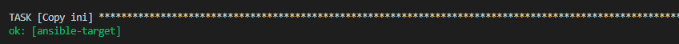
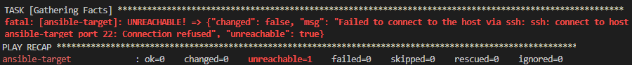

# Sprawozdanie 04
# IT 412497 Daniel Per
---

## Automatyzacja i zdalne wykonywanie poleceń za pomocą Ansible
## Pliki odpowiedzi dla wdrożeń nienadzorowanych
---
Celem tych ćwiczeń było zapoznanie się ze zdalnym zarządzaniem korzystając z Ansible oraz przygotowanie zautomatyzowania instalacji środowiska testowego dla oprogramowania, które nie pracuje w całości w kontenerze.

---

## Wykonane zadanie - Lab 008
---


### Instalacja zarządcy Ansible
* Utwórz drugą maszynę wirtualną o **jak najmniejszym** zbiorze zainstalowanego oprogramowania
  * Zastosuj ten sam system operacyjny, co "główna" maszyna
> W naszym przypadku instalujemy Fedore 39. Możemy skorzystać z tego samego pliku .iso co w przypadku głównej maszyny.

  * Zapewnij obecność programu `tar` i serwera OpenSSH (`sshd`)
Instalujemy wszystko komendą:
```
sudo dnf install -y tar openssh-server
```



  * Nadaj maszynie *hostname* `ansible-target`
```
sudo hostnamectl set-hostname ansible-target
```
Ustawiamy maszynie ustalony hostname. Sprawdzamy go przez wywołanie
```
hostname
```



  * Utwórz w systemie użytkownika `ansible`
> Użytkownika `ansible` utworzyliśmy już w trakcie instalacji systemu, więc profil jest gotowy do działania.

  * Zrób migawkę maszyny (i/lub przeprowadź jej eksport)
Korzystając z funkcjonalności VirtualBoxa, robimy migawkę naszej maszyny.



* Na głównej maszynie wirtualnej (nie na tej nowej!), zainstaluj [oprogramowanie Ansible](https://docs.ansible.com/ansible/latest/installation_guide/index.html), najlepiej z repozytorium dystrybucji
Na głównej maszynie instalujemy oprogramowanie Ansible zgodnie z powyższą instrukcją.

* Wymień klucze SSH między użytkownikiem w głównej maszynie wirtualnej, a użytkownikiem `ansible` z nowej tak, by logowanie `ssh ansible@ansible-target` nie wymagało podania hasła
Najpierw w pliku `etc/hosts` dodajemy nazwę dla ip naszej nowej maszyny



Następnie tworzymy i wymieniamy klucze.
```
ssh-keygen -t rsa -b 4096
ssh-copy-id -i ~/.ssh/id_rsa ansible@ansible-target
ssh-copy-id -i ~/.ssh/id_rsa DanPer@fedora
```
> Wymieniamy klucze ze swoją maszyną z powodu zaistniałego problemu z korzystaniem z później tworzonego pliku `.ini`



Jak widać wszystko wykonano prawidłowo. Po wywołaniu ssh na nową maszynę nie została wyświetlona prośba o hasło.

### Inwentaryzacja
* Dokonaj inwentaryzacji systemów
  * Ustal przewidywalne nazwy komputerów stosując `hostnamectl`
  ```
  # Dla głownej maszyny
  sudo hostnamectl set-hostname fedora

  # Dla nowej maszyny
  sudo hostnamectl set-hostname ansible-target
  ```

  * Wprowadź nazwy DNS dla maszyn wirtualnych, stosując `systemd-resolved` lub `resolv.conf` i `/etc/hosts` - tak, aby możliwe było wywoływanie komputerów za pomocą nazw, a nie tylko adresów IP
> Stosowanie nazw zostało wprowadzone powyżej przy wymianie kluczy.

  * Zweryfikuj łączność



  * Stwórz [plik inwentaryzacji](https://docs.ansible.com/ansible/latest/getting_started/get_started_inventory.html)
Tworzymy nowy plik `inventory.ini`

  * Umieść w nim sekcje `Orchestrators` oraz `Endpoints`. Umieść nazwy maszyn wirtualnych w odpowiednich sekcjach
Uzupełniamy plik inwentaryzacji wedle instrukcji.
```
[Orchestrators]
fedora ansible_user=DanPer

[Endpoints]
ansible-target ansible_user=ansible
```
> Dodaliśmy też nazwy użytkowników których ma dotyczyć na maszynach

  * Wyślij żądanie `ping` do wszystkich maszyn
```
ansible -i inventory.ini all -m ping
```



  
### Zdalne wywoływanie procedur
Za pomocą [*playbooka*](https://docs.ansible.com/ansible/latest/getting_started/get_started_playbook.html) Ansible:
  * Wyślij żądanie `ping` do wszystkich maszyn
  * Skopiuj plik inwentaryzacji na maszyny/ę `Endpoints`
  * Ponów operację, porównaj różnice w wyjściu
  * Zaktualizuj pakiety w systemie
  * Zrestartuj usługi `sshd` i `rngd`
  * Przeprowadź operacje względem maszyny z wyłączonym serwerem SSH, odpiętą kartą sieciową

Z pomocą instrukcji przygotowujemy plik `playbook.yaml` :

```
- name: Ping all
  hosts: all
  tasks:
   - name: Ping my hosts
     ansible.builtin.ping:

- name: Copying
  hosts: Endpoints
  remote_user: ansible
  tasks:
   - name: Copy ini
     copy:
      src: ./inventory.ini
      dest: /home/ansible/

- name: Update packages
  hosts: Endpoints
  remote_user: ansible
  tasks:
   - name: update
     ansible.builtin.dnf:
      name: "*"
      state: latest
     become: true

- name: Restart ssh deamon
  hosts: Endpoints
  become: true
  tasks:
  - name: Use systemd to restart running sshd deamon
    systemd:
      name: sshd
      state: restarted
```

`Playbook` składa się z listy `play'i` czyli zadań do wykonania, dla określonych hostów.
> Zadanie aktualizacji pakietów potrzebowało uprawnień root'a. \
Do wykonania tego użyliśmy `become: true`, oraz do uzyskania hasła dla wykonywanego polecenia z rootem do komendy wywołania playbooka dodajemy `--ask-become-pass`

```
ansible-playbook -i inventory.ini playbook.yaml --ask-become-pass
```



Następnie uruchamiamy playbook ponownie.



Po ponownym uruchomieniu w wyjściu jest "ok" zamiast "changed", wynika to z faktu że plik który kopiujemy już znajduje się na miejscu. Oznacza to że można korzystać z pliku wielokrotnie bez przejmowania się o błąd związany z wielokrotnym kopiowaniem tych samych plików.

Po sprawdzeniu wszystkiego ostatnie czego nam brakuje to testu przy wyłączonej usłudze ssh.



Jak widać wyjściem jest status 'unreachable', czyli maszyna jest nieosiągalna.
  

### Zarządzanie kontenerem
Za pomocą [*playbooka*](https://docs.ansible.com/ansible/latest/getting_started/get_started_playbook.html) Ansible:
* Wykonaj, w zależności od dostępności obrazów:
  * Uruchom kontener sekcji `Deploy` z poprzednich zajęć
  * Pobierz z Docker Hub aplikację "opublikowaną" w ramach kroku `Publish`
  * Opcjonalnie: zaimportuj obrazy `Builder` i `Tester` (z pliku, nie z Docker Hub)
  * Uruchom aplikację dostarczaną kontenerem Deploy/Publish, podłącz *storage* oraz wyprowadź port
    * W przypadku aplikacji działającej poza kontenerem:
      * Wyślij plik aplikacji na zdalną maszynę
      * Stwórz kontener przeznaczony do uruchomienia aplikacji (zaopatrzony w zależności)
      * Umieść/udostępnij plik w kontenerze, uruchom w nim aplikację
  * Zatrzymaj i usuń kontener
* Ubierz powyższe kroki w [*rolę*](https://docs.ansible.com/ansible/latest/playbook_guide/playbooks_reuse_roles.html), za pomocą szkieletowania `ansible-galaxy`
  


## Wykonane zadanie - Lab 009

inst.ks=link do repo


### Zadania do wykonania
* Zainstaluj [system Fedora](https://download.fedoraproject.org/pub/fedora/linux/releases/), stosując instalator sieciowy (*netinst*)

Pobieramy i instalujemy czysty system Fedora (w naszym przypadku wersję 39) oraz tworzymy nowego użytkownika. 

* Pobierz plik odpowiedzi `/root/anaconda-ks.cfg`

Pobieramy nasz plik odpowiedzi `/root/anaconda-ks.cfg`, który lekko zmodyfikujemy i wyślemy na nasze repo.

* Plik odpowiedzi może nie zawierać wzmianek na temat potrzebnych repozytoriów. Na przykład, dla systemu Fedora 38:
  * `url --mirrorlist=http://mirrors.fedoraproject.org/mirrorlist?repo=fedora-38&arch=x86_64`
  * `repo --name=update --mirrorlist=http://mirrors.fedoraproject.org/mirrorlist?repo=updates-released-f38&arch=x86_64`
* Plik odpowiedzi może zakładać pusty dysk. Zapewnij, że zawsze będzie formatować całość, stosując `clearpart --all`

Ustawiamy formatowanie całego dysku korzystając z `clearpart --all`, oraz dodajemy wzmianki na temat repo dla naszego systemu. W naszym przypadku z fedorą 39:
  * `url --mirrorlist=http://mirrors.fedoraproject.org/mirrorlist?repo=fedora-39&arch=x86_64`
  * `repo --name=update --mirrorlist=http://mirrors.fedoraproject.org/mirrorlist?repo=updates-released-f39&arch=x86_64`

* Ustaw *hostname* inny niż domyślny `localhost`
* Rozszerz plik odpowiedzi o repozytoria i oprogramowanie potrzebne do uruchomienia programu, zbudowanego w ramach projektu. 
  * W przypadku kontenera, jest to po prostu Docker.
    * Utwórz w sekcji `%post` mechanizm umożliwiający pobranie i uruchomienie kontenera
    * Pamiętaj, że **Docker zadziała dopiero na uruchomionym systemie!** - nie da się wdać z interakcji z Dockerem z poziomu instalatora systemu: polecenia `docker run` nie powiodą się na tym etapie
  * Gdy program pracuje poza kontenerem, potrzebny jest cały łańcuch dependencji oraz sam program.
    * Użyj sekcji `%post`, by pobrać z Jenkinsa zbudowany artefakt
    * Jeżeli nie jest to możliwe/wykonalne, użyj dowolnego serwera SFTP/FTP/HTTP aby "zahostować" program - następnie pobierz go z tak hostującego serwera (stosując np. `wget`)
    * Umieść program w ścieżce stosownej dla binariów `/usr/local/bin/`
    * Zadbaj w sekcji `%packages`, by system zainstalował wszystkie dependencje potrzebne do działania programu
  * Wybierz oprogramowanie na podstawie poprzedniego sprawozdania.
  * Zapoznaj się z [dokumentacją pliku odpowiedzi](https://access.redhat.com/documentation/en-us/red_hat_enterprise_linux/9/html/performing_an_advanced_rhel_9_installation/kickstart-commands-and-options-reference_installing-rhel-as-an-experienced-user)
  * Użyj pliku odpowiedzi do przeprowadzenia [instalacji nienadzorowanej](https://docs.fedoraproject.org/en-US/fedora/f36/install-guide/advanced/Kickstart_Installations/)
* Zapewnij, by od razu po pierwszym uruchomieniu systemu, oprogramowanie zostało uruchomione (w dowolny sposób)

