# Sprawozdanie 05
# IT 412497 Daniel Per
---

## Wdrażanie na zarządzalne kontenery: Kubernetes (1)
## Wdrażanie na zarządzalne kontenery: Kubernetes (2)
---
Celem tych ćwiczeń było zapoznanie się z Kubernetes'em.

---

## Wykonane zadanie - Lab 010-011
---


### Instalacja klastra Kubernetes
 * Zaopatrz się w implementację stosu k8s: [minikube](https://minikube.sigs.k8s.io/docs/start/)

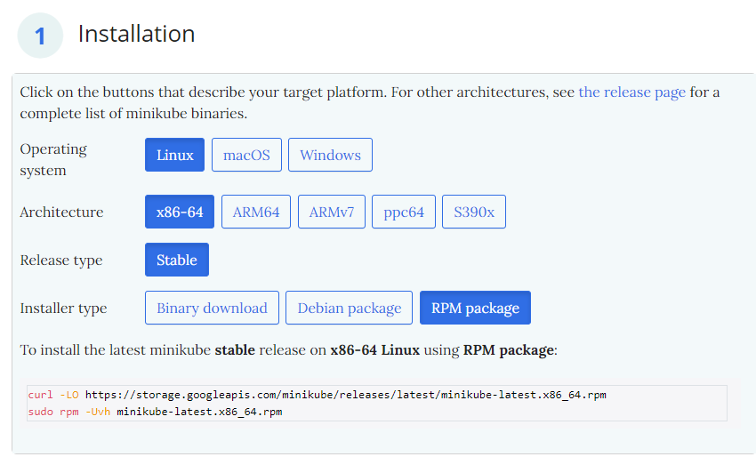
Wchodzimy na podaną stronę i wybieramy interesujący nas system i typ instalacji. W naszym przypadku (Fedora) jest to Linux i wybieramy RPM package.

 * Przeprowadź instalację, wykaż poziom bezpieczeństwa instalacji
Korzystamy z podanych nam na stronie komend w celu instalacji minikube'a.


```
curl -LO https://storage.googleapis.com/minikube/releases/latest/minikube-latest.x86_64.rpm
sudo rpm -Uvh minikube-latest.x86_64.rpm
```


 * Zaopatrz się w polecenie `kubectl` w wariancie minikube, może być alias `minikubctl`, jeżeli masz już "prawdziwy" `kubectl`

Do tego korzystamy z podanej nam komendy:
```
alias kubectl="minikube kubectl --"
```

 * Uruchom Kubernetes, pokaż działający kontener/worker

```
minikube start
```

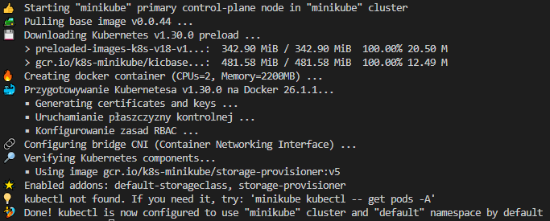


 * Uruchom Dashboard, otwórz w przeglądarce, przedstaw łączność
Uruchamiamy dashboard komendą:
```
minikube dashboard
```
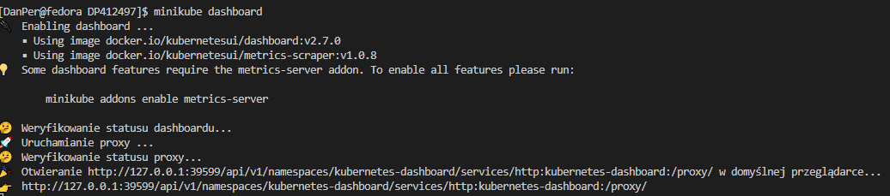

I następnie (jeśli nie otworzy się automatycznie) przechodzimy na adres który pojawi się w konsoli.

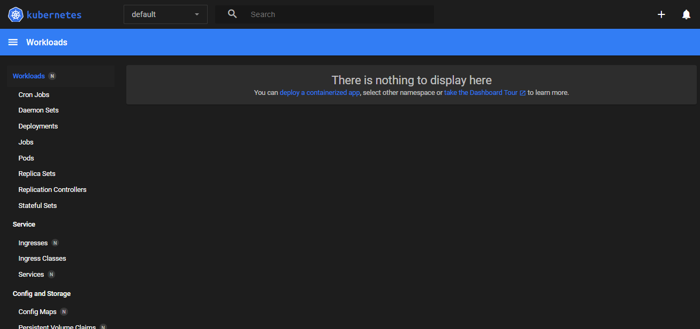


 
### Analiza posiadanego kontenera
 * Zdefiniuj krok "Deploy" swojego projektu jako "Deploy to cloud":
   * Deploy zbudowanej aplikacji powinien się odbywać "na kontener"
   * Przygotuj obraz Docker ze swoją aplikacją - sprawdź, że Twój kontener Deploy na pewno **pracuje**, a nie natychmiast kończy pracę! 😎
   * Jeżeli wybrana aplikacja nie nadaje się do pracy w kontenerze i nie wyprowadza interfejsu funkcjonalnego przez sieć, wymień projekt na potrzeby tego zadania:
     * Optimum: obraz-gotowiec (po prostu inna aplikacja, np. `nginx`, ale **z dorzuconą własną konfiguracją**), samodzielnie wybrany program, obraz zbudowany na jego bazie
     * Plan max: obraz wygenerowany wskutek pracy *pipeline'u*
   * Wykaż, że wybrana aplikacja pracuje jako kontener

Jako iż poprzednio pracowaliśmy na `irssi`, które nie jest stale działającym programem, dla tego zadania posłużymy się `nginx`.
Przygotujemy sobie `Dockerfile'a`, aby stworzyć swoją wersję obrazu lokalnie. Chcemy coś w nim dodatkowo zmienić, więc postawmy na stronę startową, czyli plik `index.html`.
Nasz plik Dockerfile będzie wyglądał następująco:
```
FROM nginx:1.26.1
COPY index.html /usr/share/nginx/html/index.html
```
> Pobieramy obraz nginx w wersji 1.26.0, która jest najnowszą dostępną stabilną wersją i następnie podmieniamy plik strony na nasz. (Jest to ten sam plik ze zmienioną treścią).

Gdy Dockerfile jest gotowy, stwórzmy z jego pomocą nasz obraz i zwersjonujmy go na :0.1
Następnie postawimy kontener z tego obrazu, aby sprawdzić czy nasz obraz działa.
Czyli uruchamiamy komendy:
```
docker build -f nginx.Dockerfile -t my-nginx:0.1 .
docker run -d -p 8085:80 --name docker-nginx my-nginx:0.1
```
Jeśli zadziałało, powinniśmy zobaczyć efekty na `localhost:8085`.

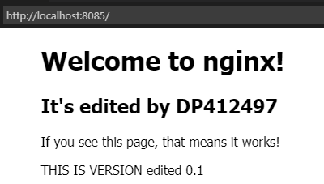

   
### Uruchamianie oprogramowania
 * Uruchom kontener na stosie k8s
 * Kontener uruchomiony w minikubie zostanie automatycznie ubrany w pod.
 * ```minikube kubectl run -- <nazwa-wdrożenia> --image=<obraz-docker> --port=<wyprowadzany port> --labels app=<nazwa-wdrożenia>```

Najpierw chcemy umieścić nasz obraz w DockerHub'ie. Zaczynamy od zalogowania się, tagujemy nasz obraz i push'ujemy do huba.
```
docker login
docker tag my-nginx:0.1 kogucik1519/my-nginx:0.1
```

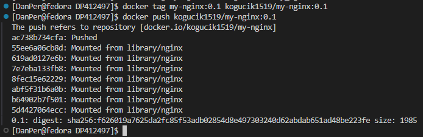

Teraz możemy nasz obraz uruchomić
```
kubectl run kube-nginx-01 --image=kogucik1519/my-nginx:0.1 --port=80 --labels app=kube-nginx-01
```

 * Przedstaw że pod działa (via Dashboard oraz kubectl)

Sprawdzamy dashboard i kubectl czy działa.

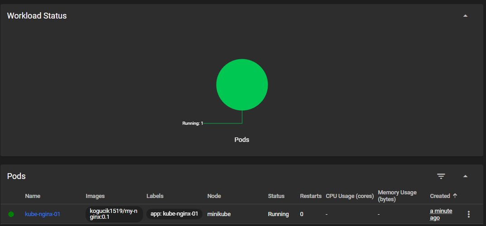
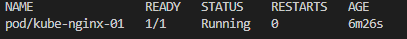

Jak widzimy wszystko działa poprawnie.

 * Wyprowadź port celem dotarcia do eksponowanej funkcjonalności
 * ```kubectl port-forward pod/<nazwa-wdrożenia> <LO_PORT>:<PODMAIN_CNTNR_PORT> ```

```
kubectl port-forward pod/kube-nginx-01 8086:80
```

 * Przedstaw komunikację z eskponowaną funkcjonalnością

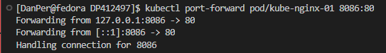
 


### Konwersja wdrożenia ręcznego na wdrożenie deklaratywne YAML
 * Upewnij się, że posiadasz wdrożenie z poprzednich zajęć zapisane jako plik
 * Wzbogać swój obraz o 4 repliki
 * Rozpocznij wdrożenie za pomocą ```kubectl apply```
 * Zbadaj stan za pomocą ```kubectl rollout status```


Korzystając z bazowego pliku, edytujemy go na nasze potrzeby dla naszego obrazu.
`deployment.yaml`
```
apiVersion: apps/v1
kind: Deployment
metadata:
  name: nginx-deployment
spec:
  replicas: 4
  selector:
    matchLabels:
      app: nginx
  template:
    metadata:
      labels:
        app: nginx
    spec:
      containers:
      - name: nginx
        image: kogucik1519/my-nginx:0.1
        ports:
        - containerPort: 80
```

Wdrażamy go dzięki:
```
kubectl apply -f ./yamle/deployment.yaml
```

Badamy stan za pomocą:
```
kubectl rollout status
```

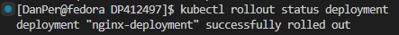


### Przygotowanie nowego obrazu
 * Zarejestruj nową wersję swojego obrazu `Deploy` (w Docker Hub lub lokalnie)
 * Upewnij się, że dostępne są dwie co najmniej wersje obrazu z wybranym programem
 * Jeżeli potrzebny jest "gotowiec" z powodu problemów z `Deploy`, można użyć np `httpd`, ale powinien to być **własny** kontener: zmodyfikowany względem oryginału i opublikowany na własnym koncie DH.
 * Będzie to wymagać 
   * przejścia przez *pipeline* dwukrotnie, lub
   * ręcznego zbudowania dwóch wersji, lub
   * przepakowania wybranego obrazu samodzielnie np przez ```commit```
 * Przygotuj wersję obrazu, którego uruchomienie kończy się błędem

Ponawiamy kroki jak dla przygotowania naszej wersji 0.1 (oczywiście ponownie zmieniając lekko index.html):
```
docker build -f nginx.Dockerfile -t my-nginx:0.2 .
docker tag my-nginx:0.2 kogucik1519/my-nginx:0.2
docker push kogucik1519/my-nginx:0.2
```

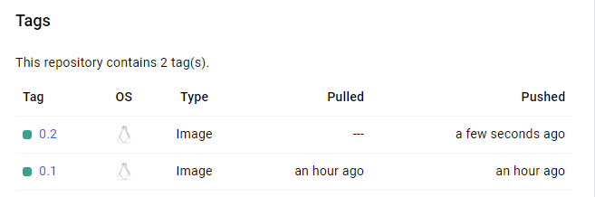
Jak widać druga wersja jest gotowa do korzystania.
  
### Zmiany w deploymencie
 * Aktualizuj plik YAML z wdrożeniem i przeprowadzaj je ponownie po zastosowaniu następujących zmian:

   * Nasze bazowe ustawienia
    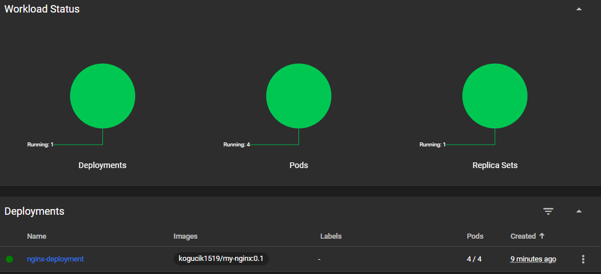

   * zwiększenie replik np. do 8
    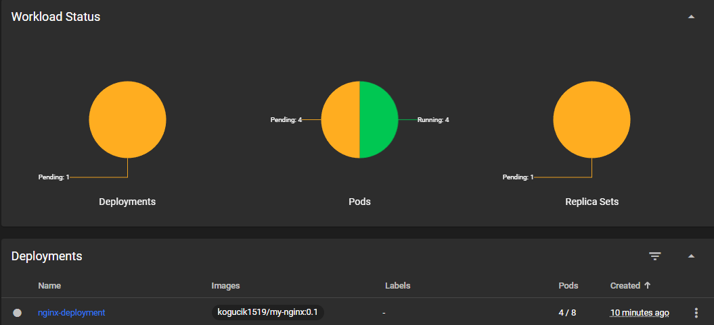
    Dodatkowe repliki są dodawane do naszego set'u.

   * zmniejszenie liczby replik do 1
    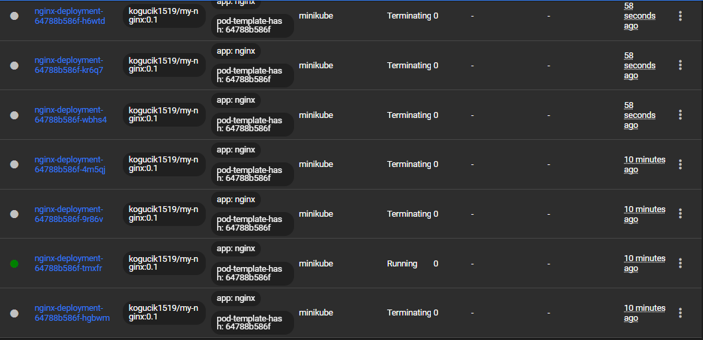
    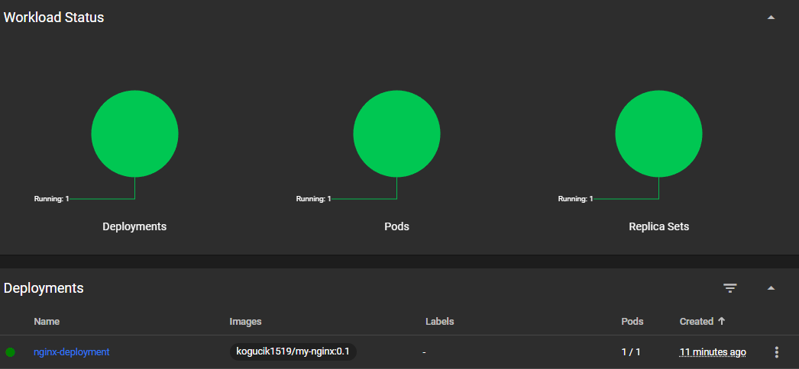
    Nadmiar replik jest terminowany.

   * zmniejszenie liczby replik do 0
    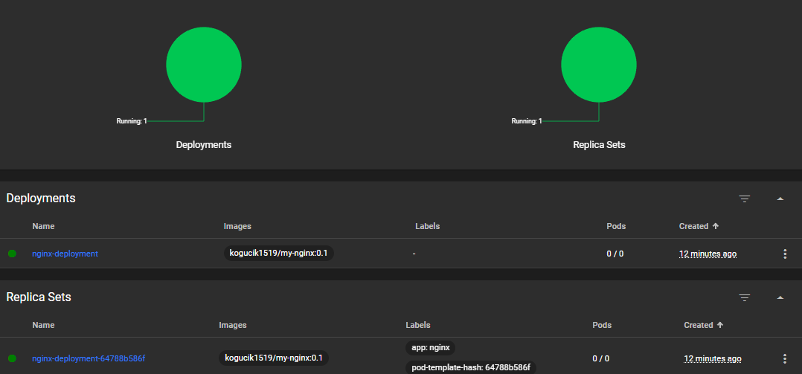
    Nie mamy żadnych pod'ów, ale nasz deployment i set dalej jest, mimo że pusty.

   * Zastosowanie nowej wersji obrazu
    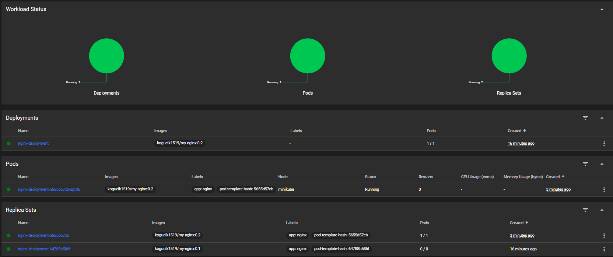
    Pojawił się nowy set dla nowej wersji
    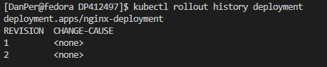
    Widzimy drugi wpis w historii.

   * Zastosowanie starszej wersji obrazu
    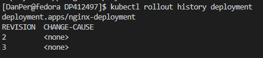
    Pojawił się kolejny wpis, nasza 'nowa' (stara) wersja, a zniknęła pierwsza.
    Stało się tak ponieważ wskoczyła ona po prostu na nowe miejsce, stała się tą nową, ponieważ już była gotowa.


 * Przywracaj poprzednie wersje wdrożeń za pomocą poleceń
   * ```kubectl rollout history```
   * ```kubectl rollout undo```


### Kontrola wdrożenia
 * Napisz skrypt weryfikujący, czy wdrożenie "zdążyło" się wdrożyć (60 sekund)

 ```
  #!/bin/bash
  # Nazwa wdrożenia
  DEPLOYMENT_NAME="my-nginx"
  NAMESPACE="default"
  TIMEOUT=60

  # Sprawdzenie stanu wdrożenia
  start_time=$(date +%s)

  while true; do
      # Pobranie liczby gotowych replik
      ready_replicas=$(kubectl get deployment $DEPLOYMENT_NAME -n $NAMESPACE -o jsonpath='{.status.readyReplicas}')

      # Pobranie całkowitej liczby replik
      replicas=$(kubectl get deployment $DEPLOYMENT_NAME -n $NAMESPACE -o jsonpath='{.status.replicas}')

      # Sprawdzenie, czy wszystkie repliki są gotowe
      if [[ "$ready_replicas" == "$replicas" ]]; then
          echo "Wdrożenie $DEPLOYMENT_NAME zakończone pomyślnie."
          exit 0
      fi

      # Sprawdzenie, czy przekroczono czas oczekiwania
      current_time=$(date +%s)
      elapsed_time=$((current_time - start_time))
      if [[ "$elapsed_time" -ge "$TIMEOUT" ]]; then
          echo "Wdrożenie $DEPLOYMENT_NAME nie zakończyło się w ciągu $TIMEOUT sekund."
          exit 1
      fi

      # Odczekanie 5 sekund przed kolejną kontrolą
      sleep 5
  done
 ```
 

### Strategie wdrożenia
 * Przygotuj wersje [wdrożeń](https://kubernetes.io/docs/concepts/workloads/controllers/deployment/) stosujące następujące strategie wdrożeń
   * Recreate
    Do naszego base yaml'a dodajewy w spec. :
    ```
    strategy:
      type: Recreate
    ```

    > Stara wersja zostaje zatrzymana przed uruchomieniem nowej.\
     Może powodować przestój aplikacji.

   * Rolling Update (z parametrami `maxUnavailable` > 1, `maxSurge` > 20%)
    Do naszego base yaml'a dodajewy w spec. :
    ```
    strategy:
      type: RollingUpdate
      rollingUpdate:
        maxUnavailable: 2
        maxSurge: 20%
    ```

    > Wdrażanie odbywa się stopniowo, wymieniając stare pody na nowe. \
    Minimalizuje przestoje, ale może spowodować krótkotrwałe zmniejszenie liczby dostępnych instancji (przy maxUnavailable). \
    Można dostosować parametry takie jak maxUnavailable i maxSurge dla lepszej kontroli nad procesem wdrażania.

   * Canary Deployment workload
   Do naszego base yaml'a dodajemy etykietę dla nowych wersji podów, która powoli jest wdrażana.
   W tym przypadku `track: canary`.
   
   > Nowa wersja jest wdrażana w małej liczbie replik przed pełnym wdrożeniem.\
   Wymaga ręcznego zarządzania i monitorowania wyników przed pełnym wdrożeniem.

 * Dla wdrożeń z wieloma replikami, użyj [serwisów](https://kubernetes.io/docs/concepts/services-networking/service/)
 Budujemy nasz plik `services.yaml`
 ```
  apiVersion: v1
  kind: Service
  metadata:
    name: nginx-service
  spec:
    selector:
      app.kubernetes.io/name: nginx
    ports:
      - protocol: TCP
        port: 82
        targetPort: 80
 ```

 I go uruchamiamy 
 ```
 kubectl apply services.yaml
 ```
