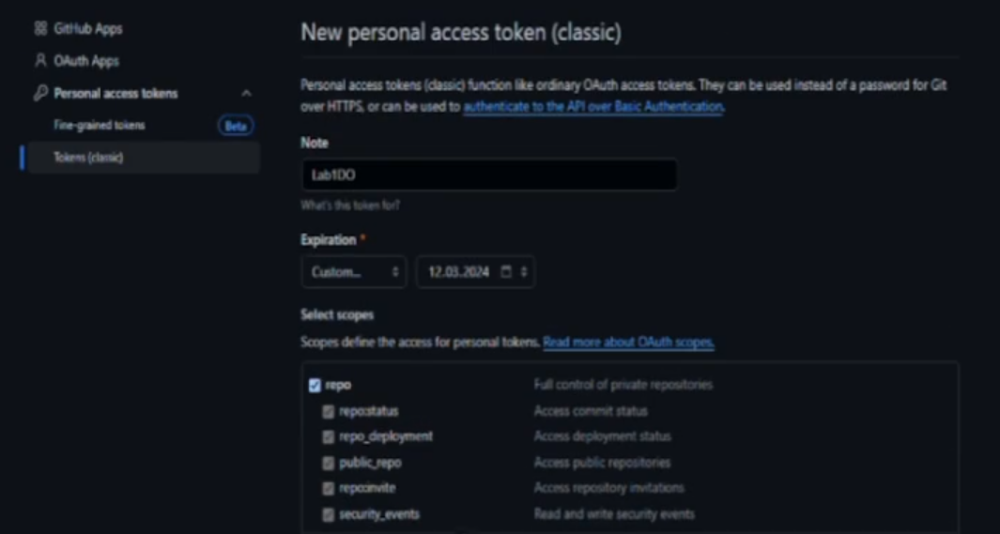
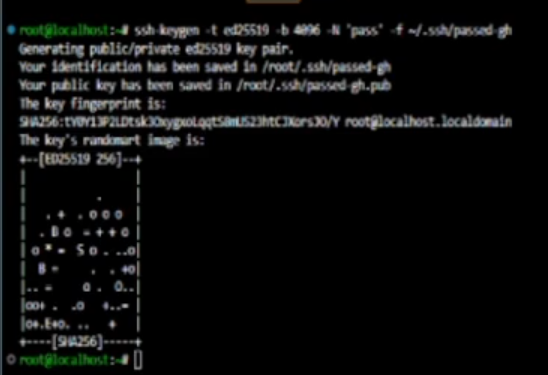

# Lab01 - GitHub Basics

---
## Jakub Rejek 412219

### Przedmowa
Chciałem z góry przeprosić za jakość zrzutów ekranu które dołaczyłem do sprawozdania. Powstały one na podstawie nagrania które wykonywałem w trakcie wykonywania ćwiczenia jako formy szkolenia.


Nagranie uległo silnej kompresji czegow wynikiem jest obniżona jakość materiału.

### 1. Zainstaluj klienta Git i obsługę kluczy SSH

Przed rozpoczeceim zajęć przygotowałem maszynę wirtualną z obrazu Fedory 39. 
Z maszyną komunikuję się przy pomocy protokołu SSH korzystająć z narzędzi Visual Studio Code **(VSC)**. W pierwszej kolejności zainstalowałem git-a na maszynie korzysatjąc z DNF: 
```bash
dnf install git
```

> Laboratorium to wykonałem 2 razy (Raz na WSL drugi raz na nowej Fedorze 39) 
>Występowały problemy z komunikacją maszyny z siecią oraz połaczeniem maszyny z hostem.


### 2. Sklonuj repozytorium przedmiotowe za pomocą HTTPS i personal access token

By ułątwić sobie pracę z repozytoriami w przyszłości utworzyłem, na maszynie, katalog Repos w którym będą powstawały wszystkie potrzebne mi repozytoria.

Katalog plików maszyny został podpięty do Remote Explorera wewnątrz VSC. Dzięki temu w prosty sposób mogę uzyskać dostęp do plików konfiguracyjnych ssh lub foldeów w których będę pracować z repozytoriami.

Wszedłem na GitHub i poz zalogowaniu się na swoje konto przeszedłem do:
> Settings -> Developer settings -> Personal access token -> Tokens (classic)
>
Tam odnalazłem stronę pozwalającą na wygenerowanie tokenu uwierzytelnijącego.



Nadałem tokenowi nazwe oraz uprawnienia tak by przysżłość mojego konta na GitHub nie była zagrożona i by upewnić się w tym przekonaniu ustawiłem termin wygaśnięcia klucza na dwa dni. Ten klucz posłużył jedynie do realizacji ćwiczenia a w dalszych krokach będę korzystał z kluczy SSH.


> UWAGA : Gdyby git nie wyrazuił się jasno by klucz nie przepadł musi zostać zapisany w bezpiecznym miejcu (schowek wystarczy) zanim przeładuje się stronę. Można też jej nie przeładowywać. Efekt ten sam. Gdy strona zostanie przeładowana nie ma możliwości ponownego wyświetlenia tokenu. Stracony token należy usunąć i wygenerować ponownie.

By zakończyć ten krok wystarczyło sklonować repozytorium przedmiotowe poniższym poleceniem:

```bash
git clone <Link-do-Repozytorium-na-GitHub> [Ścieżka-docelowa-repozytorium-lokalnego]
```
W miejscu "Linka do repozytorium" należy wstawić link HTTPS kopijąc go ze strony repozytorium:

> **Code -> HTPPS**

> Pojwił sie jednak problem. Repozytorium przedmiotowe przydzielone dla naszej grupy laboratoryjnej jest publiczne co sprawiło że nie zostąłem odpytany o token po jego skopiowaniu.

By zdemonstrować działanie tokenu skopiowałem repozytorium prywatne: **MDO2024_S**


Dzięki życzliwości VSC prośba o podanie loginu i hasła została wyświetlona w popup-ie. W miejsce loginu nalezy podać login GitHub a w miejscu hasła wygenerowany token.

Po podaniu tokenu, zakłądając, że jest on poprawny, repozytrium powinno zostać skopiowane.


### 3. Upewnij się w kwestii dostępu do repozytorium jako uczestnik i sklonuj je za pomocą utworzonego klucza SSH, zapoznaj się z dokumentacją.

Przed rozpoczęciem laboratorium otrzymaliśmy zaproszenia mailowe po których zaakceptowaniu uzyskaliśmy wymagane uprawnienia do repozytorium.
#### 3.1 Utwórz dwa klucze SSH, inne niż RSA, w tym co najmniej jeden zabezpieczony hasłem

By wygenerować klucz skożystamy z programu ssh-keygen dostarczony w standardowym pakiecie Unixa. Wywoałanie programu bez argumentów wygeneruje klucz ale każdą informację która będzie potrzebna w procesie generowania klucza będzie musiała zostać wprowadzona w terminalu "on-prompted".


By zaosczędzić sobie czasu wykonałem dwie instrukcję generujące bardzo zbliżone klucze różniące się jedynie nazwą oraz zawartością hasła.

Puste hasło:
```bash
ssh-keygen -t ed25519 -b 4096 -N '' -f ~/.ssh/passless-gh
```

Ustalone hasło:
```bash
ssh-keygen -t ed25519 -b 4096 -N 'pass' -f ~/.ssh/passed-gh
```

> Klucz z hasłem będzie, **każdorazowo**, wymagał podania hasła by móc dokonać weryfikacji tożsamości z jego pomocą.

W miejscu wslazanym przy generowaniu klucza powinny się znajdowac dwie pary kluczy. W każdej parze znajdujes się klucz publiczny z rozszerzeniem "*pub" oraz prywatny nie posiadający rozszerzenia.
#### 3.2 Skonfiguruj klucz SSH jako metodę dostępu do GitHuba
By umożliwić komunikajcę z GitHub-em z pomocą wygenerowanych kluczy muusimy dokonać konfiguracji po obu stronach.

##### Github:
Po stronie usługi (GitHub) musimy dostarczyć klucz publiczny, który jest sparowany z kluczem prywatnym(Analogia wkłądki do zamka i klucza). Należy więc umieścić "wkłądkę w naszych drzwich".

Przechodzimy do:
> Settings -> SSH and GPG keys -> New SSH key
>
Nadajemy nazwę dla klucza by łątwiej było go zweryfikować jeżeli będziemy chcieli autoryzowac kilka maszyn.

W polu klucza przeklejamy zawartość pliku z kluczem publicznym

>Musimy pamiętać, że w przypadku kluczy kryptograficznych musimy zachować 100% zgodność. Nie możemy przez przypadek usunąć lub dodać znaku.


##### Maszyna
Po stornie VM-a przechodzimy do pliku konfiguracyjnego SSH: ~/.ssh/config.
Dzięki podpięciu plików z maszyny do VSC na hoście mogłem otworzyć go prosto w edytorze.

Dodałem do configu hosta które zaliasowałem jako "github":
```ssh_config
Host github
	Hostname github.com
	User git
	IdentityFile ~/.ssh/passless-gh
```
- W polu hostname znalazł się adres githuba
- W polu urzytkownika znalazł się git(github weryfikuje urzytkowników na podstawie klucza który jest używany do komunikacji). 
Wszystkie połaczenia wykonywane są na user-a git.
- W polu IdentityFile znalazła się ścieżka wskazująca na plik z kluczem prywatnym na maszynie(oczywiście klucz wskazany w configu musi się zgadzać z kluczem dodanym na koncie GitHub).


#### 3.3 Sklonuj repozytorium z wykorzystaniem protokołu SSH

By potwierdzić działąnie kluczy oraz poprawność konfiguracji pozostało skopiowanie repozytroium. W  tym wypadku również skorzystałem z prywatnego repozytorium do weryfikacji poprawności a następnie skopiowałem to poprawne repozytorium przedmiotowe.

```bash
git clone git@github:InzynieriaOprogramowaniaAGH/MDO2024_INO.git ./SSHRepo
```

### 4. Przełącz się na gałąź main, a potem na gałąź swojej grupy (pilnuj gałęzi i katalogu!)
Po skopiowaniu repozytoriuim git powinien ustawić HEAD, czyli punkt na osi repozytorium w którym znajduje się obecnie, na ostatni commit gałęzi main(lub innej gałęzi ustawionej na główną).

Z tej pozycji możemy skorzystać z polecenia checkout by przepiąć się na wybraną gałąź. W naszym przypadku będzie to gałąź grupy.

```bash
git checkout GCL4
```
Po wykonaniu powyższego polecenia HEAD powinien wskazywać na punkt w którym znajduje się najnowszy commit brancha grupy(w moim przypadku GCL4).

#### 4.1 Utwórz gałąź o nazwie "inicjały & nr indeksu" np. KD232144. Miej na uwadze, że odgałęziasz się od brancha grupy!
By utworzyć nową gałąź możemy skorzystać z polecenia branch lub wykonać checkout z parametrem **"b"** 
```bash
git checkout -b JR412219
```
W ten sposób możemy utworzyć gałąź z punktu na gałęzi w którym stoimy jednocześnie przepinając HEAD w miejsce owej(nowej) gałęzi.


> Należy pamiętać, że jeżeli mieliśmy jakieś pliki, które nie zostały z commitowane do repo, zostaną one nadpisane przez pliki z obecnie wskazywanej przez HEAD gałęzi.
#### 4.2 Rozpocznij pracę na nowej gałęzi
- W katalogu właściwym dla grupy utwórz nowy katalog, także o nazwie "inicjały & nr indeksu" np. KD232144.


 
 W przypadku VSC wystarczyło dodać nowy katalog w eksplorerze plików. W tym katalogu znajdą się pliki z których będę korzystał w trakcie laboratorium oraz moje sprawozdania.

- Napisz Git hooka - skrypt weryfikujący, że każdy Twój "commit message" zaczyna się od "twoje inicjały & nr indexu". (Przykładowe githook'i są w .git/hooks).

Z pośród wielu hooków, które znajdują się w katalogu .git/hooks tym, który wybrałem był commit-msg. Jego zawartośc wywoływana jest w momecie nadania wiadomości do tworzonego commita.

Po krótkiej wojnie znakowej z bashem uzyskałem poniższy hook:
```bash
# #!/bin/bash
# # Plik: .git/hooks/commit-msg
porto=JR412219
if "grep -q ^$porto $1"; then
  exit 0
fi
  echo "Message nie zaczyna się od $porto"
  exit 1
```

Ze względu na to, że hook był pisany w folderze hooks na bazie wersji sample nie musiałem go przemieszczać w celu jego uruchomienia.


- Dodaj ten skrypt do stworzonego wcześniej katalogu.
Przy pomocy poniższego polecenia przekopiowałem plik do katalogu roboczego:
```bash
cp <source> <dest>
```
Wyślij zmiany do zdalnego źródła

#### 5. Spróbuj wciągnąć swoją gałąź do gałęzi grupowej
Dokonałem merge gałęzi roboczej do gałęzi grupy w repo lokalnym:


