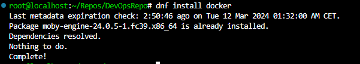
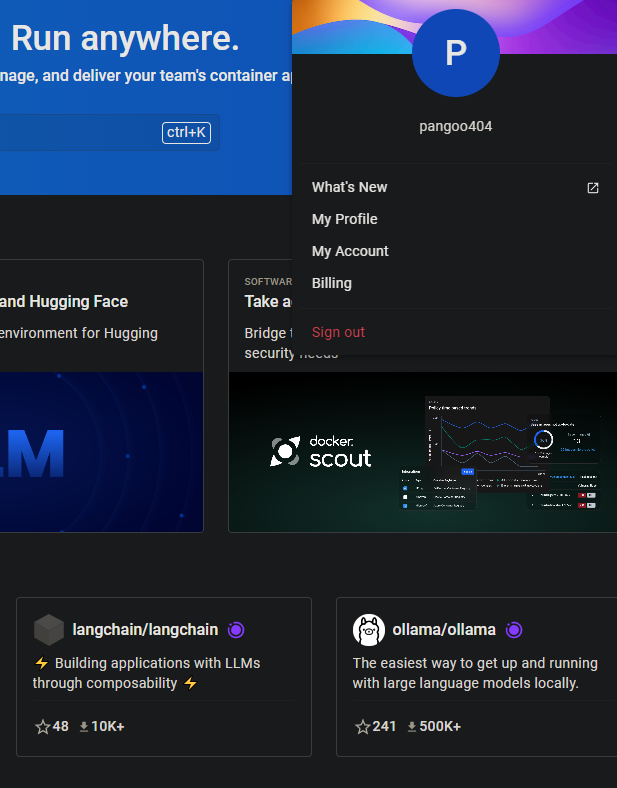
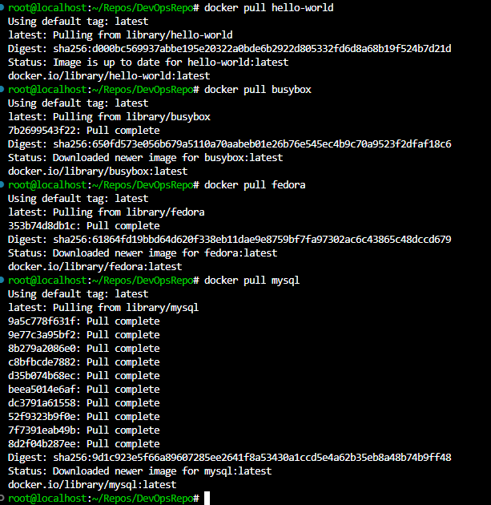
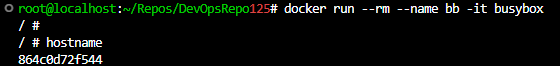
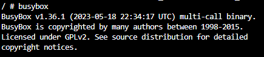
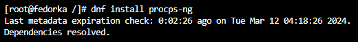
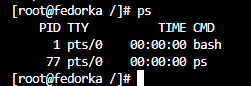
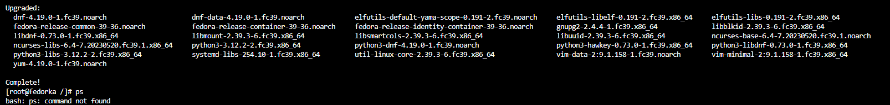

# Lab2 - Git, Docker
---
## Jakub Rejek
### Zestawienie środowiska

### 1. Zainstaluj Docker w systemie linuksowym

Wywołujac polecenie systemowe instalacji pakietów dockera dokonujemy całej instalcji. W moim przypadku docker był juz zainstalowany przed rozpoczęciem laboratorium.
```bash
dnf install docker
```
Fedora roziwązała wiele problemów na które natykałem się przy konfiguracji dockera na innych dystrybucjach Linux-a.



### 2. Zarejestruj się w [Docker Hub](https://hub.docker.com/) i zapoznaj z sugerowanymi obrazami

Rejestracja na Docker Hub była o tyle prosta, że dano nam mozliwość skorzystania z konta GiHub. Po przeklikaniu formularza i nadaniu nazwy urzytkownika mogliśmy przystapić do zapoznania się z platformą.



### 3. Pobierz obrazy `hello-world`, `busybox`, `ubuntu` lub `fedora`, `mysql`

By pobrać obraz ze zdalnego repozytorium musimy wykonać polecenie:

```bash
docker pull <nazwa_obrazu>
```
Z godnie z poleceniem zaciągnąłem powyższe obrazy:



4. Uruchom kontener z obrazu `busybox`
   - Efekt uruchomienia kontenera:
   

   - Podłącz się do kontenera **interaktywnie** i wywołaj numer wersji
   Przy tworzeniu kontenera jednym z argumentów był **-i** który uruchomi busybox w wersji interaktywnej. Wywołując polecenie busybox w kontenerze otrzymujemy informację o wersji obrazu:

   

5. Uruchom "system w kontenerze" w tym przypadku Fedorę.
   -`PID1` w kontenerze i procesy dockera na hoście
   Obraz fedory nie posiada zainstalowanego programu **ps** pozwalajacego na wyświetlenie procesów.
   
   
   - Aktualizacja pakietów
   Całość zamyka się pnownie na jednym wywołaniu update-u na menadzerze pakietów Fedory.
   ```bash
   dnf update
   ```
   
   - Wyjdź
   Po zakończeniu pracy w kontenerze mogę go opuścić wywołując `exit`. Ze względu na obecność flagi `-rm` kontener został usunięty w momencie jego zamknięcia.

   
6. Stwórz własnoręcznie, zbuduj i uruchom prosty plik `Dockerfile` bazujący na wybranym systemie i sklonuj nasze repo.
   - Kieruj się [dobrymi praktykami](https://docs.docker.com/develop/develop-images/dockerfile_best-practices/)
   - Upewnij się że obraz będzie miał `git`-a
   - Uruchom w trybie interaktywnym i zweryfikuj że jest tam ściągnięte nasze repozytorium
7. Pokaż uruchomione ( != "działające" ) kontenery, wyczyść je.
8. Wyczyść obrazy
9. Dodaj stworzone pliki `Dockefile` do folderu swojego `Sprawozdanie1` w repozytorium.
10. Wystaw *Pull Request* do gałęzi grupowej jako zgłoszenie wykonanego zadania.
