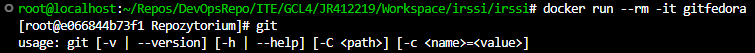
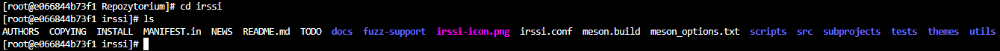
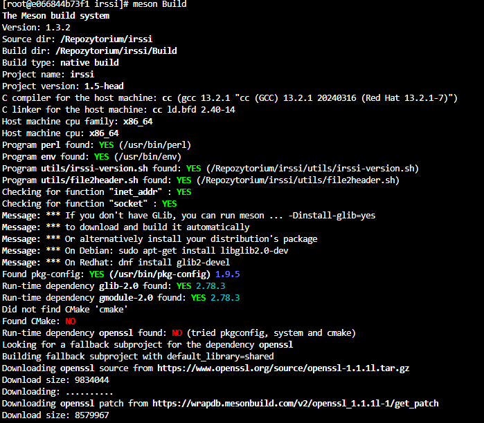
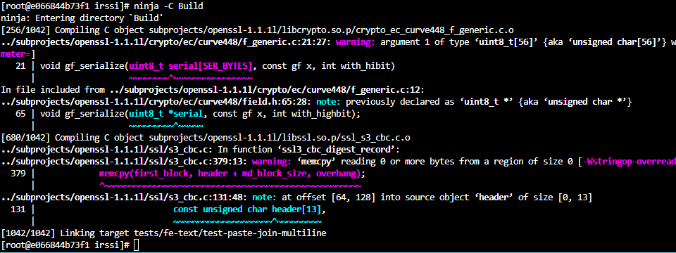
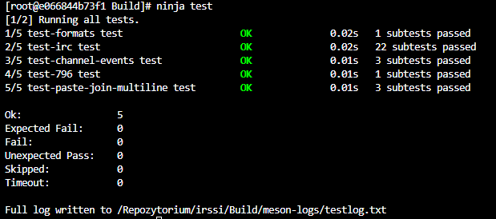
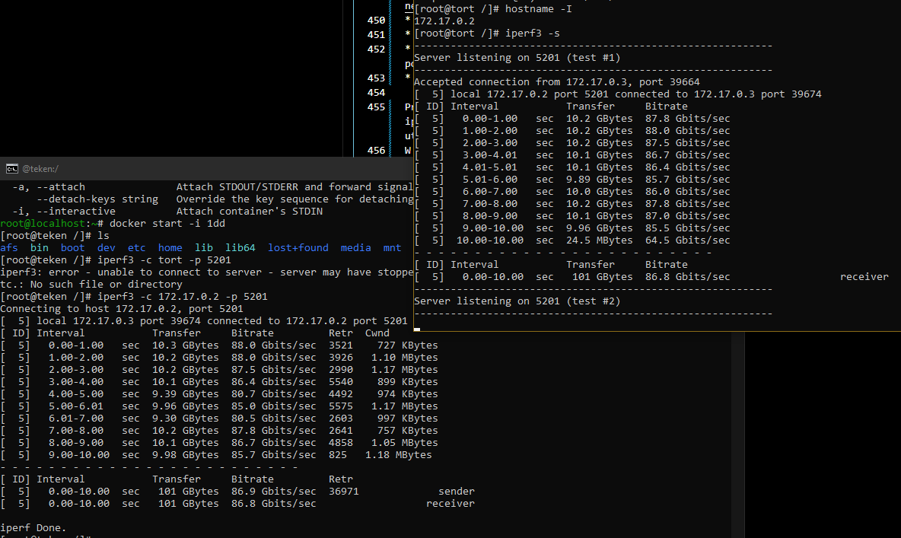

# Lab3 - Dockerfiles + Compose
---
## Jakub Rejek
### Dockerfiles, kontener jako definicja etapu
Format sprawozdania
Wykonaj opisane niżej kroki i dokumentuj ich wykonanie

Na dokumentację składają się następujące elementy.

Sprawozdanie proszę umieścić w następującej ścieżce: <kierunek>/<grupa>/<inicjały><numerIndeksu>/Sprawozdanie2/README.md, w formacie Markdown
```
Zadania do wykonania:

### Wybór oprogramowania na zajęcia:

Idąc za przykładem prowadzacego obrałem dwa wskazane na cwiczeniach programy, które pozwolą mi na realizację instrukcji
* [irsii](https://github.com/irssi/irssi) - Budowane z `meson` + `ninja`
* [To Do Web App](https://github.com/devenes/node-js-dummy-test) - Budowane i uruchamiane w `Node`

Po zapoznaniu się z wymaganiami obu byłem gotowy do ich uruchomienia na maszynie wirtualnej. Stworzyłem katalog Workspace w którym będę trzymał wszystkie pliki i katalogi, które mogą być potrzebne w trakcie laboratorium. W nim też utworzyłem foldery w których umieszczę odpowiednie pliki Dockerfile.

### Przeprowadzenie buildu w kontenerze:
1. Wykonaj kroki `build` i `test` wewnątrz wybranego kontenera bazowego.

Przeszedłem do katalogu `irssi` i uruchomiłem interaktywnie kontener z obrazem fedory z już zainstalowanym gitem.

```BASH
docker run --rm -it gitfedora
```


Zaciągnąłem repozytorium z kodem irssi a nastepnie przeszedłem do zaciągniętego katalogu "irssi".

```BASH
git clone https://github.com/irssi/irssi
cd irssi
```


Na tym etapie zauważyłem że mój obraz zaciągał nasze repo przy uruchomieniu ale nie przeszkadzało to w dalszych czynnościach.

 Szybko zostałem upomniany o pobranie dependencji oraz build systemów `meson`-a i `ninja`-y, które potrzbene są do zbudowania programu. Wszystkie potrzebne zależności znalazłem w instrukcji instalacji w dokumentacji programu.

 >- meson-0.53 build system with ninja-1.8 or greater
 >- pkg-config (or compatible)
>- glib-2.32 or greater
>- openssl (for ssl support)
>- perl-5.8 or greater (for building, and optionally Perl scripts)
>- terminfo or ncurses (for text frontend)

Zaktualizowałem pakiety menager-a a nastepnie zaciągnąłem wymagane zależności.

```BASH
dnf update -y
dnf install -y gcc meson ninja* glib2-devel utf8proc* perl-Ext* ncurses*
```
Gdy wszystkie wymagane pakiety zostały zainstalowane pozostało zbudować program. W przypadku irris korzystamy z dwóch systemów budowy. `ninja korzysta z elementów wstępnie złożonych przez meson-a`

```BASH
meson Build
ninja -C Build
```
Wykonanie mesona:

Następnie ninja:


```BASH
ninja test
```


2. Stwórz dwa pliki `Dockerfile` automatyzujące kroki powyżej:
### IRSSI:

#### irssibuild
Utworzyyłem prosty dockerfile który bazuje na czystej fedorze. Chciałem uniknąć kopiowania naszego repo za każdym razem gdy będę chiał skorzystac z obrazu bazowego ``gitfedora``. Jedyna zmianą było doinstalowanie gita wraz z zależnościami programu.

Plik Dockerfile wrzuciłem do katalogu roboczego przeznaczonego dla irssi.


irssibuild.Dockerfile :
```Dockerfile
FROM fedora:39

WORKDIR /root/Apps

RUN dnf -y update && dnf -y install git gcc meson ninja* glib2-devel utf8proc* perl-Ext* ncurses*
RUN git clone https://github.com/irssi/irssi

WORKDIR /root/Apps/irssi

RUN meson Build && ninja -C Build
```
By zbudować powyżej opisany obraz wywołuję polecenie:

```BASH
docker build -t irssibuild -f irssibuild.Dockerfile .
```

``-t`` ten argument pozwala nadać nam tag dla naszego obrazu dzięki czemu łątwiej będzie nam go rozpoznać.

``-f`` pozwala na wskazanie dockerfile-a którego chcemy budować


Budowa kontenera przechodzi pomyślnie. Warto zauważyć, że gdy zmienimy jedną z warstw w Dockerfilu pozostałe nie musza być ponownie wykonywane a zaciągane są z cashu.

```
[1037/1042] Compiling C object tests/fe-text/test-paste-join-multiline.p/.._.._src_fe-text_textbuffer-formats.c.o
[1038/1042] Compiling C object tests/fe-text/test-paste-join-multiline.p/.._.._src_fe-text_terminfo-core.c.o
[1039/1042] Compiling C object tests/fe-text/test-paste-join-multiline.p/.._.._src_fe-text_textbuffer.c.o
[1040/1042] Compiling C object tests/fe-text/test-paste-join-multiline.p/.._.._src_fe-text_textbuffer-view.c.o
[1041/1042] Compiling C object tests/fe-text/test-paste-join-multiline.p/test-paste-join-multiline.c.o
[1042/1042] Linking target tests/fe-text/test-paste-join-multiline
Removing intermediate container cf574900fc65
 ---> 7b6ad57f9695
Successfully built 7b6ad57f9695
Successfully tagged irssibuild:latest
root@localhost:~/Repos/DevOpsRepo/ITE/GCL4/JR412219/Workspace/Lab3/irssi# docker images
REPOSITORY   TAG       IMAGE ID       CREATED          SIZE
irssibuild   latest    7b6ad57f9695   44 seconds ago   1.09GB
```

#### irssitest
Obraz który służy nam do testów jest jeszcze prostrzy ponieważ jedynym problemem jest wskazanie odpowiedniej ścieżki do miejca gdzie znajdują się testy. W obu przypadkach skorzystałem ze ścieżek bezwzględnych by mieć pewność co do położenia w kontenerze.

```Dockerfile
FROM irssibuild

WORKDIR /root/Apps/irssi/Build

RUN ninja test
```

Wynik w terminalu:
```
Step 3/3 : RUN ninja test
 ---> Running in 96ed3ebd77c3
[1/2] Generating irssi-version.h with a custom command (wrapped by meson to capture output)
[1/2] Running all tests.
1/5 test-formats test              OK              0.01s   1 subtests passed
2/5 test-irc test                  OK              0.01s   22 subtests passed
3/5 test-channel-events test       OK              0.01s   3 subtests passed
4/5 test-paste-join-multiline test OK              0.01s   3 subtests passed
5/5 test-796 test                  OK              0.01s   1 subtests passed

Ok:                 5   
Expected Fail:      0   
Fail:               0   
Unexpected Pass:    0   
Skipped:            0   
Timeout:            0   

Full log written to /root/Apps/irssi/Build/meson-logs/testlog.txt
Removing intermediate container 96ed3ebd77c3
 ---> 024ca122eb31
Successfully built 024ca122eb31
Successfully tagged irssitest:latest
```
### TDWA
#### TDWAbuild

Podobnie jak w przyypadku poprzedniego programu w katalogu roboczym utworzyłem Dockerfile służacy instalacji aplikacji z pomocą node.js:
```Dockerfile
FROM fedora:39

WORKDIR /root

RUN dnf update -y && dnf install -y nodejs git
RUN git clone https://github.com/devenes/node-js-dummy-test TDWA

WORKDIR /root/TDWA/node-js-dummy-test

RUN npm install
```
By zbudować kontener nalezy ponownie wywołać poniżcze polecenie podobnie jak w przypadku irssi.

```BASH
docker build -t tdwabuild -f TDWAbuild.Dockerfile .
```
Wynik w terminalu:
```
Step 4/6 : RUN git clone https://github.com/devenes/node-js-dummy-test TDWA
 ---> Running in afc751f623ee
Cloning into 'TDWA'...
Removing intermediate container afc751f623ee
 ---> e24d2e73c024
Step 5/6 : WORKDIR /root/TDWA/node-js-dummy-test
 ---> Running in 92e58503b587
Removing intermediate container 92e58503b587
 ---> bda8359b2cb0
Step 6/6 : RUN npm install
 ---> Running in f9c8ed70c4d6

added 354 packages, and audited 355 packages in 5s

37 packages are looking for funding
  run `npm fund` for details

8 vulnerabilities (3 moderate, 3 high, 2 critical)

To address issues that do not require attention, run:
  npm audit fix

To address all issues (including breaking changes), run:
  npm audit fix --force

Run `npm audit` for details.
npm notice 
npm notice New patch version of npm available! 10.5.0 -> 10.5.1
npm notice Changelog: <https://github.com/npm/cli/releases/tag/v10.5.1>
npm notice Run `npm install -g npm@10.5.1` to update!
npm notice 
Removing intermediate container f9c8ed70c4d6
 ---> 39a96f3b9cd5
Successfully built 39a96f3b9cd5
Successfully tagged tdwabuild:latest
```
Obraz buduje się poprawnie możemy przejść do kolejnego.
 #### TDWAtest
W nowym Dockerfile-u opisujemy budowe obrazu który wykona testy dla zbudowanej aplikacji.

```Dockerfile
FROM tdwabuild

WORKDIR /root/TDWA/node-js-dummy-test

RUN npm test
```
Ponownie korzystamy z polecenia:
```Bash
docker build -t tdwatest -f TDWAtest.Dockerfile .
```
Wynik w terminalu:
```
PASS src/index.test.js
  GET /
    ✓ should return 200 OK (21 ms)

Test Suites: 1 passed, 1 total
Tests:       1 passed, 1 total
Snapshots:   0 total
Time:        0.257 s
Ran all test suites matching /src\/lessindex.test.js/i.
Removing intermediate container 24036a5fd776
 ---> 3820af984e2a
Successfully built 3820af984e2a
Successfully tagged tdwatest:latest
```
Jak widać aplikacja przeszła test a obraz zbudował się.

3. Wykaż, że kontener wdraża się i pracuje poprawnie. Pamiętaj o różnicy między obrazem a kontenerem.

W takim kontenerze nie pracuje nic. Taki kontenera powstał jednynie w celu zbudowania/testowania builda aplikacji. Nie ma żadnej zadeklarowanej funkcjonalności przy uruchomieniu (``CMD``) dlatego też po uruchomieniu nic się nie stanie o ile uruchomimy kontener w trybie interaktywnym.
   
### Zakres rozszerzony tematu sprawozdania
#### Docker Compose
Wykonanie kompozycji dla obu obrazów zacząłem od zapoznania się z przykładowym plikiem compose oraz doinstalowania narzędzia docker-compose na hoście.
Wykonałem polecenie:
```Bash
dnf install -y docker-compose
```
Po pobraniu narzędzia napisałem prosty plik ``compose.yml`` i wrzuciłem go do katalogu roboczego irssi.

irssi - compose.yml
```yml
version: '3.0'

services:

  build:
    image: irssibuild

  test:
    image: irssitest
```
TDWA - compose.yml
```yml
version: '3.0'

services:

  build:
    image: tdwabuild

  test:
    image: tdwatest
```

By postawić kompozycję wywołujemy polecenie:
```Bash
docker-compose up
```
Po zakończeniu pracy z kompozycją warto wywołać powyższe narzędzie z poleceniem ``down`` pozbędziemy się w ten sposób powstałych kontenerów.

Wynikiem postawienia kompozycji jest wynik w terminalu:

```
root@localhost:~/Repos/DevOpsRepo/ITE/GCL4/JR412219/Workspace/Lab3/irssi# docker-compose up
Creating network "irssi_default" with the default driver
Creating irssi_build_1 ... done
Creating irssi_test_1  ... done
Attaching to irssi_test_1, irssi_build_1
irssi_test_1 exited with code 0
irssi_build_1 exited with code 0
```


#### Przygotowanie do wdrożenia (deploy): dyskusje

> * czy program nadaje się do wdrażania i publikowania jako kontener, czy taki sposób interakcji nadaje się tylko do builda

W przypadku irssi deployment w kontenerze nie ma sensu ponieważ pomimo poprawnego działania aplikacji w terminalu kontenera nie wyświetli się rysowana grafika ASCCI i aplikacja będzie bezużyteczna.
Jeżeli mówimy o TLDR aplikacja po uruchomieniu w kontenerze oraz wystawieniu portów maszyny na port na hoście możemy otworzyć w przeglądarce działającą aplikację.

> * jeżeli program miałby być publikowany jako kontener - czy trzeba go oczyszczać z pozostałości po buildzie?

  Czy trzeba? Nie. Czy wypada i należy? Tak. Jeżeli kontener przeznaczony do deploya jest jednoczesnie kontenerem do builda pozostawiamy w nim mase rzeczy np: narzędzia które nie są potrzebne nikomu poza osobbą przeprowadzajacą builda. W deployu powinien się znaleść jak najlżejszy artefakt (np: *.exe) pozbawiony bibliotek z narzędziami dev i śmieci pozostawionych przez sam build.
  
> * A może dedykowany *deploy-and-publish* byłby oddzielną ścieżką (inne Dockerfiles)?

  Jest to możliwe podejście jeżeli podepniemy do dockera folder docelowy na artefakt a nastepnie kontner który zostaje uruchomiony z takim podpięciem wykonuje deploy(build+deploy/deploy z istniejącego w kontenerze builda) do tego właśnie folderu.

> * Czy zbudowany program należałoby dystrybuować jako pakiet, np. JAR, DEB, RPM, EGG?
> * W jaki sposób zapewnić taki format? Dodatkowy krok (trzeci kontener)? Jakiś przykład?

  Można rozszerzyć kontener o czyszczenie ze wszystkich zbędnych posotałości poza artefaktem a następnie wykorzystanie odpowiedniego do naszych potrzeb menagera pakietów który pozwoli nam zapakować artefakt w pakiecik. Ponownie musimy spiąć loklany system plików z kontenerem by wyciągnąć z niego pakiet jak wskazałem powyżej.

# Lab4 - Dodatkowa terminologia w konteneryzacji, instancja Jenkins
---

### Zachowywanie stanu

Na początku przygotowałem dwa Voluminy Vin i Vout na których będę operować.
Wywołałem polecenia:
```Bash
docker volume create Vin
docker volume create Vout
```

Przygotowałem kontener, który przy uruchomieniu o ile otrzyma podpięcie voluminu skopiuje repo TDWA do wskazanego voluminu.

```Dockerfile
FROM fedora
RUN dnf update -y -y && dnf -y install git 
WORKDIR /root/Volumes
CMD git clone https://github.com/devenes/node-js-dummy-test /root/Volumes
```

Efektem uruchomienia powyższego kontenera przy pomocy polecenia:
```Bash
docker run --rm -v Vin:/root/Volumes cloner
```
:była zwrotka z gita oraz obezcność plików na voluminie.
```
root@localhost:~/Repos/DevOpsRepo/ITE/GCL4/JR412219/Workspace/Lab4# docker run --rm -v Vin:/root/Volumes cloner
Cloning into '/root/Volumes'...
root@localhost:~/Repos/DevOpsRepo/ITE/GCL4/JR412219/Workspace/Lab4# docker volume inspect Vin
[
    {
        "CreatedAt": "2024-03-26T18:03:55+01:00",
        "Driver": "local",
        "Labels": null,
        "Mountpoint": "/var/lib/docker/volumes/Vin/_data",
        "Name": "Vin",
        "Options": null,
        "Scope": "local"
    }
]
root@localhost:~/Repos/DevOpsRepo/ITE/GCL4/JR412219/Workspace/Lab4# ls /var/lib/docker/volumes/Vin/_data
Dockerfile  LICENSE  package.json  package-lock.json  public  readme  README.md  src  views
```

Przyszedł czas na przygotowanie dockerfile-a który posłuży instalacji aplikacji:

```Dockerfile
FROM fedora:39
VOLUME /root/TDWA
VOLUME /root/OUT

RUN dnf update -y && dnf install -y nodejs

WORKDIR /root/TDWA/node-js-dummy-test

CMD npm install && cp -r /root/TDWA /root/OUT
```
Budujemy obraz i przygotowujemy się do uruchomienia.
Przy uruchomieniu należy podać dwa Voluminy, które zostaną spięte z zadeklarowanymi w Dockerfilu miejscami. Nie chciemy by zostały utworzone dwa puste voluminy a chcemy skorzystać z uwcześniej utworzonych ``Vin`` i ``Vout``

```Bash
docker run -v Vin:/root/TDWA -v Vout:/root/OUT c1
```
-``c1`` - nadany tak powyzszego Dockerfile-a.

Dockerfile wykonuje build z pomocą np menagera i kopije zawartość z roboczego woluminu wejściowego na wolumin wejściowy. Przejrzałem zawartość katalogu wyjściowego i stwierdziłem że aplkacja uruchamiana w node w całości powinna trafić do OUT.

Wynik w terminalu:
```
root@localhost:~/Repos/DevOpsRepo/ITE/GCL4/JR412219/Workspace/Lab4# docker run -v Vin:/root/TDWA -v Vout:/root/OUT c1

up to date, audited 355 packages in 1s

37 packages are looking for funding
  run `npm fund` for details

8 vulnerabilities (3 moderate, 3 high, 2 critical)

To address issues that do not require attention, run:
  npm audit fix

To address all issues (including breaking changes), run:
  npm audit fix --force

Run `npm audit` for details.
npm notice 
npm notice New patch version of npm available! 10.5.0 -> 10.5.1
npm notice Changelog: <https://github.com/npm/cli/releases/tag/v10.5.1>
npm notice Run `npm install -g npm@10.5.1` to update!
npm notice 
root@localhost:~/Repos/DevOpsRepo/ITE/GCL4/JR412219/Workspace/Lab4# docker volume inspect Vout
[
    {
        "CreatedAt": "2024-03-26T18:04:21+01:00",
        "Driver": "local",
        "Labels": null,
        "Mountpoint": "/var/lib/docker/volumes/Vout/_data",
        "Name": "Vout",
        "Options": null,
        "Scope": "local"
    }
]
root@localhost:~/Repos/DevOpsRepo/ITE/GCL4/JR412219/Workspace/Lab4# ls /var/lib/docker/volumes/Vout/_data
TDWA
root@localhost:~/Repos/DevOpsRepo/ITE/GCL4/JR412219/Workspace/Lab4# ls /var/lib/docker/volumes/Vout/_data/TDWA
Dockerfile  LICENSE  node-js-dummy-test  node_modules  package.json  package-lock.json  public  readme  README.md  src  views
```
Samo skopiowanie repo na wolumin mogło odbyc się na kilka sposobów.
Pamiętając że Volumin jest miejscem lokalnie osadzonym w systemie plików mozemy wywołać polecenie git clone bezpośrednio w nim na hoście.
Ja skorzystałem z Dockerfile by przećwiczyć pracę z Voluminami.

W moim podejściu okazało się jednak koniecznym uruchomienie kontenera kopiującego i kontenera budującego w celu przypięcia do nich voluminów. 

Możliwym jest ominięcie tego problemu po przez podpięcie woluminu z pozycji Dockerfile-a poleceniem ``RUN --mount`` ale wymaga to stosowanie buildex--a więc odpuściłęm sobie. Dopuki build działa unikam buildex-a.

### Eksponowanie portu
* Ponów ten krok, ale wykorzystaj własną dedykowaną sieć mostkową. Spróbuj użyć rozwiązywania nazw
* Połącz się spoza kontenera (z hosta i spoza hosta)
* Przedstaw przepustowość komunikacji lub problem z jej zmierzeniem (wyciągnij log z kontenera, woluminy mogą pomóc)
* Opcjonalnie: odwołuj się do kontenera serwerowego za pomocą nazw, a nie adresów IP

Przygotowałem Dockerfile na bazie fedory któy posiadał podstawowe narzędzia takie jak hostname ncurses i tldr oraz iperf3. Uruchomiłem dwa połączenia ssh do maszyny wirtualnej i uruchomiłem na nich dwie instancje kontenera z utworzonego przed chwilą obrazu.
W kontenerze który posłuży za serwer uruchomiłem usługę serwer poleceniem: ``iperf3 -s``
```
[root@tort /]# iperf3 -s
-----------------------------------------------------------
Server listening on 5201 (test #1)
-----------------------------------------------------------
```
Serwer nasłuchuje.
W kontenerze client wywołujemy polecenie: ``iperf3 -c <host address> [-p | [port]``
Warto przed uruchomieniem serwer pobrać jego address ip by wykorzystać go do połączenia.


Wynikiem testu 1 jest wymiana pomiędzy dwoma kontenerami. Oba kontery są widoczne ponieważ domyślnie są one zmostkowane wewnątrz dockera. Możemy to zmienić nadając im specyficzny typ sieci lub grupując je w odpowiednie z nich.

Następnie stworzyłem sieć mostkową o nazwie ramennet zgodnie z dokumentacją ``docker network create``:
```
root@localhost:~/Repos/DevOpsRepo# docker network create -d bridge ramennet
6344159e2e35ee669620c87daaea73da06af05354702ed311e934bf3aff073b8
```
By dodać kontener do danej sieci stworzyłem nowy kontener "serweraB" na bazie tego samego obrazu co poprzednio:
```BASH
docker run -it --network ramennet --name serverB -h naruto iperf
```
W obu przypadkach kontener różni się tylko nazwą hosta i kontenera.


### Instancja Jenkins
* Zapoznaj się z dokumentacją  https://www.jenkins.io/doc/book/installing/docker/
* Przeprowadź instalację skonteneryzowanej instancji Jenkinsa z pomocnikiem DIND
* Zainicjalizuj instację, wykaż działające kontenery, pokaż ekran logowania

## Zakres rozszerzony
### Komunikacja
* Stwórz kontener czysto do budowania (bez narzędzi do klonowania/kopiowania, bez sklonowanego repozytorium)
* Stwórz na jego bazie kontener przejściowy, który tylko buduje, wyciągnij z niego pliki po skutecznym buildzie

### Usługi w rozumieniu systemu, kontenera i klastra
* Zestaw w kontenerze ubuntu/fedora usługę SSHD, połącz się z nią, opisz zalety i wady (przypadki użycia...?) komunikacji z kontenerem z wykorzystaniem SSH

### Jenkins: zależności
* Co jest potrzebne by w naszym Jenkinsie uruchomić Dockerfile dla buildera?
* Co jest potrzebne w Jenkinsie by uruchomić Docker Compose?