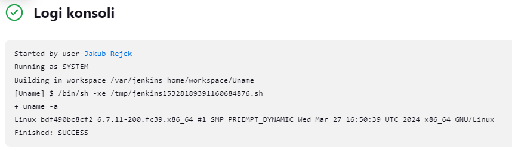
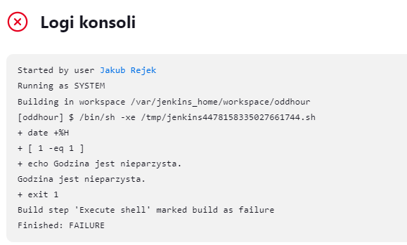
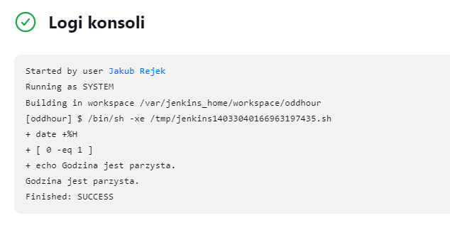
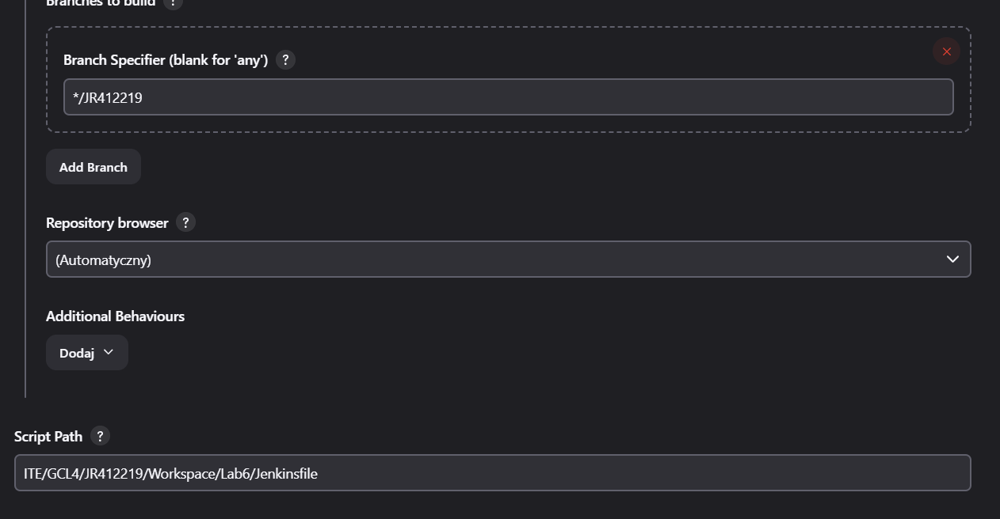

# Zajęcia 05-07
---
### Przygotowanie
Na rzecz budowy pipelinu skorzystąłem z "To do List" z poprzedniej części laboratorium.
Po upewnieniu się, że obrazy budujący i testujący dla TDWA z zajęć 3 działa poprawnie rozpocząłem przygotowanie kontenera dind oraz bluocean. Kontener bluocean jest wariacją na temat klasycznego Jenkinsa który "ułatwia" z nim pracę co nie oznacza, że gdy go zobaczyłem chciałem z nim pracować. Po jego pierwszym uruchomieniu nie skorzystąłem z GUI blueocean do końca laboratoriów.
Kontener `dind`, czyli docker in docker jest kontenerem, który eksponuje demona dokerowego dla Jenkinsa dzięki czemu możemy z niego skorzystać w pipelinie.
By przygotować obraz dind skorzystałem z instrukcji pobrania i instalcji na stronie Jenkinsa.
Najpier należało uitworzyć sieć Jenkinsa w ramach których będą komunikować się dind i Jenkins.
Skorzystąłem z polecenia dockera:
```BASH
docker network create jenkins
```  
Następnie uruchomiłem kontener dind skopiowanym ze strony z instrukcją instalcji komendą.
```BASH
docker run \
  --name jenkins-docker \
  --rm \
  --detach \
  --privileged \
  --network jenkins \
  --network-alias docker \
  --env DOCKER_TLS_CERTDIR=/certs \
  --volume jenkins-docker-certs:/certs/client \
  --volume jenkins-data:/var/jenkins_home \
  --publish 2376:2376 \
  docker:dind \
  --storage-driver overlay2
```
Zgodnie z opisem poszczególnych argumentów polecenia możemy zauważyć, że kontener zostaje podpięty do sieci jenkins, posiada nadany alias sieciowy przez który bedzie wywoływany oraz woluminy na których znajdą się pliki należące do kontenera Jenkinsa oraz configuracyjne i logi z pracy demona. Kontener zostanie również usunięty w momencie wyłączenia maszyny wirtualnej przez co trzeba pamiętać o uruchamianiu demona przy każdorazowym przystapieniu do pracy z Jenkinsem.

Następnym krokiem było przygotowanie obrazu blueocean. Tak jak wspomniałem we wstępie nigdy z niego nie skorzystałem pomimo że podobno ułatwia pracę z Jenkinsem. Nie mówię że ta nie jest ale, gdy zrozumiałem czym jest zdążyłem przyzwyczaić się do oryginalnego interfacu użytkownika Jenkinsa. Sam nie przepadam za reskinami których celem jest "upraszczanie pracy" poprzez ograniczenie dostępnych opcji.
By przygotowac obraz blueocean należało sporżadzić dockerfile o nastepującej treści również załaczony w instrukcji instalacji Jenkinsa.
```Dockerfile
FROM jenkins/jenkins:2.440.3-jdk17
USER root
RUN apt-get update && apt-get install -y lsb-release
RUN curl -fsSLo /usr/share/keyrings/docker-archive-keyring.asc \
  https://download.docker.com/linux/debian/gpg
RUN echo "deb [arch=$(dpkg --print-architecture) \
  signed-by=/usr/share/keyrings/docker-archive-keyring.asc] \
  https://download.docker.com/linux/debian \
  $(lsb_release -cs) stable" > /etc/apt/sources.list.d/docker.list
RUN apt-get update && apt-get install -y docker-ce-cli
USER jenkins
RUN jenkins-plugin-cli --plugins "blueocean docker-workflow"
```
Następnie obraz został zbudowany i uruchomiony poleceniami:
```BASH
docker build -t blueocean -f Blueocean.Dockerfile .
docker run \
  --name jenkins-blueocean \
  --restart=on-failure \
  --detach \
  --network jenkins \
  --env DOCKER_HOST=tcp://docker:2376 \
  --env DOCKER_CERT_PATH=/certs/client \
  --env DOCKER_TLS_VERIFY=1 \
  --publish 8080:8080 \
  --publish 50000:50000 \
  --volume jenkins-data:/var/jenkins_home \
  --volume jenkins-docker-certs:/certs/client:ro \
  myjenkins-blueocean:2.440.3-1 
```
Ponownie w poleceniu uruchomienia kontenera widzimy że został on podpiety do tej samej sieci mostkowej co dind oraz zostął mu wskazany port na którym nadaje demon dockerowy. Zostały podpięte również voluminy w których Jenkins będzie mógł gromadzić swojej pliki oraz logi z pracy projektów przez to że zostały one zmapowane na voluminy w razie awarii kontenerów dind lub Jenkins na voluminach powinny pozostac pliki configuracyjne pipelinów oraz logi. 

Jenkins nadaje swoją usługę na porcie 8080. Korzystajać z polecenie `ip addr` wewnątrz interkatywnie uruchomionego kontenera Jenkinsa (`docker container exec -it <container> ./bin/bash`) ustaliłem na jakim adresie znajdę usługę Jenkinsa. Podając adres maszyny oraz port w przeglądarce w formacie *[addr]:[port]* uzyskałem dostęp do usługi Jenkinsa. Przed przejściem do przeglądarki i przypadkowym ubiciem kontenera z Jenkinsem skopiowałem do schowka początkowe hasło admina dla usługi Jenkinsa któe uzyskałem wypisując zawartość wskazanego w instrukcji konfiguracji pliku w kontenerze Jenkinsa.
```BASH
sudo cat /var/lib/jenkins/secrets/initialAdminPassword
```
Oczywiście powyższe polecenie musi zostać wywołane wewnątrz interaktywnie pracująceog kontenera Jenkinsa. Wrazie gdyby konfiguracja się nie powiodła lub zostało zpomniane hasło możemy usunąć zawartość katalogu na który zmapowany został volumin z plikami Jenkinsa by przywrócić Jenkinsa do stanu fabrycznego i początkowej konfiguracji.
Po wstepnym logowaniu przy pomocy uprzednio pozyskanego hasła przeprowadziłem konfigurację swojego konta które miało pełne uprawninia admina oraz znacznie przyyjazne do zapamiętania hasło.
  
### Uruchomienie 
Pierwsyzm krokiem wprowadzajacym do pracy z Jenkinsem było utworzenie pierwszego projektu który zwracał wynik polecenia `uname` oraz drugi, który zwracał błąd, gdy godzina była nieparzysta.
W przypadku pierwszego w konfiguracji projektu należało wybrać "Uruchomienie powłoki" i przekazać polecenie do wykonania czym w naszym przyypadku był `uname -a`.
Po uruchomieniu projektu uzysakłąem następujący wynik oraz potwierdzenie poprawności uruchomienia.

Drugi projekt był o kilka linijek dłuższy ale również skaładał się na Uruchomienie powłoki oraz wykonanie prostego skryptu Bash który porównywał oprację modulo na godzinie i wykonywał if statement na jego podstawie.

Skrypt wyglada następująco:
```BASH
if [ $(( $(date +%H) % 2 )) -eq 1 ]; then
    echo "Godzina jest nieparzysta."
    exit 1
else
    echo "Godzina jest parzysta."
fi
```
Poniżej wynik uruchomienia o nieparzystej i parzystej godzinie.

  

  Na powyyższych zrzutach widzimy jak Pipeline może zostać wysterowany zarówno rpzez polecenia i wyrażenia logiczne w Jenkinsfile ale również przez skrypty które zwracając kod błędu zakończą wykonanie pipelinu również z błędem.


Ostatnim etapem z wprowadzenia do Jenkinsa było przygotowanie "Prawdziwego projektu" który zaciąga nasze repo przedmiotowe a następnie wykonuje checkout na moją personalną gałąź i wykonuje build i test zgodnie z zawartością Dockerfilów z labu nr 3.
Z perspekwty czasu wydaje mi się że autorowi instrukcji chodziło o utworzenie pierwszego pipelinu, który będzie zdefiniowany jako Jenkinsfile lub przynajmniej konfiguracja jako opis kroków w piplinie.
Ja jednak postawiłem na proste przejście prze wywołania poleceń w terminalu. Podbnie jak w przypadku poprzednich punktów utworzyłem nowy projekt i w konfiguracji ustawiłem uruchomienie powłoki jako definicję kroku budowania. Powłoka nastepnie wykonywała serię poleceń zgodnie z treścią poniżej:
```BASH
git clone git@github.com:InzynieriaOprogramowaniaAGH/MDO2024_INO.git Repo
cd Repo
git checkout JR412219
cd ITE/GCL4/JR412219/Workspace/Lab3/TDWA 
ls
docker build -t tdwabuild -f TDWAbuild.Dockerfile .
docker build -t tdwatest -f TDWAtest.Dockerfile .
cd ~ && rm -rf Repo
```
  Na tym etapie zrozumiałem, że godzina systemu na maszynie wirtualnej z której korzystałem i z której godzinę zaciągał docker i jego kontenery była błędna pomimo konfiguracji dla naszego regionu. Założyłem że wynikało to z faktu, że przez pewien czas maszyny nie wyłączałem a jedynie zapisywałem stan a godzina była aktualizowana przy uruchomieniu systemu.

### Pipeline
Pipeline został oparty o apliakcaje ToDoWebApp (TDWA) któego konteneryzopwałem na potrzeby labboratorium 3. Projekt oparty jest na Node-dzie dlatego poszczególne kroki nie prezentowały się zbyt wymagająco. Zgodnie z założeniami przebiegu diagramu ustalonego w porozumieniu z prowadzącym pipline miał skłądać się na poniższe etapy:
-Checkout - Zaciągający dockerfile z mojej gałęzi naszego repozytorium.
-Build(tylko z nazwy) - Zdefiniowany w Dockerfilu etap kopmozycji oprogramowania, instalujący dependencje dla naszego projektu.
-Test - Etap uruchamiający dockerfila wywołującego zaimplementowane testy jednsotkowe kodu.
-Deploy(Connectivity test) - etap który miał sprawdzić czy uruchomiona aplikacja (wogóle się uruchamia i) postuje na wskazanym w projekcie porcie usługę którą jest cała apliakcja ToDo. Etap ten angażuje dodatkowy kontener curl-a, który wykonuje dla nas test łączności z usługą wewenatrz dedykowanej sieci.
-Publish - w którym tworzone jest (jeśeli już nie istnieje) lokalne repozytorium Node na którym publikowana jest nowa wersja pakietu instalacyjnego aplikacji. Nie kontrolowałem użeteczności powyższego rozwiazania ale mapując lokalne repozytorium na volumin na maszynie(hoście) powinniśmy móc uruchomić usługe repo na hoście i uzyskać dostęp do "artefaktu" który zostął przez nas wygenerowany po zakończeniu pipelinu.

#### Opis poszczególnych stagów oraz całego pipelinu.
Budowa pipelinu zajęła mi ponadplanowe kilka tygodni, ale w tym czasie udało mi się zebrać pewne wnioski i napotkać problemy, które udało mi się rzowiązać(prędzej obejść) w celu uzyskania porządanego efektu i którymi chętnie się podzielę.

Checkout - Stage:
Checkout odpowiada za zaciągnięcie zawartości mojej gałęzi na której znajdują się wymagane Dockerfile. Na początku  wywołuje się skrypt który oczyszcza workspace z pozostałości poprzednich wykonań oraz czyści dockera by zwolnić trochę pamięci. Finalnie przeniosłem te czynności do POST Action po Publish.
```groovy
stage('Checkout') {
            steps {
                sh '''
                #!/bin/bash
                docker system prune -f
                docker image prune -f
                docker container prune -f
                rm -rf ITE
                '''
                git branch: 'JR412219', url: 'https://github.com/InzynieriaOprogramowaniaAGH/MDO2024_INO.git'
            }
        }
```

Build - Stage:
Etap builda został opisany jako wywołanie builda przez demona dockerowego w dind. Ze względu na to, że z perspektywy pipelinu widać jedynie nazwę dockerfile-a omówię go w nastepnej kolejności. Z perspektyw Jenkinsa, stage zostanie zakończony sukcesem i przejdzie dalej gdy demon dockera zwróci image "tdwabuild" inaczej kończąc pracę z kodem wyjącia 0. Nie ma tu dodatkowych warunków przepływu lub dodatkowej funckjonalności. Całość wyglada tak samo jak w przypadku "Task3"
```groovy
 stage('Build') {
            steps {
                dir('ITE/GCL4/JR412219/Workspace/Lab3/TDWA'){
                    script{
                        docker.build('tdwabuild','-f TDWAbuild.Dockerfile .')
                    }
                }
               
            }
        }
```
Stage opisany jest w jednym bloku skryptu który zaiwera obiektowe odwołanie do polecenia dockera. Sposób tego zapisu zauważyłem gdy przeglądałem branche osób któe wykoanały laboratoriumw temacie. Taki sposób zapisu pozawala wykorzystać obiekty kontenerów/obrazów do ich wywoływania zamiast posługiwania się bezwględnie ustalonym tagiem. Uniemożliwiło to jednak przekierowanie wyniku wywołania polecenia shellowego prosto do pliku z logiem. 
Dockerfile wykorzystany w tym stage-u podobnie jak testowy został opracowany na potrzeby Lab 3 i nie był modyfikowany.

```Dockerfile
FROM fedora:39

WORKDIR /root

RUN dnf update -y && dnf install -y nodejs git
RUN git clone https://github.com/devenes/node-js-dummy-test TDWA

WORKDIR /root/TDWA/node-js-dummy-test

RUN npm install
```
Dockerfile bazując na fedorze 39 przygotowuje się do instalacji pobierając narzędzia potrzbene do zaciągnięcia aplikacji z repo oraz wykoanania instalcji. W przypadku apliakcji nodeowych nie musimy przejmować się wieloma rzeczami na raz gdy isntalujaemy aplkację; Node wykona większość roboty za nas o ile autor dobrze przygotował projekt.
- W alternatywnej wersji przygotowałem kontener nalerzący do Checkout-u, podobnie jak w trakcie lab 3 zaciągał repo na volumin a dopiero osoby kontener builda korzystając z zawartości teog voluminu dokonywał "build aplikacji". Zrezygnowałem z tego podejscia ponieważ wymagała zabawy w zarządzanie voluminami (usuwanie ich, tworzenie i podpianie) za każdym przejście a korzyść płunąca z ich użycia była nikła nie poprwaiajac znacząco objętości ani prędkoći wykoania rozwiązania.
- Logi z wykonania demona (dind) w pierszej wersji były przekierowane bezpośrednio do pliku "*log" który był nazywany zgodnie z numerem wywołania pieline-u jednak w tym wariancie pojawiły się pewne problemy które propagowały w każdym etapie piplinu. Gdy tworzyłęm strumień syjściowy do pliku, który miał przekierowac wynik wykonania demona do pliku nazwanego od nazwy etapu oraz numeru wywyołania pipelinu pojawił się problem z odczytem zmiennej środopiskowej ``env.BUILD_NUMBER`` w którym przechowywany jest ID uruchominia pipelinu. Szybki wgląd w dokumentację i konsulatcja z copilotem i gpt by dowiedzieć się, że problem wynika ze sposobu uzyskania dostępu do zmiennych charakterystycznych dla BASH-a: ``${var}`` - by usunąć ten bła dodałęm bezwzględne uruchomienia bin/bash na poczatku każdego skryptu
-By móc dobrać się do logów pod koniec wykoania pipelinu postanowiłem dodać wywoałanie polaecenie dockera ``docker logs`` dzięki czemu moźemy zrzucić logi demona do wybranegop pliku w kontenerze dind. Jeżeli chcemy uzyskać do nich dostęp na hoście do kontenera dind możemy podpiąć volume, który zostanie zmapowany na lokalizację do której przekierujemy logi. Pominąłem ten etap ponieważ rozwiazanie to wiązało się ponownie z problemem odwołania do zmiennych wewnątrz pipelinu. Gdy rzowiązałem problem z odwołaniem do zmiennych pipeline nie był w stanie przekierować wyniku do pliku skarżąc się na nie istniejącą lokalizację wykonania. Gdy przed przekierowaniem logu utworzyłem plik podpowiadający nazwą do przekierowania z ``docker logs`` -> 'dockerlogs${env.BUILD_NUMBER}.log' program nie był wstanie go zlokalizować i kończył się błędem. Do dalszego zwalczania błędów ze znakowaniem wersji zniechęcił mnie fakt, że by czekać na efekt przejścia pipelinu czekałem po kilka minut za każdym razem, gdy wprwadzałem w nim zmiany. Było to związane z ograniczoną aktywnością agenta budującego dla Node przez kończące się miejsce na dysku maszyny(hosta) oraz dziwnego zachowanie wynikającego z uzycia ścieżki work__directory po przez obszar ``dir(<Path>){}``, gdy ścieżka była definiowana jako obszar ścieżki roboczej Stage budujący potrafił trwać od 1 min 16s <-> 3min. Gdy zmieniłem ścieżkę na względną w miejscu wskazania plku stage wykonywał się w przedziale 2s<->7s.

Zestawienie obu zapisów:
## 1
```groovy
script{
docker.build('tdwabuild','-f ITE/GCL4/JR412219/Workspace/Lab3/TDWA/TDWAbuild.Dockerfile .') // wykonywujący się w 2-7 sekund.
}
```
## 2
```groovy
dir('ITE/GCL4/JR412219/Workspace/Lab3/TDWA'){
                    script{
                        docker.build('tdwabuild','-f TDWAbuild.Dockerfile .') // wykonujący się w 1:16 - 3 min
                    }
}
```
Nie udało mi się ustalić co powoduje tą różnicę zwłaszcza, że nie jest ona pomijalna.

(Oczywiście odkryłem to przez przypadek walcząc z innym błędem stosunkowo późno w trakcie prac nad pipelinem)

## Test - Stage
Bliźniaczy do builda krok bazujący na obrazie przygotowanym w ramach labów 3. W tym przypadku forma zapisu nie wpłynęła na wykonanie ale testy te wykonują się na tyle szybko, że różnica była by pomijalna niezależnie od podejścia.
```groovy
stage('Test') {
            steps {
                 dir('ITE/GCL4/JR412219/Workspace/Lab3/TDWA'){
                     script{
                     docker.build('tdwatest', '-f TDWAtest.Dockerfile .')
                     }
                 }
            }
        }
```
Testy były jednymy stagem w pipelinie, który zachowywał się przewidywalnie i nie generował błędów w żadnej implementacji skryptu. W ramach poprawienia czytelności spróbowałem wysterować pipeline by ``grep``-em ze strumienia zbierał ilość poprawnie wykoannych testów i zestawiał je jako procent na terminal pipelinu. Nie było to jednak roziwązanie idealne, ponieważ niepotrzebnie wprowadzał dodatkowe elementy, które wydłużały stage i uprzykszały prototypowanie pipelinu.

## Deploy - Stage

Deploy służy sprwadzeniu czy aplikacja po uruchomienu rzeczywiście udostępnia usługę i możliwa jest komunikacja. W ramach tego  stage-a wykonałem kilka prototypów których przetestowanie i modyfikacja zajęła stanowczo za długo. Zamiast wywalić zbędne stage z config-a i pozostawienie bez czyszczenia potrzebnych obrazów w workspacie, każdą jedną iteracje na tym stage-u wykonywałem na żywym piplinie czekajac każdorazowo na wykonanie wszystkich poprzednich stagów tylko po to by dowiedzieć się ze zrobiłem liteówkę lub zgubiłem argument wywołania.

```groovy
stage('Deploy') {
            steps {
                script {
                    //Tworzymy siec do przeprowadzenia testu łączności.
                    sh 'docker network create deploy || true'
                    //Uruchamiamy petenta
                    def TDWA = docker.build('tdwadeploy', '-f ITE/GCL4/JR412219/Workspace/Lab3/TDWA/TDWAdeploy.Dockerfile .')
                    def container = TDWA.run("--rm -d -p 3000:3000 --network=deploy --name tdwa")
                    //Uruchamiamy kontener curla by wykonć test łączności
                    sh 'docker run --rm --network=deploy curlimages/curl:latest -L -v  http://tdwa:3000'
                    //Czyszczenie
                    sh 'docker stop tdwa'
                    sh 'docker container rm tdwa'
                    sh 'docker network rm deploy'
                    sh 'docker rmi tdwadeploy'
                }
            }
```
Kontener TDWAdeploy uruchamiamy w trybie detach by nie zablokował pipelinu po uruchomieniu aplikacji i eksponujemy port aplikacji ``3000`` do sieci dockerowej **delpoy**. Przy uruchomieniu kontenera podpinamy sieć **deploy**, która służy nam do testu łaczności. Polecenia tworzenia sieci deploy jest doposażone w przekazanie true ze względu na to, że pomimo bezpośrredniego wywołania usunięcia jej po każdym przejściu testu pipeline, czasami, zwracał bład wskazujący na to, że sieć już istnieje. Do tej samej sieci zostaje podpięty kontner curl uruchamiany w trybie gadatliwym by można było zobaczyć efekt testu w konsoli pipelinu oraz podajac jako łącze docelowe nazwę anszego kontenera oraz port na którym curl powinien spróbowac nasłuchać aplikacji. Po przejściu testu łacznosci sprzątamy zasoby które nie będą juz nam potrzebne. W moim przypadku było to o tyle wazne że maszyna pracowała na pograniczu mam Mb nie mam Mb.
-Alternatywnie można skrzystać z wywołań progrmaó bezpośrednio w piplinie, które sprawdzą czy coś nadaje na porcie apliakcji np: nc Musimy wtedy zadbać o możliwość komunikacji między sicią kontenera tdwa a kontenerem Jenkinsa. Przyypominam że pracujemy z dind co sprawia że musimy wyciągnąć ten port z dockera uruchomionego w dockerze by móc się do niego odezwać.

## Publish - Stage

Ostatni elemt pipelinu to przygotowanie artefaktu i jego "publikacja". Artefakt powinien być wersjonowany posiadając odpowiednią sygnaturę wersji. Wraz z prowadzącym laboratorium ustaliłem wymagania dla mojego projektu które zkłądały użycie ``npm publish`` jako kluczowy krok tego stage-a. By wykonać publish musiałem posiadać uprawnienai npm dlatego porzuciłem myśli o szybkim i prostym wywołaniu npm publish. Podejście musiało być zmienione.
```groovy
stage('Publish') {
            steps {
                script{
                sh 'docker network create publish || true'
                sh'''
                docker run --network=publish --name verdaccio -d -p 4873:4873 verdaccio/verdaccio || docker start verdaccio
                '''
                def publishImg = docker.build('tdwapublish', '-f ITE/GCL4/JR412219/Workspace/Lab3/TDWA/TDWApublish.Dockerfile .')
                def container = publishImg.run(" --network=publish --name tdwa")
                sleep 5;
                sh 'docker stop tdwa'
                sh 'docker network rm publish'
                }
            }
        }
```
Obranym przezemnie rozwiazaniem było stworzenie lokalnego repozytorium Node. Użyłem narzędzia verdacio które stawia repozytorium jako usługę domyślnie na porcie **4873**.
-W pierwszym podejściu spróbowałem wykorzystac bat i pominąć użycie dockerfile-a w publishu lecz nie udało mi się doprowadzić go do skutku.
-Drugie podejście na którym finalnie stanęło zawierało dockerfile, który bazując na obrazie budującym może w ramach swojego endpointu wygenerować nazwę wersji będący datą zakończenia pipelinu w formacie: "jr-yyyy-mm-dd" autoryzajca na repo oraz ostateczny publish.
Kontner z repozytorium lokalnym oraz kontener publikujący trafiają ponownie do jednej sieci a kontener publikujący dokonuje publish po uruchomieniu.
```Dockerfile
FROM tdwabuild

WORKDIR /root/TDWA

CMD npm version jr-$(date +%Y-%m-%d) --no-git-tag-version & npm adduser --registry http://verdaccio:4873 & npm publish --registry http://verdaccio:4873
```
Nie jestem dumny z tego jak wygląda to wywołanie ale na tym etapie liczyło się dla mnie jedynie to, że pipline działa.
W ten właśnie sposób pipeline kończy pracę i czyści workspace ze zbędnych elementów dockerowych oraz plików.

Na koniec zamieszczam całokształt skryptu configurujacego pipeline.

```groovy
pipeline {
    agent any

    stages {
        stage('Checkout') {
            ...
        }
        stage('Build') {
            ...
        }
        stage('Test') {
            ...
        }
        stage('Deploy') {
            ...
        }
        stage('Publish') {
            ...
        }
    }
    post {
            always {
                // Czyszczenie po zakończeniu
                sh 'docker system prune -af'
                sh 'rm -rf ITE'
            }
        }
}
```
## Przekazanie Jenkinsfile do Jenkinsa:
Plik Jenkinsa po umieszczeniu na repo może zostać wskazany w konfiguracji pipelinu jako śródło skryptu i zaciągany za każdym razem gdy uruchamiany jest pipeline. Postanowiłem pracowac na prywatnym repo ze względu na iość napotkanych trudności a nie chciłem pisać aliasów tylko po to by co minutę pushowac plik z pojedynczą zmianą w kodzie.

Finalnie w ustawieniach piplinu znalazło się ansze repo na którym umiesciiłem finalną wersję Jenkinsfila.

## Wnioski

Praca z piplinem jest ciekawa ale odniosłem wrażenie, że pomimo włożonych wielu godzin w czytanie dokumentacji i zapoznanie się z wieloma implementacjami piplinów Jenkinsa nadal nie czuję się pewnie i nie do końca rozumiem błędy, które napotkałem. W większosci przyypadków, gdy problem nie dawał się rozwiązać kończyło się na zmianie strategi lub ponownym przpisaniu fragmentu tak by uniknąć danego problemu. Na pewno przekrój sprawozdań inych osób pomógł mi bardziej zaznajomić się z technologią lecz nadal mój pipline jest daleki od tego co chiałbym z nim osiagnać. Zostawiam go w stanie takim jakim jest ponieważ muszę zająć się nadrobieniem zaległości z pozostałymi dwoma sprawozdaniami.