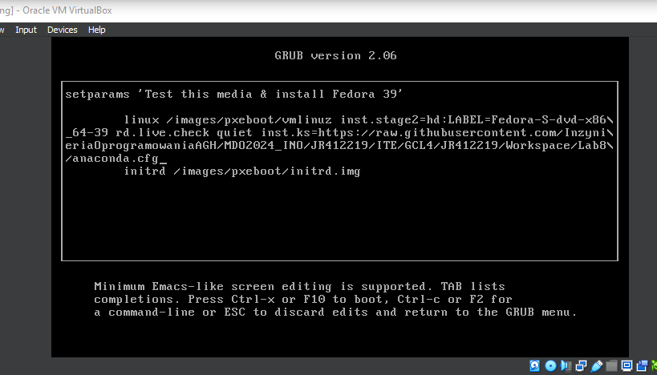
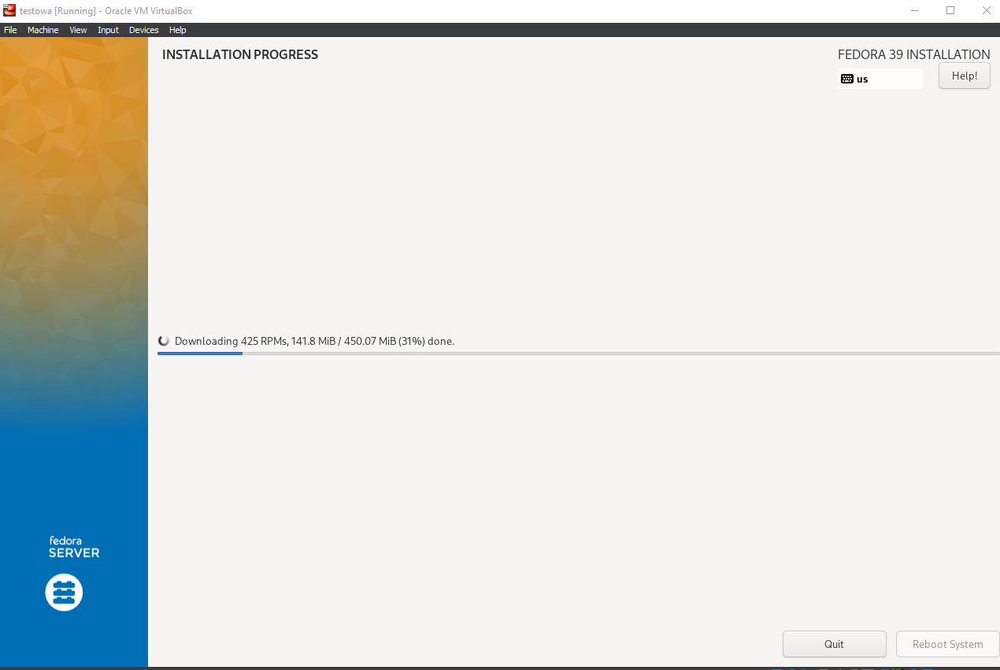
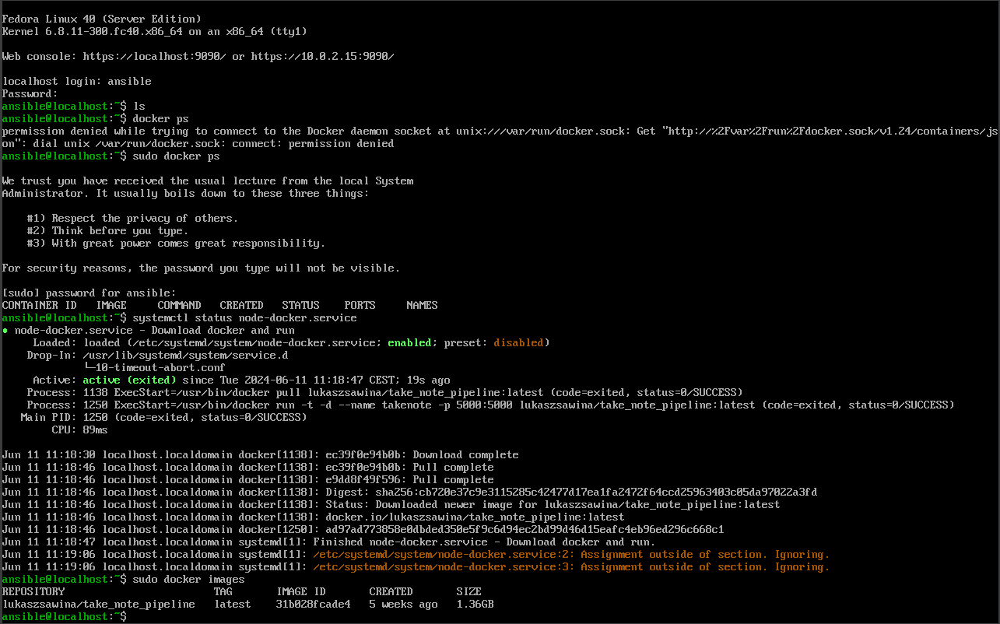

# Sprawozdanie 4 - Lab 8-9
## Jakub Rejek 412219

### Przygotowanie wstępne:

W celu wykonania laboratorium należy przygotowac dodatkową maszynę, która będzie wykonywać zlecone przez nadzorce zadania. Zgodnie z instrukcją przeprowadziłem instalację maszyny z tego samego obrazu co maszyna nadzorcy (FedoraServer). Po przejsciu przez proces instalacji w którym maszyna otrzymała bazowe konto admina(może być to trochę mylące, ale konto admina na maszynie celu nazywa się 'nadzorca'), należy zapewnić by obie maszyny posiadały wymagane oprogramowanie.

W przypadku maszyny **celu**:
- tar
- sshd (openssh)

W przyapdku **nadzorcy**: 
- ansible

Możemy sprawdzić czy programy są zainstalowane wywołując ``<program> --help`` lub wykonując instalację. Jeżeli program jest już zainstalowany zwróci informację że manager nie miał nic do roboty.
By dokonać instalcji wywołujemy menadzera pakietów odpowiednigo dla naszego systemu; w przypadku Fedory ``dnf`` z poleceniem instalcji dla wszystkich wymaganych programów:

```BASH
dnf install tar sshd
```
(Bedzie wymagana autoryazacja **sudo**)

Maszyna celu otrzymuje nowe konto użytkownika któremu nadajemy hasło oraz podpinamy uprawnienia grupy "wheel" która pozwoli między innymi wykonywać polecenia "superusera" bez podawania słowa kluczowego sudo.

```BASH
sudo useradd oversear
sudo passwd oversear
sudo usermod -aG wheel ansible
```
Maszyna nadzorcy jest bliźniaczą do wykorzystywanej na wszystkioch laboratoriach maszyną posiadającą dodatkowe oprogramowanie ułątwiające pracę (np. lepsza powłoka).

Nadajmy maszyną hostnamy by było je łatwiej rozpoznać i nie musieć podawać adresu przy łączeniu się przez ssh.
```BASH
sudo hostnamectl set-hostname <hostname>
hostname
```
hostname - powinien wyświetlić nadany hostname jeżeli wszystko zrobiliśmy poprawnie.

Otwieramy plik **/etc/hosts** przy pomocy **NANO**
Pod istniejącymi już listingami hostów dla DNS dodajemy adres maszyny w sieci po którym podajemy nadany hostname
```
<addr> <hostname>
np:
127.0.0.2 ansible-target
```

Wyłączamy maszyny i wchodzimy w configurację sieciową w środowisku wirtualizacji(Dla mnie VirtualBox).
``Tools>Network``

Po otworzeniu zakąłdki z managerem adapterów sieciowych tworzymy nowy adapter sieciowy który posłuży nam za wspólne podpięcie dla wszystkich maszyn na których pracujemy. (Trzeba pamiętać o aktywacji serwera DNS dla adaptera).
Nastepnie dodajemy utworzony adapter jako drugi adapter wszystkich maszyn na których będizemy pracować i między którymi chcemy wymienić informację.

Adapter ustawiamy jako HostOnly z przyzwoleniem łacznosci dla VM-ów. Dzięki temu adapterowi maszyny będą się widzieć w jednej sieci niezależnej od sieci NAT po której łączymy się z komputera. 

Przechodzimy do configuracji pierwszego adaptera dla obu VM-ów i dokonujemy przekierowania z adresu maszyny (możemy go poznać wywołujać ``ip addr`` na danej maszynie) na adres w sieci nat zgodnie z domyślną maską mamy dostep do ostatniego kjwartyla w adresie dlateog sugeruję nadać maszynom adresy z zakresu 1-5 
np: 127.0.0.2 dla targetu i 127.0.0.3 dla nadzorcy. Wszystkie amszyny domyślnie zgłaszają się na tym samym adresie w sieci NAT jest to najprostrzy sposób obejścia tego problemu, który dla mnie zadziałał. Jako port zarówno u hosta i gościa podajemy 22 (port ssh).

Następnie na obu maszynach genereujemy po jednym kluczu oraz w powłoce systemowej hosta(hosta maszyn - naszego komputera) generujemy również parę kluczy.
Powinnismy posiadać pary kluczy:
-ansible-target(na celu)
-ansible-nadzorca(na nadzorcy)
-vs-auth(na hoscie)
(nazwy, długosć, i typ szyfrowania wedle uznania)

Wykorzystywane polecenia.
```BASH
ssh-keygen -t <type> -b <bitlength> -f ~/.ssh/<name>
ssh-copy-id -i ~/.ssh/<name>.pub <user>@<host>
```
``ssh-copy-id`` służy przekazaniu kluczy publicznych do miejsc w których chcemy autoryzowac się z ich pomocą. Korzystając z hostname-ów ustalonych wcześniej na każdej z maszyn wymieniamy klucze w oba kierunki ze storny celu do nadzorcy i vice versa. (Klucz autoryzacji z nadzorcy do targetu jest konieczny dla pracy ansible w drugą stronę przydaje się jeżeli chcemy przerzucić jakieś pliki w obu kierunkach.)
W przypadku hosta przekazujemy ten sam klucz publiczny do obu maszyn(nie róbcie tak w pracy) korzystając z nadanych im adresów na NAT i kont na których pracujemy.

Zostaniemy poproszeni o zalogowanie na końcie na który chcemy przekazac ID.

**(opcjonalne)** Teraz otwieramy plik konfiguracyjny .ssh/config dla VS Code na hoście i dodajemy hostname odpowiadających wszystkim maszynom do terminala których chcemy mieć dostęp. Można zainspirować się konfiguracją dla oryginalnej maszyny. Przypominam że nie musicie tworzyć nowej maszyny nadzorcy jeżeli wasza dotychczasowa maszyna nadal działa.
Jeżeli wszytko wykonaliśmy poprawnie to w tym momencie możemy wykonąc połaczenie za pomocą remoteExplorera w VSCodzie by uzyskać dosep do terminalów i ssytemów plików na obu maszynach. Nie musimy korzystać z NANO do edycji plików.

Sprawdzamy możliwość podpięcia się do **durgiej** maszyny w obu kierunkach, bez hasła:
```BASH
ssh <user>@<hostname>
```
Jezeli mamy poprawnie nadane hostnamy dla obu maszyn oraz poprawnie przekazaliśmy klucze publiczne powinniśmy zobaczyć **znak zachęty** z drugiej maszyny.

**(Ze względu na ilosc problemów które napotkałem w trakcie configuracji samego środowiska do pracy nie wykonałem zbyt wiele zrzutów ekranów z części wstępnej.)**

## Ansible - Inventory

Ansible korzysta z pliku inwentarza który okresla nadzorcę oraz wszytkie endpointy czyli wykonawców zleconych przez niego czynności.
Inwentarz umieszczmy w pliku o rozszerzeniu *.yaml lub *.ini oba będą odczytane w ten sam sposób:

```yaml
[Endpoints]
ansible-target

[Orchestrators]
oversear
```

By sprawdzić czy inwentarz został poprawnie napisany wywołujemy Ansible-wego pinga.
```BASH
ansible -i inventory.yaml all -m ping
```


Gdyby zdarzyła się sytuacja, że wywołując ansible nie może on uzyskać uprawnień do maszyny nadzorcy czyli tej na której pracuje. Najprostrzym rozwiązaniem jest wygenerowanie klucza na nadzorcy podobnie jak powyżej i wysłanie go na adres 0.0.0.0 na konto nadzorcy. Po tym wszytko powinno przechodzić.

## Ansible - Playbook

Gdy mamy działający inwentarz moży przygotować playbooka. Dzięki niemu możemy zlecić polecenie do inwentarzu i podzieliś je na porządane kroki. Niestety pliki *.yaml są whitespace sens więc poszukiwanie błędów może być problematyczne.

Naszym zadaniem jest przygotowanie playbooka, który wykona pinga na inventory następnie przekaże plik inwentarza na wszystkie endpointy, zaktualizuje pakiety sytemowe i zresetuje usługę ssh. Wszytkie zadania sa podzielone w taski i ich parametry.

```yaml
- name: FullPlaybook
  hosts: Endpoints
  remote_user: oversear
  become: yes

  tasks:
    - name: Ping
      ansible.builtin.ping:

    - name: Copy file with permit
      ansible.builtin.copy:
        src: ./inventory.ini
        dest: /home/ansible/inventory.ini
        owner: ansible
        group: ansible
        mode: u=rw,g=r,o=r

    - name: Update packages
      ansible.builtin.dnf:
        name: "*"
        state: latest

    - name: Restart SSH
      ansible.builtin.service:
        name: sshd
        state: restarted
```
Jest to drugie wywołanie polecenia po pierwszym miałem awarię i straciłem zrzut ekranu z pierwszego wykonania:

Pierwsze wyywołanie różni się oznaczeniem "Changed" przy zadaniu "Update"; stan maszyny zmienił się po tym zadaniu o czym Ansible nas informuje, jeżeli Ansible nie wprowadza żadnych zmian w endpoitcie status zwracany to "OK".

Jeżeli usługa SSH zostanie wyłączona lub maszyna umrze w między czasie efektem wykonania playbooka będzie FATAL z komunikatek błędu odpowiednim dla ssh. 

Następnym etapem było przygotowanie playbooka, który pobierze artefakt z naszego pipelinu z poprzednich laboratoriów i zainstaluje go na endpoincie. Problem pojawił się z uzyskaniem dostepu do artefaktu na nowych maszynach nie wazne jak chciałem przekazać repozytorium loklane, które siedzi na maszynie Jenkinsowej nie byłem w stanie zmusić node-a do pobrania pakietu z tamtego miejsca. Ze względu na rosnące zaległości postanowiłem skorzystac z programu znajomego, który został umieszczony na docker hubie.

By nasz playbook mógł tego dokonać dopisujemy do nieog poniższe zadania:
```yaml
- name: Pobierz Docker
      ansible.builtin.dnf:
        name: docker
        state: latest

    - name: Aktywuj usługe deamona
      ansible.builtin.service:
        name: docker
        state: started

    - name: Ukradnij obraz od kolegii bo nie chcesz walczyc z wlasnym archiwum node-a
      command: docker pull lukaszsawina/take_note_pipeline

    - name: Run detached obraz aplikacji
      command: docker run -d -p 5000:5000 --name=app lukaszsawina/take_note_pipeline
```


By aplikacja była widoczna w przeglądarce hosta mapujemy port z usługą na ten sam port ale w adresacji hosta.

Możemy teraz odwołać się do maszyny na wskazanym porcie i zobaczyć działającą aplikację na maszynie endpointowej

Gdy mamy już działającą usługę możemy skrzystać z dostepu do konsoli na celu i ubić ją lub usunąć. W następnych krokach dodamy automatyczne usunięcie przy ubiciu oraz rolę ubijającą kontener z aplikacją po jej uruchomieniu.
## Ansible - Role
Mamy juz gotowy playbook który spełnia swoje zadanie. Teraz możemy ubrać go w role galaxy. W tym celu inicjalizujemy nową rolę poleceniem:
```BASH
ansible-galaxy init <name>
```
W ten sposób uzyskamy nową strukturę katalogów odpowiadającą nowo utworzonej roli.
Tworzymy nowy playbook o poniższej zawartości:
```yaml
- name: AppInstall
  hosts: Endpoints
  remote_user: oversear
  become: yes
  roles:
    - my_role
```
Przenosimy wcześniej utworzone taski do pliku main.yml w katalogu tasks wewnątrz naszej roli:
```yaml
---
  # tasks file for my_role
- name: Zainstaluj Docker
  ansible.builtin.dnf:
    name: docker
    state: latest
    
- name: Uruchom demona dockerowego
  ansible.builtin.service:
    name: docker
    state: started
      
- name: Ukradnij obraz od kolegi bo nie chcesz walczyc ze swoim repozytorium node-a
  command: docker pull lukaszsawina/take_note_pipeline
      
- name: Run detached obraz aplikacji
  command: docker run --rm -d -p 5000:5000 --name=app lukaszsawina/take_note_pipeline
      #Wiemy ze działa wiec ubijamy kontenera na końcu by kontener nie wisiał
- name: Stop container
  command: docker stop app
```
Ponownie wywołujemy playbooka tym razem widzimy że każde zadanie jest przypisane do naszej roli.

Efektem pracy naszego playbooka jest działająca aplikacja na wszytkich endpointach w inwentarzu. (oczywiście musimy usunąć ostatnie zadanie by aplikacja pozostała uruchomiona)
## Instalcja nie nadzorowana
By przeprowadzić instalację nie nadzorowaną musimy najpierw uzyskać plik *cfg pochodzący z instalcji maszyny systemu z netinstall (pliki pobierane są w momencie instalcji z zasobu sieciowego). Oczywiście wybraliśmy ponownie fedore 39 i przeprowadziliśmy standardową instalację tworząc uzytkownika i nadając mu hasło oraz wybierając podstawowe parametry systemu (język klawiatura itd.). Po zakonczeniu instalcji w katalogu głównym możemy znaleść plik konfiguracyjny ujmujący wszystkie nasze wybory z graficznego instalatora systemu. Plik ten za pomocą ``scp`` należy wysłać na maszynę nadzorcy. Ponownie trzeba zadbać by maszyny wuidziały się w tej samej sieci.
Zwartość pliku instalacyjnego pod koniec tego laboratorium wygląda nastepująco
```cfg
# Generated by Anaconda 39.32.6
# Generated by pykickstart v3.48
#version=DEVEL
# Use graphical install
graphical

# Keyboard layouts
keyboard --vckeymap=us --xlayouts='us'
# System language
lang en_US.UTF-8

# Repository

url --mirrorlist=http://mirrors.fedoraproject.org/mirrorlist?repo=fedora-39&arch=x86_64
repo --name=update --mirrorlist=http://mirrors.fedoraproject.org/mirrorlist?repo=updates-released-f39&arch=x86_64

%packages
@^custom-environment
@container-management
@^server-product-environment
moby-engine

%end

# Run the Setup Agent on first boot
firstboot --enable

# Generated using Blivet version 3.9.1
ignoredisk --only-use=sda
autopart

# Partition clearing information
clearpart --all

# System timezone
timezone Europe/Warsaw --utc

# Root password
rootpw --iscrypted --allow-ssh $y$j9T$xN0VMOtPESTpvFUF8.qRVt5s$RAbf.fn4y.XKCkPhSIvZxuNz0IjPxG7ATBZNP4YQuh.
user --groups=wheel --name=ansible --password=$y$j9T$bnt.ZKurEBIy4VTKWu111xyZ$IfVGf5TlVzG4bURXYDTxfO4t0uXBY7JeUqDLjU3UxxD --iscrypted --gecos="Ansible User"

%post --erroronfail --log=/root/ks-post.log

cat << 'EOF' > /etc/systemd/system/node-docker.service

usermod -aG docker root
systemctl enable docker

[Unit]
Description=Download docker and run
Requires=docker.service
After=docker.service

[Service]
Type=oneshot
RemainAfterExit=yes
ExecStart=/usr/bin/docker pull lukaszsawina/take_note_pipeline:latest
ExecStart=/usr/bin/docker run -t -d --name takenote -p 5000:5000 lukaszsawina/take_note_pipeline:latest

[Install]
WantedBy=multi-user.target
EOF

systemctl daemon-reload
systemctl enable node-docker.service
systemctl start node-docker.service

%end

#reboot
```
Domyślnie plik ten nie zawiera pewnych sekcji które teraz omówię:

Dodanie mirrora ze źródłem sytemu:
```cfg
url --mirrorlist=http://mirrors.fedoraproject.org/mirrorlist?repo=fedora-39&arch=x86_64
repo --name=update --mirrorlist=http://mirrors.fedoraproject.org/mirrorlist?repo=updates-released-f39&arch=x86_64
```
By instaltor fedory nie pytał o źródło instalcji należy wskazać mu zdalny mirror z obrazem odpowiadającym wersji naszego systemu.

Instalacja pakietu moby-engine w celu uruchomienia dockera:
```cfg
@container-management
@^server-product-environment
moby-engine
```
W sekcji **packeges** zaraz pod wariantem pakietów systemowych dodajemy powyższe linijki które pozwola nam zrealizowac dalszą część instalcji.

Instalcja naszej aplikacji:
By móc dodać czynności które zostaną wykonanane przy pierwszym uruchomieniu/ po instalcji systemu dodajemy do pliku *.cfg sekcję post. Zawarty w niej skrypt wykona się po poprawnej instalcji systemu.
```cfg
%post --erroronfail --log=/root/ks-post.log

cat << 'EOF' > /etc/systemd/system/node-docker.service

usermod -aG docker root
systemctl enable docker

[Unit]
Description=Download docker and run
Requires=docker.service
After=docker.service

[Service]
Type=oneshot
RemainAfterExit=yes
ExecStart=/usr/bin/docker pull lukaszsawina/take_note_pipeline:latest
ExecStart=/usr/bin/docker run -t -d --name takenote -p 5000:5000 lukaszsawina/take_note_pipeline:latest

[Install]
WantedBy=multi-user.target
EOF

systemctl daemon-reload
systemctl enable node-docker.service
systemctl start node-docker.service

%end
```
W skrypcie ujmujemy polecenia dockerowe, które zaciągają i uruchamiją kontener z docker huba oraz użytkowników na endpointcie dla któych ma zostac wykonana cała operacja.
Na samym końcu pliku **cfg** dodajemy polecenie reboot które automatycznie zrestartuje maszyynę po zakończeniu instalcji.

Tak przygotowany plik cfg wrzucamy na dowolne repo (domyslnie nasze przedmiotowe) a nastepnie wchodzimy na githuba w przeglądarce i pozyskujemy surowe łacze wyświetlając zawartość pliku w wersji raw:


Takie łącze będzie nam potrzebne w następnym kroku.
## Wykonanie instalcji zdalnej
By wykorzystać utworzony plik musimy utworzyć nową maszynę i uruchomić ją z pliku rozruchowego podobnie jak w przypadku maszyny "wzornik" z którego popraliśmy plik konfiguracyjny do laboratorium. Po wyświetleniu się inicjalizatora instalcji zamiast wybrać opcję instalcji klikamy klawisz 'e' od razu zostaniemy przekierowani do edytora tekstowego. W miejsu po parametrze quiet dodajemy ``inst.ks=<link>`` w miejsce linka wrzucamy pozyskane w poprzednim kroku łacze do pliku konfiguracyjnego. Gdy upewnimy się, że wszytko działa poprawnie( a dla osób na Virtual boxie oznacza to bezbłędne przepisanie łacza z palca bo schowek nie działa bez systemu- przynajmniej mi się nie udało go wkleić) wywołujemy skrypt instalacyjny zatwierdzajac modyfikację skrótem ``CTR+X``.

Jeżeli wszystko zrobiliśmy poprawnie system bez naszej ingerencji pobierze wszystkie potrzebne zasoby, wykona configurację i tylko na chwilę zobaczymy instalator graficzny, który po chwili sam się zamknie a system zostanie odpalony ponownie.

Napotkałem jednak problem który został rozwiązany przez usunięcie wywołania reboot z cfg który polegał na nie widocznosci systemu po restarcie gdy dokonałem restartu ręcznie system budził się poprawnie i wykonywał instalcji aplikacji z docker huba.

Widzimy że docker posiada kontener z naszą aplikacją na świeżo postawionej maszynie.
## Wnioski
W przebiegu laboratorium napotkałem sporo problemów z łącznością które udało mi się w prostrzy lub łatwiejszy sposób obejść oraz zapchac dwie maszyny. Zgadzam się w pełni z prowadzącym co do problematyki pracy z yaml-ami które krzyczą na jedną spację w jedna lub druga stronę. Wysyłał to sprawozdanie długo po terminie ale wszytko to spowodowane było ogromną obsuwą z drugim sprawozdaniem i chęcią przerobienia tego labu jak najbardziej samodzielnie. Zakładam, że większość osób zrobiło już to laboratoriuma, ale wydaje mi się że w tm stanie sprawozdanie to dostarcza wielu porad i rozwiązań na problemy, które można napotkać w trakcie pracy. Przepraszam za znikające/brakujące/przestawione znaki w wyrazach ale mam niesprawną lewą rękę przez co czasami przeskakiwała mi na klawiaturze, a zalezy mi też na czasie.
