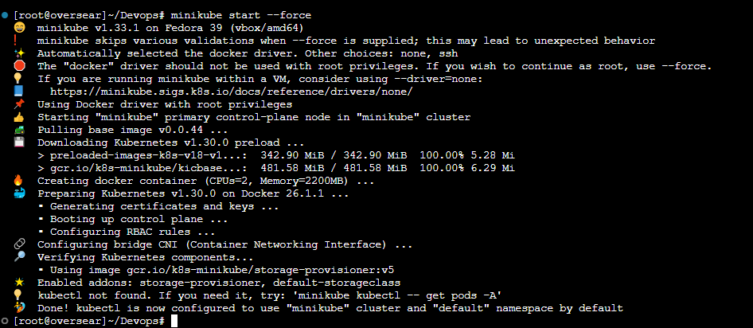
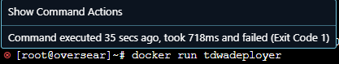
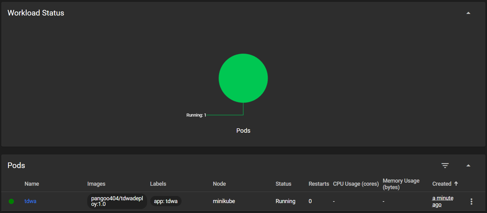
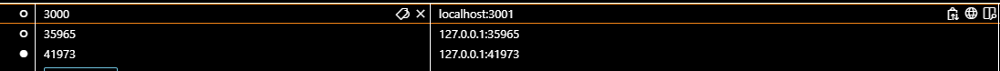
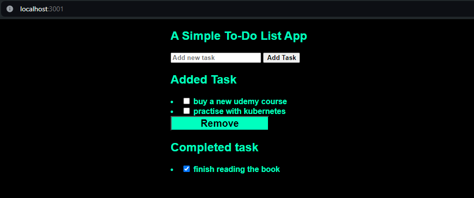
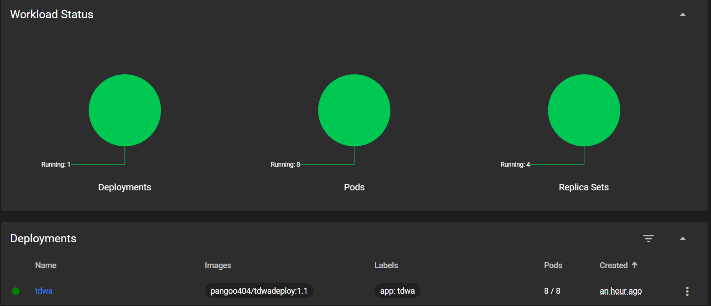
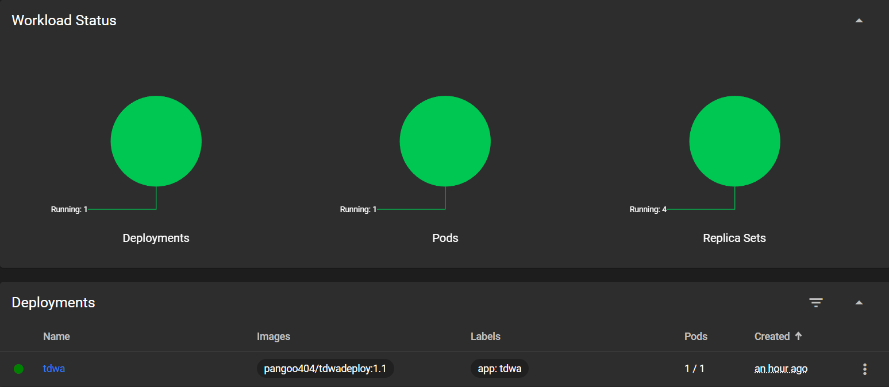
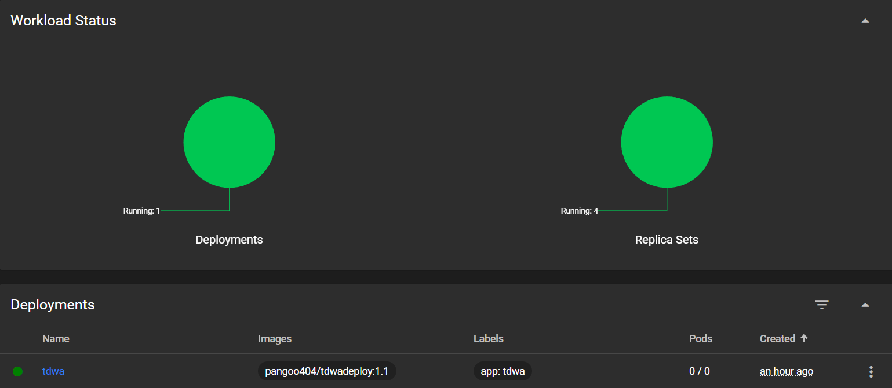
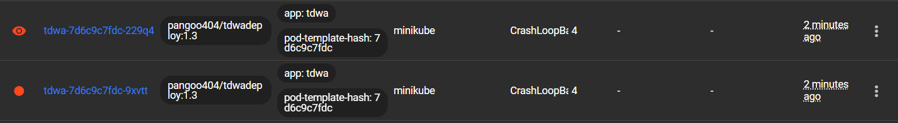
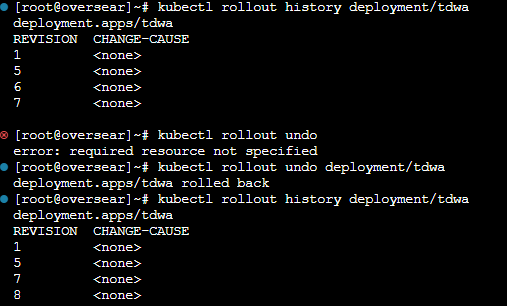

# Sprawozdanie 5
## Jakub Rejek 412219

### Kubernetes - konfiguracja wstępna
Pierwszym krokiem laboratorium było przygotowanie oporgramowania minikube odpowiadajace za utrzymanie klastrów i podów oraz menagera kubectl (w wariancie uproszczonym lub regularnym). Śledząc dokumentację w sekcji getting started można krok po kroku przeprowadzić instalację roziwązania na maszynie wirtualnej.

```BASH
curl -LO https://storage.googleapis.com/minikube/releases/latest/minikube-latest.x86_64.rpm
sudo rpm -Uvh minikube-latest.x86_64.rpm
```
By uzyskać listing powyższych poleceń wystarczy przeklikać opcje instalcje w kroku 1 **Installation** i w ostatnim kroku wybrać **RPM Package**

Trzeba upewnić się by maszyna posiadała odpowiednio duże zasoby by utrzymała wszystkie pody.
Wymagania:
- RAM > 2GB
- DYSK > 20GB
- PROCESOR > 2 Cores

Zaleceniem w kwestii bezpieczeństwa jest praca z podami przy pomocy konta z grupy wheel, ale nie **ROOT** jeżeli jednak przeżyliście laby z dockera na root i nie czujecie się zagrożeni przez dockera z uprawnieniami root-a możecie zmusić kubernetesy do pracy z rootem flagą --force, która ominie testy bezpieczeństwa.

Uruchamiamy usługę minikube:
```BASH
minikube start
```

#### Pobieramy kubectl
Zaciągamy sobie paczkę do instalcji za pomocą poniższej komendy.
```BASH
   curl -LO "https://dl.k8s.io/release/$(curl -L -s https://dl.k8s.io/release/stable.txt)/bin/linux/amd64/kubectl"
```
Instalujemy:
```BASH
sudo install -o root -g root -m 0755 kubectl /usr/local/bin/kubectl
```
(Wszystkie powyższe polecenia pochodzą z dokumentacji kubectl)

Dodajmy sobie alias dla kubectl by ułatwić sobie pracę:
```BASH
alias kubectl="minikube kubectl --"
```
Gdy jesteśmy gotowi możemy spróbowac uruchomić **dashboard** Przy jego pomocy będziemy mogli obserwować zachowanie naszych podów i wykryć błędy które wystąpiły przy wdrożeniu poszczególnych podów.

(Dashboard zablokuje terminal dlatego polecem dodać nową instancję terminala do VS-a i tam wywołać polecenie)
```BASH
minikube dashboard
```
Po przejsciu inicjalizacji która może zająć kilka dsekund powinniśmy zostać zaskoczeni wyskakujacym oknem przeglądarki z naszym świeżym dashboardem. 

Jeżeli to nie nastąpi możemy kliknąć/skopiować link, który wyświetli się w terminalu.

### Oprogramowanie do kontenera - artefakt z poprzednich zajęć
Drugim etapem laboratorium było przygotowanie oprogramowania pracującego jako usługa w kontenerze. Program musi eksponować jakąś usługe na dedykowanym porcie sieciowym i musi działać w trybie ciągłym(nie umierać po zakończeniu wsyztkich poleceń CMD/ENDPOINT). Postanowiłem program z Pipelinu, zwersjonizowac na repo dockerhubowym i zaciągać obrazy właśnie z niego. To w jaki sposób uzyskane zostaną artefakty zależy od projektu ale muszą one być dostępne w jakimś zdalnym repo by kubernetes mógł je zaciągnąć.

Finalnie na repozytorium DockerHub trafiły 3 obrazy aplikacji TDWA oznaczone:

- 1.0
- 1.1
- 1.3 (failing)

Ostatni obraz miał w swoim endpoint-cie polecenie **exit 1** zamiast start.


Ten obraz został wykorzystany by pokazac fail deploya na podach.
### Pierwszy pod.
Gdy już mamy wszystkie komponenty potrzebne do wykonania wdrożenia naszego kontenera. możemy ręcznie wdrożyć pod poleceniem:
```BASH
kubectl run <nameForDeploy> --image=<repo>/<image> --port=<appPort> --labels app=<labelName>
```

**nameForDeploy** - będzie nazwą którą zostanie otagowany nasz pod i przez którą będziemy się z nim komunikować.

**appPort** - to port z którego korzysta aplikacja i na której będziemy chcieli ją usłyszeć.

**labelName** - etykietka którą otrzyma dane wdrożenie dzieki nim możemy grupować pody i odwoływac się do całych zbiorów po nazwie etykiety. W tym przypadku jest to nazwa pracującej na niej apliakcji.

W dashboardzie powinniśmy zobaczyć działajacy pod:



Teraz pożądanym efektem powinno być zobaczenie aplikacji w przeglądarce. By było to jednak możliwe musimy przekierowac porty w dwóch warstwach:

W VS Codzie:
 
 Dodajac nową zasadę przekierowania dla localhosta. Mapujemy port aplikacji na dowolny port po stronie hosta.

 W kubernetesie:
```BASH
kubectl port-forward pod/<podName> <port>:<port>
```
 (Ponownie blokuje terminal)
 Jeżeli wszystko poszło po naszje myśli. I wszystie przekierowania nie mają błędów w przeglądarce powinniśmy zobaczyć naszą aplikację:
 
 Odwołujemy się do niej na utworzonym w VS Codzie przekierownym porcie.

### Automatyzacja wdrożenia - wdrożenie deklaratywne 
Gdy wiemy, że nasza aplikacja działa i pody mozna wdrożyc bez więskzych komplikacji czas zautomatyzowac proces i przygotowac wdrożenie deklaratywne.

W tym celu przygotowujemy plik wdrożenia o rozszerzeniu ***.yaml**.
```yml
apiVersion: apps/v1
kind: Deployment
metadata:
  name: tdwa
  labels:
    app: tdwa
spec:
  replicas: 4
  selector:
    matchLabels:
      app: tdwa
  template:
    metadata:
      labels:
        app: tdwa
    spec:
      containers:
        - name: tdwa
          image: pangoo404/tdwadeploy:1.0
          ports:
            - containerPort: 3000
```
Powyższe wdrożenie zakłąda utworzenie 4 podów o takich samych parametrach jak w przypdaku wywołania ręcznego polecenia.
```BASH
kubectl apply -f <name>.yaml
```
Powyższe poleceni posłuzy nam jak uruchomieni nowej deklaracji wdrożenia, ale rónież pozwoli zaktualizowac obecnie istniejące wdrożenie.


W dashboardzie widzimy utworzone pody oraz liczbe deploymentów w których są one ujęte.

### Warianty wdrożeń:

#### Liczba podów:
W ramach poniższych modyfikacji jedyną zmianą była modyfikacja pliku deploymentu w poniższej lini na pożaną liczbę podów.
```yml
replicas: 4
```
#### 8 Podów w ramach wdrożenia

#### 1 Pod w ramach wdrożenia

#### 0 Podów w ramach wdrożenia

Widzimy że dla 0 podów nadal funkcjonuje zestaw replik oraz wdrożenie ale nie ma ono żadnych instancji. Może to być przydatne, gdy nasza strategia wdrożenia zakłada przymusowy downtime przy wprowadzaniu aktualizacji w usłudze.

#### Pod z błędem:
Po wdrożeniu poda z błędem dashboard zwraca błąd i możemy go odczytać najeżdzajac na nadany label.

Gdybyśmy wykonali takie wdrożenie w strategi canary wdrożenie pozostawiło by wszystkie pody poza jednym nietknięte(więcej w dalszej części).

### Historia wersji
By pokazac działanie funkcji wersjonowania deploymentów dokonałem kilkukrotnie deployów z różnymi wersjami obrazów by pojawiły się one w historii.
W pliku deploymentu:
```yml
image: pangoo404/tdwadeploy:1.0
```
By wykonać wdrożenie w innej wersji zmodyfikowałem wersję obrazu do której odwołuje się deployment.
By wyświetlić historię możemy wywołać polecenie
```BASH
kubectl rollout history deployment/<deployName>
#W moim przypadku
kubectl rollout history deployment/tdwa
```
Gdy chcemy wycofać się z ostatniej zmiany wersji wystarczy wykonać polecenie:
```BASH
kubectl rollout undo deployment/tdwa
```
Efekt w historii powinien przypominać coś takiego:


Trzeba pamiętać, że wycofa to nie tylko wersje programu a całego wdrożenia to oznacza że jeżlei wprowadziliśmy zmianę w liczbie podów lub strategii również zostanie ona wycofana.

### Skrypt timeout dla wdrożenia:
Ten punkt na etapie pisania ostatniego labu mnie pokonał. Nigdy nie potrafiłem płynnie pisac skryptów powłoki i choć potrafię skleić coś pracujac z dokumentajca i internetem nie wiedziałem jak zabrac się do tego problemu.

Poprosiłem o pomoc Copilota i repo znajomego i udało mi się wyczarować coś takiego:
```sh
#!/bin/bash

DEPLOYMENT_FILE="tdwapod.yaml"
DEPLOYMENT_NAME="tdwa"
TIMEOUT_SECONDS=60
INTERVAL_SECONDS=5
TIME_PASSED=0

kubectl apply -f $DEPLOYMENT_FILE

while [ $TIME_PASSED -lt $TIMEOUT_SECONDS ]; do
    STATUS=$(kubectl get deployment $DEPLOYMENT_NAME -o jsonpath='{.status.conditions[?(@.type=="Available")].status}')

    if [ "$STATUS" == "True" ]; then
        echo "Deployment $DEPLOYMENT_NAME succeded."
        exit 0
    fi

    sleep $INTERVAL_SECONDS
    TIME_PASSED=$((TIME_PASSED + INTERVAL_SECONDS))
done

echo "Timeout ($TIMEOUT_SECONDS s) pending for deploy $DEPLOYMENT_NAME."
exit 1
```
By móc uruchomić skrypt nalezy nadać mu uprawnienia wykonania:
```sh
chmod +x deploy.sh
```
Problemem jest jednak fakt, że przy próbie wywołania kontenera który powinien się nie wdrożyć. Tzn wariant z exit 1 nadal kończy się z komunikatem o poprawnym wdrożeniu.

Na tym etapie chciałem już oddać ostatnie sprawozdanie by nie obrywać po ocenie dlatego poprzestałem na tej wersji.

### Strategie wdrożeń
Gdy przeprowadzamy aktualizację na klastrze oczywistym jest, że równoczesna praca i wprowadzanie zmian w oprogramowaniu nie jest możliwa. Pody udostępnijące usługę muszą być wyłaczone na czas aktualizacji. Usługa staje się w tedy nie dostępna dla użytkownika co w roziwązaniach produkcyjnych w tej branży jest praktycznie niedopuszczalne. W celu ograniczenia wpływu aktualizacji na świadczone usługi ustandaryzowano różne systemy przeprowadzania aktualizacji ograniczajace downtime usługi co nie oznacza, że dane rozwiązanie jest adekwatne dla każdego usecase-a.

Nie udało mi się naocznie zaobserwować róznic we wdrożeniach ze względu na czas wykonania.

#### Recreate - delete create
W tej strategii wszystkie pody zostają usuniete przed wdrożeniem nowych. Oznacza to że przez pewien czas nie będzie żadnego działajacego poda.
```yml
apiVersion: apps/v1
kind: Deployment
metadata:
  name: tdwa
  labels:
    app: tdwa
spec:
  replicas: 10
  selector:
    matchLabels:
      app: tdwa
  strategy:
    type: Recreate
  template:
    metadata:
      labels:
        app: tdwa
    spec:
      containers:
        - name: tdwa
          image: pangoo404/tdwadeploy:1.1
          ports:
            - containerPort: 3000
```

#### Canary - jeden na ofiarę
W tej strategii zanim nastąpi wprowdzenie kontenerów jedne z kontenerów "kanarek" wprowadza deployment w pojedynkę jeżeli mu się nie powiedzie deployment zostaje wstrzymany.
```yml
apiVersion: apps/v1
kind: Deployment
metadata:
  name: tdwa
  labels:
    app: tdwa
    track: canary
spec:
  replicas: 1
  selector:
    matchLabels:
      app: tdwa
      track: canary
  template:
    metadata:
      labels:
        app: tdwa
        track: canary
    spec:
      containers:
      - name: tdwa
        image: pangoo404/tdwadeploy:1.1
        ports:
        - containerPort: 3000
```
#### RollingUpdate - round and around
Strategia zakąłda wprowadzanie aktualizacji stopniowo umożliwiając zakłądaną dopuszczalną liczbę niedostępnych instancji. Dopiero gdy dana liczba podów ponownie wstanie mogą się wyłaćzyć kolejne instancje. Gwarantuje to pewną stabilność dostepności usługi bez gwarancji, jednolitej usługi dla wszystkich.
```yml
apiVersion: apps/v1
kind: Deployment
metadata:
  name:  tdwa
  labels:
    app: tdwa
spec:
  replicas: 10
  strategy: 
    type: RollingUpdate
    rollingUpdate:
      maxUnavailable: 2
      maxSurge: 25%
  selector:
    matchLabels:
      app: tdwa
  template:
    metadata:
      labels:
        app: tdwa
    spec:
      containers:
      - name: tdwa
        image: pangoo404/tdwadeploy:1.1
        ports:
        - containerPort: 3000
```
### Service
By ubrać wdrożenie w serwis który pokieruje ruchem musimy przygotowac dodatkowy plik servisu o roższerzeniu ***yml**
```yml
apiVersion: v1
kind: Service
metadata:
  name: service
spec:
  selector:
    app: tdwa
  ports:
    - protocol: TCP
      port: 80
      targetPort: 3030
```
Teraz wystarczy użyć pliku serwisu zamiast wdrożenia wraz z wywołaniem **apply**.

Usługa powinna być słyszalna na zadanym porcie w przeglądarce na hoście.


### Wnioski/Przemyślenia

W tej sekcji zebrałem przemyślenia dotyczące problematyki wdrożeń i pracy z narzędziami o których traktuje powyższe laboratorium.

Robiąc laboratorium w pospiechu by nadrobic zaległości nie poświęciłem zbyt wiele uwagi na poszczególne elementy wdrożenia do któych na pewno kiedys wrócę.

Narzędzie daje dużą swobodę i kontrolę nad tworzonymi podami.

Nadal nie potrafię zrozumieć pisania skryptów dla powłoki.

Było to jedno z przyjemnijeszych laboratoriów ze wzgledu na możliwość obserwacji działania kolejnych implementacji i działania usługi w przeglądarce jak w przypadku implementacji na produkcji.