# Sprawozdanie 3

Pierwsza część laboratoriów polegała na sprawdzeniu poprawności działania kontenerów budujących i testujących dla wybranej aplikacji z poprzednich zajęć. 

# Przygotowanie

**1. Przetestowanie kontenerów do budowania i testowania z poprzednich zajęć**
<br>
W tym celu korzystamy ze zbudowanego wcześniej pliku `docker-compose.yml`, który definiuje sposób uruchomienia kontenerów `build` i `test`. Sam plik jest zdefiniowany w następujący sposób:

>```dockerfile
>services:
>  irssi-build:
>    build:
>      context: .
>      dockerfile: irssi-build.Dockerfile
>    image: irssi-build:0.1
>    container_name: irssi-build
>
>    restart: 'no'
>
>  irssi-test:
>    build:
>      context: .
>      dockerfile: irssi-test.Dockerfile
>    image: irssi-test:0.1
>    container_name: irssi-test
>
>    depends_on:
>      - irssi-build
>    restart: 'no'
>```

Jego uruchomienie za pomocą poniższej komendy daje następujący wynik:
```
docker-compose -f <path_to_docker_compose> up
```

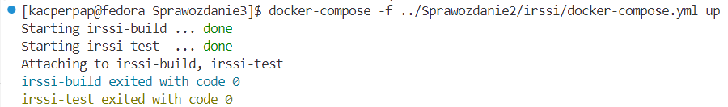

<br>

**2. Przygotowanie, uruchomienie i skonfigurowanie Jenkinsa w kontenerze z pluginem BlueOcean**

<br>

Przedstawione kroki wykonane zgodnie z instrukcją [https://www.jenkins.io/doc/book/installing/docker/](https://www.jenkins.io/doc/book/installing/docker/) zostały wykonane i opisane w poprzednim sprawozdaniu. Poniżej przedstawiam działjący kontener `jenkins-blueocean` oraz udostępniane porty i zbindowane wolumeny, które zapewniają zabezpieczenie przestrzeni roboczej `/var/jenkins_home` (logów).

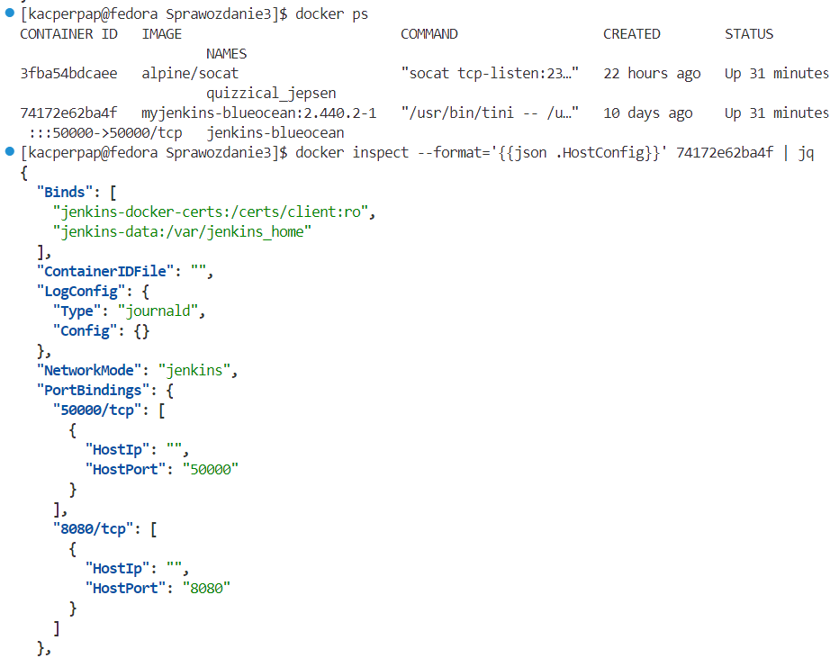

**3. Blue Ocean**
<br>
>Blue Ocean as it stands provides easy-to-use Pipeline visualization. It was intended to be a rethink of the Jenkins user experience, designed from the ground up for Jenkins Pipeline. Blue Ocean was intended to reduce clutter and increases clarity for all users.

***Blue Ocean to plugin dostępny w Jenkinsie, który umożliwia bardziej intuicyjne UI do budowania pipelinów w Jenkinsie, oferując dynamiczną, złożoną wizualizację,edytor pipelinów, personalizację, natywną integrację pull requestów przy pracy w GitHubie lub BitBucket.***

# Uruchomienie 

**1. uname_job, odd_hour_job - zadania jenkinsa**
<br>
Pierwszym krokiem było zbudowanie dwóch prostych projektów. Pierwszy wyświetlający wynik komendy `uname`. Drugi kończący się jako `SUCCESS` lub `FAIL` w zależności od parzystości godziny. W tym celu tworzymy zadania dla każdego projektu. Wykonujemy to poprzez kroki: `Nowy projekt`, gdzie podajemy nazwę zadania oraz wybieramy opcję `general-puropse job`. Następnie dodajemy polecenie w konfiguracji zadania, w `Uruchom powłokę`, uruchamianej podczas budowania.

Dla zdania pierwszego polecenie wygląda następująco:
```bash
uname
```

Zadanie drugie:
```bash
#!/bin/bash

hour=$(date +%-H)

if (( hour % 2 != 0 )); then
    echo "Błąd: godzina $hour jest nieparzysta"
    exit 1
else
    echo "Godzina $hour jest parzysta"
    exit 0
fi
```

Logi tych zadań prezentują się następująco:

- Poprawne wykonanie buildu z jednym poleceniem `uname`

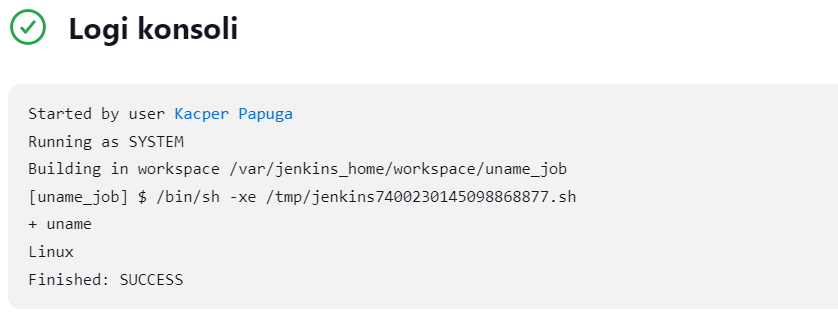

- Błąd zgodny z założeniem - nieparzysta godzina, status wykonania zadania `FAILED`

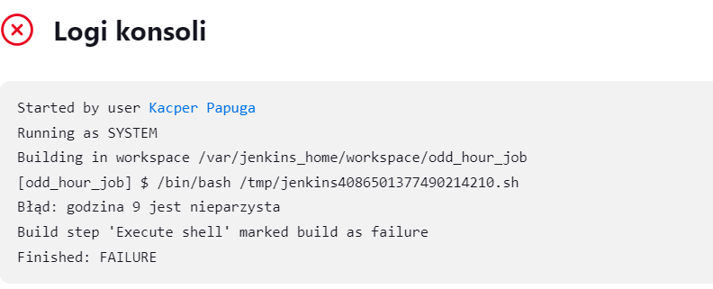

**2.Projekt irssi**
<br>
Aby uruchomić projekt z poprzednich zajęć poprzez zadanie Jenkinsa, które polega na sklonowaniu repozytorium, przełączeniu się na odpowiednią gałąź i zbudowaniu obrazów do budowania i testowania tworzymy nowy projekt. Nasze repozytorium jest publiczne, dlatego nie musimy podawać `credensials` aby umożliwić jego sklonowanie. Tym samym konfiguracja wygląda następująco:

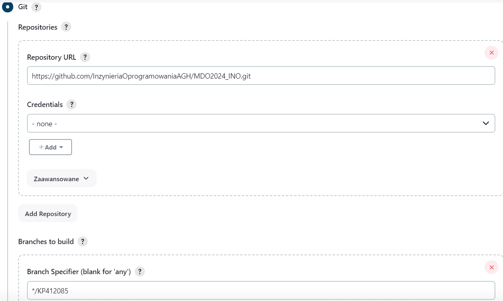

Polecenie wykonywane w powłoce do uruchomienia zdefiniowanego na poprzednich zajęciach pliku `docker-compose`: 
```bash
cd ~/ITE/GCL4/KP412085/Sprawozdanie2/irssi/
docker-compose -f docker-compose.yml up
```
Jednak przed wykonaniem tego zadania sprawdzamy czy mamy w kontenerze jenkinsa zainstalowane rozszerzenie `docker-compose`. Możemy to sprawdzić poprzez:
```bash
docker exec -t <jenkins-container-id> bash docker-compose --help
```
Ponieważ instalowałem tylko rozszerzenie `docker`, polecenie to wyświetla błąd, dlatego poprzez UI Jenkinsa pobieram dodatkowego plugina `docker compose build step`:

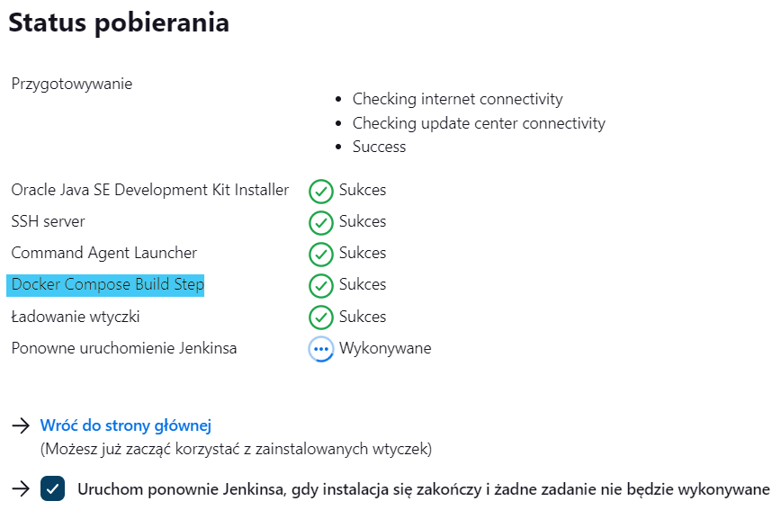

Jest to jednak plugin tylko dodający `step` do projektu, co powoduje, że nie pobiera on `docker-compose`. Umożliwia on tylko graficzne zdefiniowanie zadania, zamiast definiowania polecenia w powłoce. Aby pobrać właściwe rozszerzenie korzystam z instrukcji [https://docs.docker.com/compose/install/linux/#install-using-the-repository](https://docs.docker.com/compose/install/linux/#install-using-the-repository), którą realizuję bezpośrednio w kontenerze jenkinsa. Rezultat jest następujący:

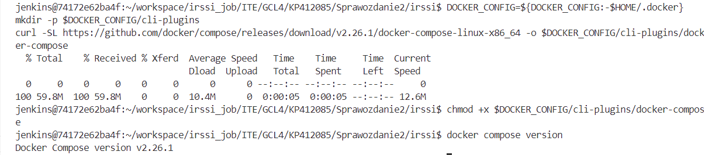

***Uwaga! Pobrane rozszerzenie to docker compose (nie docker-compose). Jest to nowsza wersja tej funkcjonalności instalowana domyślnie w Docker Desktop, przy czym stara wersja docker-compose oznaczona została jego deprecated i nie jest dalej wspierana.***

W związku z powyższym zamiast korzystania z pobranego pluginu, który korzysta ze starego polecenia `docker-compose` (poniżej zdefiniowany za pomocą plugina build step):

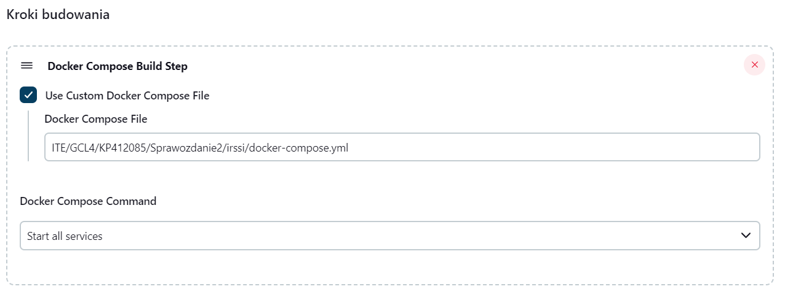

Korzystamy z zdefiniowania polecenia `docker compose` w powłoce, co wygląda następująco:

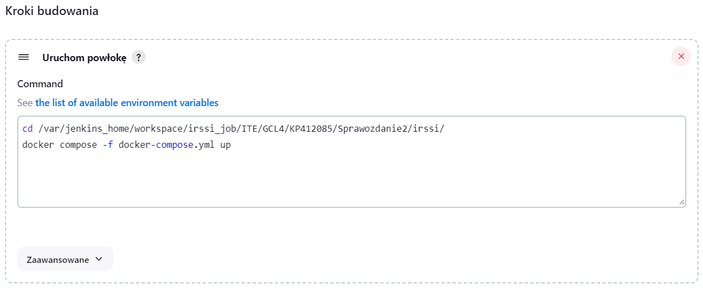

Przed uruchomieniem tego zadania upewniamy się że mamy uruchomiony kontener zbudowany na wsześniejszych zajęciach za pomocą:

>```docker
>docker run /
> --name jenkins-docker /
>  --rm /
>  --detach /
>  --privileged /
>  --network jenkins  --network-alias docker /
>  --env DOCKER_TLS_CERTDIR=/certs /
>  --volume jenkins-docker-certs:/certs/client  --volume jenkins-data:/var/jenkins_home /
>  --publish 2376:2376 /
>  docker:dind /
>  --storage-driver overlay2
>```


Ostatecznie zadanie `irssi_job` po uruchomieniu zostaje zakończone z kodem sukcesu:

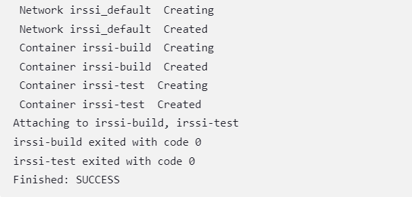

**3. Irssi pipeline (stage deploy i publish w pkt 5)**
<br> 

Na podstawie obrazów `dockerfile` z poprzednich zajęć tworzę pipeline'a dla aplikacji irssi. Zawiera on 3 etapy: `Prepare`, `Build` oraz `Test`. Obrazy budowane i testowane będą na dedykowanym `DIND` dla bezpieczeństawa wykonania. Dokładniejsze rozróżnienie pomiędzy przeprowadzaniem tych etapów w `DIND` lub bezpośrednio w kontenerze `CI` podam poniżej. Dla tego pipeline'a plik `Jenkinsfile` zostanie umieszczony w repozytorium w osobnym katalogu. 

Jenkinsfile dla `irssi_pipeline` wygląda następująco:
```Jenkinsfile
pipeline {
    agent any
    
    environment {
        IMAGE_TAG = new Date().getTime()
    }

    stages {
        stage('Prepare') {
            steps {
                sh 'rm -rf MDO2024_INO'
                sh 'git clone https://github.com/InzynieriaOprogramowaniaAGH/MDO2024_INO.git'
                dir("MDO2024_INO"){
                    sh 'git checkout KP412085'
                }
            }
        }
        
        stage('Build') {
            steps {
                dir("MDO2024_INO/ITE/GCL4/KP412085/Sprawozdanie2/irssi"){
                    sh 'docker build --no-cache -t irssi-build:${IMAGE_TAG} -f irssi-build.Dockerfile .'
                }
            }
        }
        
        stage('Test') {
            steps {
                dir("MDO2024_INO/ITE/GCL4/KP412085/Sprawozdanie3/irssi"){
                    sh 'docker build --no-cache --build-arg IMAGE_TAG=$IMAGE_TAG -t irssi-test:${IMAGE_TAG} -f irssi-test-date-tag.Dockerfile .'
                }
            }
        }
    }
}
```

`IMAGE_TAG` to oznaczenie, które definiuje nasz konkretny obraz do budowania i testowania poprzez tag (może także wersjonować naszą wersją do deploymentu i publish). Data pobierana jest poprzez kod Groovy, i dołączana jako tag do każdego tworzonego obrazu na każdym etapie. Po sklonowaniu repozytorium i przełączeniu się na odpowiednią gałąź, przechodzimy do katalogu z projektem i budujemy obraz. <b>Waże jest aby uwzględnić to, że przy każdym uruchomieniu piepeline'a, musimy usunąć repozytorium, które wcześniej sklonowaliśmy. Dzieje się tak dlatego, że wszystkie nasze projekty w Jenkinsie są zapisywane w kontenerze jenkinsa w lokalizacji `/var/jenkins_home`, która została zbindowana przy tworzeniu obrazu jenkinsa. Oznacza to, że wszystkie dane pipeline są zapisywane w tej lokalizacji w odpowiednim katalogu.</b> Ponadto wykonując zagnieżone kroki, umieszczamy je w `dir(""){}`, aby zachować położenie pomiędzy kolejnymi poleceniami.

Dla celu zbudowania tego prostego pipeline'u modyfikuję także plik `dockerfile` do testowania w taki sposó, aby przyjmował jako argument budowania odpowiedni tag obrazu `build` z którego ma korzystać. Modyikacja ta jest następująca:

```dockerfile
ARG IMAGE_TAG

FROM irssi-test:$IMAGE_TAG

WORKDIR /irssi/Build

RUN ninja test
```

Uruchomienie takiego `dockerfila` wygląda następująco:

```bash
docker build --build-arg IMAGE_TAG=$IMAGE_TAG -t irssi-test:${IMAGE_TAG} -f irssi-test-date-tag.Dockerfile .
```

Po uruchomieniu takiego pipeline'a otrzymujemy następujący wynik:

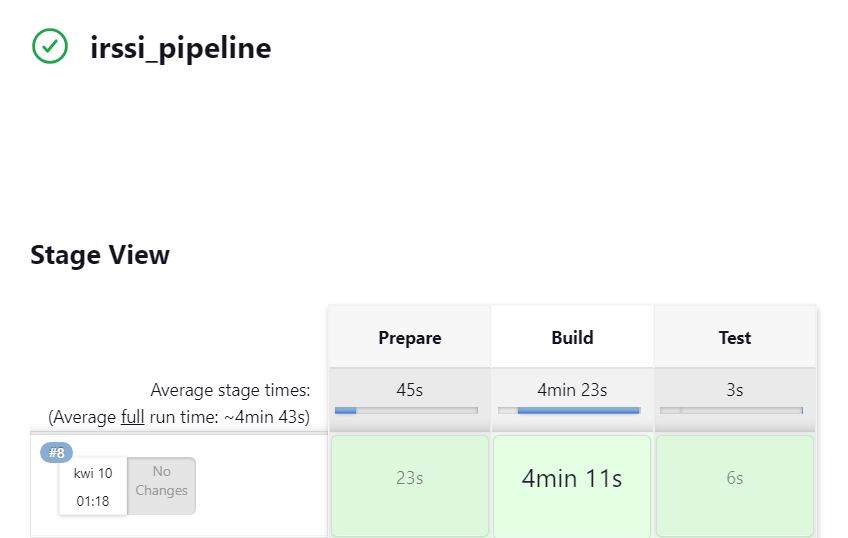


**4. Róznica pomiędzy DIND oraz budowaniem bezpośrednio w kontenerze CI**

- <b>Budowanie na dedykowanym DIND (Docker-in-Docker):</b>
    - <b>Izolacja środowiska</b>: W tym podejściu każde zadanie budowania uruchamiane jest w oddzielnym kontenerze Docker, który działa wewnątrz innego kontenera Docker. Oznacza to, że proces budowania odbywa się w pełni izolowanym środowisku, które ma dostęp do pełnego stosu Docker.
    - <b>Złożoność konfiguracji</b>: Konfiguracja DIND może być bardziej złożona ze względu na potrzebę zapewnienia poprawnej konfiguracji warstw kontenerów. Wymaga to odpowiedniej konfiguracji uprawnień i ustawień, aby zapobiec potencjalnym problemom bezpieczeństwa i wydajności.
    - <b>Wykorzystanie zasobów</b>: Uruchomienie kontenera Docker w kontenerze może być bardziej zasobożerne niż uruchomienie kontenera CI bezpośrednio na hostu, ponieważ wymaga dodatkowej warstwy wirtualizacji.
- <b>Budowanie na kontenerze CI:</b>
    - <b>Prostota konfiguracji</b>: W przypadku bezpośredniego uruchomienia kontenera CI na hoście nie ma potrzeby konfigurowania DIND ani zarządzania warstwami kontenerów. Jest to zazwyczaj prostsze podejście konfiguracyjne.
    - <b>Wykorzystanie zasobów</b>: Uruchomienie kontenera CI bezpośrednio na hoście może być bardziej wydajne pod względem zużycia zasobów niż uruchomienie DIND, ponieważ eliminuje dodatkową warstwę wirtualizacji.
    - <strong>Izolacja środowiska</strong>: Mimo że uruchomienie kontenera CI na hoście może nie zapewniać takiej samej izolacji środowiska co DIND, to wciąż może być wystarczające dla wielu przypadków użycia.


# Irssi pipeline stage prepare, build, test, deploy i publish 

**0. Omówienie etapów deploy i publish**

Poprzednia wersja pipeline'a obejmowała budowanie aplikacji oraz jej testy. Kolejnym etapem jest deploy, czyli uruchomienie aplikacji w kontenerze docelowym. Aplikacje instalowane z repoztorium fedory poprzez menadżera pakietów `dnf` (na systemach typu RHEL) pobiera spakowane wersje aplikacji w postaci paczki `rpm`. Taka paczka dostosowana jest do naszego systemu i architektury już podczas pobierania z repozytorium, któych pliki konfiguracyjne (oraz adresy serwerów lustrzanych) znajdują się w katalogu `/etc/yum.repos.d`. W trakcie pobierania instalowane są za zgodą użytkownika wszystkie konieczne dependencje. Taki sposób jest wygodny i dostosowany do użytkownika indywidualnego. Istnieje jednak również możliwość wyabstrahowania paczki od architektury (ograniczeniem jest dalej rodzina systemów RHEL domyślnie uywająca dnf). Polega ona na budowaniu paczki z rozszeżeniem `.src.rpm`, która jak nazwa wskazuje zawiera kody źródłowe oraz inne definicje i konfiguracje aplikacji. Taką paczkę można zbudować bezpośrednio na hoście użytkownika końcowego. Ograniczeniem, które pojawia się w tym miejscu jest zazwyczaj dużo większa liczba zależności, ponieważ podczas budowy paczki `rpm` ze źródła (`src.rpm`), musimy posiadać wszystkie zależności budowania (nie tylko runtime'owe) aplikacji oraz dodatkowo program budujący. Zależności takiego programu `rpmbuild` to (część z nich jest domyślnie zainstalowana):

```bash
dnf install gcc rpm-build rpm-devel rpmlint make python bash coreutils diffutils patch rpmdevtools
```  
W moim pipelinie, krok deploy będzie budował paczkę ze źródła, co pomimo większych wymogów pozwoli zbudować końcową aplikację bezpośrednio u użytkownika końcowego, po czym odpali program irssi i sprawdzi poprawność jego działania. Za zbudowania paczki, którą przekażemy do kontenera deployowego będzie odpowiedzialny krok `publish`. Kontener publishowy wymaga zainstalowania dependencji programu budującego paczki `rpm` (ALE nie posiada dependencji do budowania aplikcji, ponieważ tylko pakuje w odpowiedni sposób cały kod), natomiast kontener deployowy będzie musiał posiadać zarazem dependencje potrzebne podczas budowy i działania aplikacji oraz te potrzebne programowi budującemu. Ponadto skoro w kroku `deploy` kompilujemy paczkę `.src.rpm`, to ten krok poprzedza krok publish z budową tej paczki. 


**1. Budowanie pakietu source rpm (próbne)**

Pierwszym krokiem była próba zbudowania paczki poza pipelinem w celu przetestowania procesu jej towrzenia. W tym celu stworzyłem dwa kontenery fedory `rpm_build` oraz `rpm_deploy`. Pierwszy kontner posiada zależności zdefiniowane w następujący sposób:

```bash
docker run -it --name=rpm_build fedora
dnf -y install gcc rpm-build rpm-devel rpmlint make python bash coreutils diffutils patch rpmdevtools git 
```

Drugi kontener:

```bash
docker run -it --name=rpm_deploy fedora
dnf -y install gcc rpm-build rpm-devel rpmlint make python bash coreutils diffutils patch rpmdevtools git meson ninja* glib2-devel utf8proc* ncurses* perl-Ext* cmake gdb openssl-devel
```

W celu przetestowania procsu budowy paczki, utworzę ją na kontnerze `rpm_build` po czym skopiuję do kontener `rpm_deploy` gdzie ją zbuduję i uruchomię program.

W kontenerze `rpm_build` wykonuję następujące kroki:

- Buduję katalog projektu za pomocą:
  ```bash
    $ rpmdev-setuptree

    $ tree ~/rpmbuild/
    /home/user/rpmbuild/
    |-- BUILD
    |-- RPMS
    |-- SOURCES
    |-- SPECS
    `-- SRPMS
  ```

  Zbudowana paczka będzie znajdowała się w podkatalogu `SRPMS`, w katalogu `SPECS` utworzymy plik `specfile`, który będzie definiował sposób budowania paczki, katalog `BUILD` będzie zawierał kod źródłowy aplikacji oraz licencję.

- Klonujemy kod repozytorium irssi:
  ```bash
  git clone https://github.com/irssi/irssi.git
  ```

- Budujemy archiwum i umieszczamy je w odpowienim katalogu:
  ```bash
  mv irssi irssi-<version>
  tar -cvzf irssi-<version>.tar.gz irssi-<version>
  cp irssi-<version>.tar.gz ~/rpmbuild/SOURCES
  ```

- Budujemy plik `.spec` oraz definiujemy go zgodnie ze wzorcem podanym w pliku, pozostawiając jedynie sekcję %changelog wygenerowaną automatycznie [irssi.spec](./irssi/irssi.spec)

  ```bash
  cd ~/rpmbuild/SPECS
  rpmdev-newspec irssi
  ```
  Plik `.spec` wygląda następująco:
  >Name:           irssi
  >Version:        1.0
  >Release:        1%{?dist}
  >Summary:        Client irssi
  >
  >License:        GPLv2
  >URL:            https://irssi.org/
  >Source0:        https://github.com/InzynieriaOprogramowaniaAGH/MDO2024_INO/tree/KP412085/ITE/GCL4/KP412085/Sprawozdanie3/irssi/releases/download/%{version}/irssi-%{version}.tar.gz
  >
  >
  >
  >BuildRequires:  git
  >BuildRequires:  meson
  >BuildRequires:  gcc
  >BuildRequires:  glib2-devel
  >BuildRequires:  ncurses-devel
  >BuildRequires:  ninja-build
  >BuildRequires:  perl-ExtUtils-Embed
  >BuildRequires:  utf8proc-devel
  >BuildRequires:  cmake
  >BuildRequires:  openssl-devel
  >BuildRequires:  gdb
  >Requires:       glib2
  >Requires:       openssl
  >Requires:       perl
  >Requires:       ncurses-libs
  >
  >%description
  >The client of the future
  >
  >%prep
  >%autosetup
  >
  >%build
  >meson Build
  >ninja -C %{_builddir}/irssi-%{version}/Build
  > 
  >%install
  >DESTDIR=%{buildroot} ninja -C Build install
  >mkdir -p %{buildroot}/usr/local/share/licenses/%{name}/
  >cp %{_builddir}/irssi-%{version}/COPYING %{buildroot}/usr/local/share/licenses/%{name}/
  >
  >%files
  >%license /usr/local/share/licenses/%{name}/COPYING
  >/usr/local/bin/%{name}
  >/usr/local/share/%{name}/
  >/usr/lib/debug/
  >/usr/local/include/
  >/usr/local/lib64/
  >/usr/local/share/doc 
  >/usr/local/share/man
  >

  `Source0` definiuje miejsce z którego można pobrać paczkę `.tar.gz`, której używamy do budowania. Sekcja `BuildRequires` definiuje zależności potrzebne podczas budowy oraz `Requires` zlaeżności potrzebne podczas działania aplikacji. `%prep%` to sekcja umożliwiająca stoswanie skryptów przygotowująych (`%autosetup` to domyslny skrypt narzędzia), `%build` to definicja budowania aplikacji, `%install`, instalacji odpowiednich plików, oraz `%files`, czyli definicji określających miejsca docelowe w których ma zostać zainstalowana aplikacja (która zbuduje się do katalogu `BUILDROOT`) na hoście.

- Następnie budujemy paczkę ze źródłami, z opcją `-bs`(build source) zamiast `-bb` (build binary):
  ```bash
  rpmbuild -bs irssi.spec
  ```
- Na koniec korzystamy z wbudowanego `lintera rpm` żeby sprawdzić poprawność zbudowania paczki:
  ```
  rpmlint ~/rpmbuild/SPECS/irssi.spec
  rpmlint ~/rpmbuild/SRPMS/<name>.src.rpm
  ```

  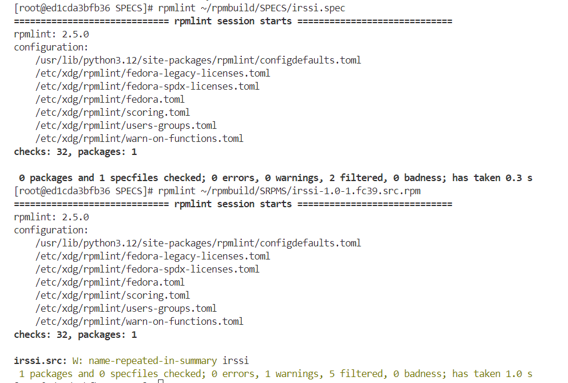

- Po zbudowaniu paczki przenosimy ją do kontenera `rpm_deploy`. w tym celu podczas działania obydwu kontenerów odpalamy dodatkowy terminal i kopiujemy paczkę:
  ```bash
  docker cp <rpm_build_name/id>:/root/rpmbuild/SRPMS/<name>.src.rpm .
  docker cp ./<name>.src.rpm <rpm_deploy_name/id>:/ 
  ```
- Następnie w kontenerze deployowym budujemy paczkę:
  ```bash
  rpmbuild --rebuild <name>.src.rpm
  ```

  Wynik takiej operacji powinien być następujący:
  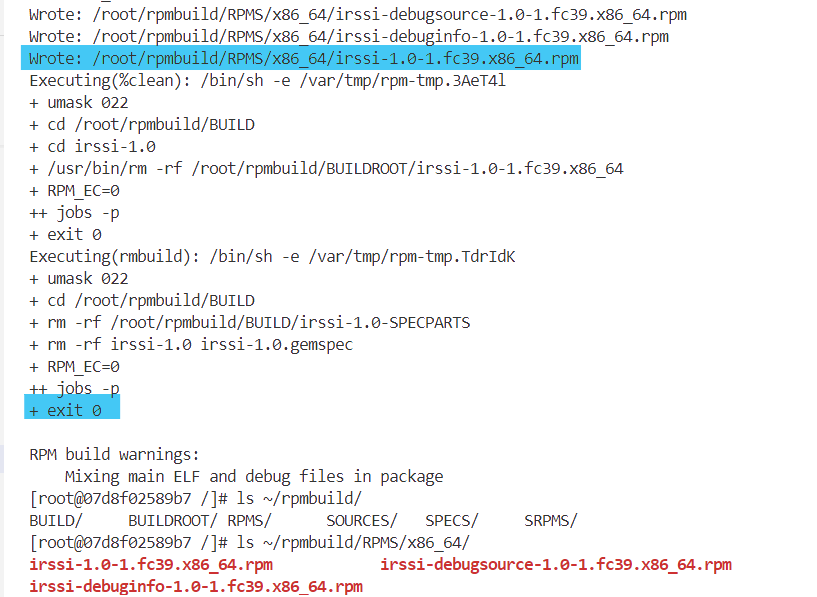

- Na końcu instalujemy paczkę w systemie (jeśli konieczne pobieramy zależności zdefiniowane w skrypcie poprzez wyrażenie zgody) oraz testujemy działanie aplikacji:
  ```bash
  dnf install ~/rpmbuild/RPMS/<arch/i.e.:x86_64>/irssi-<version>.rpm
  irssi --help
  ```
  **Z powodu, że irssi jest aplikacją interaktywną, w paipelinie będziemy ją testować za pomocą `irssi --help` lub `irssi --version`**, które są komendami nieblokującymi (wracają do terminala).

  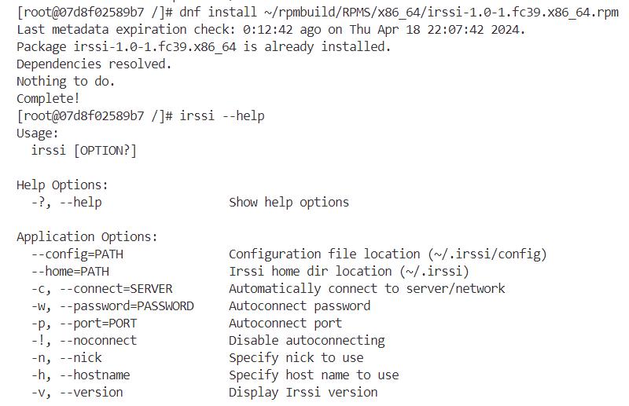


**2. Step publish**

Krok ten jest przeniesieniem budowania paczki `source rpm` do obrazu dockera. Poprzedza on krok `deploy`, podczas którego potrzebna jest zbudowana paczka. Obraz dockera wygląda następumąco: 

```dockerfile
ARG IMAGE_TAG

FROM irssi-build:$IMAGE_TAG

RUN --mount=type=cache,target=/var/cache/yum \
    dnf -y install \
    rpm-build \
    rpm-devel \
    rpmlint \
    make \
    python \
    bash \
    coreutils \
    diffutils \
    patch \
    rpmdevtools

WORKDIR /

ARG VERSION
ARG RELEASE

RUN mv irssi irssi-$VERSION && \
    tar -cvzf irssi-$VERSION.tar.gz irssi-$VERSION && \
    rpmdev-setuptree && \
    cp irssi-$VERSION.tar.gz /root/rpmbuild/SOURCES/

WORKDIR /root/rpmbuild/SPECS

COPY ./irssi.spec .

RUN rpmbuild -bs irssi.spec && \
    rpmlint irssi.spec && \
    rpmlint ../SRPMS/irssi-$VERSION-$RELEASE.fc39.src.rpm && \
    mkdir -p /releases/source_rpm/ && \
    mv /root/rpmbuild/SRPMS/irssi-$VERSION-$RELEASE.fc39.src.rpm /releases/source_rpm/
```


