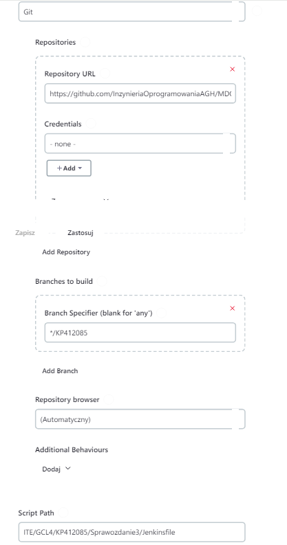

# Sprawozdanie 3

Pierwsza część laboratoriów polegała na sprawdzeniu poprawności działania kontenerów budujących i testujących dla wybranej aplikacji z poprzednich zajęć. Kolejnym etapem było zbudowanie całego pipelina, który umozliwa automatyczne budowanie, testowanie, wdrożenie aplikacji oraz publikację artefaktów budowy w wybrane miejsce. 

# Przygotowanie

**0. Diagramy wdrożenia i komunikacji oraz licencja aplikacji**

Korzystam z aplikacji, którą wkorzystywałem na poprzednich laboratoriach, której licencja **GNU GENERAL PUBLIC LICENSE Version 2, June 1991**, umożliwia używania i modyfikację kodu, przy obowiązku publikacji zmian na tej samej licencji.

**Diagram wdrożenia**


**Diagram komunikacji**


**1. Przetestowanie kontenerów do budowania i testowania z poprzednich zajęć**
<br>
W tym celu korzystamy ze zbudowanego wcześniej pliku `docker-compose.yml`, który definiuje sposób uruchomienia kontenerów `build` i `test`. Sam plik jest zdefiniowany w następujący sposób:

>```dockerfile
>services:
>  irssi-build:
>    build:
>      context: .
>      dockerfile: irssi-build.Dockerfile
>    image: irssi-build:0.1
>    container_name: irssi-build
>
>    restart: 'no'
>
>  irssi-test:
>    build:
>      context: .
>      dockerfile: irssi-test.Dockerfile
>    image: irssi-test:0.1
>    container_name: irssi-test
>
>    depends_on:
>      - irssi-build
>    restart: 'no'
>```

Jego uruchomienie za pomocą poniższej komendy daje następujący wynik:
```
docker-compose -f <path_to_docker_compose> up
```


<br>

**2. Przygotowanie, uruchomienie i skonfigurowanie Jenkinsa w kontenerze z pluginem BlueOcean**

<br>

Przedstawione kroki wykonane zgodnie z instrukcją [https://www.jenkins.io/doc/book/installing/docker/](https://www.jenkins.io/doc/book/installing/docker/) zostały wykonane i opisane w poprzednim sprawozdaniu. Poniżej przedstawiam działjący kontener `jenkins-blueocean` oraz udostępniane porty i zbindowane wolumeny, które zapewniają zabezpieczenie przestrzeni roboczej `/var/jenkins_home` (logów).


**3. Blue Ocean**
<br>
>Blue Ocean as it stands provides easy-to-use Pipeline visualization. It was intended to be a rethink of the Jenkins user experience, designed from the ground up for Jenkins Pipeline. Blue Ocean was intended to reduce clutter and increases clarity for all users.

***Blue Ocean to plugin dostępny w Jenkinsie, który umożliwia bardziej intuicyjne UI do budowania pipelinów w Jenkinsie, oferując dynamiczną, złożoną wizualizację,edytor pipelinów, personalizację, natywną integrację pull requestów przy pracy w GitHubie lub BitBucket.***

# Uruchomienie 

**1. uname_job, odd_hour_job - zadania jenkinsa**
<br>
Pierwszym krokiem było zbudowanie dwóch prostych projektów. Pierwszy wyświetlający wynik komendy `uname`. Drugi kończący się jako `SUCCESS` lub `FAIL` w zależności od parzystości godziny. W tym celu tworzymy zadania dla każdego projektu. Wykonujemy to poprzez kroki: `Nowy projekt`, gdzie podajemy nazwę zadania oraz wybieramy opcję `general-puropse job`. Następnie dodajemy polecenie w konfiguracji zadania, w `Uruchom powłokę`, uruchamianej podczas budowania.

Dla zdania pierwszego polecenie wygląda następująco:
```bash
uname
```

Zadanie drugie:
```bash
#!/bin/bash

hour=$(date +%-H)

if (( hour % 2 != 0 )); then
    echo "Błąd: godzina $hour jest nieparzysta"
    exit 1
else
    echo "Godzina $hour jest parzysta"
    exit 0
fi
```

Logi tych zadań prezentują się następująco:

- Poprawne wykonanie buildu z jednym poleceniem `uname`


- Błąd zgodny z założeniem - nieparzysta godzina, status wykonania zadania `FAILED`


**2.Projekt irssi**

<br>
Aby uruchomić projekt z poprzednich zajęć poprzez zadanie Jenkinsa, które polega na sklonowaniu repozytorium, przełączeniu się na odpowiednią gałąź i zbudowaniu obrazów do budowania i testowania tworzymy nowy projekt. Nasze repozytorium jest publiczne, dlatego nie musimy podawać `credensials` aby umożliwić jego sklonowanie. Tym samym konfiguracja wygląda następująco:


Polecenie wykonywane w powłoce do uruchomienia zdefiniowanego na poprzednich zajęciach pliku `docker-compose`: 
```bash
cd ~/ITE/GCL4/KP412085/Sprawozdanie2/irssi/
docker-compose -f docker-compose.yml up
```
Jednak przed wykonaniem tego zadania sprawdzamy czy mamy w kontenerze jenkinsa zainstalowane rozszerzenie `docker-compose`. Możemy to sprawdzić poprzez:
```bash
docker exec -t <jenkins-container-id> bash docker-compose --help
```
Ponieważ instalowałem tylko rozszerzenie `docker`, polecenie to wyświetla błąd, dlatego poprzez UI Jenkinsa pobieram dodatkowego plugina `docker compose build step`:


Jest to jednak plugin tylko dodający `step` do projektu, co powoduje, że nie pobiera on `docker-compose`. Umożliwia on tylko graficzne zdefiniowanie zadania, zamiast definiowania polecenia w powłoce. Aby pobrać właściwe rozszerzenie korzystam z instrukcji [https://docs.docker.com/compose/install/linux/#install-using-the-repository](https://docs.docker.com/compose/install/linux/#install-using-the-repository), którą realizuję bezpośrednio w kontenerze jenkinsa. Rezultat jest następujący:


***Uwaga! Pobrane rozszerzenie to docker compose (nie docker-compose). Jest to nowsza wersja tej funkcjonalności instalowana domyślnie w Docker Desktop, przy czym stara wersja docker-compose oznaczona została jego deprecated i nie jest dalej wspierana.***

W związku z powyższym zamiast korzystania z pobranego pluginu, który korzysta ze starego polecenia `docker-compose` (poniżej zdefiniowany za pomocą plugina build step):


Korzystamy z zdefiniowania polecenia `docker compose` w powłoce, co wygląda następująco:


Przed uruchomieniem tego zadania upewniamy się że mamy uruchomiony kontener zbudowany na wsześniejszych zajęciach za pomocą:

>```docker
>docker run /
> --name jenkins-docker /
>  --rm /
>  --detach /
>  --privileged /
>  --network jenkins  --network-alias docker /
>  --env DOCKER_TLS_CERTDIR=/certs /
>  --volume jenkins-docker-certs:/certs/client  --volume jenkins-data:/var/jenkins_home /
>  --publish 2376:2376 /
>  docker:dind /
>  --storage-driver overlay2
>```


Ostatecznie zadanie `irssi_job` po uruchomieniu zostaje zakończone z kodem sukcesu:


**3. Irssi pipeline (stage deploy i publish w pkt 5)**
<br> 

Na podstawie obrazów `dockerfile` z poprzednich zajęć tworzę pipeline'a dla aplikacji irssi. Zawiera on 3 etapy: `Prepare`, `Build` oraz `Test`. Obrazy budowane i testowane będą na dedykowanym `DIND` dla bezpieczeństawa wykonania. Dokładniejsze rozróżnienie pomiędzy przeprowadzaniem tych etapów w `DIND` lub bezpośrednio w kontenerze `CI` podam poniżej. Dla tego pipeline'a plik `Jenkinsfile` zostanie umieszczony w repozytorium w osobnym katalogu. 

Jenkinsfile dla `irssi_pipeline` wygląda następująco:
```Jenkinsfile
pipeline {
    agent any
    
    environment {
        IMAGE_TAG = new Date().getTime()
    }

    stages {
        stage('Prepare') {
            steps {
                sh 'rm -rf MDO2024_INO'
                sh 'git clone https://github.com/InzynieriaOprogramowaniaAGH/MDO2024_INO.git'
                dir("MDO2024_INO"){
                    sh 'git checkout KP412085'
                }
            }
        }
        
        stage('Build') {
            steps {
                dir("MDO2024_INO/ITE/GCL4/KP412085/Sprawozdanie2/irssi"){
                    sh 'docker build --no-cache -t irssi-build:${IMAGE_TAG} -f irssi-build.Dockerfile .'
                }
            }
        }
        
        stage('Test') {
            steps {
                dir("MDO2024_INO/ITE/GCL4/KP412085/Sprawozdanie3/irssi"){
                    sh 'docker build --no-cache --build-arg IMAGE_TAG=$IMAGE_TAG -t irssi-test:${IMAGE_TAG} -f irssi-test-date-tag.Dockerfile .'
                }
            }
        }
    }
}
```

`IMAGE_TAG` to oznaczenie, które definiuje nasz konkretny obraz do budowania i testowania poprzez tag (może także wersjonować naszą wersją do deploymentu i publish). Data pobierana jest poprzez kod Groovy, i dołączana jako tag do każdego tworzonego obrazu na każdym etapie. Po sklonowaniu repozytorium i przełączeniu się na odpowiednią gałąź, przechodzimy do katalogu z projektem i budujemy obraz. <b>Waże jest aby uwzględnić to, że przy każdym uruchomieniu piepeline'a, musimy usunąć repozytorium, które wcześniej sklonowaliśmy. Dzieje się tak dlatego, że wszystkie nasze projekty w Jenkinsie są zapisywane w kontenerze jenkinsa w lokalizacji `/var/jenkins_home`, która została zbindowana przy tworzeniu obrazu jenkinsa. Oznacza to, że wszystkie dane pipeline są zapisywane w tej lokalizacji w odpowiednim katalogu.</b> Ponadto wykonując zagnieżone kroki, umieszczamy je w `dir(""){}`, aby zachować położenie pomiędzy kolejnymi poleceniami.

Dla celu zbudowania tego prostego pipeline'u modyfikuję także plik `dockerfile` do testowania w taki sposó, aby przyjmował jako argument budowania odpowiedni tag obrazu `build` z którego ma korzystać. Modyikacja ta jest następująca:

```dockerfile
ARG IMAGE_TAG

FROM irssi-test:$IMAGE_TAG

WORKDIR /irssi/Build

RUN ninja test
```

Uruchomienie takiego `dockerfila` wygląda następująco:

```bash
docker build --build-arg IMAGE_TAG=$IMAGE_TAG -t irssi-test:${IMAGE_TAG} -f irssi-test-date-tag.Dockerfile .
```

Po uruchomieniu takiego pipeline'a otrzymujemy następujący wynik:


**4. Róznica pomiędzy DIND oraz budowaniem bezpośrednio w kontenerze CI**

- <b>Budowanie na dedykowanym DIND (Docker-in-Docker):</b>
    - <b>Izolacja środowiska</b>: W tym podejściu każde zadanie budowania uruchamiane jest w oddzielnym kontenerze Docker, który działa wewnątrz innego kontenera Docker. Oznacza to, że proces budowania odbywa się w pełni izolowanym środowisku, które ma dostęp do pełnego stosu Docker.
    - <b>Złożoność konfiguracji</b>: Konfiguracja DIND może być bardziej złożona ze względu na potrzebę zapewnienia poprawnej konfiguracji warstw kontenerów. Wymaga to odpowiedniej konfiguracji uprawnień i ustawień, aby zapobiec potencjalnym problemom bezpieczeństwa i wydajności.
    - <b>Wykorzystanie zasobów</b>: Uruchomienie kontenera Docker w kontenerze może być bardziej zasobożerne niż uruchomienie kontenera CI bezpośrednio na hostu, ponieważ wymaga dodatkowej warstwy wirtualizacji.
- <b>Budowanie na kontenerze CI:</b>
    - <b>Prostota konfiguracji</b>: W przypadku bezpośredniego uruchomienia kontenera CI na hoście nie ma potrzeby konfigurowania DIND ani zarządzania warstwami kontenerów. Jest to zazwyczaj prostsze podejście konfiguracyjne.
    - <b>Wykorzystanie zasobów</b>: Uruchomienie kontenera CI bezpośrednio na hoście może być bardziej wydajne pod względem zużycia zasobów niż uruchomienie DIND, ponieważ eliminuje dodatkową warstwę wirtualizacji.
    - <strong>Izolacja środowiska</strong>: Mimo że uruchomienie kontenera CI na hoście może nie zapewniać takiej samej izolacji środowiska co DIND, to wciąż może być wystarczające dla wielu przypadków użycia.


# Irssi pipeline stage prepare, build, test, deploy i publish 

**0. Omówienie etapów deploy i publish**

Poprzednia wersja pipeline'a obejmowała budowanie aplikacji oraz jej testy. Kolejnym etapem jest deploy, czyli uruchomienie aplikacji w kontenerze docelowym. Aplikacje instalowane z repoztorium fedory poprzez menadżera pakietów `dnf` (na systemach typu RHEL) są pobierane jako spakowane wersje aplikacji w postaci paczki `rpm`. Taka paczka dostosowana jest do naszego systemu i architektury już podczas pobierania z repozytorium, któych pliki konfiguracyjne (oraz adresy serwerów lustrzanych) znajdują się w katalogu `/etc/yum.repos.d`. W trakcie pobierania instalowane są za zgodą użytkownika wszystkie konieczne dependencje. Taki sposób jest wygodny i dostosowany do użytkownika indywidualnego. Istnieje jednak również możliwość wyabstrahowania paczki od architektury (ograniczeniem jest dalej rodzina systemów RHEL domyślnie uyżwająca dnf i paczek rpm oraz wersja systemu). Polega ona na budowaniu paczki z rozszeżeniem `.src.rpm`, która jak nazwa wskazuje zawiera kody źródłowe oraz inne definicje i konfiguracje aplikacji. Taką paczkę można zbudować bezpośrednio na hoście użytkownika końcowego. Ograniczeniem, które pojawia się w tym miejscu jest zazwyczaj dużo większa liczba zależności, ponieważ podczas budowy paczki `rpm` ze źródła (`src.rpm`), musimy posiadać wszystkie zależności budowania (nie tylko runtime'owe) aplikacji oraz dodatkowo program budujący. Zależności takiego programu `rpmbuild` to (część z nich jest domyślnie zainstalowana):

```bash
dnf install gcc rpm-build rpm-devel rpmlint make python bash coreutils diffutils patch rpmdevtools
```  
**W moim pipelinie, krok deploy będzie budował paczkę ze źródła, co pomimo większych wymogów pozwoli zbudować końcową aplikację bezpośrednio u użytkownika końcowego, po czym w kolejnym etapie obrazu usunie wszystkie niepotrzebne zależności (pozostają tylko runtimowe) oraz odpali program irssi i sprawdzi poprawność jego działania. Za zbudowanie paczki `src.rpm`, którą przekażemy do kontenera deployowego będzie odpowiedzialny krok `publish`. Kontener publishowy wymaga zainstalowania dependencji programu budującego paczki `rpm` (ALE nie wymaga posiadania dependencji do budowania aplikcji, ponieważ tylko pakuje w odpowiedni sposób cały kod), natomiast kontener deployowy będzie musiał posiadać zarazem dependencje potrzebne podczas budowy i działania aplikacji oraz te potrzebne programowi budującemu. Ponadto skoro w kroku `deploy` kompilujemy paczkę `.src.rpm`, to ten krok poprzedza krok publish z budową tej paczki.**


**1. Budowanie pakietu source rpm (próbne)**
Instrukcje pomocne do budowy pakietu zostały znalezione na [https://rpm-packaging-guide.github.io/](https://rpm-packaging-guide.github.io/)

Pierwszym krokiem była próba zbudowania paczki poza pipelinem w celu przetestowania procesu jej towrzenia. W tym celu stworzyłem dwa kontenery fedory `rpm_build` oraz `rpm_deploy`. Pierwszy kontner posiada zależności zdefiniowane w następujący sposób:

```bash
docker run -it --name=rpm_build fedora
dnf -y install gcc rpm-build rpm-devel rpmlint make python bash coreutils diffutils patch rpmdevtools git 
```

Drugi kontener:

```bash
docker run -it --name=rpm_deploy fedora
dnf -y install gcc rpm-build rpm-devel rpmlint make python bash coreutils diffutils patch rpmdevtools git meson ninja* glib2-devel utf8proc* ncurses* perl-Ext* cmake gdb openssl-devel
```

W celu przetestowania procsu budowy paczki, utworzę ją na kontnerze `rpm_build` po czym skopiuję do kontener `rpm_deploy` gdzie ją zbuduję i uruchomię program.

W kontenerze `rpm_build` wykonuję następujące kroki:

- Buduję katalog projektu za pomocą:
  ```bash
    $ rpmdev-setuptree

    $ tree ~/rpmbuild/
    /home/user/rpmbuild/
    |-- BUILD
    |-- RPMS
    |-- SOURCES
    |-- SPECS
    `-- SRPMS
  ```

  Zbudowana paczka będzie znajdowała się w podkatalogu `SRPMS`, w katalogu `SPECS` utworzymy plik `specfile`, który będzie definiował sposób budowania paczki, katalog `BUILD` będzie zawierał kod źródłowy aplikacji oraz licencję.

- Klonujemy kod repozytorium irssi:
  ```bash
  git clone https://github.com/irssi/irssi.git
  ```

- Budujemy archiwum i umieszczamy je w odpowienim katalogu:
  ```bash
  mv irssi irssi-<version>
  tar -cvzf irssi-<version>.tar.gz irssi-<version>
  cp irssi-<version>.tar.gz ~/rpmbuild/SOURCES
  ```

- Budujemy plik `.spec` oraz definiujemy go zgodnie ze wzorcem podanym w insrukcji, pozostawiając jedynie sekcję %changelog wygenerowaną automatycznie.

  ```bash
  cd ~/rpmbuild/SPECS
  rpmdev-newspec irssi
  ```
  Plik `.spec` wygląda następująco:
  >Name:           irssi
  >Version:        1.0
  >Release:        1%{?dist}
  >Summary:        Client irssi
  >
  >License:        GPLv2
  >URL:            https://irssi.org/
  >Source0:        https://github.com/InzynieriaOprogramowaniaAGH/MDO2024_INO/tree/KP412085/ITE/GCL4/KP412085/Sprawozdanie3/irssi/releases/download/%{version}/irssi-%{version}.tar.gz
  >
  >
  >
  >BuildRequires:  meson
  >BuildRequires:  gcc
  >BuildRequires:  glib2-devel
  >BuildRequires:  ncurses-devel
  >BuildRequires:  ninja-build
  >BuildRequires:  perl-ExtUtils-Embed
  >BuildRequires:  utf8proc-devel
  >BuildRequires:  cmake
  >BuildRequires:  openssl-devel
  >BuildRequires:  gdb
  >Requires:       glib2
  >Requires:       openssl
  >Requires:       perl
  >Requires:       ncurses-libs
  >
  >%description
  >The client of the future
  >
  >%prep
  >%autosetup
  >
  >%build
  >meson Build
  >ninja -C %{_builddir}/irssi-%{version}/Build
  > 
  >%install
  >DESTDIR=%{buildroot} ninja -C Build install
  >mkdir -p %{buildroot}/usr/local/share/licenses/%{name}/
  >cp %{_builddir}/irssi-%{version}/COPYING %{buildroot}/usr/local/share/licenses/%{name}/
  >
  >%files
  >%license /usr/local/share/licenses/%{name}/COPYING
  >/usr/local/bin/%{name}
  >/usr/local/share/%{name}/
  >/usr/lib/debug/
  >/usr/local/include/
  >/usr/local/lib64/
  >/usr/local/share/doc 
  >/usr/local/share/man
  >

  `Source0` definiuje miejsce z którego można pobrać paczkę `.tar.gz`, której używamy do budowania. Sekcja `BuildRequires` definiuje zależności potrzebne podczas budowy oraz `Requires` zlaeżności potrzebne podczas działania aplikacji. `%prep%` to sekcja umożliwiająca stoswanie skryptów przygotowująych (`%autosetup` to domyslny skrypt narzędzia), `%build` to definicja budowania aplikacji, `%install`, instalacji odpowiednich plików, oraz `%files`, czyli definicji określających miejsca docelowe w których ma zostać zainstalowana aplikacja (która zbuduje się do katalogu `BUILDROOT`) na hoście.

- Następnie budujemy paczkę ze źródłami, z opcją `-bs`(build source) zamiast `-bb` (build binary):
  ```bash
  rpmbuild -bs irssi.spec
  ```
- Na koniec korzystamy z wbudowanego `lintera rpm` żeby sprawdzić poprawność zbudowania paczki:
  ```
  rpmlint ~/rpmbuild/SPECS/irssi.spec
  rpmlint ~/rpmbuild/SRPMS/<name>.src.rpm
  ```

  

- Po zbudowaniu paczki przenosimy ją do kontenera `rpm_deploy`. w tym celu podczas działania obydwu kontenerów odpalamy dodatkowy terminal i kopiujemy paczkę:
  ```bash
  docker cp <rpm_build_name/id>:/root/rpmbuild/SRPMS/<name>.src.rpm .
  docker cp ./<name>.src.rpm <rpm_deploy_name/id>:/ 
  ```
- Następnie w kontenerze deployowym budujemy paczkę:
  ```bash
  rpmbuild --rebuild <name>.src.rpm
  ```

  Wynik takiej operacji powinien być następujący:
  

- Na końcu instalujemy paczkę w systemie (jeśli konieczne pobieramy zależności zdefiniowane w skrypcie poprzez wyrażenie zgody) oraz testujemy działanie aplikacji:
  ```bash
  dnf install ~/rpmbuild/RPMS/<arch/i.e.:x86_64>/irssi-<version>.rpm
  irssi --help
  ```
  **Z powodu, że irssi jest aplikacją interaktywną, w paipelinie będziemy ją testować za pomocą `irssi --help` lub `irssi --version`**, które są komendami nieblokującymi (wracają do terminala).

  


**2. Step publish**

Krok ten jest przeniesieniem budowania paczki `source rpm` do obrazu dockera. Poprzedza on krok `deploy`, podczas którego potrzebna jest zbudowana paczka. Obraz dockera używany w tym kroku wygląda następująco [irssi-publish-rpm.Dockerfile](./irssi/irssi-publish-rpm.Dockerfile) 

Podczas budowy paczki na hoście docelowym program budujący miał problem z poprawnym zainstalowaniem aplikacji, ponieważ budując paczkę zmieniłem nazwę repozytorium z `irssi` na `irssi-1.0`. Dlatego w budowaniu paczki tar w obrazie, nie poprzedziłem zamianą nazwy repozytorium. Pomimo tego skrypt `%autosetup` definiował zbuodwany katalog aplikacji, dodając do nazwy wersję aplikacji, co powodowało dalej ten sam problem. Rozwiązaniem była prosta zmiana skryptu `%prep` na pokazany poniżej, oraz odpowienie dopasowanie ścieżek w dalszej częsci pliku `.spec`. 
```bash
%setup -n irssi
```


Ponadto dodałem sekcję `%changelog`, aby móc przekopiować plik bez jego generowania. Wykorzystany końcowo plik znajduję się [tutaj](./irssi/irssi.spec)

```dockerfile
ARG IMAGE_TAG

FROM irssi-build:$IMAGE_TAG

RUN --mount=type=cache,target=/var/cache/yum \
    dnf -y install \
    rpm-build \
    rpm-devel \
    rpmlint \
    make \
    python \
    bash \
    coreutils \
    diffutils \
    patch \
    rpmdevtools

WORKDIR /

ARG VERSION
ARG RELEASE

RUN tar -cvzf irssi-$VERSION.tar.gz irssi && \
    rpmdev-setuptree && \
    cp irssi-$VERSION.tar.gz /root/rpmbuild/SOURCES/

WORKDIR /root/rpmbuild/SPECS

COPY ./irssi.spec .

RUN rpmbuild -bs irssi.spec && \
    rpmlint irssi.spec && \
    rpmlint ../SRPMS/irssi-$VERSION-$RELEASE.fc39.src.rpm && \
    mkdir -p /source_rpm && \
    mv /root/rpmbuild/SRPMS/irssi-$VERSION-$RELEASE.fc39.src.rpm /source_rpm
```

`IMAGE_TAG` to argument podawany podczas budowania obrazu za pomocą komendy `--build-arg`. **Następnie na podstawie obrazu z etapu budowy tworzę mój nowy obraz. Robię tak ponieważ, etap ten wymaga zainstalowania dependecji programu budowania paczek rpm (nie potrzebuje dependencji builda), które potem WRAZ z dependencjami builda będą potrzebne w etapie deploy do zbudowania paczki `rpm` ze źródła. Aby zoptymalizować cały proces korzystam z obrazu build w kroku publish oraz z obrazu publish w kroku deploy co umożliwia dostęp do wszystkich potrzebnych zależności.**

Po pobraniu wszystkich zależności wprowadzam nowe argumenty czasu budowy `VERSION` oraz `RELEASE`. Robię to w tym momencie, ponieważ zgodnie z dokumentacją **argumenty czasu budowy deklarowane przed operacją FROM nie są dostępne w etapie budowania obrazu**


Pozostałe kroki są prawie analogiczne do tych wykonywanych w czasie próbnej budowy paczki. Różnica polega na tym, że nie tworzymy pliku `.spec` za pomocą komendy `rpmdev-newspec`, tylko kopiujemy w odpowiednie miejsce gotowy plik [irssi.spec](./irssi/irssi.spec). Od wersji testowej różni się on zapisem w sekcji `%changelog`, który generuje ostrzeżenia podczas budowy paczki, ale nie wpływa nie jej działanie. W celu przekazania paczki do następnego etapu pipelina tworzymy katalog `/source_rpm` w obrazie dockera. Budując kolejny obraz na podstawie tego, będziemy mieli dostęp do tego katalogu.
 

**3. Step deploy**

Obraz ten wygląda następująco: [irssi-deploy-rpm.Dockerfile](./irssi/irssi-deploy-rpm.Dockerfile). Został podzielony na dwa etapy, pierwszy `build-on-deploy`, pobiera konieczne zależności oraz buduje paczkę ze źródła, która znajduje się w katalogu `/source_rpm`(dostępny ponieważ budujemy obraz na podstawie wcześniejszego obrazu). Kolejny krok został stworzony, aby pomimo konieczności posiadania wszystkich zależności do zbudowania paczki`.src.rpm`, było możliwe usunięcie wszystkih niepotrzebnych zależności. Umożliwi to znaczące zmiejszenie rozmiaru paczki (co pokazałem na screenach poniżej) oraz zapewnienie większego bezpieczeństwa z powodu usunięcia wszystkich niepotrzebnych zależności.
Obrazy zbudowane w kontenerze jenkinsa po zakończeniu wszystkich kroków (BEZ 2-ETAPOWEGO DEPLOYMENTU):


Jak widać na powyższym screenie, rozmiar obrazu jest bardzo duży. Domyślny rozmiar fedory to około 180 MB. Dzięki podzieleniu etapów, rozmiar tego obrazu zmniejszył się o połowę:


Podczas budowy paczki na hoście pojawiały się również błędy dotyczące braku lub złego skonifigurowania plików debugowania. Pliki te nie są potrzebne dlatego w celu rozwiązania problemu podczas budowania paczki dodałem opcję `--nodebuginfo`.

Linie dockerfila:
```bash
COPY --from=build-on-deploy /source_rpm /source_rpm
COPY --from=build-on-deploy /root/rpmbuild/RPMS/x86_64/irssi-$VERSION-$RELEASE.fc39.x86_64.rpm /rpm/
```
Umożliwiają kopiowanie do ostatniego kroku 2 plików. Ten znajdujący się w `/source_rpm`, to przekazywany od obazu `publish` zbudowany obiekt `.src.rpm`. Nie jest on potrzebny w drugim etapie deploya do działania aplikacji, ale potrzebujemy go aby, po zakończeniu działania pipelina sukcesem, zapisać go jako artefakt jenkinsa. (Innym sposobem byłoby dodanie wolumenu i zapisanie go tam) Robię tak aby zapisywać artefakty nie wtedy kiedy powstają, ale tylko w momencie zakończenia sukcesem całego pipelina. Drugi plik to gotowa paczka `rpm` do zbudowania aplikacji irssi.


```dockerfile
ARG IMAGE_TAG

FROM irssi-publish-rpm:$IMAGE_TAG AS build-on-deploy

RUN --mount=type=cache,target=/var/cache/yum \
    dnf -y install \
    cmake \
    openssl-devel

ARG VERSION
ARG RELEASE

WORKDIR /source_rpm

RUN rpmbuild --rebuild --nodebuginfo irssi-$VERSION-$RELEASE.fc39.src.rpm && \
    dnf -y install /root/rpmbuild/RPMS/x86_64/irssi-$VERSION-$RELEASE.fc39.x86_64.rpm

FROM fedora:39 AS deploy 

ARG VERSION
ARG RELEASE

RUN mkdir -p /rpm && mkdir -p /source_rpm

COPY --from=build-on-deploy /source_rpm /source_rpm
COPY --from=build-on-deploy /root/rpmbuild/RPMS/x86_64/irssi-$VERSION-$RELEASE.fc39.x86_64.rpm /rpm/

RUN dnf -y install \
    glib2 \
    perl \
    ncurses-libs \
    utf8proc \
    openssl-devel && \
    dnf clean all && \
    dnf -y install /rpm/irssi-$VERSION-$RELEASE.fc39.x86_64.rpm

ENTRYPOINT irssi

CMD ["--version"]

```

Dockerfile kończy się poleceniem `irssi --version`, które pozwala w sposób nieblokujący sprawdzić poprawność działania zbudowanej aplikacji po jej uruchomieniu w pipelinie za pomocą polecenia:
```bash
sh "docker run -it -d --name irssi-${VERSION}-${RELEASE} irssi-deploy:${IMAGE_TAG}"
sh "docker exec irssi-${VERSION}-${RELEASE} irssi --version"
```
Konieczne było dodanie drugiej linijki, ponieważ ostatnie polecenia dockerfile otwierają aplikację w trybie interaktywnym w budowanym kontenerze, natomiast nie zwracają wersji. Możliwe, że moglibyśmy otrzymać wersję zamieniając to na `CMD ["irssi", "--version"]` tak aby sprawdzono wersję bez odpalania aplikacji lub po odpaleniu w trybie interaktywnym poprzez `ENTRYPOINT irssi CMD ["/version"]`. Jednka wszystkie sposoby umożliwiają osiągnięcie tego samego efektu, a kontener uruchomiony w trybie `detach` i tak zostanie usunięty po poprawnym zakończeniu pipelina, lub rozpoczęciu nowego poprzez skrypt [clear_dind_vol.sh](./irssi/clear_dind_vol.sh).

Końcowym efektem kroku deploy a zarazem pipelina, jest publikacja artefaktu, po sprawdzeniu działania budowy całej aplikacji na kontenerze docelowym z paczki `src.rpm`:


***UWAGA! Dla uproszczenia publikacji na zewnętrzny rejestr, dodaję do DockerHuba obraz irssi-deploy. Robię tak ponieważ to ten obraz zawiera paczkę `rpm`, którą można instalować jedynie z runtimowymi zależnościami. Nie miałoby sensu dodawanie takiego obrazu z kroku publish, poieważ wymagałoby to dodania ogromnej liczby zależności do zbudowania tej paczki ze źródła i zainstalowania aplikacji. Inaczej sytuacja wygląda jeśli dodajemy paczkę `src.rpm` jako samodzielny plik. Wtedy to na "głowie" użytkownika jest doinstalowanie koniecznych zależności. Wymagałoby to dodania również README do takiej paczki aby dokładnie przedstawić proces budowania. Ponadto paczkę taką musiałbym publikować nie na DockerHubie, ale umieszczać ją w innym repozytorium. Z takiego powodu dodaję do mojego pipelina zmienne środowiskowe wykorzystujące `credentials`, czyli bezpieczne zmienne jenkinsa. Następnie wykorzystuję je do zalogowania się w kroku deploy do dockerhuba, i umieszczenie tam obrazu irssi-deploy.***


***Po zakończeniu pipelina, obraz zapisuje się w DockerHubie***


 

**4. Zachowywanie logów oraz paczki jako artefaktów jenkinsa**

Aby zachować logi i paczkę z pipeline'u tworzymy ostatni etap `post`. W etapie tym definiujemy sekcję `success`, która w momencie zakończenia się poprawnie całego pipelina, utworzy artefakt w jenkinsie. W ten sposób zapisujemy efekt naszego budowania, który jest w łatwy sposób możliwy do pobrania. Można byłoby również publikować paczkę na zewnętrzny rejestr, ale pozostanę na zapisaniu artefaktu.

>```dockerfile
>post {
>        success {
>            script {
>                dir("MDO2024_INO/ITE/GCL4/KP412085/Sprawozdanie3/irssi/releases/>source_rpm/"){
>                    sh "docker cp irssi-${VERSION}-${RELEASE}:/source_rpm/${SRC_RPM_FILE} . "
>                    sh "docker stop irssi-${VERSION}-${RELEASE}"
>                    sh "docker rm irssi-${VERSION}-${RELEASE}"
>                    if (fileExists("${SRC_RPM_FILE}")) {
>                        archiveArtifacts artifacts: "${SRC_RPM_FILE}", fingerprint: true
>                    } else {
>                        error "File ${SRC_RPM_FILE} has not been packaged in publish step correctly or have different name"
>                    }
>                }
>            }
>        }
>    }
>```

Logi zapisują się automatycznie, i tworzone są z tego co jest generowane na terminal jenkinsa. Dodatkowe logi potrzebne są tylko w przypadku uruchamiania kontenrów. Jeśli uruchomimy je w trybie detach, to wszystkie logi z operacji wykonywanych wewnątrz takiego kontenera, mogą zostać pozyskane poprzez polecenie `docker logs <container_id>` Dlatego w kroku `deploy`, po uruchomieniu kontenera i aplikacji, pobieram logi w sposób następujący: 
```bash
sh "docker run -it -d --name irssi-${VERSION}-${RELEASE} irssi-deploy:${IMAGE_TAG}"
sh "docker exec irssi-${VERSION}-${RELEASE} irssi --version"
sh "docker logs irssi-${VERSION}-${RELEASE}"
```
Jeśli aplikacja nie uruchomi się poprawnie, to na terminalu jenkinsa zobaczymy błąd z wewnątrz kontenera. Wszystkie logi z czasu działania pipelina zapisują się w pliku `pipeline.log` jako artefakt. Dodatkowo zapisuje się paczka `src.rpm`, której wersjonowanie jest zgodne z przyjętą konwencją, i przekazaną jako parametry `VERSION` oraz `RELEASE` na początku pipelina.


Wszystkie logi i artefakty zapisywane są w przestrzeni roboczej pipelina. W przypadku zakończenia niepowodzeniem zapisywane są tylko logi, bez zbudowanej paczki:


**5. Jenkinsfile**

Ostatecznie plik definiujący pipeline wygląda jak pokazano poniżej. Jest dostępny również jako [Jenkinsfile](./Jenkinsfile). Wersjonowanie użyte do wydania aplikacji składa się z dwóch członów. VERSION czyli wersji aplikacji i jej konkretnego wydania zdefiniowanego jako RELEASE.

```bash
pipeline {
    agent any
    
    environment {
        IMAGE_TAG = new Date().getTime()
        VERSION = 1.0
        RELEASE = 1
        SRC_RPM_FILE = "irssi-${VERSION}-${RELEASE}.fc39.src.rpm"
        DOCKERHUB_CREDENTIALS = credentials('dockerhub-token')

    }

    stages {
        stage('Prepare') {
            steps {
                sh 'git config --global http.postBuffer 524288000'
                sh 'rm -rf MDO2024_INO'
                sh 'git clone https://github.com/InzynieriaOprogramowaniaAGH/MDO2024_INO.git'
                
                dir("MDO2024_INO"){
                    sh 'git checkout KP412085'
                    dir("ITE/GCL4/KP412085/Sprawozdanie3/irssi"){
                        sh 'chmod +x clear_dind_vol.sh'
                        sh './clear_dind_vol.sh'
                    }
                }
            }
        }
        
        stage('Build') {
            steps {
                dir("MDO2024_INO/ITE/GCL4/KP412085/Sprawozdanie3/irssi"){
                    sh 'docker build --no-cache -t irssi-build:${IMAGE_TAG} -f irssi-build.Dockerfile .'
                }
            }
        }
        
        stage('Test') {
            steps {
                dir("MDO2024_INO/ITE/GCL4/KP412085/Sprawozdanie3/irssi"){
                    sh 'docker build --no-cache --build-arg IMAGE_TAG=${IMAGE_TAG} -t irssi-test:${IMAGE_TAG} -f irssi-test-date-tag.Dockerfile .'
                }
            }
        }
        

        stage('Publish') {
            steps {
                dir("MDO2024_INO/ITE/GCL4/KP412085/Sprawozdanie3/irssi") {
                    sh "docker build --no-cache --build-arg IMAGE_TAG=${IMAGE_TAG} --build-arg VERSION=${VERSION} --build-arg RELEASE=${RELEASE} -t irssi-publish-rpm:${IMAGE_TAG} -f irssi-publish-rpm.Dockerfile ."
                }
            }
        }
        
        stage('Deploy') {
            steps {
                dir("MDO2024_INO/ITE/GCL4/KP412085/Sprawozdanie3/irssi") {
                    sh "docker build --no-cache --build-arg IMAGE_TAG=${IMAGE_TAG} --build-arg VERSION=${VERSION} --build-arg RELEASE=${RELEASE} -t irssi-deploy:${IMAGE_TAG} -f irssi-deploy-rpm.Dockerfile ."

                    sh "docker run -it -d --name irssi-${VERSION}-${RELEASE} irssi-deploy:${IMAGE_TAG}"
                    sh "docker exec irssi-${VERSION}-${RELEASE} irssi --version"
                    sh "docker logs irssi-${VERSION}-${RELEASE}"

                    sh "echo $DOCKERHUB_CREDENTIALS_PSW | docker login -u $DOCKERHUB_CREDENTIALS_USR --password-stdin"
                    sh "docker tag irssi-deploy:${IMAGE_TAG} kacperpap/irssi-deploy:${VERSION}-${RELEASE}"
                    sh "docker push kacperpap/irssi-deploy:${VERSION}-${RELEASE}"
                    sh "docker logout"
                }
            }
        }
        
    }
    
    post {

        success {
            script {
                dir("MDO2024_INO/ITE/GCL4/KP412085/Sprawozdanie3/irssi/releases/source_rpm/"){
                    sh "docker cp irssi-${VERSION}-${RELEASE}:/source_rpm/${SRC_RPM_FILE} . "
                    sh "docker stop irssi-${VERSION}-${RELEASE}"
                    sh "docker rm irssi-${VERSION}-${RELEASE}"

                    if (fileExists("${SRC_RPM_FILE}")) {
                        archiveArtifacts artifacts: "${SRC_RPM_FILE}", fingerprint: true
                    } else {
                        error "File ${SRC_RPM_FILE} has not been packaged in publish step correctly or have different name"
                    }
                }
            }
        }
    }
}

```

Dodatkowo w etapie `Prepare` dodałem skrypt który czyści obrazy i kontenery, zbudowane i uruchomione podczas poprzedniego uruchomienia pipelina: [clear_dind_vol.sh](./irssi/clear_dind_vol.sh)

```bash
#!/bin/bash

if [ "$(docker ps -a -q)" ]; then
  docker stop -f $(docker ps -a -q)
  docker rm -f $(docker ps -a -q)
fi

if [ "$(docker images -q)" ]; then
  docker rmi -f $(docker images -q)
fi
```


**6. Trigger**

Cały proces może zostać zautomatyzowany poprzez dodanie triggera oraz pobieranie `Jenkinsfile`, na podstawie którego zostanie uruchomiony cały pipeline. Konfiguracja takiego tworzenie pipelina z pliku została przedstawiona poniżej. 



Istnieje wiele możliwości dodawania triggerów powodujących uruchamianie pipelina. Najłatwiejszym sposobem jest wybranie opcji budowania przy commit'cie do repozytorium lub ustawieniu budowania co wybrany okres czasu. Nie ma to jednak sensu dla wybranej przezmnie aplikacji i sposobu jej budowania. Sensownym byłoby dodanie skryptu, uruchamiającego budowę np. w momencie utworzenia nowej gałęzi relese'owej, lub commita z odpowiednim oznaczeniem, ale wymagałoby to dokłądnego zdefiniowania sposobu rozwoju aplikacji (workflow), dlatego dla powyższego przykładu pominę dodawanie triggera.

**7. Rozbieżności**
Diagramy wdrożenia i komunikacji dość dokładnie przedstawiają ideę tworzenia mojego pipelina. Głównymi różnicami w stosunku do tych początkowo planowanych (które później zostały zmodyfikowane i są przedstawione na początku sprawozdania) jest zamiana na budowanie obrazów build, test, publish bez uruchamiania kontenerów oraz zrezygnowanie z automatycznego triggera oraz publikacja obrazu irssi-deploy w zewnętrznym rejestrze DockerHub. Dodatkowo diagram komunikacji uległ zmianie, ponieważ artefakt publikowany jest po zakończeniu pipelin, a nie w kroku publish oraz jak wspomniałem dodatkowo publikowany jest obraz na DockerHuba.


# Podsumowanie

- [x] Aplikacja została wybrana
- [x] Licencja potwierdza możliwość swobodnego obrotu kodem na potrzeby zadania
- [x] Wybrany program buduje się
- [x] Przechodzą dołączone do niego testy
- [x] Zdecydowano, czy jest potrzebny fork własnej kopii repozytorium (niepotrzebny fork, nie wprowadzamy żadnych zmian do repozytorium aplikacji)
- [x] Stworzono diagram UML zawierający planowany pomysł na proces CI/CD
- [x] Wybrano kontener bazowy lub stworzono odpowiedni kontener wstepny (runtime dependencies)
- [x] Build został wykonany wewnątrz obrazu
- [x] Testy zostały wykonane wewnątrz obazu
- [x] Obraz testowy jest oparty o obraz build
- [x] Logi z procesu są odkładane jako numerowany artefakt (domyślnie jako pipeline.log w jenkins blue ocean, przypisane do każdego uruchomienia pipeline osobno)
- [x] Zdefiniowano kontener 'deploy' służący zbudowanej aplikacji do pracy
- [x] Uzasadniono czy kontener buildowy nadaje się do tej roli/opisano proces stworzenia nowego
- [x] Wersjonowany kontener 'deploy' ze zbudowaną aplikacją jest wdrażany na instancję Dockera
- [x] Następuje weryfikacja, że aplikacja pracuje poprawnie (*smoke test*)
- [x] Zdefiniowano, jaki element ma być publikowany jako artefakt
- [x] Uzasadniono wybór: kontener z programem, plik binarny, flatpak, archiwum tar.gz, pakiet RPM/DEB
- [x] Opisano proces wersjonowania artefaktu (można użyć *semantic versioning*)
- [x] Dostępność artefaktu: artefakt załączony jako rezultat builda w Jenkinsie
- [x] Przedstawiono sposób na zidentyfikowanie pochodzenia artefaktu
- [x] Pliki Dockerfile i Jenkinsfile dostępne w sprawozdaniu w kopiowalnej postaci oraz obok sprawozdania, jako osobne pliki
- [x] Zweryfikowano potencjalną rozbieżność między zaplanowanym UML a otrzymanym efektem
- [x] Sprawozdanie pozwala zidentyfikować cel podjętych kroków
- [x] Forma sprawozdania umożliwia wykonanie opisanych kroków w jednoznaczny sposób


**Uwagi do pipeline:**
Architektura mojego pipeline, z powodu konieczności budowania paczki `.src.rpm` uległa niechcianej modyfikacji. Obraz publish przestał pełnić funkcję publikacji do zewnętrznego rejestru zbudowanej paczki. Ponadto nie publikuje on także paczki do lokalnego rejestru - odpowiedzialny jest za to krok w sekcji `post` pipelina, który po poprawnym zakończeniu wszystkich etapów zapisuje paczkę jako artefakt jenkinsa. Nie jest to najlepsze rozwiązanie, ponieważ krok publish stał się krokiem odpowiedzialnym tylko za budowę paczki ze zbudowanej wcześniej i przetestowanej aplikacji. Krok deploy natomiast w związku z tym, że posługiwałem się paczką ze źródłami, które na docelowym hoście należy zbudować, musiał posiadać bardzo dużo zależności. Częściowo jednak poradziłem sobie z tym problemem tworząc dwuetapową budowę obrazu deploy, która w drugim kroku przebudowuje obraz z dostępną paczką `.rpm`, zbudowaną  w pierwszym etapie. Etap deploy jednak jest poprawny, ponieważ jego głównym celem było wdrożenie aplikacji do kontenera i przeprowadzenie `smoke testów`, sprawdzających poprawność działania aplikacji. Mój pipeline mógłby natomiast zostać zmieniony w taki sposób, żeby krok `publish` zamienić na krok faktycznie odpowiedzialny tylko za budowę paczki `.src.rpm`, natomiast po kroku deploy, który testuje cały proces od pobrania (lub przekazania z poprzedniego kontenera) paczki `src.rpm` buduje ją, instaluje i testuje działanie aplikacji w nieblokujący sposób (np. poprzez sprawdzenie wersji aplikacji) dodać etap właściwej publikacji. W tej architekturze dopiero po kroku `deploy` nastąpiłby krok `publish`, który rzeczywiście byłby odpowiedzialny za publikację paczki `.src.rpm` do zewnętrznego repozytorium. Jednka pomimo tego mój pipeline oprócz mylnie nazwanego kroku publish poprawnie realizuje swoje zadanie, buduje, testuje kod po czym buduje paczkę, wdraża je na środowisko docelowe testując poprawność całego procesu zbudowania paczki ze źródła i zainstalowania jej, po czym publikuje artefakt w jenkinsie.


