# Sprawozdanie 4

# Instalacja zarządcy ansible i wstępna konfiguracja maszyn

**1.Utworzenie drugiej VM**

Druga maszyna wirtualna ma służyć jako host konfigurowany przez ansibla. Jako, że ansible jest `agentless`, zainstalowanie go będzie wymagane tylko na maszynie, która będzie pełniła rolę zarządcy. Dlatego na maszynie z poprzednich zajęć instalujemy ansible z repozytorium fedory poprzez:

```bash
dnf -y install ansible
```

Tworzymy drugą VM z tego samego obrazu. Dodajemy do niej użytkownika oraz bazowo konfigurujemy maszynę.

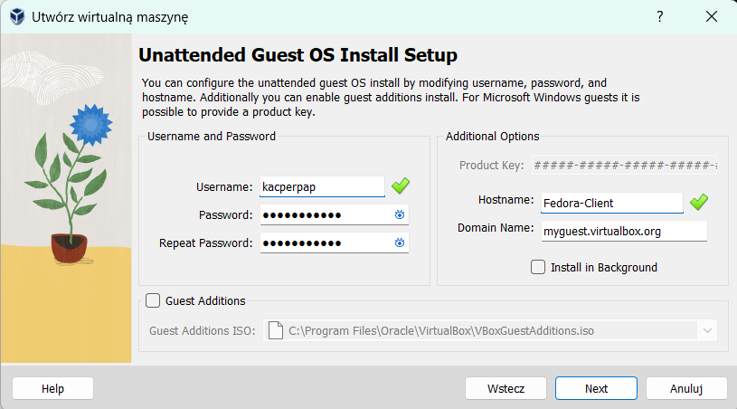

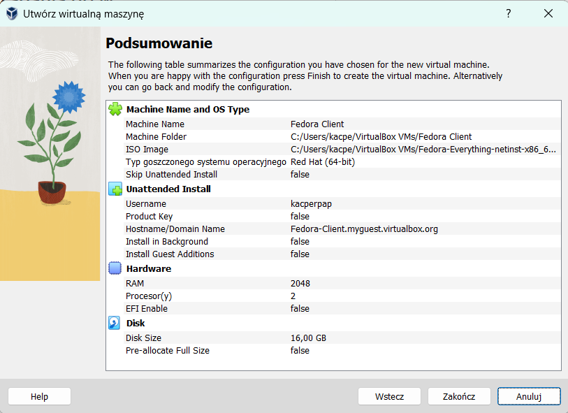

**2.Pobranie podstawowoych zależności**

Ansible do działania na hoście potrzebuje zainstalowanego pythona. Jednak dystrybucje fedory mają go już domyslnie zainstalowanego. Ponadto instalujemy `sshd` oraz `tar`. (`sshd` jest również domyslnie zainstalowane)

```
dnf -y install tar
```

**3. Hostname**

Na nowym hoście korzystamy z utworzonego użytkownika bądź tworzymy nowego. 

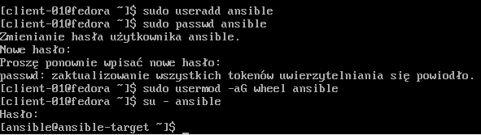

Ustawiamy `hostname`, który pozwoli zidentyfikować maszynę w sieci (również po stronie maszyny zarządzającej). Korzystamy z polecenia:

```
sudo hostnamectl set-hostname <hostname>
```

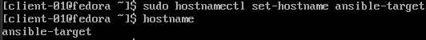

**4. Wprowadzanie nazw DNS dla maszyn wirtualnych**

Na dystrybucji fedory definicje DNS znajdują się w pliku: `/etc/hosts`. Dodajemy tam do adresu loopback, hostname aktualnej maszyny, oraz adres w sieci lokalnej i hostname dla drugiej maszyny:

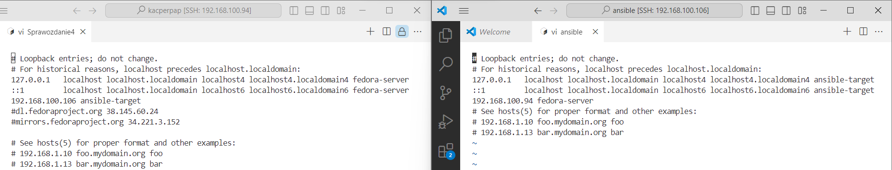

Weryfikujemy poprawność połączenia i rozwiązywania nazw:

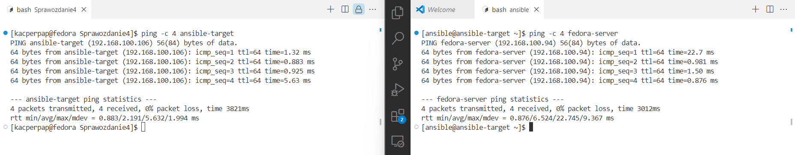

**5. Wymiana kluczy**

W celu wymiany kluczy pomiędzy hostami, najpierw tworzymy je za pomocą polecenia:

```bash
ssh-keygen -t <type:dsa/rsa/ed25519/ecdsa> -f <path>
```

Dodanie ścieżki spowoduje konieczność ustawienia odpowiednich uprawnień do katalogu z kluczami (700) oraz do samych kluczy: prywatnego (600) i publiczniego (644). Sposób konfiguracji pliku konfiguracyjnego `/etc/ssh/sshd` w razie problemów jest opisany na: [https://www.ibm.com/support/pages/configuring-ssh-login-without-password](https://www.ibm.com/support/pages/configuring-ssh-login-without-password).

Wymiany kluczy możemy dokonać poprzez polecenie:
```bash
ssh-copy-id -i <path_to_pub_key> user@hostname
```

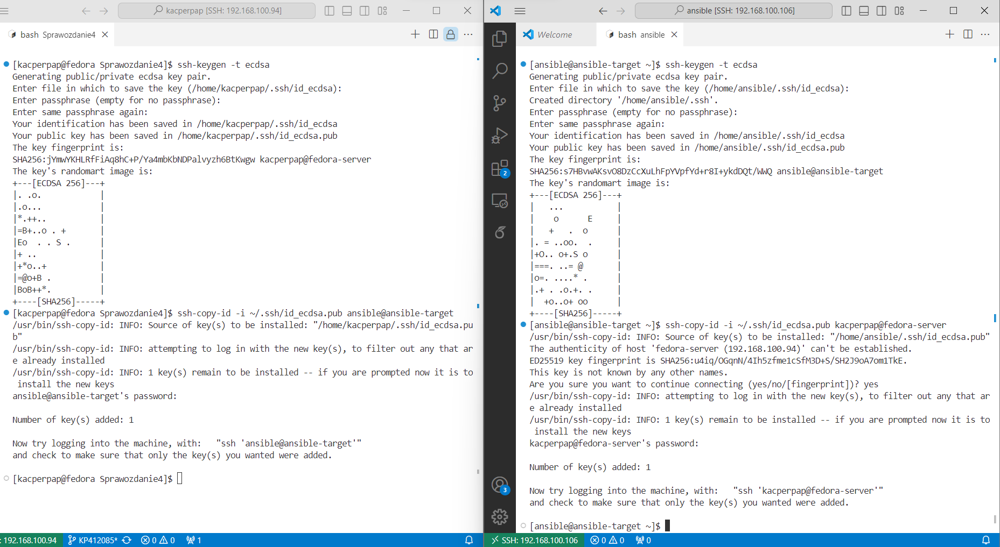

Należy pamiętać, aby dodać klucz publiczny do katalogu `known-hosts` również maszyny na której zainstalowany jest ansible, tak aby mogła łączyć się poprzez ssh sama ze sobą bez konieczności podawania hasła.

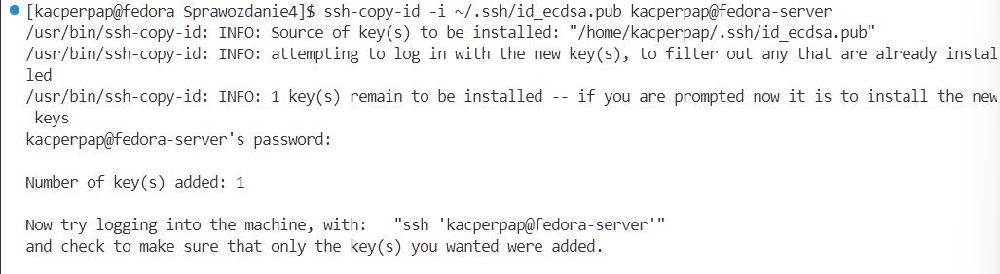


***UWAGA, zmiana domyślnej nazwy klucza powoduje, że nie jesteśmy w stanie łączyć się bez podawania hasła. Sprawdzając logi ssh poprzez komendę:***
```bash
ssh -vvv user@hostname
```
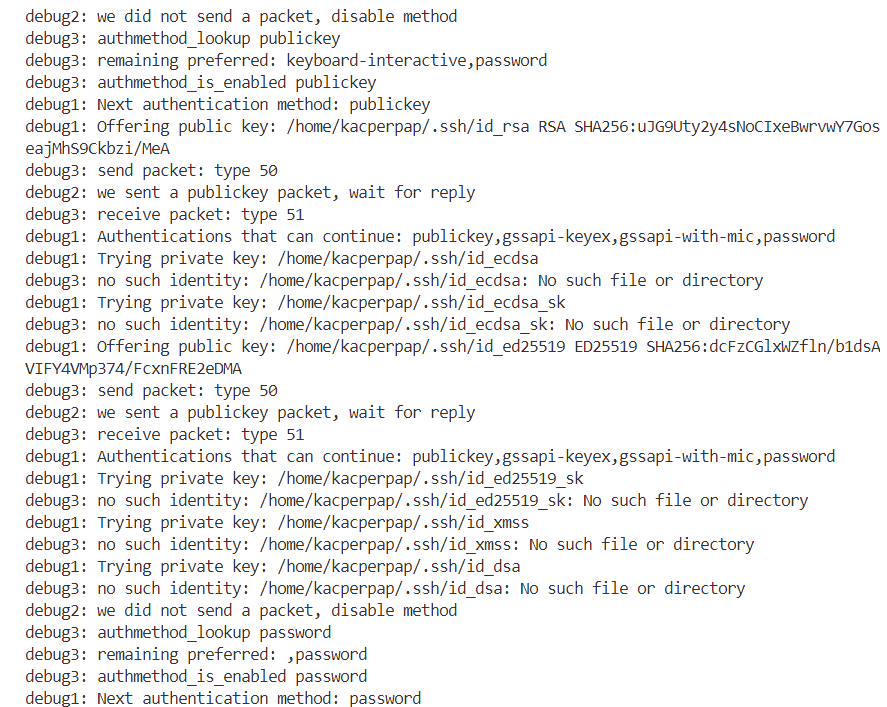

***Można zauważyć, że przy takim połączeniu domyślnie przeszukiwany jest katalog ~/.ssh i sprawdzane jest istnienie klucza id_rsa, id_ecdsa, id_ed25519, id_ed25519_sk, id_xmss, id_dsa. Oznacza to, że większa liczba kluczy tego samego typu, lub z innymi nazwami wymagałaby dodatkowej konfiguracji, którą można pominąć pozostawiając domyślną nazwę klucza***

# Inwentaryzacja i zdalne wywoływanie procedur

Po zakończeniu konfiguracja maszyn i ich wzajemnych połączeń, możemy przejść do używania ansibla w celu dalszej konfiguracji.

**1. Dodanie pliku inwentaryzacji**
Pliki inwentaryzacji definiują hosty zarządzane przez ansibla. Można je tworzyć w formacie `.ini` lub `.yaml`. Ponadto umożliwiają m.in tworzenie grup parent-children, czy definiowanie różnych użytkowników, do któych będziemy się łączyć na hostach. Zdefiniowany plik inwentaryzacji w moim przypadku wygląda następująco:

```yaml
all:
  children:
    Orchestrators:
      hosts:
        orchestrator:
          ansible_host: fedora-server
          ansible_user: kacperpap

    Endpoints:
      hosts:
        ep-01:
          ansible_host: ansible-target
          ansible_user: ansible
```

**2. Wysłanie żądania ping do wszystkich maszyn**

Sprawdzamy poprawność połączeń i definicji pliku, wywołując prosty skrypt ansibla. Ansible wysyła zdefiniowany jako program `pythona` skrypt na wszystkie hosty wyszczególnione w poleceniu i dostępne w pliku inwentaryzacji, po czym uruchamia je na docelowym hoście, kasuje i kończy działania zwracjąc komunikat na hoście nadrządcy. (skrypt ten wywołując się z opcją all wywoła się również dla localhosta, dlatego należy oamiętać o dodaniu kluczy publicznych do katalogu known_hosts własnej maszyny) 

```bash
ansible -i inventory.yaml all -m ping
```

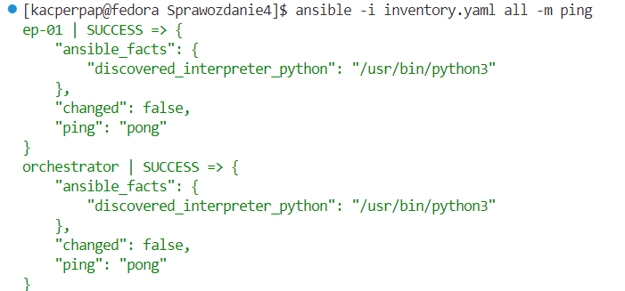

**3. Skopiowanie inventory na endpoints i wykonanie ping**

Aby skopiować plik `inventory.yaml` i wysłać go do wszystkich hostów zdefiniowanych jako `endpoints`, a następnie uruchomić na nich ping, możemy stworzyć prostego playbooka, który zdefiniuje te dwa zadania. (każda maszyna zna klucze publiczne wszystkich innych maszyn i swoje)

```yaml
- name: Copy inventory and ping all
  hosts: Endpoints
  remote_user: ansible

  tasks:
    - name: Copy inventory.yaml to ansible-target
      copy:
        src: /home/kacperpap/MDO2024_INO/ITE/GCL4/KP412085/Sprawozdanie4/inventory.yaml
        dest: /home/ansible/

    - name: Ping all hosts using the copied inventory file
      ansible.builtin.ping:
```

Wykonanie takiego playbooka możemy zainicjować poleceniem:
```bash
ansible-playbook -i <inventory_path> <playbook_path>
```
Wynik takiego polecenia jest podsumowaniem działania playbooka i jego tasków. Dzięki definicji poszczególnych tasków możemy rozróżnić każdy etap i dowiedzieć się czy zadanie zostało wykonane poprawnie.


**4. Aktualizacja pakietów przez ansible**
Aktualizacja pakietów wymaga uprawnień grupy `wheel`. Powoduje to, że polecenie, które ansible musi wykonać wygląda następująco:
```bash
sudo dnf update
```
Zgodnie z dokumentacją ansibla, możemy skorzystać w playbook'u z parametru `become`, którego domyślna wartość `true`, spowoduje, że zadania, w których zakresie będzie ten parametr, zostaną wykonane z uprawnieniami `root`. Konieczne jest jednak w tym wypadku podanie hasła. Zgodnie z [dokumentacją ansibla dotyczącą playbooks_privilege_escalation](https://docs.ansible.com/ansible/latest/playbook_guide/playbooks_privilege_escalation.html), dodajemy podczas wywołania playbooka parametr `--ask-become-pass`:

```bash
ansible -i inventory.yaml --ask-become-pass <path_to_playbook>
```

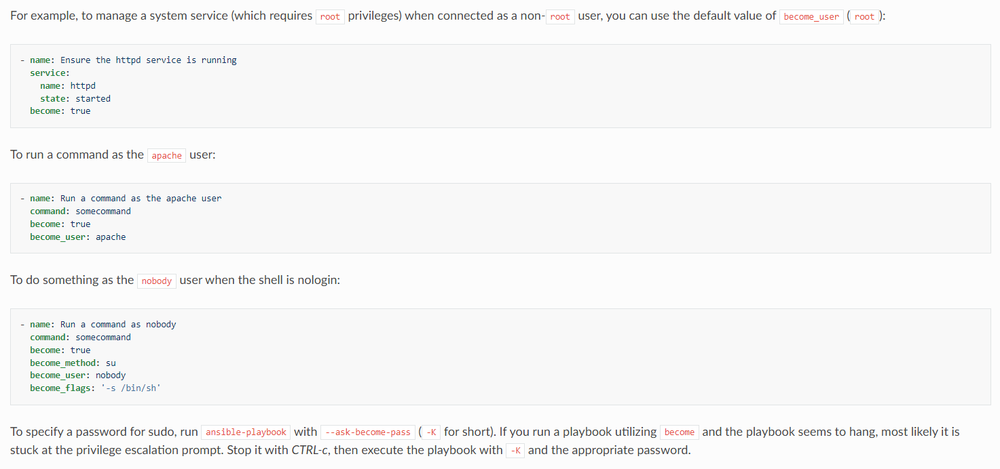

Dla playbooka o takiej definicji:

```bash
- name: Update packages on target system
  hosts: Endpoints
  tasks:
    - name: Upgrade all packages
      ansible.builtin.dnf:
        name: "*"
        state: latest
      become: true
```

Otrzymujemy rezultat (paczki były już zaktualizowane):
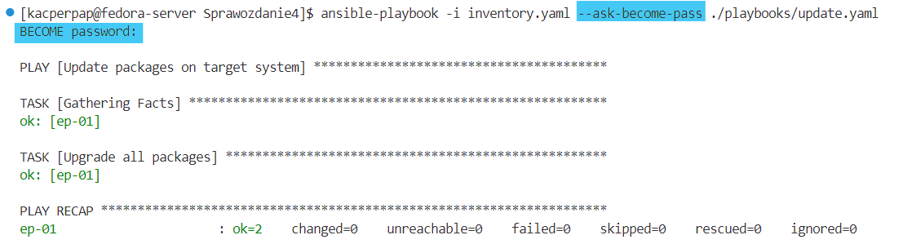

***UWAGA, Parametr state: latest w module Ansible dnf oznacza, że wszystkie pakiety, które są już zainstalowane w systemie, powinny być zaktualizowane do najnowszej dostępnej wersji. Brak tego parametru może powodować że różne werjse tej samej paczki (u mnie błąd pojawił się z paczkami wlroots0.14-devel oraz wlroots0.15-devel) będą aktualizowane, co zakończy się błędem.***

**5. Restart usługi sshd**

Analogicznie do poprzedniego playbooka, podajemy parametr `become: true` oraz `--ask-become-pass`. Zdefiniowany playbook w taki sposób kończy się poprawnym rezultatem:

```bash
- name: Restart ssh deamon
  hosts: Endpoints
  become: true
  tasks:
    - name: Use systemd to restart running sshd deamon
      systemd:
        name: sshd
        state: restarted
```

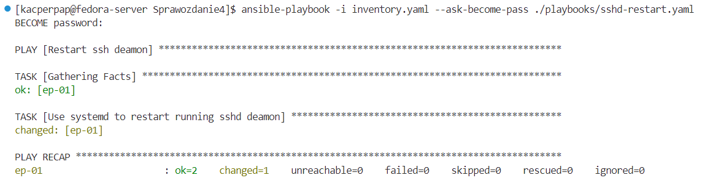

Zwrócony kod `changed` oznacza, że ansible zmienił zastany stan maszyny, ponieważ doprowadził do restartu, działającego demona `sshd`.


**6. Wyłączenie sshd/ odłączenie karty sieciowej**

Na systemie fedora nie ma domyslnie zainstlowanego serwisu `rngd`. Po aktuazliacji paczek i restarcie demona `ssh` zatrzymuję `sshd` na maszynie `ansible-target` i próbuję ponownie wykonać wcześniejszego playbooka z przesyłaniem pliku inventory i pingowaniem wszystkich maszyn:

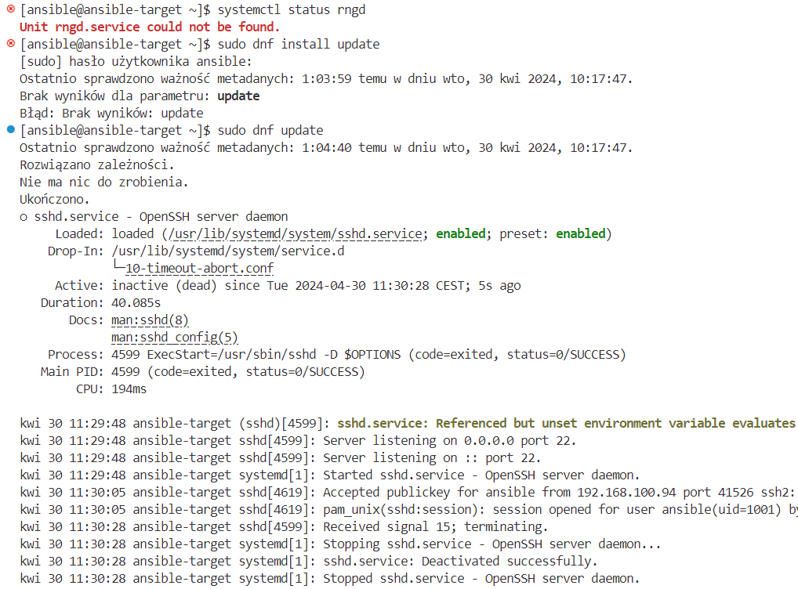

Rezultat jest następujący:

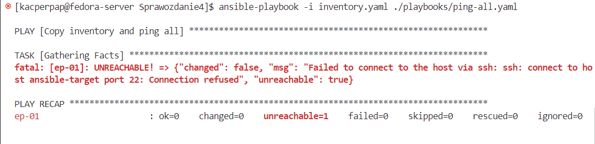

Zwracany kod błędu jest następujący:
```
fatal: [ep-01]: UNREACHABLE! => {"changed": false, "msg": "Failed to connect to the host via ssh: ssh: connect to host ansible-target port 22: Connection refused", "unreachable": true}
```

Następnie włączam `sshd`, ale odłączam `ansible-target` kabel sieciowy.

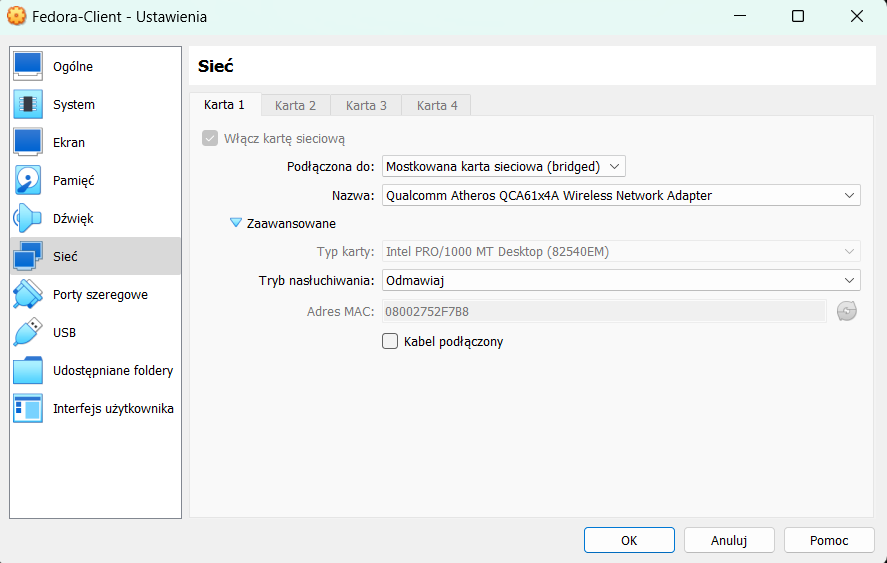

Wynikiem tego jest:

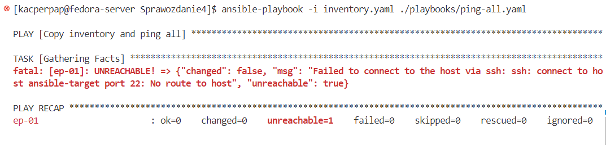

Komunikat błędu:
```
fatal: [ep-01]: UNREACHABLE! => {"changed": false, "msg": "Failed to connect to the host via ssh: ssh: connect to host ansible-target port 22: No route to host", "unreachable": true}
```

# Zarządzanie kontenerem

**1. Dodatkowa konfiguracja na maszynie docelowej**
Przed rozpoczęciem wdrażania aplikacji na docelowego hosta, musimy zainstalować na nim dockera. Robię to analogicznie do tego jak przedstawiłem w [Sprawozdaniu 1](../Sprawozdanie1/README.md). Ponadto potrzebujemy zainstalować pakiet `requests`, aby ansible mógł działać poprawnie z dockerem na tym hoście. Dlatego instalujemy menedżer pakietów `pip` oraz odpowiednią paczkę na `ansible-target`:

```bash
python3.12 -m ensurepip
python3.12 -m pip install requests
```
**2. Playbook wdrażający irssi z obrazu z DockerHub'a**
Podczas tworzenia pipelina Jenkinsa, publikuję kontener `irssi-deploy` na DockerHuba.

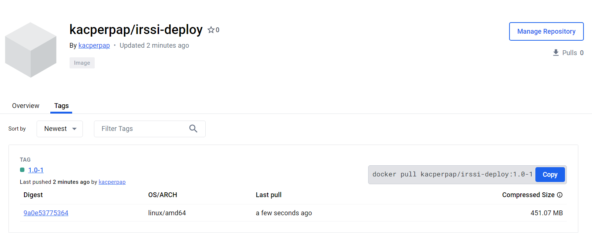

Pozwala to teraz na łatwe i szybkie pobranie i uruchomienie aplikacji w kontnerze. W tym celu tworzę `playbooka`:

```yaml
- name: Deploy irssi from rpm
  hosts: Endpoints
  tasks:
    - name: Pull irssi-deploy image from DockerHub
      docker_image:
        name: kacperpap/irssi-deploy:1.0-1
        source: pull
    
    - name: Run irssi container
      docker_container:
        name: irssi
        image: kacperpap/irssi-deploy:1.0-1
        state: started
        interactive: yes
        tty: yes
```

Definiujemy "odbiorców" zadań jako Endpoints. Deklarujemy 2 zadania, pierwsze z nich pobiera obraz. Kolejne zadanie uruchamia kontener ze zbudowanym obrazem w trybie interaktywnym, co pozwala na "ciągłe" działanie aplikacji. Korzystam przy tym ze zdefiniowanych modułów dostępnych w ansible takich jak `docker_image` oraz `docker_container`. Efekt działania jest następujący:

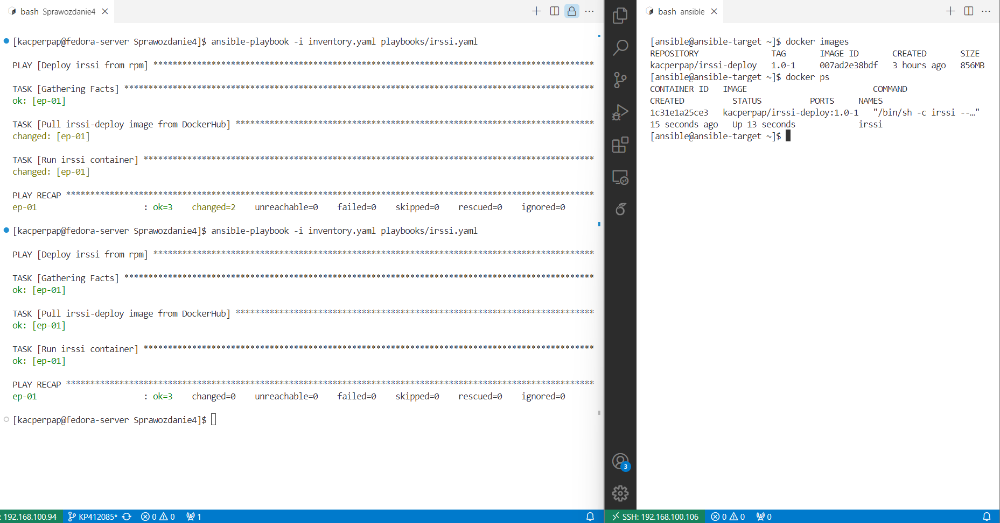

Polecenie za pierwszym razem wyświetliło status zwrotny jako changed, ponieważ stan maszyny docelowej został zmieniony -> pobrano obraz dockera i uruchomiono kontener. **Drugie wywołanie zwraca kod: ok, który oznacza, że zadanie wykonane w ramach playbooka, nie zmieniły stanu maszyny - obraz był już pobrany, a kontener działał.**

**3. Tworzenie roli**

Szkieletowanie `ansible-galaxy` umożliwia stworzenie hierarchicznej struktury katalogów (opisane w dokumentacji pod [playbooks_reuse_roles](https://docs.ansible.com/ansible/latest/playbook_guide/playbooks_reuse_roles.html)), z jasno sprecyzowanymi podkatalogami, która zapewnia ustandaryzowanie i zwiększa przenośność, niezawodność i ogólność tworzonych zadań. Po wygenerowaniu w nowym katalogu `roles` struktury katalogów poleceniem:

```bash
ansible-galaxy init deploy-irssi
```

Powstaje struktura analogiczna do:

>roles/
>    common/               # this hierarchy represents a "role"
>        tasks/            #
>            main.yml      #  <-- tasks file can include smaller files if warranted
>        handlers/         #
>            main.yml      #  <-- handlers file
>        templates/        #  <-- files for use with the template resource
>            ntp.conf.j2   #  <------- templates end in .j2
>        files/            #
>            bar.txt       #  <-- files for use with the copy resource
>            foo.sh        #  <-- script files for use with the script resource
>        vars/             #
>            main.yml      #  <-- variables associated with this role
>        defaults/         #
>            main.yml      #  <-- default lower priority variables for this role
>        meta/             #
>            main.yml      #  <-- role dependencies
>        library/          # roles can also include custom modules
>        module_utils/     # roles can also include custom module_utils
>        lookup_plugins/   # or other types of plugins, like lookup in this case
>
>    webtier/              # same kind of structure as "common" was above, done for the webtier role
>    monitoring/           # ""
>    fooapp/               # ""

W pliku `tasks/main.yml` tworzymy zadanie, analogiczne do poprzedniego z pobieraniem obrazu i uruchamianiem kontenera:

```yaml
---
- name: Pull docker image from DockerHub
  docker_image:
    name: "kacperpap/irssi-deploy:{{ VERSION }}-{{ RELEASE }}"
    source: pull

- name: Run irssi container
  docker_container:
    name: irssi
    image: "kacperpap/irssi-deploy:{{ VERSION }}-{{ RELEASE }}"
    state: started
    tty: yes
    interactive: yes
```

Parametry dodajemy do pliku umieszczonego w `defaults/main.yml`:
```
---
VERSION: 1.0
RELEASE: 1
```

Teraz definiujemy nowego playbooka, w którym korzystamy z utworzonej roli:
```yaml
- name: Deploy irssi using deploy-irssi role
  hosts: Endpoints
  roles:
    - /home/kacperpap/MDO2024_INO/ITE/GCL4/KP412085/Sprawozdanie4/roles/deploy-irssi
```

Wynik działania playbooka (obraz był już dostępny po wcześniejszym pobraniu):
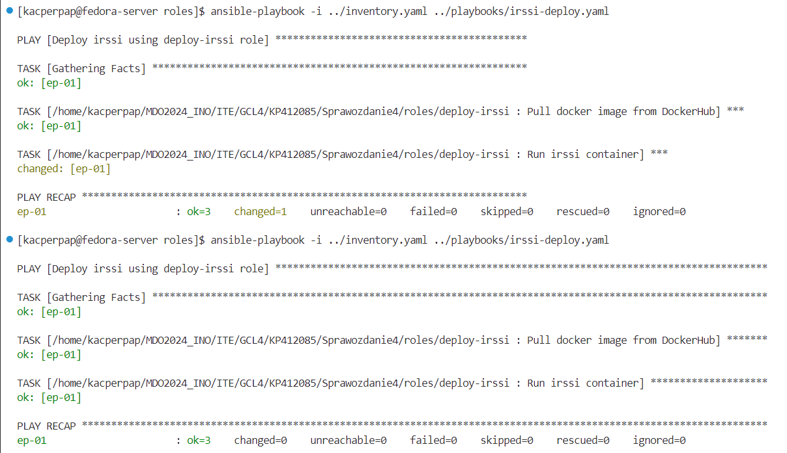


# Instalacje nienadzorowane

**1. Plik odpowiedzi**

Podczas instalacji systemu z rodziny RHEL (RHEL, Fedora, CentOS), po uzupełnieniu instalatora zapisywany jest w systemie plik odpowiedzi. Jest to plik z konfiguracją systemu uzupełnioną podczas instalacji, zapisywany w pliku `anaconda-ks.cfg` w katalogu domowym użytkownika `root`. 
>Kickstart installations offer a means to automate the installation process, either partially or fully. Kickstart files contain answers to all questions normally asked by the installation program, such as what time zone do you want the system to use, how should the drives be partitioned or which packages should be installed. Providing a prepared Kickstart file when the installation begins therefore allows the you to perform the installation automatically, without need for any intervention from the user. This is especially useful when deploying Fedora on a large number of systems at once.

Po zainstalowaniu systemu `Fedora 39` z instalatora sieciowego, kopiujemy plik odpowiedzi na podstawie którego będziemy konstruować nowy plik.

Pliki odpowiedzi nie zawierają zdefiniowanych zewnętrznych repozytoriów, ponieważ nie są one definiowane przez użytkownika podczas instalacji, tylko automatycznie odnajdowane. Dlatego pierwszą zmianą naszego pliku odpowiedzi jest dodanie lokalizacji serwerów lustrzanych z repozytorium fedory oraz aktualizacjami:
```bash
url --mirrorlist=http://mirrors.fedoraproject.org/mirrorlist?repo=fedora-39&arch=x86_64
repo --name=update --mirrorlist=http://mirrors.fedoraproject.org/mirrorlist?repo=updates-released-f39&arch=x86_64
```

Ponadto w celu wyczyszczenia dysku przed instalacją systemu wykonujemy polecenie:
```bash
clearpart --all
```
Definiuje ono wyczyszczenie wszystkich istniejących partycji na dysku, co oznacza usunięcie wszelkich istniejących danych na dysku takich jak partycje, tablice partycji, dane.

Tak zdefiniowany plik dodajemy na naszą gałąź na GitHub'ie aby podczas instalacji systemu można było w sieci wskazać ten plik konfiguracyjny: [anaconda-ks.cfg](./anaconda-ks.cfg).

```ini
# Generated by Anaconda 39.32.6
# Generated by pykickstart v3.48
#version=DEVEL
# Use graphical install
graphical

# Keyboard layouts
keyboard --vckeymap=pl --xlayouts='pl'
# System language
lang pl_PL.UTF-8


# Repository
url --mirrorlist=http://mirrors.fedoraproject.org/mirrorlist?repo=fedora-39&arch=x86_64
repo --name=update --mirrorlist=http://mirrors.fedoraproject.org/mirrorlist?repo=updates-released-f39&arch=x86_64


%packages
@^custom-environment

%end

# Run the Setup Agent on first boot
firstboot --enable

# Generated using Blivet version 3.8.1
ignoredisk --only-use=sda
autopart
# Partition clearing information
clearpart --all

# System timezone
timezone Europe/Warsaw --utc

# Root password
rootpw --lock
user --groups=wheel --name=client --password=$y$j9T$udPBpd.XCwrczYvte4YM37Mj$/jI8vRhQgoc84/6uurFbJpt4.2wjji6DQdkMrebzwE/ --iscrypted

reboot
```

Następnie uruchamiamy instalację systemu, i podczas działania programu rozruchowego `GRUB` wybieramy opcję `e`, która przenosi nas do edytora linii poleceń Gruba, która pozwala nam edytować opcje rozruchowe. To w tym miejscu zgodnie z dokumentacją należy dodać poniższą linijkę:
 - [https://docs.fedoraproject.org/en-US/fedora/f36/install-guide/advanced/Boot_Options/](https://docs.fedoraproject.org/en-US/fedora/f36/install-guide/advanced/Boot_Options/)
 - [https://anaconda-installer.readthedocs.io/en/latest/boot-options.html](https://anaconda-installer.readthedocs.io/en/latest/boot-options.html)

 ```bash
init.ks=https://raw.githubusercontent.com/InzynieriaOprogramowaniaAGH/MDO2024_INO/KP412085/ITE/GCL4/KP412085/Sprawozdanie4/anaconda-ks.cfg
```

Zamiast korzystania z protokołu `NFS` do o pobrania pliku konfiguracyjnego Kickstart (/filename) z serwera określonego przez next-server:
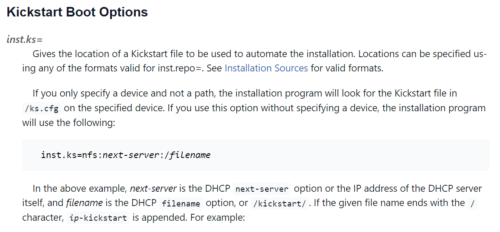

Korzystamy z pobrania pliku z GitHub'a za pomocą `HTTPS`:
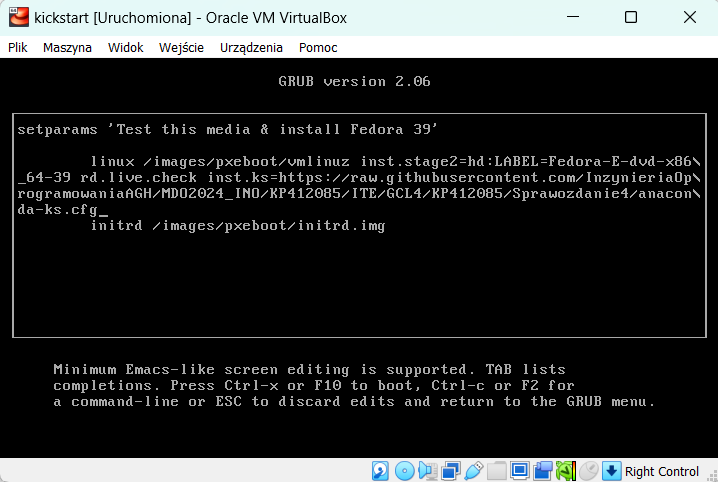

Po zatwierdzeniu zmian za pomcą `ctrl + x`, następuje automatyczna instalacja 406 pakietów RPM oraz reboot systemu:
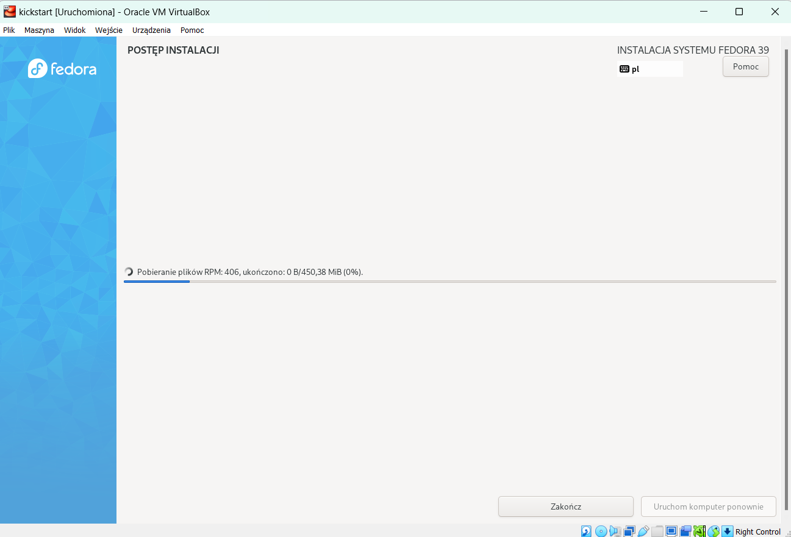


# Rozszerzenie instalacji o repozytoria i zależności konieczne do uruchomienia aplikacji irssi

**1. %post section**

Plik odpowiedzi pozwala na dodawnia skryptów `pre` oraz `post` instalacyjncyh. Umożliwiają one dodawnie konfiguracji, czy pobieranie dodatkowego oprogramowania na towrzony system. Instrukcja pokazująca przykładowy skrypt postinstalacyjny dostępna jest na stronie: [https://docs.fedoraproject.org/en-US/fedora/f36/install-guide/appendixes/Kickstart_Syntax_Reference/#sect-kickstart-postinstall](https://docs.fedoraproject.org/en-US/fedora/f36/install-guide/appendixes/Kickstart_Syntax_Reference/#sect-kickstart-postinstall). 

Zgodnie z tym tworzymy sekcję `%post` z dwoma dodatkowymi parametrami:
- `--erroronfail`
> Display an error and halt the installation if the script fails. The error message will direct you to where the cause of the failure is logged.
- `--log=`
> Logs the script’s output into the specified log file

W sekcji post zgodnie z poprzednim sposobem pobierania aplikacji z DockerHub, musimy najpierw zapewnić środowisko `Dockera`, który pozwoli nam na szybkie wdrożenie aplikcaji. Gdybym korzystał z paczki `.src.rpm` budowanej i zapisywanej jako artefatk w Jenkinsie, musiałbym w tej sekcji zdefiniować kilkanaście depencecji budujących paczkę, runtimowych oraz programu do budowania (rpm-dev-tools), a następnie zbudować, zainstalować i uruchomić aplikację. `Docker` umożliwia konteneryzację całego procesu, poprzez stworzenie gotowego programu z zależnościami i zbudowaną aplikacją, nakładając niewielki narzut na wirtualizację systemową, co jezt znacznie lepszym rozwiązaniem (oprócz tego, że sama aplikacja nie jest "stworzona" do działania w kontenerze, jest interaktywnym komunikatorem).


