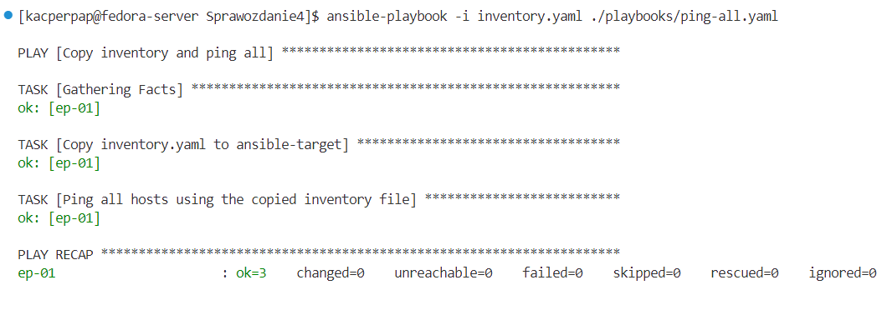

# Sprawozdanie 4

# Instalacja zarządcy ansible i wstępna konfiguracja maszyn

**1.Utworzenie drugiej VM**

Druga maszyna wirtualna ma służyć jako host konfigurowany przez ansibla. Jako, że ansible jest `agentless`, zainstalowanie go będzie wymagane tylko na maszynie, która będzie pełniła rolę zarządcy. Dlatego na maszynie z poprzednich zajęć instalujemy ansible z repozytorium fedory poprzez:

```bash
dnf -y install ansible
```

Tworzymy drugą VM z tego samego obrazu. Dodajemy do niej użytkownika oraz bazowo konfigurujemy maszynę.


**2.Pobranie podstawowoych zależności**

Ansible do działania na hoście potrzebuje zainstalowanego pythona. Jednak dystrybucje fedory mają go już domyslnie zainstalowanego. Ponadto instalujemy `sshd` oraz `tar`. (`sshd` jest również domyslnie zainstalowane)

```
dnf -y install tar
```

**3. Hostname**

Na nowym hoście korzystamy z utworzonego użytkownika bądź tworzymy nowego. 


Ustawiamy `hostname`, który pozwoli zidentyfikować maszynę w sieci. Korzystamy z polecenia:

```
sudo hostnamectl set-hostname <hostname>
```


**4. Wprowadzanie nazw DNS dla maszyn wirtualnych**

Na dystrybucji fedory definicje DNS znajdują się w pliku: `/etc/hosts`. Dodajemy tam do adresu loopback, hostname aktualnej maszyny, oraz adres w sieci lokalnej i hostname dla drugiej maszyny:


Weryfikujemy poprawność połączenia i rozwiązywania nazw:


**5. Wymiana kluczy**

W celu wymiany kluczy pomiędzy hostami, najpierw tworzymy je za pomocą polecenia:

```bash
ssh-keygen -t <type:dsa/rsa/ed25519/ecdsa> -f <path>
```

Dodanie ścieżki spowoduje konieczność ustawienia odpowiednich uprawnień do katalogu z kluczami (700) oraz do samych kluczy: prywatnego (600) i publiczniego (644). Sposób konfiguracji pliku konfiguracyjnego `/etc/ssh/sshd` w razie problemów jest opisany na: [https://www.ibm.com/support/pages/configuring-ssh-login-without-password](https://www.ibm.com/support/pages/configuring-ssh-login-without-password).

Wymiany kluczy możemy dokonać poprzez polecenie:
```bash
ssh-copy-id -i <path_to_pub_key> user@hostname
```


Należy pamiętać, aby dodać klucz publiczny do katalogu `known-hosts` również maszyny na której zainstalowany jest ansible, tak aby mogła łączyć się poprzez ssh sama ze sobą bez konieczności podawania hasła.


***UWAGA, zmiana domyślnej nazwy klucza powoduje, że nie jesteśmy w stanie łączyć się bez podawania hasła. Sprawdzając logi ssh poprzez komendę:***
```bash
ssh -vvv user@hostname
```


***Można zauważyć, że przy takim połączeniu domyślnie przeszukiwany jest katalog ~/.ssh i sprawdzane jest istnienie klucza id_rsa, id_ecdsa, id_ed25519, id_ed25519_sk, id_xmss, id_dsa. Oznacza to, że większa liczba kluczy tego samego typu, lub z innymi nazwami wymagałaby dodatkowej konfiguracji, którą można pominąć pozostawiając domyślną nazwę klucza***

# Inwentaryzacja i zdalne wywoływanie procedur

Po zakończeniu konfiguracja maszyn i ich wzajemnych połączeń, możemy przejść do używania ansibla w celu dalszej konfiguracji.

**1. Dodanie pliku inwentaryzacji**
Pliki inwentaryzacji definiują hosty zarządzane przez ansibla. Można je tworzyć w formacie `.ini` lub `.yaml`. Ponadto umożliwiają m.in tworzenie grup parent-children, czy definiowanie różnych użytkowników, do któych będziemy się łączyć na hostach. Zdefiniowany plik inwentaryzacji w moim przypadku wygląda następująco:

```yaml
all:
  children:
    Orchestrators:
      hosts:
        orchestrator:
          ansible_host: fedora-server
          ansible_user: kacperpap

    Endpoints:
      hosts:
        ep-01:
          ansible_host: ansible-target
          ansible_user: ansible
```

**2. Wysłanie żądania ping do wszystkich maszyn**

Sprawdzamy poprawność połączeń i definicji pliku, wywołując prosty skrypt ansibla. Ansible wysyła zdefiniowany jako program `pythona` skrypt na wszystkie hosty wyszczególnione w poleceniu i dostępne w pliku inwentaryzacji, po czym uruchamia je na docelowym hoście, kasuje i kończy działania zwracjąc komunikat na hoście nadrządcy.


**3. Skopiowanie inventory na endpoints i wykonanie ping**

Aby skopiować plik `inventory.yaml` i wysłać go do wszystkich hostów zdefiniowanych jako `endpoints`, a następnie uruchomić na nich ping, możemy stworzyć prostego playbooka, który zdefiniuje te dwa zadania.

```yaml
- name: Copy inventory and ping all
  hosts: Endpoints
  remote_user: ansible

  tasks:
    - name: Copy inventory.yaml to ansible-target
      copy:
        src: /home/kacperpap/MDO2024_INO/ITE/GCL4/KP412085/Sprawozdanie4/inventory.yaml
        dest: /home/ansible/

    - name: Ping all hosts using the copied inventory file
      ansible.builtin.ping:
```

Wykonanie takiego playbooka możemy zainicjować poleceniem:
```bash
ansible-playbook -i <inventory_path> <playbook_path>
```
Wynik takiego polecenia jest podsumowaniem działania playbooka i jego tasków. Dzięki definicji poszczególnych tasków możemy rozróżnić każdy etap i dowiedzieć się czy zadanie zostało wykonane poprawnie.



**4. Wyłączenie sshd/ odłączenie karty sieciowej**

Na systemie fedora nie ma domyslnie zainstlowanego serwisu `rngd`. Po aktuazliacji paczek i restarcie demona `ssh` zatrzymuję `sshd` na maszynie `ansible-target` i próbuję ponownie wykonać wcześniejszego playbooka:


Rezultat jest następujący:


Zwracany kod błędu jest następujący:
```
fatal: [ep-01]: UNREACHABLE! => {"changed": false, "msg": "Failed to connect to the host via ssh: ssh: connect to host ansible-target port 22: Connection refused", "unreachable": true}
```

Następnie włączam `sshd`, ale odłączam `ansible-target` kabel sieciowy.


Wynikiem tego jest:


Komunikat błędu:
```
fatal: [ep-01]: UNREACHABLE! => {"changed": false, "msg": "Failed to connect to the host via ssh: ssh: connect to host ansible-target port 22: No route to host", "unreachable": true}
```

# Zarządzanie kontenerem

**1. Dodatkowa konfiguracja na maszynie docelowej**
Przed rozpoczęciem wdrażania aplikacji na docelowego hosta, musimy zainstalować na nim dockera. Robię to analogicznie do tego jak przedstawiłem w [Sprawozdaniu 1](../Sprawozdanie1/README.md). Ponadto potrzebujemy zainstalować pakiet `requests`, aby ansible mógł działać poprawnie z dockerem na tym hoście. Dlatego instalujemy menedżer pakietów `pip` oraz odpowiednią paczkę na `ansible-target`:

```bash
python3.12 -m ensurepip
python3.12 -m pip install requests
```
**2. Playbook wdrażający irssi z obrazu z DockerHub'a**
Podczas tworzenia pipelina Jenkinsa, publikuję kontener `irssi-deploy` na DockerHuba.


Pozwala to teraz na łatwe i szybkie pobranie i uruchomienie aplikacji w kontnerze. W tym celu tworzę `playbooka`:

```yaml
- name: Deploy irssi from rpm
  hosts: Endpoints
  tasks:
    - name: Pull irssi-deploy image from DockerHub
      docker_image:
        name: kacperpap/irssi-deploy:1.0-1
        source: pull
    
    - name: Run irssi container
      docker_container:
        name: irssi
        image: kacperpap/irssi-deploy:1.0-1
        state: started
        interactive: yes
        tty: yes
```

Definiujemy "odbiorców" zadań jako Endpoints. Deklarujemy 2 zadania, pierwsze z nich pobiera obraz. Kolejne zadanie uruchamia kontener ze zbudowanym obrazem w trybie interaktywnym, co pozwala na "ciągłe" działanie aplikacji. Korzystam przy tym ze zdefiniowanych modułów dostępnych w ansible takich jak `docker_image` oraz `docker_container`. Efekt działania jest następujący:


**3. Tworzenie roli**

Szkieletowanie `ansible-galaxy` umożliwia

