# Sprawozdanie 5

Celem ćwiczeń dotyczących kubernetesa, było przekazanie wiedzy na temat wdrożenia aplikacji za pomocą orkiestratora kontenerów.

# Instalacja klastra kubernetes

Kubernetes moży być zainstalowany przez różne implementacje. Istnieje wiele różnych sposobów instalacji Kubernetes, takich jak rozszerzenie w  `Docker Desktop`, `Minikube`, `kind`, `kubeadm`, czy zarządzane usługi w chmurze (np. `GKE`,`EKS`, `AKS`). Jest to spowodowane tym, że każde z tych środowisk, oprócz silnika k8s dostarcza dodatkowe funkcjonalności przydatne w różnych sytuacjach. Najczęstszym wyborem instalacji dla potrzeb lokalnych i testowych wdrożeń aplikacji poprzez k8s są Minikube, Docker Desktop, i kind. Umożliwiają tworzenie lokalnego klastra na pojednyczej maszynie oraz mają mniej skomplikowaną konfigurację klastra (co oznacza mniejszą kontrolę, która jest już wymagana w rzeczywistych środowiskach produkcyjnych). Z tego powodu na maszynie wirtualnej do celów testowych pobieramy `minikube`.

Pracując na maszynie wirtualnej z systemem `Fedora 39` pobieram minikube poprzez wykorzystanie menadżera pakietów RPM za pomocą polecenia: 

```bash
curl -LO https://storage.googleapis.com/minikube/releases/latest/minikube-latest.x86_64.rpm
sudo rpm -Uvh minikube-latest.x86_64.rpm
```

Następnie uruchamiam instalację, konfigurację oraz uruchomienie kontenera minikube za pomocą polecenia:
```bash
minikube start
```


Następnie uruchamiam `dashboard` dostępny w minikube poprzez:
```bash
minikube dashboard
```

Powoduje to utworzenie przekierowania portów z hosta maszyny na której pracuje (z jej adresu localhost), do kontenera maszyny wirtualnej, na port na którym działa dashboard uruchomiony jako kontener. 


Domyślnie w przestrzeni nazw `kubernetes-dashboard` utworzonej podczas instalacji minikube, tworzonę są serwisy działające na portach `8000`, `9090`, które pozwalają na komunikację wewnątrz klastra z aplikacją dashboard. VSCode automatycznie znajduje wolny dynamiczny port i tworzy przekierowanie aby umożliwić połączenie z się tym dshboardem z poza klastra k8s. 


Ponadto aby ułatwić sobie pracę dodajemy alias, tak aby polecenia `minikube kubectl` (k8s jest zainstalowany wewnątrz minikube wieć jego api jest widoczne tylko poprzez api minikube) zamienić na `kubectl`. Rozwiązanie to tworzy jednak alias tylko w obecnym terminalu, dlatego aby zachować te ustawienia tworzymy symlink zgodnie z dokumentacją, za pomocą polecenia:

```bash
ln -s $(which minikube) /usr/local/bin/kubectl
```


# Analiza posiadanego kontenera

Podczas tworzenia pipelina, jako rezultat końcowy publikowany był artefakt aplikacji irssi zapisany w Jenkinsie oraz obraz deployowy zapisywany na DockerHub'ie: [https://hub.docker.com/layers/kacperpap/irssi-deploy/1.0-1/images/sha256-9a0e5377536459321c860e313021b6086dbb3b3b2eb5a087672870a33d057fbd?context=repo](https://hub.docker.com/layers/kacperpap/irssi-deploy/1.0-1/images/sha256-9a0e5377536459321c860e313021b6086dbb3b3b2eb5a087672870a33d057fbd?context=repo). 

Kontener deployowy w celu poprawnego działania potrzebuje działania albo w trybie interaktywnym, albo poprzez przekazanie terminala. Można to osiągnąć w sposób jaki przedstawiłem w poprzednim sprawozdaniu, tj. poprzez uruchomienie z przekazaniem pseudo-terminala `tty` (brak interaktywnej sesji) oraz ustawieniem zmiennej środowiskowej `TERM` koniecznej do poprawnego działania `irssi`. Z takimi ustawieniami, kontener uruchomiony z aplikacją działa w trbie ciągłym. Jednak nie udostępnia on żadnego interfejsu/ funkcjonalności poprzez sieć, dlatego przekierowanie portów z hosta do maszyny mogłoby tylko "pomóc" wywołać polecenie otworzenia dodatkowej sesji (terminala, np. za pomocą docker exec -it <container_id>), a nie uzyskać dostęp do funkcjonalności. Dlatego zamieniam moją aplikację na prostą aplikację napisaną w Pythonie we `Flasku`, która udostępnia API do zamiany temperatury ze stopni fahrenheita na stopnie celsjusza na porcie 5000 dla adresów 0.0.0.0.


Pobieramy obraz aplikacji:


Uruchamiamy z przekierowaniem portów z maszyny wirtualnej do kontenera z aplikacją:
```bash
docker run --name temperature_converter -d -p 5000:5000 kacperpap/temperature_converter:0.1.0
```


Aplikacja taka zgodnie z potrzebami zadania, działa w trybie ciągłym w kontenerze oraz udostępnia prostą usługę sieciową. Odpowiedź na żądanie http wysłane do działającej aplikacji poprzez wysłanie zapytania na port 5000 localhosta maszyny wirtualnej zwraca poprawną odpowiedź:
```bash
curl http://localhost:5000/api/convert-fahrenheit-to-celsius?fahrenheit=100
```


# Uruchomienie aplikacji poprzez k8s w minikube

Aplikację możemy uruchomić na stosie k8s co umożliwi nam zarządzanie nią w dalszej częci podczas wdrażania w łatwieszy sposób. W tym celu musimy stowrzyć `poda`, czyli najmniejszą jednątkę pracy kubernetesa, uruchamiającą kontener z aplikacją oraz stworzyć seriws udostępniający niezmienne api dla uruchomionych podów (w póżniejszej części liczba uruchamianych podów w deploymencie będzie większa, a każdy z nich będzie posiadał inny adres IP, któy może zmieniać się wraz z manipulacjami podami - ich niszczeniem lub tworzeniem, przez co potrzebujemy dodatkowe stabilnego interfejsu udostępniającego nasze usługi)


W tym celu najpierw tworzymy poda uruchamiającego naszą aplikację:
```bash
kubectl run temperature-converter --image=kacperpap/temperature_converter:0.1.0 --port=5000 --labels=app=temperature-converter
```

Następnie tworzymy serwis:
```bash
kubectl expose pod temperature-converter --port=5000 --target-port=5000 --name=temperature-converter-service
```

Po czym przekierowujemy porty. 
***UWAGA! Przekierowanie portów należy zrobić zarówno na maszynie wirtualnej, co gwarantuje nam dostęp do poda poprzez serwis udostępniający API aplikacji z poda, oraz należy przekierować porty w VSCodoe, tak aby zapytanie na localhost i port serwisu na naszym hoście, zostało przekierowane do VM***

Wynik takiego działania jest następujący:


# Tworzenie wdrożenia automatycznego

Powyższe kroki można wykonać za pomocą definicji plików yaml. Pozwala to na automatyzację w przypadku bardziej rozbudowanych wdrożeń. Ponadto z całości definicji wdrożenia w k8s można za pomocą `Helm` utworzyć `helm chart` umożliwiający instalowanie całości wdrożenia za pomocą pojedynczej komendy. 

Aby wykonać wdrożenie okreslonej liczby replik aplikacji (z dodatkowymi możliwościami definicji wdrożenia) tworzymy plik [temperature-converter.deployment.yaml](./temperature-converter.deployment.yaml), który definiuje dokładnie to samo co poprzednie bezpośrednie uruchomienie poda poprzez kube-API, ale zawiera to w formie wdrożenia, i definiuje powstanie docelowo 2 replik:

```yaml
apiVersion: apps/v1
kind: Deployment
metadata:
  name: temperature-converter
spec:
  replicas: 2
  selector:
    matchLabels:
      app: temperature-converter
      tier: backend
  template:
    metadata:
      labels:
        app: temperature-converter
        tier: backend
    spec:
      containers:
      - name: temperature-converter
        image: kacperpap/temperature_converter:0.1.0
        ports:
        - containerPort: 5000
```

Analogicznie tworzymy plik [temperature-converter.service.yaml](./temperature-converter.service.yaml):
```yaml
apiVersion: v1
kind: Service
metadata:
  name: temperature-converter-service
spec:
  selector:
    app: temperature-converter
    tier: backend
  ports:
    - protocol: TCP
      port: 5000
      targetPort: 5000
```


Uruchomienie tych jednostek pracy k8s wykonujemy za pomocą polecenia:
```bash
kubectl apply -f <path_to_yaml>
```

Po dodtkowym uruchomieniu przekierowania portów jak poprzednio, możemy komunikować się z aplikacją z lokalnego hosta, a wynik wdrożenia wygląda następująco:


Powyższe dane przedstawione w `minikube dashboard`:


# Przygotowanie kilku wersji obrazu oraz testowanie zmian w deploymencie

Po wykonaniu automatycznego wdrożenia za pomocą definicji w plikach yaml, możemy spróbować wdrażać kilka wersji jednocześnie, aby sprawdzić, jak kubernetes zarządza różnymi wersjami aplikacji, oraz jakie są sposoby wdrażania. W tym celu w pierwszym kroku dodajemy na `DockerHub'a` dodatkowe wersje obrazów. W moim przypadku wersja `0.2.0` jest identyczna jak `0.1.0` (zmianie uległ jedynie tag), natomiast wersja `0.3.0` jest wersją błędną, która na etapie `CMD`, zamiast uruchamiać serwer gunicorn dla aplikacji napisanej we flasku, uruchamia progam `false`, którego kod zakończenia zawsze jest równy 1, co oznacza, że takie wdrożenie zakończy się porażką.

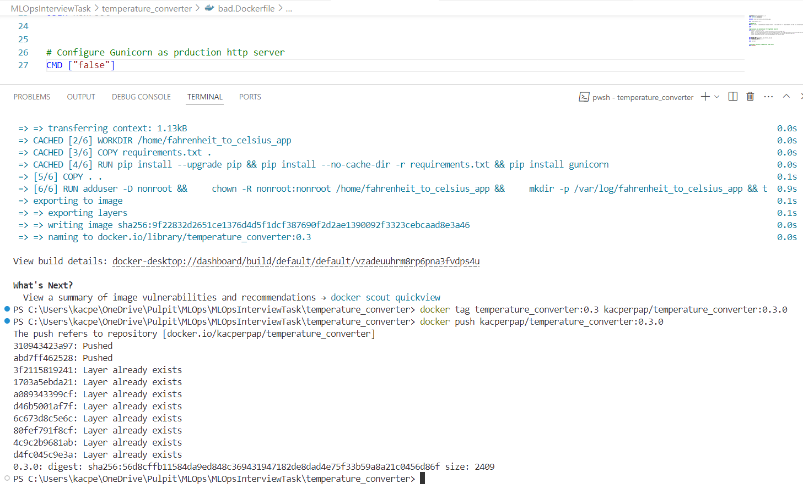

W taki sposób uzyskujemy 3 wersje aplikacji:
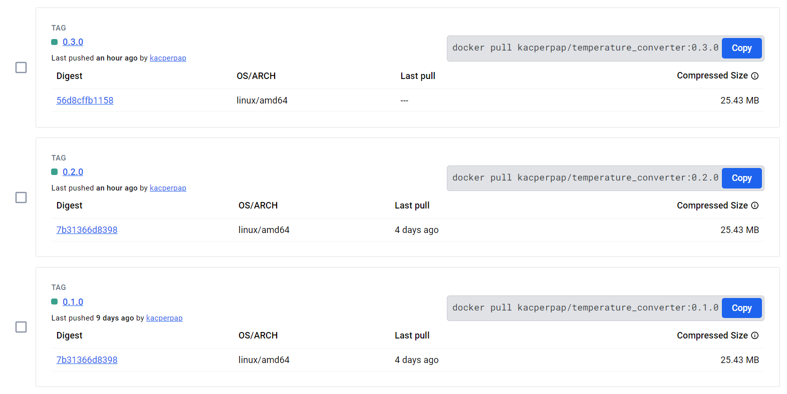


**1. Skalowanie replik w górę**

Zamiana liczby replik polega na zamianie pliku yaml (parametru `replicas`), a następnie zastosowaniu go poprzez `kubectl apply <.yaml>`. Po wykonaniu tego możemy sprawdzać obecny status wdrożenia np. za pomocą:
```bash
kubectl rollout status <deployment_name>
```


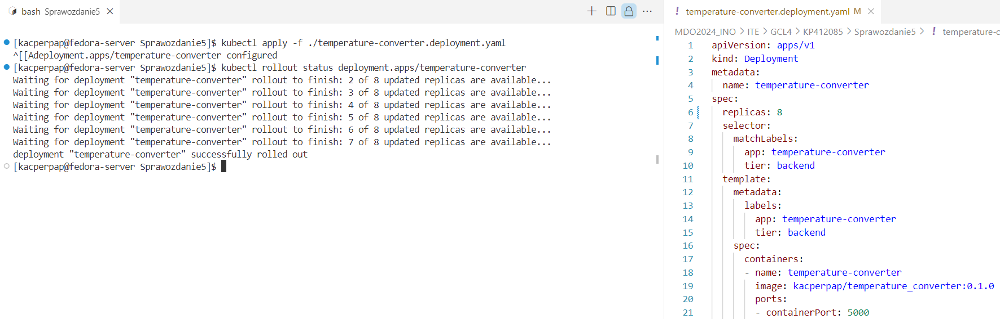

Jak widać na powyższym screenie zwiększanie liczby replik powoduje stworzenie i uruchomienie żądanej liczby podów. Operacja ta dla mojej małej aplikacji i małej liczby replik jest bardzo szybka, ale i tak można zobaczyć ją poprzez sprawdzenie statusu rollout (polecenie wyżej). Komunikaty zwracane podczas tworzenia to:
```bash
x of y updated replicas are available
```
Ten komunikat odnosi się do liczby replik, które zostały stworzone, zaktualizowane oraz są dostępne do obsługi ruchu. To znaczy, że te pody przeszły przez wszystkie etapy uruchamiania i przeszły testy gotowości. 

Przy tworzeniu większej ilości replik pojawiają się dodatkowo komunikaty:
```bash
x of y new replicas have been updated
```
Odnoszą się one do liczby replik, które zostały zaktualizowane do nowej wersji, ale niekoniecznie są jeszcze dostępne (czyli gotowe do obsługi ruchu). Oznacza to, że Kubernetes stworzył nowe pody ale te pody mogą jeszcze przechodzić przez proces uruchamiania, inicjalizacji i sprawdzania gotowości.

**2. Skalowanie w dół**

Skalowanie w dół jest procesem, który polega na zamknięciu działających replik. Jest to zazwyczaj szybki proces, ponieważ polega na wysłaniu sygnału kill do danych podów. 

Skalowanie w dół w moim przypadku z 24 do 1 repliki zajęło niecałe 2 sekundy, co można było sprawdzić poprzez polecenie:
```bash
kubectl get events --sort-by=.metadata.creationTimestamp
```

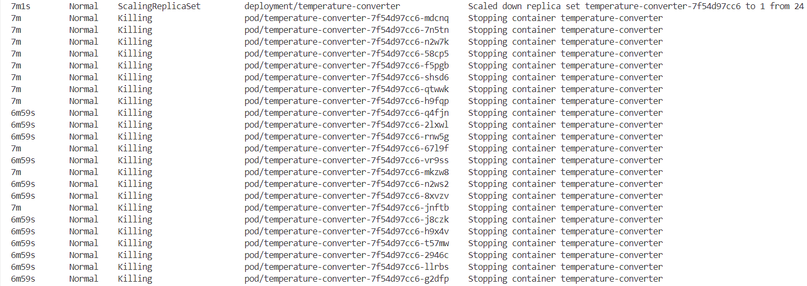

**3. Zmiejszenie liczby replik do 0**

Kubernetes umożliwia skalowanie do 0. Oznacza to, że cała struktura wdrożenia , czyli serwisy udostępniające usługi, load balancery zajmujące się balansowaniem ruchu, czy np. horizontal pod autoscalers pracujące nad automatycznym skalowaniem działają całe czasy, pomimo braku istnienia jakiegokolwiek poda samej usługi. Działanie takie powoduje jednak dalej zużywanie zasobów, na utrzyanie tych usług, co może nie być dobrym rozwiązaniem.

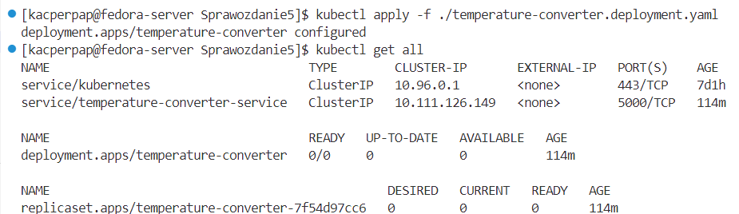

**4. Wdrażanie nowej wersji obrazu**

Zmieniamy definicję pliku yaml, w taki sposób, aby w polu `.template.spec.containers[0].image` podać nazwę nowego (poprawnie działającego w tym wypadku) obrazu z innym tagiem. Po zastosowaniu tych zmian następuje wdrożenie wersji w sposób domyślny. Aby sprawdzić jaki jest domyślny sposób wdrożenia możemy użyć polecenia:

```bash
kubectl describe <deployment>
```

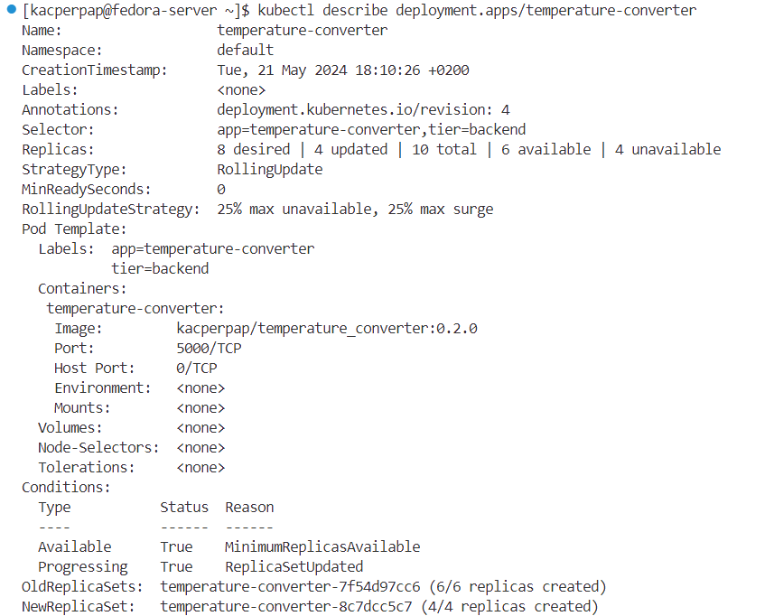

Podczas wdrażania nowej wersji widać jak działa sposób domyślny zastosowany w naszym deploymencie, czyli `RollingUpdate` z ustawionymi parametrami `maxUnavailable` oraz `maxSurge` na 25%. 

Parametry zgodnie z dokumentacją są zdefiniowane jako:
>Max Unavailable
.spec.strategy.rollingUpdate.maxUnavailable is an optional field that specifies the maximum number of Pods that can be unavailable during the update process. The value can be an absolute number (for example, 5) or a percentage of desired Pods (for example, 10%). The absolute number is calculated from percentage by rounding down. The value cannot be 0 if .spec.strategy.rollingUpdate.maxSurge is 0. The default value is 25%. For example, when this value is set to 30%, the old ReplicaSet can be scaled down to 70% of desired Pods immediately when the rolling update starts. Once new Pods are ready, old ReplicaSet can be scaled down further, followed by scaling up the new ReplicaSet, ensuring that the total number of Pods available at all times during the update is at least 70% of the desired Pods.

>Max Surge
.spec.strategy.rollingUpdate.maxSurge is an optional field that specifies the maximum number of Pods that can be created over the desired number of Pods. The value can be an absolute number (for example, 5) or a percentage of desired Pods (for example, 10%). The value cannot be 0 if MaxUnavailable is 0. The absolute number is calculated from the percentage by rounding up. The default value is 25%.
For example, when this value is set to 30%, the new ReplicaSet can be scaled up immediately when the rolling update starts, such that the total number of old and new Pods does not exceed 130% of desired Pods. Once old Pods have been killed, the new ReplicaSet can be scaled up further, ensuring that the total number of Pods running at any time during the update is at most 130% of desired Pods.

Oznacza to w naszym przypadku, że podczas wdrażania nowej wersji, początkowo liczba replik może natychmiastowo zostać zmniejszona do 6 (maksymalnie 25% niedostępnych podób z docelowej liczby 8, czyli max 2 niedostępne), po czym nowe pody ze zmienionymi obrazami tworzone są w taki sposób, aby nie przekroczyć liczby 10 ogółem (maksymalnie 25% nadmiarowych podów, czyli max 10). Screen pokazuje etap, w którym mamy 10 podów, 4 z nową wersją, 6 ze starą, dlatego kolejnym krokiem będzie usunięcie kilku wersji starych podów i znowu dodanie kilku nowych, tak aby zachować zgodność z parametrami.


Dokładny proces wdrażania możemy zaobserwować, poprzez korzystanie z polecenia:
```bash
kubectl get pods -w
```
Pozwala ono na obserwację modyfikacji podów "na żywo". Uruchamiając polecenia w trakcie działania 8 podów dla wersji starej aplikacji, dostajemy listing 8 podów ze statusem `Running`. Wykonując wdrożenie w tym momencie, możemy zaobserwować jak będą zmieniały się stany kolejnych podów. Ponadto patrząc na czas możemy zorientować się, które są zamykane (te z czasem życia większym niż 1/2 s) oraz te które są dopiero tworzone (czas < 1/2 s). Cały taki listing dla domyślnych ustawień RollingUpdate oraz wdrażaniu 8 replik nowej wersji w moim przypadku wyglądał następująco:
```bash
NAME                                     READY   STATUS    RESTARTS   AGE
temperature-converter-7f54d97cc6-7tbvj   1/1     Running   0          19m
temperature-converter-7f54d97cc6-b4pjl   1/1     Running   0          19m
temperature-converter-7f54d97cc6-bd5vz   1/1     Running   0          19m
temperature-converter-7f54d97cc6-mtwcb   1/1     Running   0          19m
temperature-converter-7f54d97cc6-qkx7r   1/1     Running   0          19m
temperature-converter-7f54d97cc6-v4jnw   1/1     Running   0          19m
temperature-converter-7f54d97cc6-wsdsk   1/1     Running   0          19m
temperature-converter-7f54d97cc6-wvjtl   1/1     Running   0          19m
temperature-converter-7f54d97cc6-v4jnw   1/1     Terminating   0          19m
temperature-converter-8c7dcc5c7-2kmcp    0/1     Pending       0          0s
temperature-converter-7f54d97cc6-bd5vz   1/1     Terminating   0          19m
temperature-converter-8c7dcc5c7-l4cw8    0/1     Pending       0          0s
temperature-converter-8c7dcc5c7-l4cw8    0/1     ContainerCreating   0          1s
temperature-converter-8c7dcc5c7-jmv4n    0/1     Pending             0          0s
temperature-converter-8c7dcc5c7-2kmcp    0/1     ContainerCreating   0          1s
temperature-converter-8c7dcc5c7-2kqkv    0/1     Pending             0          0s
temperature-converter-8c7dcc5c7-jmv4n    0/1     ContainerCreating   0          0s
temperature-converter-8c7dcc5c7-2kqkv    0/1     ContainerCreating   0          0s
temperature-converter-7f54d97cc6-bd5vz   0/1     Terminating         0          19m
temperature-converter-7f54d97cc6-v4jnw   0/1     Terminating         0          19m
temperature-converter-8c7dcc5c7-2kmcp    1/1     Running             0          8s
temperature-converter-7f54d97cc6-qkx7r   1/1     Terminating         0          19m
temperature-converter-8c7dcc5c7-kzkrv    0/1     Pending             0          0s
temperature-converter-8c7dcc5c7-kzkrv    0/1     ContainerCreating   0          0s
temperature-converter-8c7dcc5c7-l4cw8    1/1     Running             0          10s
temperature-converter-7f54d97cc6-b4pjl   1/1     Terminating         0          19m
temperature-converter-8c7dcc5c7-jmv4n    1/1     Running             0          10s
temperature-converter-8c7dcc5c7-9fdjf    0/1     Pending             0          0s
temperature-converter-8c7dcc5c7-2kqkv    1/1     Running             0          10s
temperature-converter-8c7dcc5c7-9fdjf    0/1     ContainerCreating   0          0s
temperature-converter-7f54d97cc6-7tbvj   1/1     Terminating         0          19m
temperature-converter-8c7dcc5c7-dlxcm    0/1     Pending             0          1s
temperature-converter-8c7dcc5c7-dlxcm    0/1     ContainerCreating   0          1s
temperature-converter-7f54d97cc6-mtwcb   1/1     Terminating         0          19m
temperature-converter-8c7dcc5c7-jdn2m    0/1     Pending             0          1s
temperature-converter-8c7dcc5c7-jdn2m    0/1     ContainerCreating   0          1s
temperature-converter-7f54d97cc6-qkx7r   0/1     Terminating         0          19m
temperature-converter-8c7dcc5c7-kzkrv    1/1     Running             0          10s
temperature-converter-7f54d97cc6-b4pjl   0/1     Terminating         0          19m
temperature-converter-7f54d97cc6-wsdsk   1/1     Terminating         0          19m
temperature-converter-7f54d97cc6-7tbvj   0/1     Terminating         0          19m
temperature-converter-7f54d97cc6-mtwcb   0/1     Terminating         0          19m
temperature-converter-8c7dcc5c7-9fdjf    1/1     Running             0          13s
temperature-converter-7f54d97cc6-wvjtl   1/1     Terminating         0          19m
temperature-converter-8c7dcc5c7-dlxcm    1/1     Running             0          13s
temperature-converter-7f54d97cc6-wsdsk   0/1     Terminating         0          19m
temperature-converter-8c7dcc5c7-jdn2m    1/1     Running             0          12s
temperature-converter-7f54d97cc6-wvjtl   0/1     Terminating         0          19m
```

Na podstawie powyższego listingu widać w jaki sposób tworzone i usuwane były pody, aby zapewnić spełnienie strategii wdrożenia.


**5. Rolling back do starszej wersji**

Zgodnie z dokumentacją, każda zmiana sekcji `templates` w pliku yaml powoduje zapisanie do historii rollbacku nowej rewizji. Jest to mechanizm umożliwiający cofanie nowych wdrożeń, w przypadku pojawienia się jakiś błędów. Historia nowych wdrożeń jest definiowana w pliku yaml deploymentu za pomocą parametru `.spec.revisionHistoryLimit` domyslnie ustawionego na 10 (zapis 10 ostatnich zmian we wdrożeniach).

>A Deployment's revision is created when a Deployment's rollout is triggered. This means that the new revision is created if and only if the Deployment's Pod template (.spec.template) is changed, for example if you update the labels or container images of the template. Other updates, such as scaling the Deployment, do not create a Deployment revision, so that you can facilitate simultaneous manual- or auto-scaling. This means that when you roll back to an earlier revision, only the Deployment's Pod template part is rolled back.

Powrót do poprzedniej wersji można wykonać za pomocą polecenia:
```bash
kubectl rollout undo <deployment>
```

Jeśli zdefiniowaliśmy inną liczbę zapisów historii, możemy się do nich odwoływać przekazując dodatkowy parametr do polecenia:
```bash
kubectl rollout undo --to-revision <deployment>
```
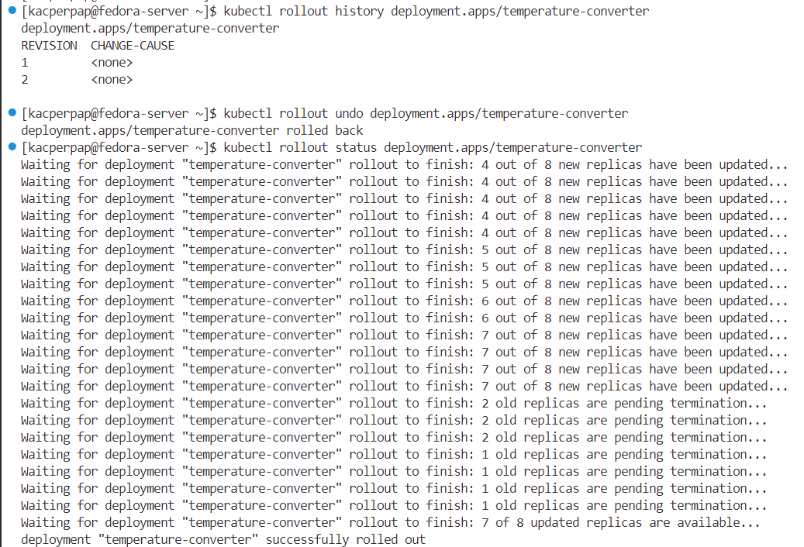

**6. Obraz zwracający kod błędu**

Trzeci utworzony obraz i dodany na DockerHuba zwraca zawsze kod błędu 1. Oznacza to, że podczas wdrożenia pody z takim obrazem nigdy nie wystartują.

W celu przetestowania aktualizujemy obraz we wdrożeniu:
```bash
kubectl set image deployment.apps/temperature-converter temperature-converter=kacperpap/temperature_converter:0.3.0

#kubectl set image <deployment> <container_name>=<new_image>
```

Po wykonaniu tego polecenia monitorując wdrażanie podów widzimy, że wdrożenie nowych podów, kończy się ich 3-krotnym restartem, po czym następuje zwrócny status podów `CrashLoopBackError`, który oznacza, że pod pomimo próby restarów za każdym razem kończył pracę z błędem.
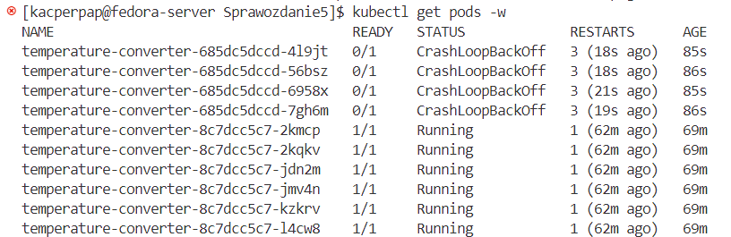

Aby powrócić stan poprzedni korzystamy z polecenia:
```bash
kubectl rollout undo deployment.apps/temperature-converter
```

# Kontrola wdrożenia

W celu kontroli wdrożenia piszemy prosty skrypt, który sprawdza czy żądana liczba replik została utworzona w określonym czasie. W przypadku braku sukcesu, następuje rollback do poprzedniej wersji.

Skrpyt [verify_deployment.sh](./verify_deployment.sh):
```bash
#!/bin/bash

DEPLOYMENT_NAME=""
NAMESPACE="default"
TIMEOUT=60
SLEEP_INTERVAL=5

for arg in "$@"
do
    eval "$arg"
done

ELAPSED_TIME=0

if [[ -z "$DEPLOYMENT_NAME" ]]; then
    echo "DEPLOYMENT_NAME needs to be specified"
    exit 1
fi

echo "Starting to monitor deployment '$DEPLOYMENT_NAME' in namespace '$NAMESPACE' for up to $TIMEOUT seconds..."

while [[ $ELAPSED_TIME -lt $TIMEOUT ]]; do 
    READY_REPLICAS=$(kubectl get deployment $DEPLOYMENT_NAME -n $NAMESPACE -o jsonpath='{.status.updatedReplicas}')
    DESIRED_REPLICAS=$(kubectl get deployment $DEPLOYMENT_NAME -n $NAMESPACE -o jsonpath='{.spec.replicas}')

    if [[ $READY_REPLICAS -eq $DESIRED_REPLICAS ]]; then
        echo "Deployment '$DEPLOYMENT_NAME' successfully deployed with all $DESIRED_REPLICAS replicas ready."
        exit 0
    fi

    echo "Waiting for deployment, current state: $READY_REPLICAS/$DESIRED_REPLICAS    ($ELAPSED_TIME seconds elapsed)"
    sleep $SLEEP_INTERVAL
    ELAPSED_TIME=$((ELAPSED_TIME + SLEEP_INTERVAL))

done 

echo "Timeout of $TIMEOUT seconds reached. Deployment '$DEPLOYMENT_NAME' did not complete successfully. Rolling back to previous version"
kubectl rollout undo deployment $DEPLOYMENT_NAME
exit 1
```

Dodajemy uprawnienia dla skryptu:
```bash
chmod +x ./verify_deployment.sh
```

Teraz w momencie wprowadzania zmian we wdrożeniu uruchamiamy skrypt, który w przypadku błędu wdrożenia cofnie je do poprzedniej wersji.

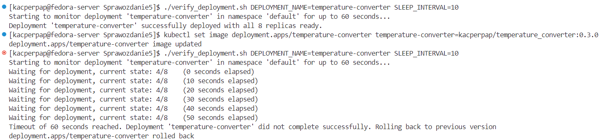


# Strategie wdrożenia

***Uwaga, dla wszystkich wdrożeń korzystamy ze wcześniej zdefiniowanego serwisu: [temperature-converter.service.yaml](./temperature-converter.service.yaml), ponieważ zdefiniowane w nim labels są identyczne jak we wdrożeniu co pozwoli na dopasowanie serwisu do tych wdrożeń. Ponadto dla canary deployment, dla którego dodajemy dodatkowe labels w celu rozróżnienia wdrożeń canary od starych, w serwisie pomijamy te labels, ponieważ udostępniamy dalej wszystkie wdrożenia pod jednym serwisem***

**1. Recreate deployment**

Strategia ta jest najprostszym typem wdrażania. Polega na zamknięciu wszystkich podów ze starej wersji i dopiero wtedy utworzeniu podów z nowym updatem. Definiujemy ją poprzez dodanie do pliku yaml typu strategi: `.spec.strategy.type==Recreate`. 

>This will only guarantee Pod termination previous to creation for upgrades. If you upgrade a Deployment, all Pods of the old revision will be terminated immediately. Successful removal is awaited before any Pod of the new revision is created. If you manually delete a Pod, the lifecycle is controlled by the ReplicaSet and the replacement will be created immediately (even if the old Pod is still in a Terminating state).

```yaml
apiVersion: apps/v1
kind: Deployment
metadata:
  name: temperature-converter
spec:
  replicas: 8
  strategy:
    type: Recreate
  selector:
    matchLabels:
      app: temperature-converter
      tier: backend
  template:
    metadata:
      labels:
        app: temperature-converter
        tier: backend
    spec:
      containers:
      - name: temperature-converter
        image: kacperpap/temperature_converter:0.1.0
        ports:
        - containerPort: 5000
```

Poniższy gif ilustruje ten proces w minikube dashboar. Najpierw wdrożenie posiada wersję obrazu `0.1.0`. Po zaktualizowaniu obrazu za pomocą `kubectl set` na wersję `0.2.0` następuje update zgodny z zdefiniowanym typem w pliku yaml, przedstawionym powyżej. Po zakończeniu stanu `terminating` dla starych wersji, tworzone są nowe pody ze statusem `ContainerCreating`, i po utworzeniu przechodzą do stanu `Running`.

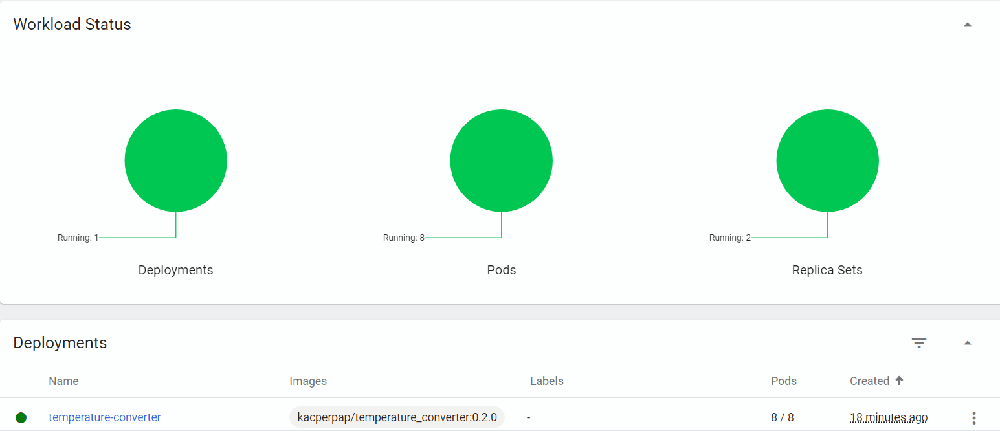

Repliki zarządzające wersjami obrazów:
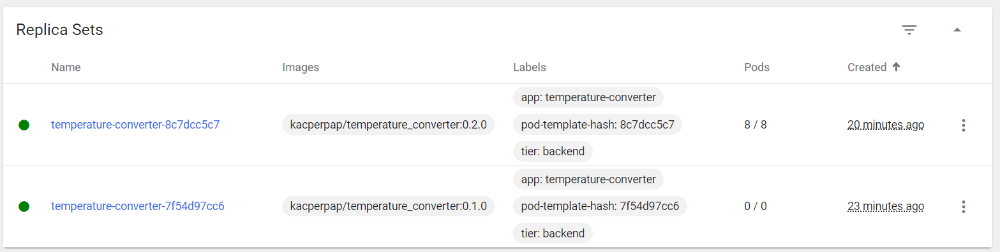

Zgodnie z tym co pisałem wcześniej serwis uruchomiony wcześniej rozpoznaje pody o etykietach podanych we wdrożeniu obydwu wersji dlatego poprawnie aktualizuje endpoints, tak aby pody były dostępne wewnątrz klastra po uruchomieniu:

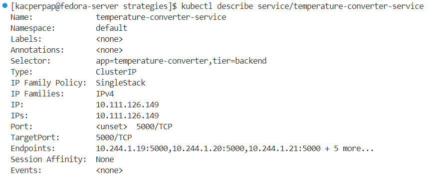


**2. Rolling Update**

Strategia ta była już wcześniej opisywana. Polega na stopniowym wdrażaniu nowych wersji, tak aby nie został przekroczony parametr `maxUnavailable`, czyli żeby liczba dostępnych podów z obydwu wersji nie spadła poniżej pewnego poziomu, oraz parametr `maxSurge`, definiujący maksymalną nadmiarową liczbę podów. Domyślnie parametry te ustawiane są na 25%. Można również ustawić je jako wartości absolutne a nie procentowe. W naszym przykładzie ustawiamy `maxUnavailable` na 2, co znacza że dla wdrożenia 8 replik, podczas updatu, minimalna liczba wszystkich replik dostępnych, nie będzie mogła być mniejsza od 6. Parametr `maxSurge` ustawiamy na 30%. Zgodnie z dokumentacją wartość absolutna tego parametru, obliczana jest poprzez zaokrąglenie w górę, w związku z czym w naszym przypadku wynosić będzie ceil(2,4) = 3, czyli maksymalna liczba wszystkich replik w danym momencie będzie mogła wynosić 11.

Strategię definiujemy w pliku yaml poprzez ustawienie `.spec.strategy.type==RollingUpdate` oraz parametrów: `.spec.strategy.rollingUpdate.maxUnavailable` i `.spec.strategy.rollingUpdate.maxSurge`.

Plik yaml definiujący tą strategię wygląda następująco [tc.deploy.rollingupdate.yaml](./strategies/tc.deploy.rollingupdate.yaml):

```yaml
apiVersion: apps/v1
kind: Deployment
metadata:
  name: temperature-converter
spec:
  replicas: 8
  selector:
    matchLabels:
      app: temperature-converter
      tier: backend
  template:
    metadata:
      labels:
        app: temperature-converter
        tier: backend
    spec:
      containers:
      - name: temperature-converter
        image: kacperpap/temperature_converter:0.1.0
        ports:
        - containerPort: 5000
  strategy:
    type: RollingUpdate
    rollingUpdate:
      maxSurge: 30%
      maxUnavailable: 2
```

Działanie wdrożenia w dashboard:
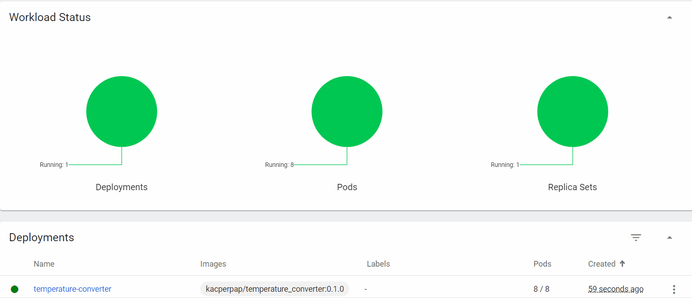

***Jak widać na powyższym gifie, maksymalna liczba podów utworzonych podczas wdrożenia wynosi 11/8, natomiast minimalna liczba dostępnych przez czas wdrożenia to 6/8***


**3. Canary deplyment**

Canary deployment tworzymy zgodnie z opisem w dokumentacji: [https://kubernetes.io/docs/concepts/workloads/management/#canary-deployments](https://kubernetes.io/docs/concepts/workloads/management/#canary-deployments), dokładniejszy opis można znaleźć również tutaj: [https://octopus.com/docs/deployments/patterns/canary-deployments](https://octopus.com/docs/deployments/patterns/canary-deployments)

W tym celu tworzymy osobne dwa pliki wdrożeń, gdzie definiujemy dodatkowy `label`. Etykieta `track` będzie miała dwie wartości określające, której wersji aplikacji dotyczy wdrożenie. Dla aplikacji w wersji `0.1.0`, która jest wersją stabilną używamy etykiety `track=stable`, natomiast dla wesji `0.2.0`: `track=canary`. 

Wdrażanie typu canary polega na stopniowym wdrażaniu nowej wersji aplikacji na małej liczbie instancji (tzw. canary, [see why canary](https://en.wikipedia.org/wiki/Domestic_canary#Miner.27s_canary)), podczas gdy większość ruchu jest obsługiwana przez stabilną wersję. Pozwala to na testowanie nowej wersji w rzeczywistych warunkach bez ryzyka związanego z pełnym wdrożeniem. 

Plik z wdrożeniem testowym: [tc.deploy.canary.canary.yaml](./strategies/tc.deploy.canary.canary.yaml):
```yaml
apiVersion: apps/v1
kind: Deployment
metadata:
  name: temperature-converter
spec:
  replicas: 2
  selector:
    matchLabels:
      app: temperature-converter
      tier: backend
      track: canary
  template:
    metadata:
      labels:
        app: temperature-converter
        tier: backend
    spec:
      containers:
      - name: temperature-converter
        image: kacperpap/temperature_converter:0.2.0
        ports:
        - containerPort: 5000
        resources:
          requests:
            memory: "128Mi"
            cpu: "250m"
          limits:
            memory: "256Mi"
            cpu: "500"
        livenessProbe:
          httpGet:
            path: /api/healthcheck
            port: 5000
```


Plik z wdrożeniem testowym: [tc.deploy.canary.stable.yaml](./strategies/tc.deploy.canary.stable.yaml):

```yaml
apiVersion: apps/v1
kind: Deployment
metadata:
  name: temperature-converter
spec:
  replicas: 6
  selector:
    matchLabels:
      app: temperature-converter
      tier: backend
      track: stable
  template:
    metadata:
      labels:
        app: temperature-converter
        tier: backend
    spec:
      containers:
      - name: temperature-converter
        image: kacperpap/temperature_converter:0.1.0
        ports:
        - containerPort: 5000
        resources:
          requests:
            memory: "128Mi"
            cpu: "250m"
          limits:
            memory: "256Mi"
            cpu: "500"
        livenessProbe:
          httpGet:
            path: /api/healthcheck
            port: 5000
```


Jak opisywałem wcześniej, aby wdrożenie canary działało poprawnie, musimy skonfigurować usługę, która będzie rozdzielać ruch między wersje stable i canary. Do tego celu służy [temperature-converter.service.yaml](./temperature-converter.service.yaml):

```yaml
apiVersion: v1
kind: Service
metadata:
  name: temperature-converter-service
spec:
  selector:
    app: temperature-converter
    tier: backend
  ports:
    - protocol: TCP
      port: 5000
      targetPort: 5000
```

***Zdefiniowanie 2 labels, pozwala na obsługę obydwu wdrożeń za pomocą jednej usługi, która znajduje wszystkie pasujące pody na podstawie podanych pasujących selektorów***