# Sprawozdanie 5

Celem ćwiczeń dotyczących kubernetesa, było przekazanie wiedzy na temat wdrożenia aplikacji za pomocą orkiestratora kontenerów.

# Instalacja klastra kubernetes

Kubernetes moży być zainstalowany przez różne implementacje. Istnieje wiele różnych sposobów instalacji Kubernetes, takich jak rozszerzenie w  `Docker Desktop`, `Minikube`, `kind`, `kubeadm`, czy zarządzane usługi w chmurze (np. `GKE`,`EKS`, `AKS`). Jest to spowodowane tym, że każde z tych środowisk, oprócz silnika k8s dostarcza dodatkowe funkcjonalności przydatne w różnych sytuacjach. Najczęstszym wyborem instalacji dla potrzeb lokalnych i testowych wdrożeń aplikacji poprzez k8s są Minikube, Docker Desktop, i kind. Umożliwiają tworzenie lokalnego klastra na pojednyczej maszynie oraz mają mniej skomplikowaną konfigurację klastra (co oznacza mniejszą kontrolę, która jest już wymagana w rzeczywistych środowiskach produkcyjnych). Z tego powodu na maszynie wirtualnej do celów testowych pobieramy `minikube`.

Pracując na maszynie wirtualnej z systemem `Fedora 39` pobieram minikube poprzez wykorzystanie menadżera pakietów RPM za pomocą polecenia: 

```bash
curl -LO https://storage.googleapis.com/minikube/releases/latest/minikube-latest.x86_64.rpm
sudo rpm -Uvh minikube-latest.x86_64.rpm
```

Następnie uruchamiam instalację, konfigurację oraz uruchomienie kontenera minikube za pomocą polecenia:
```bash
minikube start
```

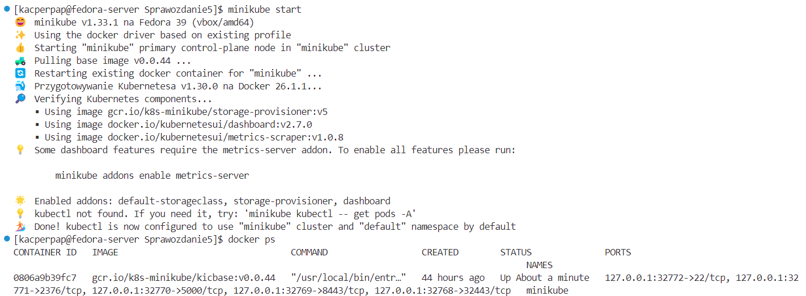

Następnie uruchamiam `dashboard` dostępny w minikube poprzez:
```bash
minikube dashboard
```

Powoduje to utworzenie przekierowania portów z hosta maszyny na której pracuje (z jej adresu localhost), do kontenera maszyny wirtualnej, na port na którym działa dashboard uruchomiony jako kontener. 

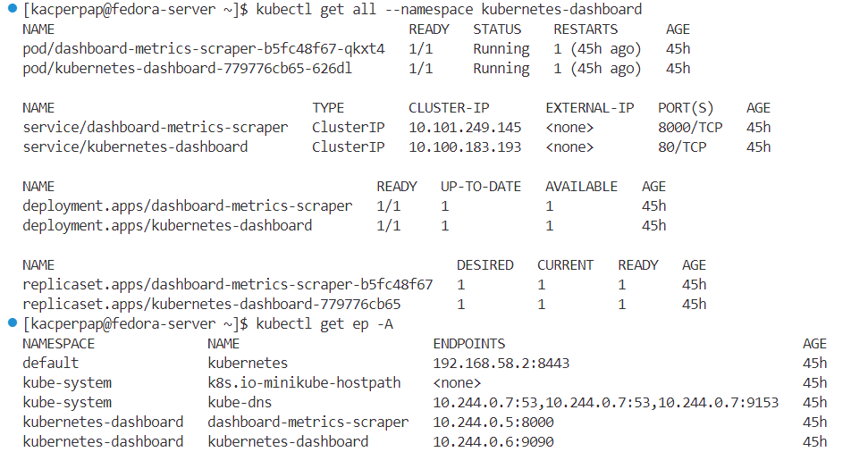

Domyślnie w przestrzeni nazw `kubernetes-dashboard` utworzonej podczas instalacji minikube, tworzonę są serwisy działające na portach `8000`, `9090`, które pozwalają na komunikację wewnątrz klastra z aplikacją dashboard. VSCode automatycznie znajduje wolny dynamiczny port i tworzy przekierowanie aby umożliwić połączenie z się tym dshboardem z poza klastra k8s. 

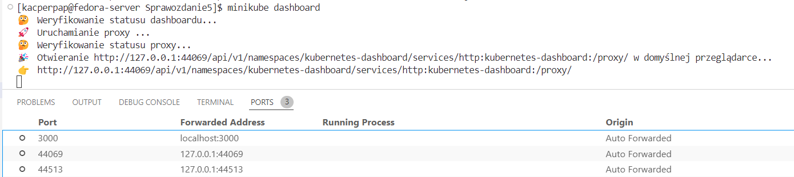


Ponadto aby ułatwić sobie pracę dodajemy alias, tak aby polecenia `minikube kubectl` (k8s jest zainstalowany wewnątrz minikube wieć jego api jest widoczne tylko poprzez api minikube) zamienić na `kubectl`. Rozwiązanie to tworzy jednak alias tylko w obecnym terminalu, dlatego aby zachować te ustawienia tworzymy symlink zgodnie z dokumentacją, za pomocą polecenia:

```bash
ln -s $(which minikube) /usr/local/bin/kubectl
```

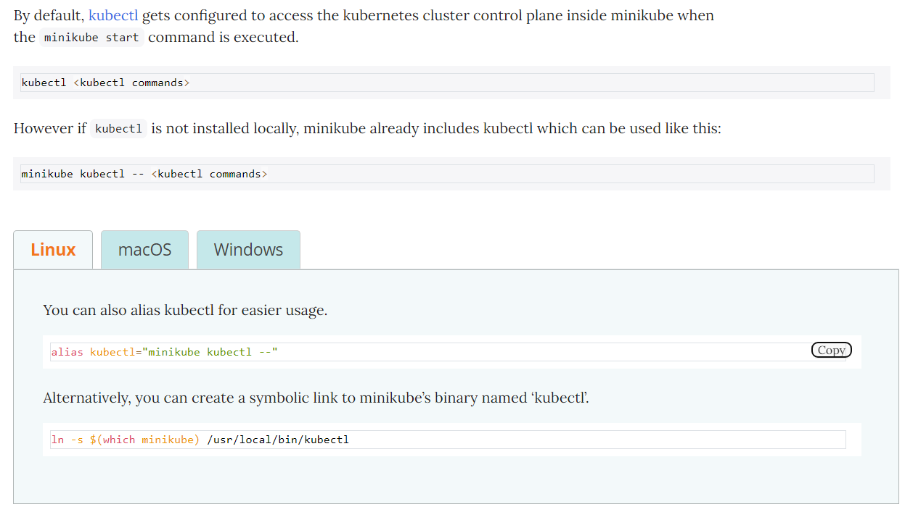

# Analiza posiadanego kontenera

Podczas tworzenia pipelina, jako rezultat końcowy publikowany był artefakt aplikacji irssi zapisany w Jenkinsie oraz obraz deployowy zapisywany na DockerHub'ie: [https://hub.docker.com/layers/kacperpap/irssi-deploy/1.0-1/images/sha256-9a0e5377536459321c860e313021b6086dbb3b3b2eb5a087672870a33d057fbd?context=repo](https://hub.docker.com/layers/kacperpap/irssi-deploy/1.0-1/images/sha256-9a0e5377536459321c860e313021b6086dbb3b3b2eb5a087672870a33d057fbd?context=repo). 

Kontener deployowy w celu poprawnego działania potrzebuje działania albo w trybie interaktywnym, albo poprzez przekazanie terminala. Można to osiągnąć w sposób jaki przedstawiłem w poprzednim sprawozdaniu, tj. poprzez uruchomienie z przekazaniem pseudo-terminala `tty` (brak interaktywnej sesji) oraz ustawieniem zmiennej środowiskowej `TERM` koniecznej do poprawnego działania `irssi`. Z takimi ustawieniami, kontener uruchomiony z aplikacją działa w trbie ciągłym. Jednak nie udostępnia on żadnego interfejsu/ funkcjonalności poprzez sieć, dlatego przekierowanie portów z hosta do maszyny mogłoby tylko "pomóc" wywołać polecenie otworzenia dodatkowej sesji (terminala, np. za pomocą docker exec -it <container_id>), a nie uzyskać dostęp do funkcjonalności. Dlatego zamieniam moją aplikację na prostą aplikację napisaną w Pythonie we `Flasku`, która udostępnia API do zamiany temperatury ze stopni fahrenheita na stopnie celsjusza na porcie 5000 dla adresów 0.0.0.0.


Pobieramy obraz aplikacji:
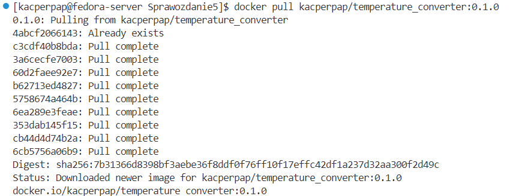

Uruchamiamy z przekierowaniem portów z maszyny wirtualnej do kontenera z aplikacją:
```bash
docker run --name temperature_converter -d -p 5000:5000 kacperpap/temperature_converter:0.1.0
```
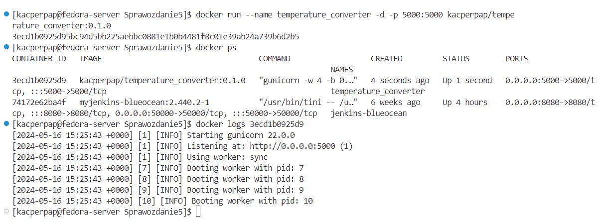


Aplikacja taka zgodnie z potrzebami zadania, działa w trybie ciągłym w kontenerze oraz udostępnia prostą usługę sieciową. Odpowiedź na żądanie http wysłane do działającej aplikacji poprzez wysłanie zapytania na port 5000 localhosta maszyny wirtualnej zwraca poprawną odpowiedź:
```bash
curl http://localhost:5000/api/convert-fahrenheit-to-celsius?fahrenheit=100
```

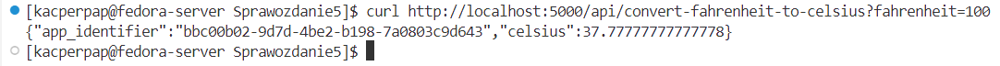


# Uruchomienie aplikacji poprzez k8s w minikube

Aplikację możemy uruchomić na stosie k8s co umożliwi nam zarządzanie nią w dalszej częci podczas wdrażania w łatwieszy sposób. W tym celu musimy stowrzyć `poda`, czyli najmniejszą jednątkę pracy kubernetesa, uruchamiającą kontener z aplikacją oraz stworzyć seriws udostępniający niezmienne api dla uruchomionych podów (w póżniejszej części liczba uruchamianych podów w deploymencie będzie większa, a każdy z nich będzie posiadał inny adres IP, któy może zmieniać się wraz z manipulacjami podami - ich niszczeniem lub tworzeniem, przez co potrzebujemy dodatkowe stabilnego interfejsu udostępniającego nasze usługi)


W tym celu najpierw tworzymy poda uruchamiającego naszą aplikację:
```bash
kubectl run temperature-converter --image=kacperpap/temperature_converter:0.1.0 --port=5000 --labels=app=temperature-converter
```

Następnie tworzymy serwis:
```bash
kubectl expose pod temperature-converter --port=5000 --target-port=5000 --name=temperature-converter-service
```

Po czym przekierowujemy porty. 
***UWAGA! Przekierowanie portów należy zrobić zarówno na maszynie wirtualnej, co gwarantuje nam dostęp do poda poprzez serwis udostępniający API aplikacji z poda, oraz należy przekierować porty w VSCodoe, tak aby zapytanie na localhost i port serwisu na naszym hoście, zostało przekierowane do VM***

Wynik takiego działania jest następujący:
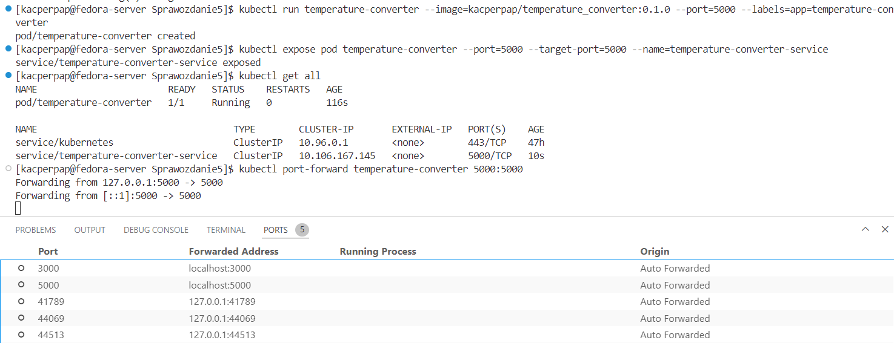

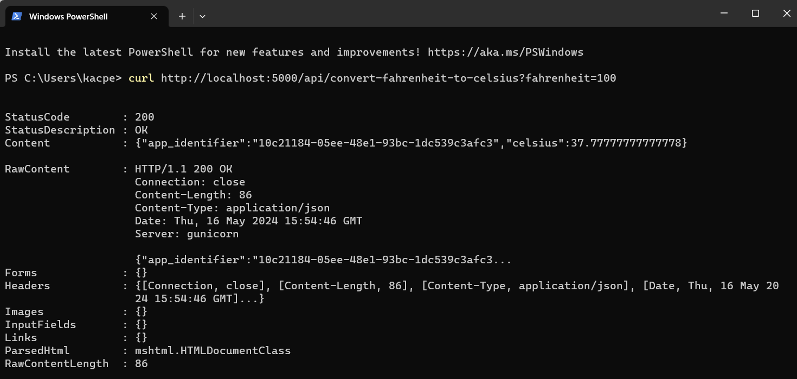

# Tworzenie wdrożenia automatycznego

Powyższe kroki można wykonać za pomocą definicji plików yaml. Pozwala to na automatyzację w przypadku bardziej rozbudowanych wdrożeń. Ponadto z całości definicji wdrożenia w k8s można za pomocą `Helm` utworzyć `helm chart` umożliwiający instalowanie całości wdrożenia za pomocą pojedynczej komendy. 

Aby wykonać wdrożenie okreslonej liczby replik aplikacji (z dodatkowymi możliwościami definicji wdrożenia) tworzymy plik [temperature-converter.deployment.yaml](./temperature-converter.deployment.yaml), który definiuje dokładnie to samo co poprzednie bezpośrednie uruchomienie poda poprzez kube-API, ale zawiera to w formie wdrożenia, i definiuje powstanie docelowo 2 replik:

```yaml
apiVersion: apps/v1
kind: Deployment
metadata:
  name: temperature-converter
spec:
  replicas: 2
  selector:
    matchLabels:
      app: temperature-converter
      tier: backend
  template:
    metadata:
      labels:
        app: temperature-converter
        tier: backend
    spec:
      containers:
      - name: temperature-converter
        image: kacperpap/temperature_converter:0.1.0
        ports:
        - containerPort: 5000
```

Analogicznie tworzymy plik [temperature-converter.service.yaml](./temperature-converter.service.yaml):
```yaml
apiVersion: v1
kind: Service
metadata:
  name: temperature-converter-service
spec:
  selector:
    app: temperature-converter
    tier: backend
  ports:
    - protocol: TCP
      port: 5000
      targetPort: 5000
```


Uruchomienie tych jednostek pracy k8s wykonujemy za pomocą polecenia:
```bash
kubectl apply -f <path_to_yaml>
```

Po dodtkowym uruchomieniu przekierowania portów jak poprzednio, możemy komunikować się z aplikacją z lokalnego hosta, a wynik wdrożenia wygląda następująco:

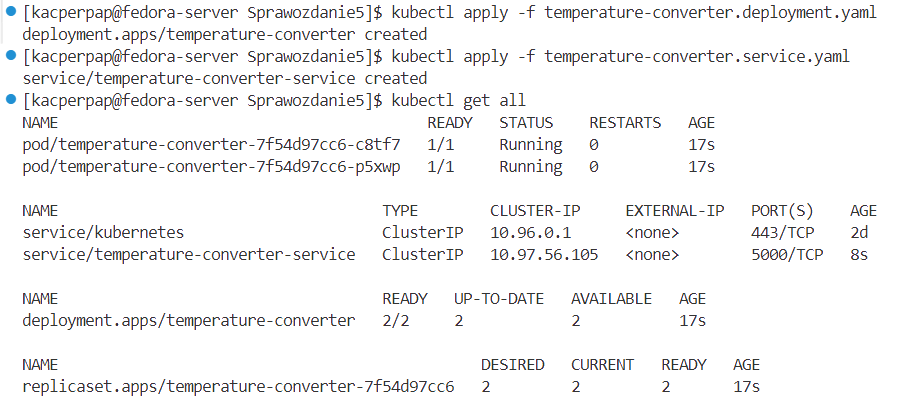

Powyższe dane przedstawione w `minikube dashboard`:
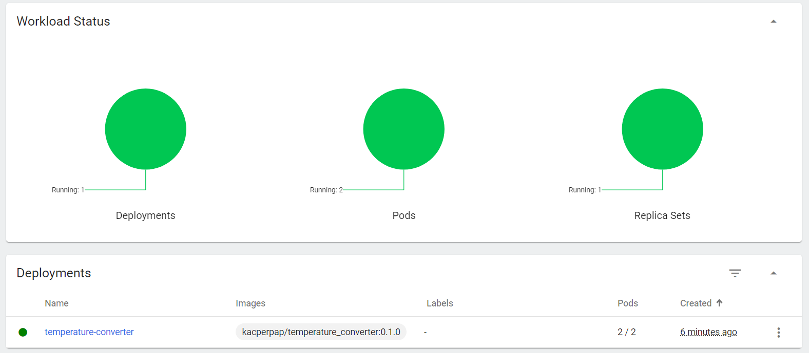

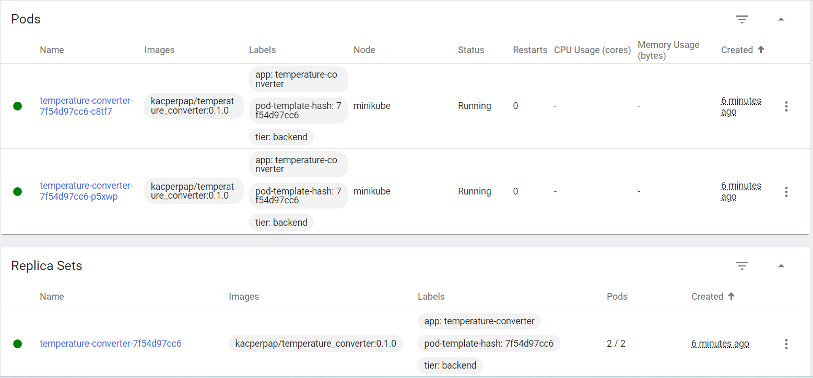

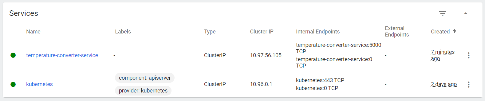


