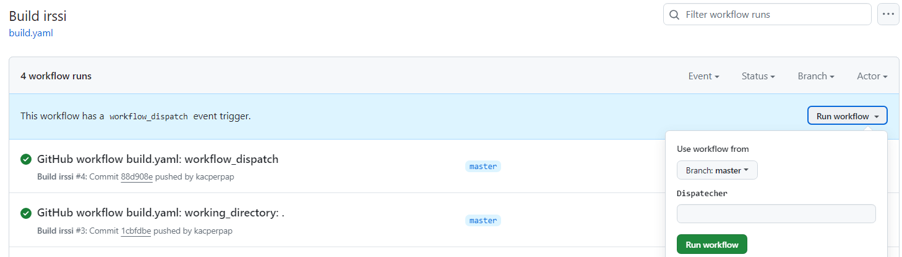

# Sprawozdanie 6 - GitHub Actions

# Przygotowanie środowiska

Budowanie apliakcji poprzez GitHub Actions przeprowadzę dla aplikacji irssi, której licencja ` GNU GENERAL PUBLIC LICENSE Version 2, June 1991` pozwala na modyfikację oprogoramowania. W związku z tym w celu zmiany katalogu `.github/workflows` definiującego pipeline, tworzę fork repozytorium i usuwam wyżej wymieniony katalog.

Fork: [https://github.com/kacperpap/irssi](https://github.com/kacperpap/irssi)

# Trigger build on push and pull request to main branch

Pierwszym etapem jest zminimalizowanie pipelina dostępnego w głównym repo irssi: [check.yml](https://github.com/irssi/irssi/blob/master/.github/workflows/check.yml). Plik ten definiuje pipeline analogiczny do tego, który definiowany jest po stronie osób wdrażających apliakcję do systemu Fedora, tj. najpierw budowana jest paczka tar, która w następnych krokach jest rozpakowywana, budowana i testowana. Moim celem jest zminimalizowanie tego procesu do przygotowania środowiska do budowy i zbudowania właściwej apliakcji z kodu źródłowego z repozytorium. W tym celu nanoszę kilka zmian:

- eliminuje wszystkie `jobs` poza build,
- zmieniam strategię budowania na `fail-fast: true`, co pozwala na oszczędzanie zasobów w przypadku błędu budowania (pojawienie się błędu w jednym miejsu/ na jednej konfiguracji budującej, kończy niepowodzeniem wszystkie dalsze kroki, jeśli budujemy np. na różne środowiska linux, windows czy macos możemy chcieć pozostawić dalszy proces budowania, ponieważ budowanie na jedno środowisko może być niezlależne od budowania na inne)
- ograniczam ustawienia `matrix`, aby zminimalizować liczbę kombinacji różnych konfiguracji budowania (w moim przypadku tylko 2 rodzaje budowania: na systemie ubuntu-20.04 przez kompilację przez gcc oraz na ubuntu-latest przez kompilację przez gcc)
- dodaję krok: `uses: actions/checkout@v3`, który definiuje checkout na sklonowane repozytorium w pipeline 
- ustawiam `working-directory: .` dla budowanego projektu

***UWAGA ! W github actions środowisko domyślnie nie checkout'je się do projektu któego dotyczy dlatego należy dodać krok klonujący repozytorium, a żeby nie musieć podawać pełnej nazwy do klonowania i tokenów github korzystamy z wbudowanej akcji: actions/checkout@v3***

Gotowy workflow wygląda następująco:

```yaml
name: Build irssi

on:
  push:
    branches:
      - master
  pull_request:

env:
  apt_build_deps: libutf8proc-dev libperl-dev libotr5-dev ninja-build
  get_pip_build_deps_meson: pip3 install setuptools${setuptools_ver}; pip3 install wheel; pip3 install meson${meson_ver}
  build_options_meson: -Dwith-proxy=yes -Dwith-bot=yes -Dwith-perl=yes -Dwith-otr=yes
  prefix: ~/irssi-build

jobs:
  build:
    runs-on: ${{ matrix.os }}
    env:
      CC: ${{ matrix.compiler }}
    strategy:
      fail-fast: true
      matrix:
        os: [ubuntu-20.04, ubuntu-latest]
        compiler: [gcc]
        include:
          - os: ubuntu-20.04
            meson_ver: ==0.53.2
            setuptools_ver: <51
          - os: ubuntu-latest
            meson_ver: <0.63.0
    steps:
      - name: Checkout code
        uses: actions/checkout@v3

      - name: Prepare required software
        env:
          meson_ver: ${{ matrix.meson_ver }}
          setuptools_ver: ${{ matrix.setuptools_ver }}
        run: |
          sudo apt update && sudo apt install -y $apt_build_deps
          eval "$get_pip_build_deps_meson"

      - name: Build and install with meson
        run: |
          meson Build $build_options_meson --prefix=${prefix}
          ninja -C Build
          ninja -C Build install
        working-directory: .
```

Po tak zdefiniowanym workflow, w wyniku `push commit` na gałąź master uruchamiany jest pipeline, który poprawnie kończy swoje działanie:


# Trigger build on push and pull request to ino_dev branch

Aby umożliwić budowanie projektu z pipelinów zdefiniowanych na innych branchach dodajemy `workflow_dispatch`, który umożliwia nam wykonanie pipeline zdefiniowanego na innej gałęzi. Zmieniony fragment kodu [build.yaml](./build.yaml):

```yaml
on:
  push:
    branches:
      - master
  pull_request:
  workflow_dispatch:
    inputs:
      tags:
        description: 'Dispatecher'
```

**Wykonanie takiego pipelina powoduje dodanie funkcjonalności wykonania pipelinów z innych branch'ow, pod warunkiem, że na tych branchach jest zdefiniowany osobny workflow**:



W celu przetestowania poprawności działania dispatchera, tworzymy nową gałąź `ino_dev`:
```bash
git checkout -b ino_dev
```
Na tej gałęzi dodajemy nowy workflow, który jest kopią tego z brancha głównego z dodaną zmianą wypisującą nazwę brancha na którym pipeline działa [build_ino_dev.yaml](./build_ino_dev.yaml):

```yaml
name: Build irssi on ino_dev

on:
  push:
    branches:
      - ino_dev
  pull_request:
    branches:
      - ino_dev
  workflow_dispatch:
    inputs:
      tags:
        description: 'Dispatecher'
  
env:
  apt_build_deps: libutf8proc-dev libperl-dev libotr5-dev ninja-build
  get_pip_build_deps_meson: pip3 install setuptools${setuptools_ver}; pip3 install wheel; pip3 install meson${meson_ver}
  build_options_meson: -Dwith-proxy=yes -Dwith-bot=yes -Dwith-perl=yes -Dwith-otr=yes
  prefix: ~/irssi-build

jobs:
  build:
    runs-on: ${{ matrix.os }}
    env:
      CC: ${{ matrix.compiler }}
    strategy:
      fail-fast: true
      matrix:
        os: [ubuntu-20.04, ubuntu-latest]
        compiler: [gcc]
        include:
          - os: ubuntu-20.04
            meson_ver: ==0.53.2
            setuptools_ver: <51
          - os: ubuntu-latest
            meson_ver: <0.63.0
    steps:
      - name: Checkout code
        uses: actions/checkout@v3

      - name: Prepare required software
        env:
          meson_ver: ${{ matrix.meson_ver }}
          setuptools_ver: ${{ matrix.setuptools_ver }}
        run: |
          sudo apt update && sudo apt install -y $apt_build_deps
          eval "$get_pip_build_deps_meson"

      - name: List directory contents
        run: |
          ls -la

      - name: Build and install with meson
        run: |
          meson Build $build_options_meson --prefix=${prefix}
          ninja -C Build
          ninja -C Build install
        working-directory: .

      - name: Check current branch
        run: |
          GIT_BRANCH=$(git rev-parse --abbrev-ref HEAD)
          echo "Build successfully done on branch $GIT_BRANCH"
```

Aby ten workflow działał poprawnie musimy dodać do niego `workflow_dispatch` tak jak poprzednio. Zmieniając dodatkowo nazwę brancha w definicjach triggerów `push` i `pull request`, powodujemy, że każda kontrybucja do tego brancha zakończy się zbudowaniem aplikacji. 


Ponadto w celu sprawdzenia czy na pewno wykonuje się poprawny workflow dodajemy na tej gałęzi dodatkowy `step`:

```yaml
- name: Check current branch
        run: |
          GIT_BRANCH=$(git rev-parse --abbrev-ref HEAD)
          echo "Build successfully done on branch $GIT_BRANCH"
```

Wypisuje on nazwę aktualnego brancha:


***UWAGA ! Manualne odpalenie triggera:***
Aby móc manualnie odpalić trigerra, musimy mieć zdefiniowany workflow na danej gałęzi o tej samej nazwie co workflow na gałęzi głównej. Pozwala nam to na odpalanie zmodyfikowanego workflow'a na innej gałęzni z nadpisanymi zmianami z workflow'a z gałęzi main. Po zmianie nazwy `build_ino_dev` na `build` (nazwy na ino_dev i master analogiczne) pojawia się możliwość manualnego trigerra:


Uruchomienie manual trigger:


Zgodnie z oczekiwaniami, wykonany pipeline został z odpowiedniej gałęzi co potwierdza, że znalazło się w nim sprawdzenie nazwy brancha zdefiniowane tylko w pipeline na gałęzi `ino_dev`:


