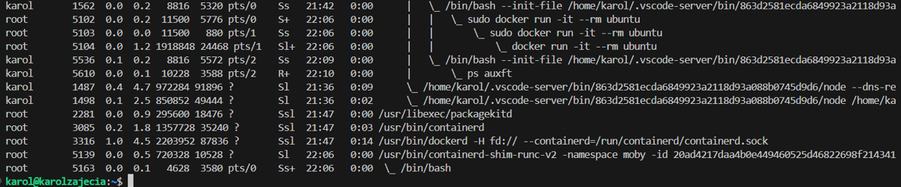

# Sprawozdanie1
## Karol Przydział 412605

## Laboratoria 1

Celem pierwszych laboratoriów było zapoznanie się z podstawowymi pojęciami związanymi z metodykami DevOps, zapoznanie się z platformą Github, systemem Git, a także połączeniem sie poprzez ssh między maszyną wirtualną a Visual Studio Code.

### Ustawiam maszynę wirtualną.

Ćwiczenia wykonuję na maszynie wirtualnej Hyper-V z wykorzystaniem systemu Ubuntu. Ponadto wykorzstuję program Visual Studio Code, do którego łączę się z maszyny poprzez SSH. 

### 1.Instaluję klienta Git i obsługę kluczy SSH.
Laboratoria rozpoczynamy od zainstalowania klienta Git.
Aby to zrobić, musimy wcześniej połączyć się między maszyną wirtualną a Visual Studio Code, którym będziemy się posługiwać podczas przeprowadzania laboratoriów.
Łączymy się poprzez SSH, najpierw w maszynie wirtualnej za pomocą komendy:

```
ifconfig 
```
sprawdzamy adres IP, przez który będziemy się łączyć w programie Visual Studio Code.

Następnie, już bezpośrednio w programie instalujemy klienta Git poprzez komendę:
```
sudo apt-get git
```
Obsługę kluczy instalujemy analogicznie wykorzstując openssh.
### 2.Klonuję repozytorium przedmiotowe za pomocą HTTPS i personal access token.
Rozpoczynam od utworzenia personal access token:


 
Kolejno klonuję repozytorium poprzez HTTPS:
```
 git clone https://KacprzykO:<IDtokena>@github.com/InzynieriaOprogramowaniaAGH/MDO2024_INO.git 
```

### 3.Tworzę klucz SSH oraz dodaję go do Githuba.
Kolejny etap opiera się na utworzeniu pary kluczy SSH.
Aby to zrobić, musimy wykonać komendę:
```
ssh-keygen -t ed25519 -C "karolprzydz@student.agh.edu.pl"
```
Po wygenerowaniu, klucz publiczny należy umieścić w zakładce SSH keys na Githubi'e:


Ostatecznie możemy sklonować nasze repozytorium wykorzustując komendę:
```
git clone git@github.com:InzynieriaOprogramowaniaAGH/MDO2024_INO.git
```

### 4.Przełączam się na gałęź main, a następnie na gałęź swojej grupy.

Następnie dążymy do przemieszczenia się do gałezi main wykorzystując komendę `git checkout main`, a następnie na gałęź swojej gupy - w tym przypadku GCL4. Kiedy jesteśmy na danej gałęzi, możemy sprawdzić co to za gałąź wykorzystując komendę `git branch`. 


Z kolei `git status` pozwala sprawdzić jakie zmiany zaszły na danej gałęzi w danym momencie.

### 5.Tworzę gałęź o nazwie "inicjały & nr indeksu".
Kiedy przełączyliśmy się na gałeź swojej grupy możemy przystąpić do utworzenia własnej gałęzi, która ma być określona poprzez inicjały oraz numer indeksu.

W tym celu wykorzystujemy komendę `git branch <inicjaly & numer indeksu>`


### 6.Rozpoczynam pracę na nowej gałęzi.
Pracę zaczynam od stworzenia folderu, którego nazwa stanowi moje inicjały oraz numer indeksu. Wykorzystuję do tego komendę `mkdir <inicjaly & numer indeksu>`


Następnie tworzę folder Sprawozdanie1.

Upewniając się, że jestem we właściwym miejscu tworzę plik o nazwie Sprawozdanie1 w formacie MarkDown.


Kolejno tworze plik `commit-msg`, który posłuży mi do napisania skryptu weryfikującego, że każdy mój commit message będzie zaczynał się od moich inicjałów wraz z numerem indeksu.


W pliku commit-msg piszę treść skryptu:


Następnie nadajemy odpowiednie uprawnienia tak, aby nasz hook wykonywał się prawidłowo za każdym razem.

Jak widać na poniższym screenie, po wpisaniu dowolnych wartości wyskakuje błąd:


`Git add .`, które występuje jako polecenie oznacza, że dodajemy zmiany do repozytorium. Z kolei `git commit -m` oznacza wykonanie danego commita. 

Jeśli jednak wprowadzimy commita z inicjałami oraz numerem indeksu wyświetli on prawidłowe dane.


Kolejny etap opiera się na wciągnięciu mojej gałęzi do gałęzi grupowej. Korzystam wiec w tym przypadku z komendy `git merge KP412605`.

Ostatecznie przy użyciu komendy push przenosimy nasze zmiany na repozytorium. 


### Napotkane problemy.

W trakcie przeprowadzania laboratorium wystapiły u mnie pewne problemy. W dużej mierze wynikały one z braku doświadczenia i samego początku z metodykami DevOps. Problemy te były związane głównie z poruszaniem się po gałęziach. W trakcie wciągania mojej gałęzi do gałęzi grupowej niechcący wykonałem `pull request` do gałęzi main - jednak później udało się to poprawić.

## Laboratoria 2

### 1.Drugie laboratoria rozpoczynam od pobrania Dockera na system Ubuntu.
 W tym celu wykonuje odpowiednio komendy:

```
curl -fsSL https://get.docker.com -o get-docker.sh
```
oraz

```
 sudo sh get-docker.sh
```

Upewniam się, że znajduję się w odpowiedniej lokalizacji.


### 2.Upewniam się, że docker działa prawidłowo.

W tym celu wpisuję komendy:

```
sudo systemctl start docker
```
która włącza dockera, oraz

```
sudo systemctl status docker
```
która sprawdza status dockera.


### 3.Tworzę konto na platformie Docker Hub.
Dzięki tej platformie jesteśmy w stanie pobierać obrazy, które są potrzebne do ćwiczeń.


### 4.Pobieram obrazy hello-world, busybox, ubuntu lub fedora, mysql

Wykorzystując komendę:

```
sudo docker pull mysql
```
pobieramy mysql.

Analogicznie postępujemy z pozostałymi obrazami.


Dodatkowo, aby sprawdzić, czy wszystkie obrazy są pobrane korzystam z komendy:
```
sudo docker images
```
która wyświetla mi aktualne obrazy.


### 5.Uruchamiam kontener z obrazu busybox.

Następnie przy użyciu komendy:
```
sudo docker run busybox
```
włączyłem obraz busybox. 

Ponadto wykorzystałem komendę:
```
sudo docker run -it --rm busybox
```
przez co mogłem podłączyć się interaktywnie, o czym świadczy `-it`. `--rm` oznacza z kolei, że kontener usunie się po zakończeniu działania.

Od razu, jako kolejny etap - będąc w busybox - wywołuję komendę `busybox | head -1`, przez co jestem w stanie wywołać numer wersji busybox.


### 6.Uruchamiam "system w kontenerze".

Aby uruchomić system w kontenerze sytuacja wygląda analogicznie - musimy wywołać podobną komendę:
```
sudo docker run -it --rm ubuntu
```
Po uruchomieniu, aby zaprezentować PID1 w kontenerze, wykorzystuję komendę `ps`. 


 Z kolei w drugim terminalu wywołuję polecenie `ps auxft`, które pokazuje procesy dockera na hoście.



Aby zaktualizować pakiety wykorzystuję komendę `apt-get update`.\
Komendę wpisuję bezpośrednio w kontenerze.


Ostatecznie, aby wyjść z kontenera wykorzystuję komendę `exit`.

### 7.Tworzę własnoręcznie, buduję oraz uruchamiam plik Dockerfile a następnie klonuję repozytorium.

Plik rozpoczynam od określenia systemu, w moim przypadku jest to ubuntu. Następnie ustawiam katalog roboczy na `/app`, oraz za pomocą komendy `git clone` klonuję repozytorium.

Ponadto upewniamy się, że obraz będzie miał git'a.


```Dockerfile
FROM ubuntu:latest

RUN apt-get update && \
    apt-get install -y git

WORKDIR /app

RUN git clone https://github.com/InzynieriaOprogramowaniaAGH/MDO2024_INO.git

CMD ["/bin/bash"]
```

Idąc dalej, tworzymy obraz korzystając z komendy:
```
sudo docker build -t <wlasna_nazwa_obrazu>
```

W moim przypadku jest to obraz o nazwie lab2dockerfile:


W tym przypadku `.` oznacza, że będziemy działać z lokalizacją, w której znajduje się DockerFile, a `-t` oznacza flagę, którą przypisujemy do obrazu.

Kolejno przy wykorzystaniu polecenia:
```
sudo docker run -it --rm lab2dockerfile
```

uruchamiamy kontener. Podobnie jak wcześniej `-it` mówi nam o tym, iż kontener jest uruchamiany interaktywnie, a `--rm` określa automatyczne usunięcie kontenera po zakończeniu pracy.


### 8.Sprawdzam uruchomione kontenery i czyszczę je.

Wykorzystując komendę:
```
sudo docker ps -a
``` 
sprawdzam, jakie kontenery są uruchomione.


Za pomocą komendy:
```
sudo docker rm -f <id_kontenera>
```
czyszczę kontenery.


### 9.Czyszczę obrazy.

Ostatnim etapem jest tutaj wyczyszczenie obrazów.

Aby to zrobić wykorzystuję komendę:
```
sudo docker image prune -a
```


`-a` określa usunięcie wszystkich obrazów, które nie są używane.
