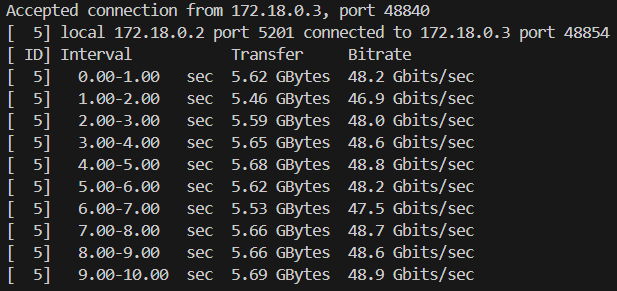

# Sprawozdanie2
## Karol Przydział 412605

## Laboratoria 3

Celem trzecich laboratoriów było zbudowanie, a następnie uruchomienie aplikacji na licencji otwartej. Aplikacje te powinny posiadać narzędzia takie jak make build oraz make test.

### Wykonuję kroki build oraz test wewnątrz wybranego kontenera bazowego. 

W tym celu rozpoczynam od uruchomienia kontenera w sposób interaktywny. Do tego posłuży mi komenda:
```
sudo docker run --rm -it ubuntu
```
Kolejny etap opiera się na doinstalowaniu potrzebnych elementów tak, abyśmy mogli bezpiecznie posługiwać się w kontenerze.

Instalujemy kompilator gcc, meson oraz gita.

W tym celu wykorzystujemy komendę:
```
apt-get update 
```
a następnie:
```
apt-get install meson git ninja* gcc 
```
Doinstalowujemy również libglib2.0-dev, jako jeden z komponentów, który będzie potrzebny do dalszej pracy.


W międzyczasie klonujemy repozytorium korzystając z polecenia:

```
git clone https://github.com/irssi/irssi
```

Następnie przenosimy się do katalogu przy użyciu komendy:
```
cd irssi
```
oraz budujemy aplikacje poprzez komendę:
```
meson build
```


Po próbie zbudowania aplikacji nie wszystko działało poprawnie, należało jeszcze doinstalować pewne komonenty.
Instaluję więc ncurses oraz utf8proc:


Po doinstalowaniu możemy już ponownie budować:


Kolejno przy użyciu komendy:
```
ninja -C /irssi/build
```

budujemy aplikację.


Następnym krokiem jest przetestowanie aplikacji:
```
ninja test
```
Efekt jest następujący:


Na powyższym zdjęciu widać, że wszystkie 5 testów zostało wykonanych poprawnie.
Opuszczamy więc kontener poleceniem `exit`.

Kolejny etap opiera się na uruchomieniu kontenera tak, aby po zakmnięciu sam się usunął.
W tym przypadku korzystamy z komendy:
```
sudo docker run --rm -it node /bin/bash
```


Pierwsze co robimy w kontenerze to sprawdzenie i zaktualizowanie paczek, a także instalacja gita:


Kolejnym krokiem jest przeniesienie się do folderu node i użycie tam komendy npm install:


Po zainstalowaniu jesteśmy w stanie sprawdzić czy test działa poprawnie:


Jak widać powyżej test został wykonany poprawnie.

### Tworzę dwa pliki Dockerfile automatyzujące kroki.

Kontener pierwszy ma przeprowadzać wszystkie kroki, aż do builda.

Rozpoczynamy od aplikacji node. W jej przypadku tworzymy dwa pliki `node-builder.dockerfile` oraz `node-test.dockerfile`

Plik `node-test.dockerfile` posłuży nam do sprawdzenia wykonanego uprzednio `node-builder.dockerfile`.

**node-builder.dockerfile**

Rozpoczynamy od pliku node-builder.dockerfile.
```
FROM node

RUN git clone https://github.com/devenes/node-js-dummy-test
WORKDIR /node-js-dummy-test

RUN npm install
```
Idąc od początku `FROM node` oznacza, że korzystamy z obrazu ze środowiska Node.js

`RUN git clone` klonuje kod z repozytorium, natomiast WORKDIR umożliwia ustawienie katalogu na `/node-js-dummy-test`.

`RUN npm install` instaluje zależności odopowiadające Node.js.

**node-test.dockerfile**

```
FROM node-builder
RUN npm test
```

`FROM node-builder` oznacza, że obraz bierzemy z uprzednio stworzonego pliku, z kolei `RUN npm test` włącza nam wszystkie testy.

Aby sprawdzić, czy kontener pracuje poprawnie musimy zbudować obraz. Korzystamy więc z komendy:


`-t` określa obraz o nazwie `node-builder`, przy czym `-f` mówi nam o tym, że do zbudowania go korzystamy z pliku w katalogu `node-builder.dockerfile`. `.` określa biężacy katalog.

Analogicznie tworzymy obraz dla `node-test.dockerfile`.


W tym przypadku sytuacja wygląda analogicznie.

Przy użyciu polecenia:
```
sudo docker container ps -a
```
Możemy sprawdzić listę dostępnych kontenerów:


Po utworzeniu obrazów dla node-builder oraz node-test możemy przejść do obrazów dla irssi.

**irssi-builder.dockerfile**

```
FROM fedora

RUN dnf -y update && dnf -y install git meson ninja* gcc glib2-devel utf8proc* ncurses* perl-Ext*
RUN git clone https://github.com/irssi/irssi.git
WORKDIR /irssi
RUN meson Build
RUN ninja -C /irssi/Build
```
`FROM fedora` oznacza określenie obrazu na podstawie obrazu fedory.

`RUN dnf -y update` oznacza aktualizację systemu, natomiast `dnf -y install git meson ninja* gcc glib2-devel utf8proc* ncurses* perl-Ext*`określa doinstalowanie wymaganych zależności.

`RUN git clone` oznacza sklonowanie zawartości z repozytorium.

`WORKDIR` oznacza ustawienie katalogu roboczego w konkretne miejsce - w tym przypadku na `/irssi`.

`RUN ninja -C /irssi/Build`oznacza skompilowanie programu.

**irssi-test.dockerfile**

```
FROM irssi-builder

WORKDIR /Build
CMD ["ninja", "test"]
```

Podobnie jak wcześniej obraz bierzemy na podstawie obrazu `irssi-builder`.

`CMD` powoduje uruchomienie testów.

Podobnie jak wcześniej budujemy obraz dla `irssi-builder` oraz `irssi-test`.


## Laboratoria 4

Celem tych laboratoriów było zapoznanie się z terminami takimi jak woluminy oraz sieci. Ponadto efektem była również praca oraz zarządzanie nimi. Na końcu poznajemy również narzędzie jakim jest Jenkins oraz sposób jego połączenia z Visual Studio Code.

### Zachowanie stanu.

Rozpoczynam od przygotowania woluminu wejściowego oraz wyjściowego.

Wykorzystuję do tego komendy:
```
sudo docker create wejscie
sudo docker create wyjscie
```


Następnie wykorzystując polecenie:
```
sudo docker run -it --rm --name wejscie --mount source=wejscie,target=/wejscie node bash
```

Podpinam woluminy do kontenera.

Kolejny etap opiera się na uruchomieniu kontenera bazowego oraz podpięciu do niego woluminów przy użyciu komendy:

```
sudo docker run -it --rm --name pomocniczy --mount source=wejscie,target=/wejscie --mount source=wyjscie,target=/wyjscie node bash
```


Ponadto jak widać na powyższym screenie, pracując już w kontenerze sklonowałem repozytorium. Użyłem do tego komendy:
```
git clone <adres>
```

Następnie przy pomocy `npm install` uruchamiam builda.


Kolejno przy pomocy polecenia:
```
cp -r node-js-dummy-test/ ../
```
kopiujemy repo z woluminu wejscie do wewnątrz kontenera.

Ponadto odnosząc się do wolumina wyjściowego zapisujemy pliki.

```
cp -r node_modules/ ../../wyjscie/
```
Ostatecznie przy użyciu `ls` sprawdzamy czy nasze repozytorium przekopiowało się poprawnie:


Następnie rozpoczynamy pracę na Dockerfile. W tym celu tworzymy plik `autobuild.Dockerfile`.

Odnosimy się w nim do kroków, które tworzyliśmy wcześniej.


Podany obraz następnie budujemy:


Kolejny etap opiera się na otworzeniu serwer iperf3 wewnątrz kontenera.
W tym celu tworzymy kontener, w którym następnie zainstalujemy iperf3.


Tworzymy również kontener, który będzie naszym serwerem, w którym również instalujemy iperf3.


Następnie przy wykorzystaniu `docker inspect` sprawdzamy adres kontenera dla naszego serwera.


Z kolei przy pomocy komendy `iperf3 -c <adres_powyzej>` łączymy się między klientem a serwerem:


Identyczne informacje otrzymujemy po stronie serwera.


Następny etap opiera się na na stworzeniu sieci bridge.
W tym celu wykorzystujemy komendę `docker create -d bridge network <nazwa_sieci>`.


Kolejno utworzymy dwa kontenery podobnie jak poprzednio - jeden z nich będzie serwerem, drugi będzie klientem. 
Połączymy je poleceniem `sudo docker run --rm -it --network nazwaSieci --name nazwa fedora bash`.


Przy pomocy polecenia `sudo docker network inspect siec1` sprawdzam jakie adresy mają poszczególne kontenery.


Z poziomu klienta korzytamy teraz z polecenia `iperf3 -c perfServer2`, aby połączyć się z serwerem.


Wynik po stronie serwera:



Następny etap opiera się na połączeniu spoza kontenera.

Korzystamy więc z połączenia, które umożliwi nam opcję mapowania portów. W ten sposób zmieniamy ścieżkę ruchu w sieci z portów na kontener.


Łączymy się z serwerem z wykorzystaniem iperf3 przy użyciu polecenia `iperf3 -c <adres_serwera>`

Następnie spróbowałem połączyć się przy wykorzystaniu cmd jednak nie wykryło zainstalowanego iperf3, a podczas instalacji wyskoczył błąd. Następnie spróbowałem wykorzystać do tego WSL, jednak tutaj również pojawił się błąd:


### Instalacja Jenkins.

W przypadku Jenkins rozpoczynamy od utworzenia sieci:


Kolejno instalujemy instancję Jenkins poleceniem, które było zawarte w dokumentacji:

```
sudo docker run \
 --name jenkins-docker \
 --rm \
 --detach \
 --privileged \
 --network jenkins \
 --network-alias docker \
 --env DOCKER_TLS_CERTDIR=/certs \
 --volume jenkins-docker-certs:/certs/client \
 --volume jenkins-data:/var/jenkins_home \
 --publish 2376:2376 \
 docker:dind \
 --storage-driver overlay2
 ```

Tworzymy obraz Jenkins wykorzystując Dockerfile po to, aby pokazać ekran logowania wraz z działającymi kontenerami.


Ponadto tworzymy jenkins.dockerfile i uzupełniamy go zgodnie z dokumentacją.

```
FROM jenkins/jenkins:2.440.2-jdk17
USER root
RUN apt-get update && apt-get install -y lsb-release
RUN curl -fsSLo /usr/share/keyrings/docker-archive-keyring.asc \
  https://download.docker.com/linux/debian/gpg
RUN echo "deb [arch=$(dpkg --print-architecture) \
  signed-by=/usr/share/keyrings/docker-archive-keyring.asc] \
  https://download.docker.com/linux/debian \
  $(lsb_release -cs) stable" > /etc/apt/sources.list.d/docker.list
RUN apt-get update && apt-get install -y docker-ce-cli
USER jenkins
RUN jenkins-plugin-cli --plugins "blueocean docker-workflow"
```

Teraz budujemy obraz jenkins:


Kolejno uruchamiamy kontener:

```
docker run \
 --name jenkins-blueocean \
 --restart=on-failure \
 --detach \
 --network jenkins \
 --env DOCKER_HOST=tcp://docker:2376 \
 --env DOCKER_CERT_PATH=/certs/client \
 --env DOCKER_TLS_VERIFY=1 \
 --publish 8080:8080 \
 --publish 50000:50000 \
 --volume jenkins-data:/var/jenkins_home \
 --volume jenkins-docker-certs:/certs/client:ro \
 myjenkins-blueocean:2.440.2-1
 ```

 Teraz przechodzimy na przeglądarkę i sprawdzamy poprawność działania:

 

 Aby uzyskać hasło do strony wpisujemy polecenie:
 ```
 sudo docker exec 88c6b8de40d1 cat /var/jenkins_home/secrets/initialAdminPassword
 ```
 Jako wynik otrzymujemy hasło:

 

