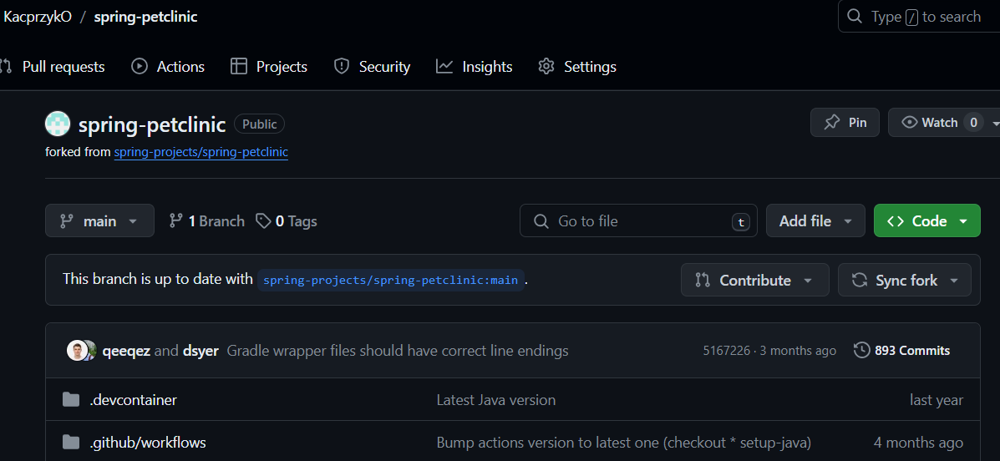

# Sprawozdanie3
## Karol Przydział 412605

## Laboratoria 5-7

Celem powyższych laboratoriów było wykorzystanie Jenkinsa do automatyzacji procesów build oraz test danego projektu.

W tym celu naszym zadaniem jest utworzenie pipeline'a, aby wykonać na nim schemat budowania, testowania oraz wdrażania aplikacji.

Projekt rozpoczynamy od uruchomienia obrazu dockera. Krok ten był już wykonywany na poprzednich laboratoriach:


### Skrypty

Kolejny krok po uruchomieniu obrazu opiera się już na działaniu bezpośrednio w Jenkinsie.

W tym celu tworzymy pierwszy projekt, który będzie zwracał uname.
Przechodzimy więc do opcji nowy projekt:


Następnie wybieramy opcję uruchomienia powłoki i uzupełniamy ją następująco:


Wynikiem tego są logi konsoli, które przedstawiają się następująco:


Kolejny etap dotyczy stworzenia projektu sprawdzającego, czy godzina jest parzysta. Jeśli jest nieparzysta program zwraca błąd.

Treść skryptu jest następująca:
```
FROM fedora

#!/bin/bash

hour=$(date +%H)

if [ $((hour % 2)) -eq 1 ]; then
    echo "Błąd: Godzina jest nieparzysta."
    exit 1
else
    echo "Godzina jest parzysta."
    exit 0
fi
```

Z kolei wynik konsoli przedstawia się następująco:


### Tworzenie "prawdziwego" projektu, który będzie klonował repozytorium, przechodził na osobistą gałąź i budował obraz dockerfiles.

Rozpoczynam od utworzenia projektu o nazwie "projektgit".

W sekcji `Repozytorium kodu` wybieram opcję `Git`, a następnie wklejam link do repozytorium. Jednak ze względu na to, że repozytorium jest prywatne muszę skonfigurować `Credentials`.
W związku z tym, używam swojego loginu do platformy GitHub wraz z hasłem Personal Access Token.


Kolejno ustawiam siebie jako użytkownika w Credentials, oraz gałąź, na którą chcę się przełączyć.


Wynik w historii zadań:


Logi konsoli:


Jak widzimy skrypt działa prawidłowo.

### Edycja "prawdziwego" projektu, w celu budowania obrazów Dockerfile.

Rozpoczynam od edycji skryptu, który wcześniej dodałem:


Efektem tego jest prawidłowe działanie skryptu.


### Dokument wraz z diagramami UML.

Pracę wykonuję na środowisku CI/CD określonym jako Jenkins. Korzystam z kodu źródłowego pobranego z repozytorium `spring-petclinic`. W pobranym repozytorium znajduje się również dodany przeze mnie plik `Dockerfile-builder` oraz `Dockerfile-tester` wraz z plikiem `Jenkinsfile`.

Diagram aktywności.

Diagram ten przedstawia kolejne etapy - rozpoczynając od Prepare i kończąc na Publish wraz z archiwizowaniem artefaktów.


Diagram wdrożeniowy pokazujący zależności.


### Definiowanie Pipeline'a.

#### W przypadku definiowania Pipeline'a mamy dwie opcje - możemy uruchomić go bezpośrednio w kontenerze bądź korzystając z Docker-in-Docker (DIND).

- Budowanie na kontenerze - jest to metoda wydajniejsza ze względu na fakt, iż nie pojawia się dodatkowa warstwa kontenera wewnętrznego. Jednak w kwestii zarówno bezpieczeństwa jak i zarządzania zasobami może okazać się niewystarzające.

- Docker-in-Docker (DIND) - w tym przypadku sytuacja jest nieco inna. DIND zapewnia dużo większe bezpieczeństwo, ponieważ uruchamianie bezpośrednio w kontenerze powoduje, że Docker może uzyskać dostęp do zasobów systemowych hosta. Ponadto, w przypadku Docker-in-Docker można zarządzać zasobami każdego kontenera niezależnie od siebie, co może być trudne w przypadku budowy bezpośrednio na kontenerze, ponieważ tam Docker ma dostęp do wszystkich zasobów hosta.

Wybór między DIND a budowaniem bezpośrednio w kontenerze zależy jednak od nas i tego jakie mamy wymagania oraz preferencje. Musimy wtedy sugerować się wieloma kwestiami, między innymi zasobami, bezpieczeństwem ale także wydajnością.


### Rozpoczynam fork repozytorium.


Repozytorium, które sforkowałem pojawia się na moim GitHubie.



`Repozytorium określa, że wstępne wymagania to minimum wersja 17 Javy oraz Gradle/Maven.`

### Sprawdzam czy licencja umożliwi mi działanie na repozytorium w kontekście zajęć.


### Tworzę pliki Dockerfile-builder oraz Dockerfile-tester, które następnie dodaje do sforkowanego repozytorium.

Zawartość poszczególnych plików:

Dockerfile-builder:

```
FROM gradle:latest

WORKDIR /app

RUN apt-get update && apt-get install -y git
RUN git clone https://github.com/spring-projects/spring-petclinic


WORKDIR /app/spring-petclinic
```
Dockerfile-tester:
```
FROM spring-builder:latest

RUN ./gradlew build -x test
```

Kod z poziomu GitHuba:


### Tworzę nowy projekt Pipeline.


Następnie modyfikuję `Build Triggers`.


Ostatecznie piszę skrypt pipeline.


Opis każdego z etapów wraz ze screenami.

- Collect - Ten etap polega na pobieraniu źródeł kodu lub artefaktów z repozytorium kodu lub innych źródeł.
Może to obejmować pobieranie kodu ze systemu kontroli wersji, takiego jak między innymi Git.


- Build - W tym etapie kod jest kompilowany, budowany lub pakowany w gotowe artefakty, które mogą być uruchamiane lub wdrażane.
Etap budowania jest często wykonywany za pomocą narzędzi takich jak Maven, Gradle, Make, Docker.


- Test - Etap testowania polega na automatycznym lub manualnym wykonywaniu testów na zbudowanych artefaktach w celu zweryfikowania, czy spełniają one określone wymagania jakościowe i funkcjonalne.


- Publish - W tym etapie zbudowane i przetestowane artefakty są publikowane w repozytorium artefaktów, gdzie są dostępne dla innych członków zespołu lub systemów wdrażania.

- Deploy - Etap ten polega na wdrożeniu zbudowanych i przetestowanych artefaktów do środowiska produkcyjnego, testowego lub innego środowiska docelowego.


### Uruchamiam utworzony Pipeline.


Logi konsoli po włączeniu skryptu.


Następnie dodaję plik Jenkinsfile do sforkowanego repozytorium.


Zmieniam ustawienia Pipeline'a tak, żeby uruchamiał się automatycznie w momencie, kiedy nastąpią zmiany w gałęzi main.


Po wprowadzeniu zmian dodaję przykładową modyfikację do pliku Dockerfile-builder.


Wynikiem tego jest automatyczne budowanie projektu, co jest pokazane na poniższym screenie.


#### Czy opublikowany obraz może być pobrany z Rejestru i uruchomiony w Dockerze bez modyfikacji (acz potencjalnie z szeregiem wymaganych parametrów, jak obraz DIND)?

Tak, opublikowany obraz może być pobrany z Rejestru i uruchomiony w Dockerze bez modyfikacji. Musimy jednak pamiętać ze etapy muszą się wykonać, a w przypadku wykorzystania DIND możemy potrzebować więcej danych.

#### Czy dołączony do jenkinsowego przejścia artefakt, gdy pobrany, ma szansę zadziałać od razu na maszynie o oczekiwanej konfiguracji docelowej?

Tak, jednak jego działanie zależy od kilku czynników. Należy upewnić się, że wszystkie zależności są zachowane a konfiguracja maszyny jest taka sama jak konfiguracja środowiska. W innym przypadku mogą pojawić się błedy, które trzeba poprawiać.