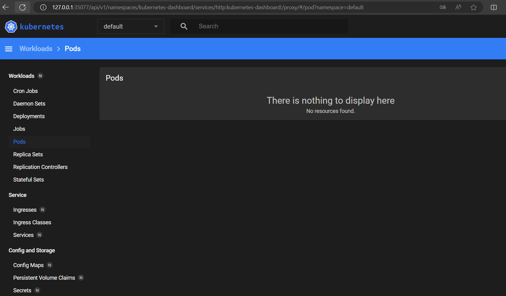
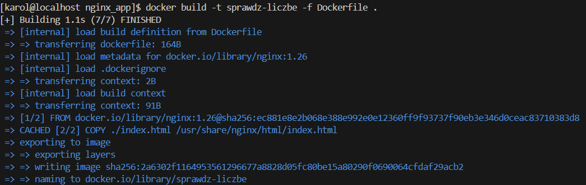
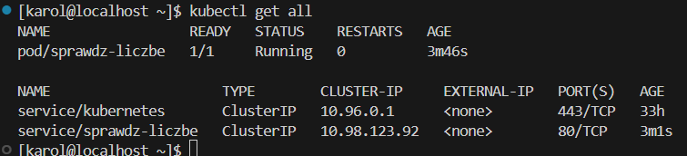

# Sprawozdanie5
## Karol Przydział 412605

## Laboratoria 10-11

## Wdrażanie na zarządzalne kontenery: Kubernetes - 1

### Instalacja klastra kubernetes.

Ćwiczenie rozpoczynamy od instalacji kubernetes. W tym celu zaopatrujemy się w implementację stosu k8s minikube. Robimy to na podstawie zawartej [dokumentacji](https://minikube.sigs.k8s.io/docs/start/). 

Aby ćwiczenie mogło zostać poprawnie wykonane musimy określić wymagania sprzętowe. Potrzebujemy więc 2GB RAMu, 20GB wolnego dysku oraz dwurdzeniowy procesor.

Całość wykonuję w systemie Fedora 38 wykorzystując opcję instalacji RPM.

Rozpoczynamy od pobrania paczki wykorzystując `curl`:
```
curl -LO https://storage.googleapis.com/minikube/releases/latest/minikube-latest.x86_64.rpm
```
Następnie instalujemy przy użyciu polecenia:
```
sudo rpm -Uvh minikube-latest.x86_64.rpm
```

i kolejno uruchamiamy:
```
minikube start
```

Podczas instalacji wystąpiły problemy, które były związane właśnie z faktem niewystarczajacej ilości wolnego miejsca, postawiłem więc nową maszynę wirtualną na której wykonywałem ćwiczenie.

Po utworzeniu nowej maszyny polecenie wykonuje się:


Po stworzeniu maszyny uruchamiamy dashboard:
```
minikube dashboard
```
Wynik z maszyny:


Sam dashboard prezentuje się następująco:



Dashboard jest narzędziem umożliwającym zarządzanie pracami (Jobs), Deploy'ami w zakładce Deployments ale również Podami znajdującymi się w zakładce Pods.

Pod jest z kolei podstawową jednostką rozliczeniową oraz operacyjną. Jest to najprostsza jednostka wdrożona przez Kubernetes. Pojedyńczy pod może zawierać jeden lub więcej kontenerów, które będą współdzielić zasoby.

Deployment pozwala na zarządzanie oraz skalowanie aplikacji kontenerowych. Ułatwia on tworzenie, aktualizację oraz zarządzanie zestawami replik oraz zapewnia stabilność i kontrolę nad cyklem życia aplikacji.

Aby sprawdzić, czy kontener kubernetes działa możemy wykorzystać polecenie `docker ps`, które wyświetli aktaualne kontenery.


Jak widać kontener kubernetes działa poprawnie.

Następnie, aby łatwiej nam było korzystać z zasobów możemy zainstalować `kubectl`.

Wykorzystujemy polecenie:
```
minikube kubectl -- get po -A
```


### Analiza posiadanego kontenera

Kolejny etap opiera się na działaniach opartych o analizę kontenera. Wykorzystuję do tego aplikację opierającą się o obraz nginx. Moja aplikacja określa czy liczba jest większa lub mniejsza od 50. W przypadku, gdy liczba jest równa zwraca komunikat mówiący, że liczby się pokrywają.

Rozpoczynamy od budowy obrazu z wykorzystaniem Dockerfile.
```
FROM nginx:1.26

COPY ./index.html /usr/share/nginx/html/index.html
```
Wraz z plikiem Dockerfile tworzę również plik index.html, który będzie zawierał opracowany program.

Kolejno buduję obraz:
```
docker build -t sprawdz-liczbe -f Dockerfile .
```


Aplikację testujemy poleceniem:
```
docker run -d --rm -p 6100:80 --name sprawdz-liczbe sprawdz-liczbe
```
Aby aplikacja mogła zadziałać poprawnie w VS Code musimy dodać port 6100, który następnie będzie przekierowany na port 80.


Ponownie sprawdzamy listę kontenerów:


Wykonujemy test naszej aplikacji na localhost:


Podany obraz należy następne umieścić na platformie DockerHub.

Aby zalogować się na tą platformę wykorzystuję polecenie:
```
docker login
```

Następnie taguję obraz, który będę chciał umieścić w DockerHub:
```
docker tag sprawdz-liczbe kacprzyk22/sprawdz-liczbe:0.0.0
```
Ostatecznie pushuje obraz:
```
docker push kacprzyk22/sprawdz-liczbe:0.0.0
```

Efektem tego jest obraz umieszczony na DockerHub:


Kolejno próbujemy uruchomić kontener poprzez pobranie obrazu z DockerHub.

```
docker run -d --rm -p 80:80 sprawdz-liczbe kacprzyk22/sprawdz-liczbe:0.0.0
```
Poprzez `docker ps` wyświetlamy kontenery i widzimy, że podany kontener działa:


### Uruchomienie oprogramowania

Aby rozpocząć to ćwiczenie musimy uruchomić kontener na stosie k8s. Jednak wcześniej należy sprawdzić, czy port na którym chcemy uruchomić dany kontener jest wolny.
```
sudo netstat -tuln | grep :80
```


Informacja ta mówi nam, że port jest wolny.

Uruchamiamy więc kontener korzystając z polecenia:
```
minikube kubectl run -- sprawdz-liczbe --image=kacprzyk22/sprawdz-liczbe:0.0.0 --port=80 --labels app=sprawdz-liczbe
```
Korzystamy również z polecenia:
```
alias kubectl="minikube kubectl --"
```
Polecenie to ułatwia korzystanie z kubectl w środowisku Minikube. Zastępuje on każdorazowe wpisywanie `minikube kubectl` na `kubectl`

Kolejno korzystając z `expose` jesteśmy w stanie udostępnić aplikację publicznie wystawiając ją na zewnątrz klastra.

```
kubectl expose pod sprawdz-liczbe --port=80 --target-port=80 --name=sprawdz-liczbe
```


Teraz sprawdzamy uruchomienie kontenera zarówno w `minikube dashboard` jak i w `kubectl`.

Minikube dashboard:


Kubectl:



W przypadku kubectl użyliśmy polecenia:
```
kubectl get all
```

Teraz chcemy przekierować aplikację z portu 3000 będącym portem lokalnym na port 80, który znajduje się wewnątrz kontenera z aplikacją sprawdz-liczbe. Wykonując polecenie jesteśmy w stanie otworzyć aplikację na porcie 3000. 

Musimy pamiętać, że takowy port należy ręcznie dodać w VS Code w zakładce `Ports`.


Widzimy, że aplikacja działa poprawnie.

## Wdrażanie na zarządzalne kontenery: Kubernetes - 2

### Konwersja wdrożenia ręcznego na wdrożenie deklaratywne YAML

Wykorzystując nowo utworzony plik YAML jesteśmy teraz w stanie wykonać poprzednie kroki, które wcześniej były wykonane ręcznie.

Rozpoczynamy od określenia liczby replik. Ustawiamy je jako 4. Ponadto, korzystamy z obrazu, który wcześniej utworzyliśmy na DockerHub.

Plik nazywa się `sprawdz-liczbe-deploy.yaml`.

Treść pliku:
```
apiVersion: apps/v1
kind: Deployment
metadata:
  name: sprawdz-liczbe-deploy
  labels:
    app: sprawdz-liczbe
spec:
  replicas: 4
  selector:
    matchLabels:
      app: sprawdz-liczbe
  template:
    metadata:
      labels:
        app: sprawdz-liczbe
    spec:
      containers:
      - name: sprawdz-liczbe
        image: kacprzyk22/sprawdz-liczbe:0.0.0
        ports:
        - containerPort: 80
```

Korzystając z polecenia:
```
kubectl -- apply -f ./sprawdz-liczbe-deploy.yaml
```
wdrażamy nasz plik.

Z kolei używając polecenia:
```
kubectl get deployments
```
sprawdzamy stan deploy.

Korzystając kolejno z polecenia:
```
kubectl rollout status deployments/sprawdz-liczbe
```
sprawdzamy statys naszego wdrożenia.


Po wykonaniu powyższych poleceń sprawdzamy dashboard. Wygląda on następująco:


### Przygotowanie nowego obrazu

W momencie przygotowywania obrazu korzystam z tego samego obrazu nginx, jednak dodaję do niego paragraf z dodatkowym opisem. Ponadto dodaję wersje obrazu zawierającą błąd, poprzez modyfikację Dockerfile na `false`.


Linijka, która została dodana to napis `Wybierz liczbe`.

Obraz z błędem zawiera dodatkową linijkę w pliku Dockerfile:


Teraz przy wykorzystaniu Dockera budujemy obrazy:
```
docker build -t sprawdz-liczbe
```
Tagujemy obraz:
```
docker tag sprawdz-liczbe kacprzyk22/sprawdz-liczbe:<wersja>
```

Pushowanie obrazu na DockerHub:
```
docker push kacprzyk22/sprawdz-liczbe:<wersja>
```
Wersja będzie sie róznić w zależności od tego, który obraz chcemy otagować.


### Zmiany w deploymencie

Kolejny krok opiera się na zmienianiu oraz analizie pliku YAML. Aktualizowanie tego pliku opiera się o:

* zwiększenie replik np. do 10
* zmniejszenie liczby replik do 1
* zmniejszenie liczby replik do 0

W pierwszym przypadku zmieniamy w treści naszego pliku YAML repliki do 10:
```
spec:
  replicas: 10
```

Przy wykorzystaniu polecenia:
```
kubectl -- apply -f ./sprawdz-liczbe-deploy.yaml
```
potwierdzamy zmiany.

Wynik z dashboard:


Wynik z VM:


Następnie zmniejszamy repliki do 1.


Kolejno zminiejszamy liczbę replik do 0.


Jeżeli ustawimy repliki na 0 zostaną usunięte wszystkie pody, które są związane z tym Deploymentem.

* Zastosowanie nowej wersji obrazu

Abyśmy mogli wykorzystać nową wersję obrazu musimy zmienić parametr image, który znajduje się w naszym `sprawdz-liczbe-deploy.yaml`. Zmiana następuje z wartości 0.0.0 na 0.0.1.

Ponownie wprowadzamy komendę:
```
minikube kubectl rollout status deployment/sprawdz-liczbe-deploy
```

Wynik przedstawia się następująco:


* Zastosowanie starszej wersji obrazu

Ponownie przechodzimy na starszą wersję obrazu.

Wynik po wykonaniu komendy:


Musimy również przetestować obraz z błędem. Będzie to więc wersja 0.0.2.


Teraz musimy przywrócić poprzednie wersje wykorzystując polecenie:
```
kubectl rollout history deployment/sprawdz-liczbe
```

Z kolei:
```
kubectl rollout undo deployment/sprawdz-liczbe
```
powoduje powrót do wcześniejszej wersji deploy.

Ostatecznie:
```
kubectl get pods
```
wyświetla liczbę wszystkich podów w klastrze.


### Kontrola wdrożenia

Na tym etapie należy napisać skrypt, który będzie sprawdzał, czy dane wdrożenie wykonało się w czasie 60 sekund.

Skrypt wygląda następująco:

```
#!/bin/bash

DEPLOYMENT_NAME="sprawdz-liczbe-deploy"
MAX_WAIT_TIME=60
START_TIME=$(date +%s)

check_deployment_status() {
    STATUS=$(minikube kubectl -- rollout status deployment/${DEPLOYMENT_NAME} --watch=false)
    echo "${STATUS}"
}


while true; do
    CURRENT_TIME=$(date +%s)
    ELAPSED_TIME=$((CURRENT_TIME - START_TIME))

    if [[ ${ELAPSED_TIME} -ge ${MAX_WAIT_TIME} ]]; then
        echo "Czas oczekiwania przekroczony (${MAX_WAIT_TIME} sekund)"
        exit 1
    fi
    DEPLOYMENT_STATUS=$(check_deployment_status)
    if [[ "${DEPLOYMENT_STATUS}" == *"successfully rolled out"* ]]; then
        echo "Wdrożenie ${DEPLOYMENT_NAME} zakończone sukcesem w ciągu ${ELAPSED_TIME} sekund"
        exit 0
    fi
    sleep 1
done
```

Wykonanie skryptu w wersji z błędem:


Wykonanie skryptu dla wersji bez błedu:


### Strategie wdrożenia

W tym kroku wykorzystujemy strategie - `Recreate`, `Rolling Update` oraz `Canary`.

Recreate jest domyślną strategią, która występuje przy deploymencie. W tej strategii wszystkie istniejące instancje (np. pody) są najpierw usuwane, zanim zostaną utworzone nowe instancje. 

Rolling Update to metoda aktualizacji zasobów, takich jak między innymi Deployment, która pozwala na stopniowe aktualizowanie podów do nowej wersji aplikacji. W przeciwieństwie do strategii Recreate, która powoduje przestój aplikacji, Rolling Update zapewnia ciągłą dostępność poprzez zamienianie starych podów nowymi w kontrolowany sposób.

Tworzę więc plik YAML o nazwie `rolling-update-deployment.yaml`.

```
apiVersion: apps/v1
kind: Deployment
metadata:
  name:  sprawdz-liczbe-deploy-rolling-update
  labels:
    app: sprawdz-liczbe
spec:
  replicas: 4
  strategy: 
    type: RollingUpdate
    rollingUpdate:
      maxUnavailable: 2
      maxSurge: 50%
  selector:
    matchLabels:
      app: sprawdz-liczbe
  template:
    metadata:
      labels:
        app: sprawdz-liczbe
    spec:
      containers:
      - name: sprawdz-liczbe
        image: kacprzyk22/sprawdz-liczbe:0.0.1
        ports:
        - containerPort: 80
```

W tym przypadku zmienna `maxUnavailable` ustawiona na 2 oznacza, że tylko dwa pody mogą być niedostępne podczas aktualizacji. Z kolei `maxSurge` oznacza, że można uruchomić dodatkowe 50% podów w stosunku do liczby, która jest określona.


Canary to metoda wdrażania, która polega na stopniowym wprowadzaniu nowej wersji aplikacji do produkcji. Poprzez wykorzystanie `track: canary` jesteśmy w stanie identyfikować pody.

```
apiVersion: apps/v1
kind: Deployment
metadata:
  name: sprawdz-liczbe-deploy-canary
  labels:
    app: sprawdz-liczbe
    track: canary
spec:
  replicas: 1
  selector:
    matchLabels:
      app: sprawdz-liczbe
      track: canary
  template:
    metadata:
      labels:
        app: sprawdz-liczbe
        track: canary
    spec:
      containers:
      - name: sprawdz-liczbe
        image: kacprzyk22/sprawdz-liczbe:0.0.0
        ports:
        - containerPort: 80
```


Podsumowanie:

`Strategia Recreate` polega na usunięciu wszystkich istniejących podów aplikacji przed wdrożeniem nowych. W praktyce oznacza to, że podczas aktualizacji aplikacja doświadcza przestoju, ponieważ nie ma działających podów obsługujących żądania do momentu, aż nowe pody zostaną utworzone i uruchomione. Strategia ta jest bardzo prosta do implementacji, ponieważ nie wymaga skomplikowanych mechanizmów synchronizacji ani utrzymywania starych i nowych wersji aplikacji jednocześnie.

`Strategia Rolling Update` umożliwia stopniowe aktualizowanie podów aplikacji, co zapewnia jej ciągłą dostępność podczas procesu wdrażania. Polega ona na sukcesywnym zamienianiu starych podów nowymi, co pozwala na monitorowanie i kontrolowanie procesu aktualizacji. Dzięki temu zawsze pozostaje pewna liczba działających podów, co minimalizuje przestoje. Ta strategia jest bardziej skomplikowana do skonfigurowania niż Recreate, ponieważ wymaga określenia parametrów takich jak liczba jednocześnie aktualizowanych podów i minimalna liczba podów, które muszą być zawsze dostępne.

`Strategia Canary` polega na stopniowym wprowadzaniu nowej wersji aplikacji do produkcji poprzez początkowe wdrożenie jej do niewielkiej części podów. Na początku tylko mały procent użytkowników korzysta z nowej wersji, co pozwala na dokładne testowanie i monitorowanie aplikacji w rzeczywistych warunkach produkcyjnych. Jeśli wszystko działa poprawnie, liczba podów z nową wersją jest stopniowo zwiększana, aż w końcu cała aplikacja zostaje zaktualizowana. Ta strategia minimalizuje ryzyko wprowadzenia błędów produkcyjnych, ponieważ ewentualne problemy można wykryć i naprawić zanim nowa wersja zostanie wdrożona do wszystkich użytkowników.

Wykorzystanie `serwisów`.

Serwisy są ważnym elementem umożliwiającym komunikację pomiędzy padami. Serwis umożliwia niezawodne odkrywanie i komunikację między różnymi komponentami aplikacji, niezależnie od tego, gdzie aktualnie działają pody.

Tworzymy plik `serwis.yaml`, który będzie wykorzystywał aplikację użytą wcześniej w ćwiczeniu. Wykorzystamy przekierowanie portu z 80 dostępnego wewnątrz klastra na 80 znajdujące się na podach.

```
apiVersion: v1
kind: Service
metadata:
  name: service
spec:
  selector:
    app: sprawdz-liczbe
  ports:
    - protocol: TCP
      port: 80
      targetPort: 80
```


Kolejno wykorzystujemy komendę:
```
kubectl post-forward service/service 5100:80
```
Otrzymany wynik:

