# Katarzyna Rura - sprawozdanie z laboratoriów 1 i 2

  

Poniższe sprawozdanie dotyczy wykorzystania narzędzi:

- `Git` - służącego do pracy w zdalnym repozytorium

- `Docker` - umożliwiającego konteneryzację

  

---

# Wprowadzenie, Git, Gałęzie, SSH

  

## Wykonane zadania

#### 1. Zainstaluj klienta Git i obsługę kluczy SSH

Polecenia uzyte do instalacji:

```bash

$ sudo apt install git #git

$ sudo apt install openssh-client #obsluga kluczy ssh

```

  
  

#### 2. Sklonuj [repozytorium przedmiotowe](https://github.com/InzynieriaOprogramowaniaAGH/MDO2024_INO) za pomocą HTTPS i personal access token

Generowanie tokenu na GitHubie odbyło się według następującej ścieżki:

1. Settings

2. Developer settings

3. Personal access tokens

4. Tokens (classic)

5. Generate new token

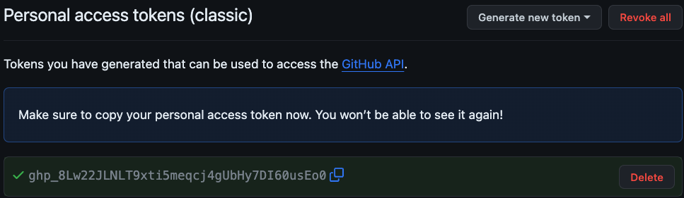

Zgodnie z instrukcją GitHuba należy skopiować token (na zielonym tle)

Klonowanie repozytorium:

```bash

$ git clone [link] [opcjonalny folder docelowy]

Username: [USERNAME]

Password: [SKOPIOWANY TOKEN]

```

W moim przypadku nie było potrzeby podawania tokenu ze względu na cache uwierzytelniania (przez wcześniejsze uwierzytelnienie `git` przechowuje dane uwierzytelniające i korzysta z nich automatycznie):

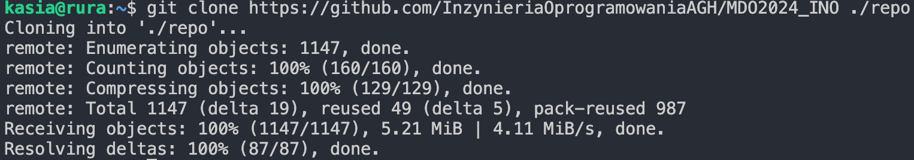

  
  

#### 3. Upewnij się w kwestii dostępu do repozytorium jako uczestnik i sklonuj je za pomocą utworzonego klucza SSH

##### Utwórz dwa klucze SSH, inne niż RSA, w tym co najmniej jeden zabezpieczony hasłem

Utworzono dwa klucze szyfrowane algorytmem `ed25519`, jeden zabezpieczony hasłem, drugi bez zabezpieczenia. Oba zostały stworzone według polecenia:

```bash

$ ssh-keygen -t ed25519 -C [adres email]

```

Dla obu kluczy poproszono o podanie nazwy oraz hasła, w przypadku tworzenia klucza bez zabezpieczenia hasłem wystarczy kliknąć dwa razy `enter` podczas pytania o hasło.

Po stworzeniu obu kluczy pojawiły się cztery pliki:

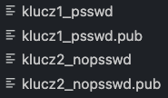

##### Skonfiguruj klucz SSH jako metodę dostępu do GitHuba

Dodano klucz publiczny (z rozszerzeniem `.pub`) do konta na GitHubie według ściezki:

1. Settings

2. SSH and GPG keys

3. New SSH key

Po dodaniu klucza klucz1_psswd:

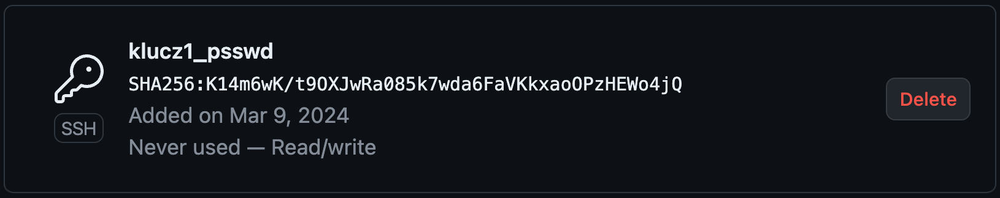

Następnie należy dodać prywatny klucz wykorzystując komendę:

```

$ ssh-add [ściezka do klucza]

```

W moim przypadku pojawił się błąd:

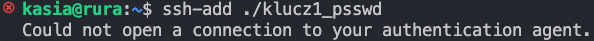

Rozwiązaniem okazało się uruchomienie agenta SSH oraz ponowne dodanie prywatnego klucza:

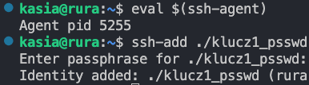

##### Sklonuj repozytorium z wykorzystaniem protokołu SSH

Klonowanie odbyło się za pomocą polecenia:

```bash

$ git clone git@github.com:InzynieriaOprogramowaniaAGH/MDO2024_INO.git

```

  
  

#### 4. Przełącz się na gałąź ```main```, a potem na gałąź swojej grupy

Po wejściu do folderu zawierającego sklonowane repozytorium nalezy przełączyć się na odpowiednie gałęzie za pomocą `git checkout [branch]`

W moim przypadku nastąpiło to w następujący sposób:

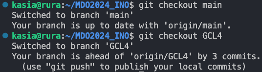

  
  

#### 5. Utwórz gałąź o nazwie "inicjały & nr indeksu"

Tworzenie nowej gałęzi odbyło się za pomocą polecenia:

```bash

$ git branch KR409759

$ git checkout KR409759

```

  
  

#### 6. Rozpocznij pracę na nowej gałęzi

##### W katalogu właściwym dla grupy utwórz nowy katalog, także o nazwie "inicjały & nr indeksu"

Katalog stworzono za pomocą `mkdikr` w następującej lokalizacji:


##### Napisz Git hooka - skrypt weryfikujący, że każdy Twój "commit message" zaczyna się od "twoje inicjały & nr indexu"

Hooka stworzono na podstawie pliku `commit-msg.sample` znajdującego się w folderze `~/MDO2024_INO/.git/hooks`:

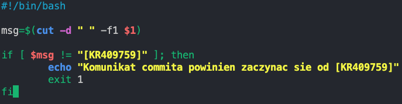

  

##### Dodaj ten skrypt do stworzonego wcześniej katalogu.

Skrypt dodano do katalogu `KR409759` za pomocą komendy:

```bash

$ cp ~/MDO2024_INO/.git/hooks/commit-msg ~/MDO2024_INO/ITE/GCL4/KR409759

```

  

##### Skopiuj go we właściwe miejsce, tak by uruchamiał się za każdym razem kiedy robisz commita.

Ponieważ hooka edytowano wprost na pliku znajdującym się w katalogu `~/MDO2024_INO/.git/hooks` - nie było potrzeby kopiowania go w to samo miejsce.

Należało natomiast dodać uprawnienia uruchamiania pliku za pomocą komendy:

```bash

$ chmod +x ~/MDO2024_INO/.git/hooks/commit-msg

```

Warto zaznaczyć, ze w moim przypadku plik `commit-msg` nie działał dopóki nie usunięto pliku `commit-msg.sample`

##### Umieść treść githooka w sprawozdaniu.

Treść w formie tekstowej:

```bash

#!/bin/bash

  

msg=$(cut -d " " -f1 $1)

  

if [ $msg != "[KR409759]" ]; then

echo "Komunikat commita powinien zaczynac sie od [KR409759]"

exit 1

fi

```

##### W katalogu dodaj plik ze sprawozdaniem

"Template" sprawozdania dodano do katalogu `KR409759/Sprawozdanie1` za pomocą komendy:

```bash

$ cp ~/MDO2024_INO/READMEs/001-Task.md ~/MDO2024_INO/ITE/GCL4/KR409759/Sprawozdanie1/README.md

```

##### Dodaj zrzuty ekranu (jako inline)

Zrzuty ekranu zostały dodane wykorzystując składnię:

```markdown


```

W przypadku tego sprawozdania zrzuty ekranu znajdują się w folderze `MDO2024_INO/ITE/GCL4/KR409759/Sprawozdanie1/pics`

##### Wyślij zmiany do zdalnego źródła

Zmiany zostały wysłane za pomocą następującej sekwencji komend:

```bash

$ git add [pliki do dodania]

$ git commit -m [commit message]

$ git push

```

##### Spróbuj wciągnąć swoją gałąź do gałęzi grupowej

Aby wciągnąć swoją gałąź do gałęzi grupowej należało przejść na wspomnianą gałąź grupową, "zmerge'ować" ją z gałęzią indywidualną, a następnie wykonać `pusha`. W moim przypadku sekwencja komend wyglądała następująco:

```bash

$ git checkout GCL4

$ git merge KR409759

$ git push

```

  

---

  

# Git, Docker

  

## Wykonane zadania

  

#### 1. Zainstaluj Docker w systemie linuksowym

Instalacja Dockera na Ubuntu odbywa się za pomocą następujących instrukcji:

```bash

apt-get update

apt-get install docker.io

```

#### 2. Zarejestruj się w [Docker Hub](https://hub.docker.com/) i zapoznaj z sugerowanymi obrazami

#### 3. Pobierz obrazy `hello-world`, `busybox`, `ubuntu` lub `fedora`, `mysql`

Obrazy pobrano za pomocą komendy `docker pull [nazwa obrazu]`. Niestety ze względu na brak uprawnień uzytkownika do komendy `docker` wystąpił następujący błąd:

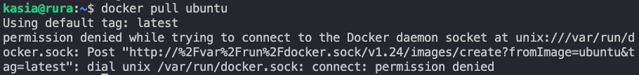

Rozwiązaniem jest wykonanie jednej z poniższych czynności:

- wywołać komendę `sudo usermod -aG docker $USER`, a następnie ponownie zalogować się na konto użytkownika

- przed każdy użyciem komendy `docker` dodać dopisek `sudo`

  

Po pobraniu wszystkich obrazów można je wyświetlić za pomocą komendy `docker images`:

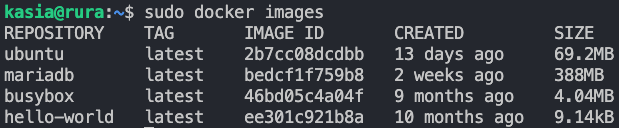

  

#### 4. Uruchom kontener z obrazu `busybox`

Uruchomienie odbyło się za pomocą komendy `docker run [nazwa kontenera]`

##### Pokaż efekt uruchomienia kontenera

Efekt uruchomienia można sprawdzić za pomocą komendy `docker ps -a`:

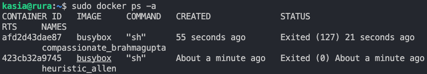

##### Podłącz się do kontenera **interaktywnie** i wywołaj numer wersji

Aby połączyć się interaktywnie z kontenerem należy użyć flagi `--interactive` podczas użycia `docker run`:

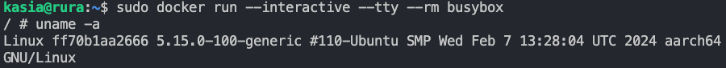

#### 5. Uruchom "system w kontenerze" (czyli kontener z obrazu `fedora` lub `ubuntu`)

Tak jak w poprzednim przypadku połączono się poprzez komendę `docker run` w trybie interaktywnym

##### Zaprezentuj `PID1` w kontenerze i procesy dockera na hoście

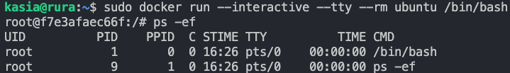

##### Zaktualizuj pakiety

Aktualizacja odbyła się za pomocą komend `apt-get update` oraz `apt-get upgrade`

##### Wyjdź

Aby wyjść z kontenera należało użyć komendy `exit`

#### 6. Stwórz własnoręcznie, zbuduj i uruchom prosty plik `Dockerfile` bazujący na wybranym systemie i sklonuj nasze repo.

##### Upewnij się że obraz będzie miał `git`-a

Aby stworzyć `Dockerfile`'a odpowiadającego wymienionym wymaganiom należało:

- dodać do pliku rodzaj obrazu za pomocą instrukcji `FROM` - w moim przypadku był to obraz `Ubuntu`

- dodać polecenia aktualizujące pakiety oraz instalujące pakiet git wykorzystując instrukcję `RUN`. Pozwala ona na wywołanie komend "systemowych", w tym przypadku `apt-get update` oraz `apt-get install -y git`. Flaga `-y` oznacza, że odpowiedzią na wszystkie pytania o potwierdzenie instalacji będzie "yes"

- sklonować repozytorium `git` ponownie korzystając z `RUN`. Repozytorium zostało dodane do nowego katalogu `DevOps` wewnątrz kontenera

- ustawić biężący katalog pracy na uprzednio stworzony `DevOps` za pomocą instrukcji `WORKDIR` oraz podania ścieżki do wspomnianego katalogu

  

Pełny `Dockerfile`:

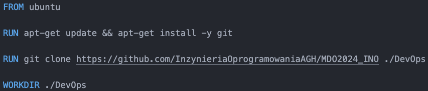

##### Uruchom w trybie interaktywnym i zweryfikuj że jest tam ściągnięte nasze repozytorium

Kontener należało uruchomić w folderze zawierającym `Dockerfile`'a. Następnie wykorzystując komendę `ls` można zauważyć poprawnie sklonowane repozytorium:

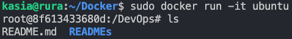

#### 7. Pokaż uruchomione kontenery

Za pomocą instrukcji `docker ps` wyświetlono uruchomione kontenery. Jak widać ponizej - nie wszystkie działają. Było to spowodowane uruchomieniem dwóch z nich bez trybu interaktywnego.

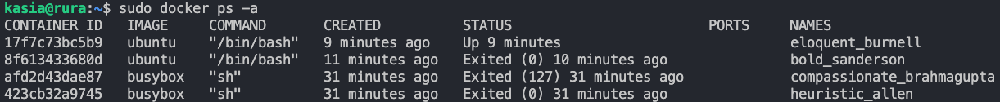

Aby zatrzymać oraz usunąć wszystkie uruchomione kontenery wykorzystano instrukcje:

```bash

docker stop $(docker ps -aq)

docker rm $(docker ps -aq)

```

Flaga `-a` umożliwia wyświetlenie wszystkich kontenerów, natomiast `-q` wyświetla tylko ich identyfikatory.

#### 8. Wyczyść obrazy

Obrazy wyczyszczono za pomocą komendy `docker rmi $(docker images -q)`