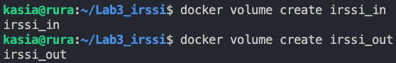
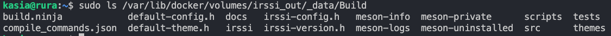

# Katarzyna Rura - sprawozdanie z laboratoriów 3 i 4

  

Poniższe sprawozdanie dotyczy wykorzystania narzędzi:

- `Docker`, `Dockerfile` - umożliwiającego konteneryzację

- `Jenkins` - pozwalającego na automatyzację procesów wytwarzania oprogramowania (takich jak kompilacja czy testowanie)

---
# Dockerfiles, kontener jako definicja etapu


## Wykonane zadania


### 1. Znaleziono dwa repozytoria spełniające poniższe wymagania:
* Dysponuje otwartą licencją
* Jest umieszczone wraz ze swoimi narzędziami Makefile.
* Zawiera zdefiniowane i obecne w repozytorium testy, które można uruchomić np. jako jeden z "targetów" Makefile'a.

Linki do wspomnianych repozytoriów: 
* https://github.com/devenes/node-js-dummy-test
* https://github.com/irssi/irssi

### 2. Przeprowadzenie buildu w kontenerze dla:
#### Node-js-dummy-test
1. Wykonano kroki `build` i `test` wewnątrz wybranego kontenera bazowego:
	* Uruchomiono kontener za pomocą polecenia:
	```bash
	$ docker run --rm -it node /bin/bash
	```
	* Zaopatrzono kontener w wymagania wstępne (`git`) za pomocą komendy:
	```bash
	$ apt-get update && apt-get install git
	```
	* Sklonowano repozytorium, a następnie zbudowano i przetestowano aplikację:
	```bash
	$ git clone https://github.com/devenes/node-js-dummy-test.git .
	```
	
2. Stworzono dwa pliki `Dockerfile` automatyzujące kroki powyżej, z uwzględnieniem następujących kwestii:
	* Kontener pierwszy (`node_builder.Dockerfile`) przeprowadza wszystkie kroki aż do *builda*:
	
	* Kontener drugi (`node_tester.Dockerfile`) bazuje na pierwszym i wykonuje testy:
	
3. Sprawdzono, czy kontenery wdrażają się i pracują poprawnie:

Po zbudowaniu i uruchomieniu kontenerów należało sprawdzić kod, z jakim się zakończyły. Poprawna budowa kontenera powinna zwrócić kod `exit 0`:


   
### Irssi
1. Wykonano kroki `build` i `test` wewnątrz wybranego kontenera bazowego:
	* Uruchomiono kontener za pomocą polecenia:
	```bash
	docker run --rm -it ubuntu /bin/bash
	```
	* Zaopatrzono kontener w wymagania wstępne (`git` oraz niezbędne zależności) za pomocą komend:
	```bash
	$ apt-get update && apt-get install git
	$ apt install meson
	$ apt install build-essential
	$ apt install libglib2.0-dev
	$ apt install libncurses-dev
	$ apt install libssl-dev
	```
	* Sklonowano repozytorium, a następnie zbudowano i przetestowano aplikację:
	```bash
	$ git clone https://github.com/irssi/irssi
	$ cd irssi/
	$ meson Build
	```
	
2. Stworzono dwa pliki `Dockerfile` automatyzujące kroki powyżej, z uwzględnieniem następujących kwestii:
	* Kontener pierwszy (`irssi_builder.Dockerfile`) przeprowadza wszystkie kroki aż do *builda*:
	
	* Kontener drugi (`irssi_tester.Dockerfile`) bazuje na pierwszym i wykonuje testy:
	
3. Sprawdzono, czy kontenery wdrażają się i pracują poprawnie:

Tak jak w poprzednim przypadku należało sprawdzić kod zakończenia działania kontenerów. Na poniższym screenie pokazano drugi sposób sprawdzania poprawności - w kolumnie `STATUS` widać, iż oba kontenery zakończyły działanie z kodem `0`:


# Dodatkowa terminologia w konteneryzacji, instancja Jenkins


## Wykonane zadania


### 1. Zachowywanie stanu
* Przygotowanie woluminów i podłączenie ich do kontenera irssi

	Stworzono dwa woluminy - wejściowy (`irssi_in`) i wyjściowy (`irssi_out`) w następujący sposób:
	```bash
	$ docker volume create [nazwa]
	```
	

* Uruchomiono nowy kontener:

Do podłączenia woluminów wykorzystano następującą flagę:
`--mount source=[nazwa_wolumina],target=[ścieżka]` - podłącza wolumin `[nazwa_wolumina]` do katalogu `[ścieżka]` wewnątrz kontenera

* Sklonowano repozytorium `irssi` na wolumin wejściowy:
```bash
$ sudo git clone https://github.com/irssi/irssi $(docker volume inspect -f '{{ .Mountpoint }}' [nazwa_wolumina_wejściowego])
```
Gdzie część `$(docker volume inspect -f '{{ .Mountpoint }}' [nazwa_wolumina_wejściowego])` uzyskuje ścieżkę montowania woluminu wejściowego, aby następnie ją zwrócić, co skutkuje sklonowaniem repozytorium do wspomnianego woluminu.
Warto pamiętać o użyciu `sudo` w przypadku korzystania z użytkownika bez uprawnień `roota`, w przeciwnym przypadku dojdzie do sytuacji ukazanej na poniższym screenie:


Sprawdzenie poprawności klonowania wykonano w uruchomionym kontenerze w następujący sposób:


* Uruchomiono build w kontenerze za pomocą komend:
```bash
$ meson Build
$ ninja -C /in/Build
```

* Powstałe/zbudowane pliki zapisano na woluminie wyjściowym, tak by były dostępne po wyłączniu kontenera wykorzystując instrukcję:
```bash
cp -r /in/Build /out
```



* Ponownie uruchomiono kontener z woluminami, a następnie sklonowano repozytorium do wolumina wejściowego wewnątrz kontenera w następujący sposób:

Stworzenie nowych woluminów oraz uruchomienie kontenera:


Klonowanie repozytorium i sprawdzenie efektów wewnątrz kontenera:


Sprawdzenie efektów poza kontenerem:


* Wyżej wymienione kroki można zautomatyzować za pomocą `docker build` i pliku `Dockerfile`:
```Dockerfile
FROM ubuntu

RUN apt-get update && \
    apt-get install -y git

RUN --mount=type=volume,source=irssi_in,target=/in git clone https://github.com/irssi/irssi

WORKDIR /in

RUN apt-get install -y meson meson build-essential libglib2.0-dev libncurses-dev libssl-dev && \
    meson Build

RUN ninja -C /in/Build
```

### Eksponowanie portu
* Uruchomiono wewnątrz kontenera serwer iperf:

Wykorzystano flagi:
`-p` - określa przekierowanie portów, w moim przypadku mapuje port hosta `5201` na port kontenera `5201`
`-s` - okresla, że w kontenerze ma zostać uruchomiony *serwer* iperf3
* Połączono się z kontenerem-serwerem z drugiego kontenera:
Przed stworzeniem drugiego kontenera należało sprawdzić adres IP kontenera-serwera:

Gdzie:
`-f` jest flagą umożliwiającą określenie formatu wyniku
`{{.Name}} - {{range .NetworkSettings.Networks}}{{.IPAddress}}{{end}}` - pozwala na wyświetlenie nazwy kontenera oraz jego adresu IP. Fragment `range` jest pętlą, jej użycie jest uzasadnione możliwością podłączenia jednego kontenera do wielu sieci, co w tym przypadku mogłoby skutkować w obejściu wszystkich sieci danego kontenera
`$(sudo docker ps -aq)` - wynik polecenia wewnątrz nawiasów jest przekazywany jako argument polecenia `docker inspect`

Uruchomienie kontenera-klienta

Gdzie flaga `-c [adres IP]` określa, że dany kontener ma być klientem podłączonym do serwera o podanym adresie IP

Efekt połączenia na kontenerze-serwerze:

* Ponownie połączono dwa kontenery, tym razem z wykorzystaniem nazw oraz dedykowanej sieci mostkowej:
Utworzenie sieci mostkowej zostało wykonane komendą:
```bash
$ docker network create --driver bridge [nazwa sieci]
```

Utworzenie kontenera-serwera:

Wykorzystano flagi:
`--name=[nazwa kontenera]` - pozwala na nadanie nazwy kontenerowi, w późniejszej części tego zadania był to niezbędny krok
`--network=[nazwa sieci]` - określa sieć, do której zostanie podłączony kontener

Uruchomienie kontenera-klienta oraz efekt  połączenia kontenerów:


* Utworzono komunikację kontener - host:
Uruchomienie kontenera-serwera (do nasłuchiwania na porcie 5201):


Połączenie hosta ze stworzonym kontenerem:


* Utworzono komunikację kontener - klient spoza hosta:
Jako klienta wykorzystano system MacOS, przed połączeniem z kontenerem utworzonym wcześniej należało upewnić się, że system posiada `iperf3`, a następnie połączyć się z serwerem wykorzystując adres IP hosta:


Efekt połączenia na serwerze:


* Podsumowanie przepustowości komunikacji:
  
| Rodzaj połączenia | Przepustowość |
| :----: | :----: |
| Kontener - kontener (adres IP) | 88.1 Gbits/sec |
| Kontener - kontener (nazwa) | 86.4 Gbits/sec |
| Kontener - host | 102 Gbits/sec |
| Kontener - spoza hosta | 6.01 Gbits/sec | 

Najwyższą przepustowość osiąga połączenie między kontenerem a hostem, co jest zrozumiałe, ponieważ nie ma narzutu sieciowego. Przepustowość między kontenerami jest również bardzo wysoka, zarówno przy użyciu adresów IP, jak i nazw hostów, co pokazuje efektywność sieci wirtualnych w obrębie tego samego hosta. Znacząco niższą przepustowość ma połączenie z zewnętrznym hostem, co jest typowe dla połączeń sieciowych wykraczających poza lokalny host, gdzie pojawiają się dodatkowe opóźnienia i ograniczenia fizyczne.

### Instancja Jenkins
* Utworzenie pliku `docker-compose.yml`:

```yaml
services:
  jenkins:
    container_name: jenkins
    image: jenkins/jenkins
    ports:
      - "8080:8080"
    volumes:
      - jenkins_data:/var/jenkins_home
    networks:
      - jenkins

  docker:
    container_name: docker
    image: docker:stable-dind
    volumes:
      - jenkins_data:/var/jenkins_home
    networks:
      - jenkins
    depends_on:
      - jenkins

networks:
  jenkins:

volumes:
  jenkins_data:
```

Następnie uruchomiono kontener za pomocą komendy:
```bash
docker-compose up -d
```

Oraz sprawdzono, czy kontener działa (za pomocą `docker ps`):


* Zalogowanie się do usługi Jenkins
Aby uzyskać hasło niezbędne do zalogowania się należało sprawdzić logi kontenera Jenkinsa za pomocą komendy:
```bash
docker logs [nazwa kontenera]
```

Następnie należało wejść na stronę `http://[adres IP hosta]:8080` oraz wpisać uzyskane hasło. Po poprawnym wykonaniu powyższych czynności pojawił się panel administratora:


