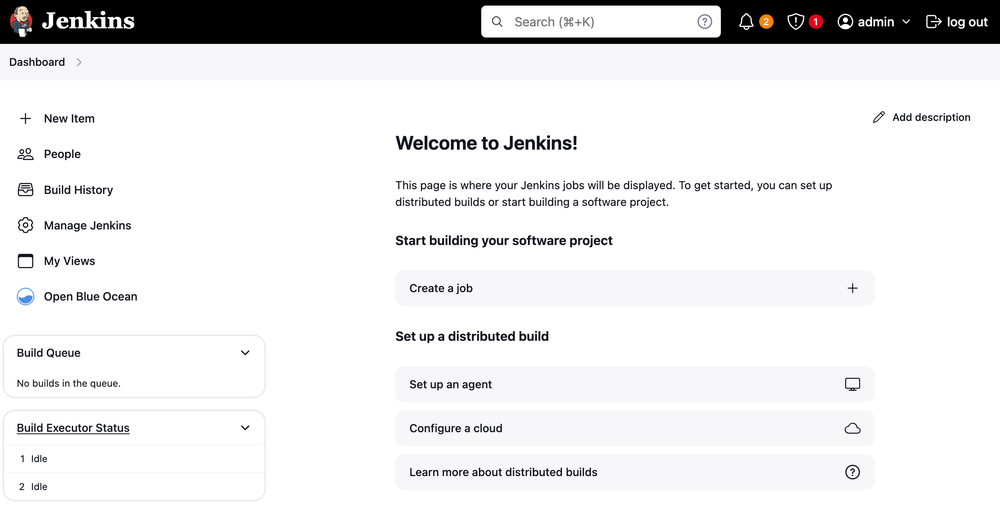
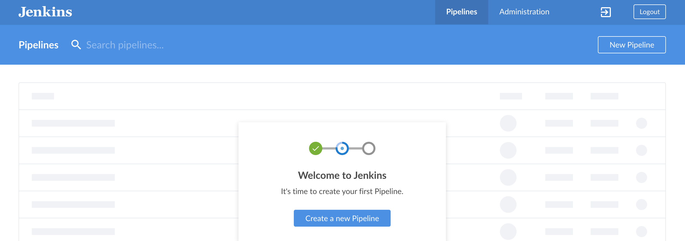
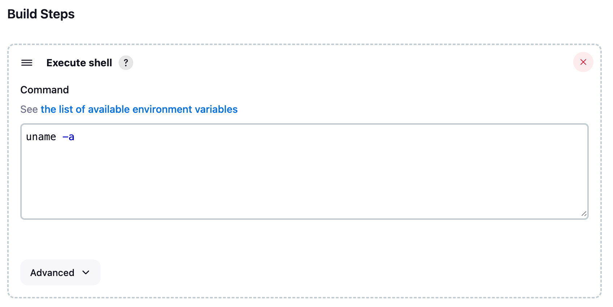
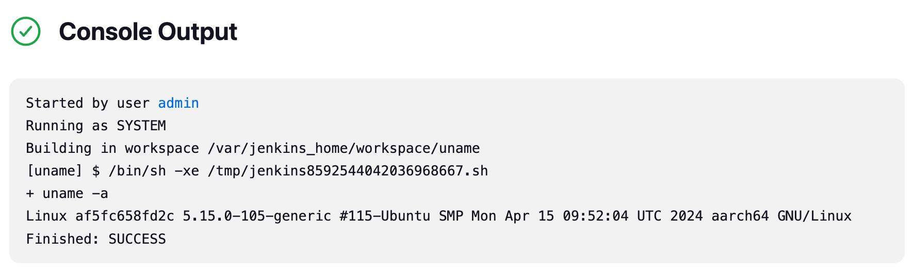
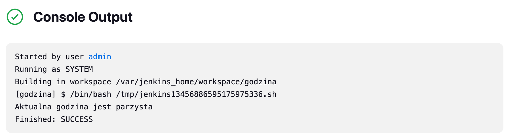
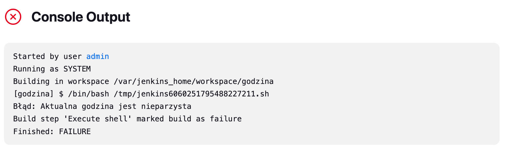
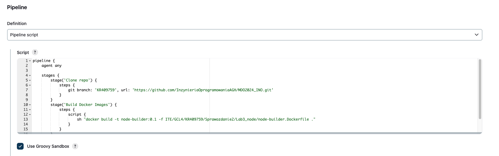
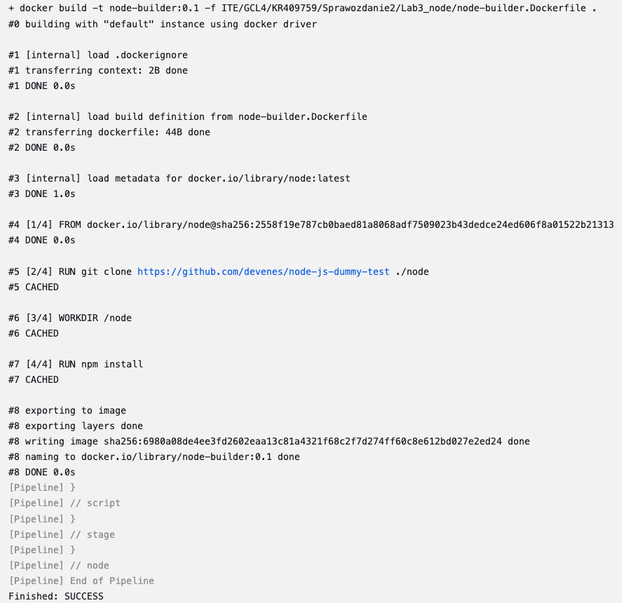
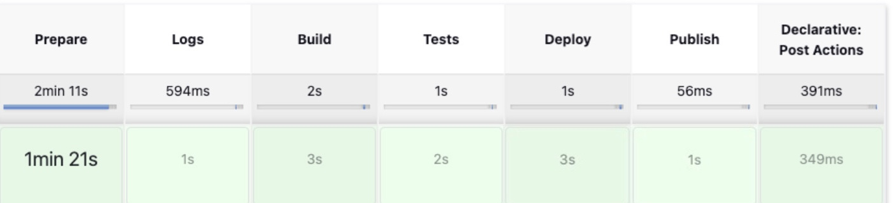

# Katarzyna Rura - sprawozdanie z laboratoriów 5, 6 i 7

---

## Pipeline, Jenkins, izolacja etapów

### Przygotowanie
* Upewniono się, że kontenery budujące i testujące stworzone na poprzednich zajęciach działają:
  


* Zgodnie z instrukcją instalacji Jenkinsa: https://www.jenkins.io/doc/book/installing/docker/ uruchomiono obraz Dockera eksponujący środowisko zagnieżdżone oraz Blueocean:


* Następnie zalogowano się do Jenkinsa oraz dodano plugin Blueocean:



  
### Uruchomienie 
#### Konfiguracja wstępna i pierwsze uruchomienie
* Utworzono projekt, który wyświetla uname według ścieżki:
```
Dashboard -> New Item -> Freestyle project
```
Po nadaniu projektowi nazwy, w sekcji `Build steps` wybrano opcję `Execute shell`, do której wpisano instrukcję wyświetlającą `uname`:


Efekt uruchomienia znajduje się w sekcji `Console Output`:


* Utworzono projekt, który zwraca błąd, gdy godzina jest nieparzysta:
  * Kroki tworzenia projektu pokrywają się z tymi opisanymi powyżej
  * Skrypt wykorzystany w sekcji `Build steps -> execute shell`:
    ```bash
    #!/bin/bash
    hour=$(date +%H)

    if [ $((hour % 2)) -ne 0 ]; then
        echo "Błąd: Aktualna godzina jest nieparzysta"
        exit 1
    else
        echo "Aktualna godzina jest parzysta"
    fi
    ```
  * Efekty uruchomienia o godzinie 16 oraz 17:
  
  
  
### Skrypt Jenkins Pipeline 
Za pomocą skryptu Groovy zaimplementowano pipeline w Jenkinsie, który miał za zadanie:
* Sklonować repozytorium przedmiotowe oraz użyć gałęzi KR409759
* Zbudować obraz `node-builder:0.1`

Logi konsoli po pomyślnym zakończeniu pipeline'a:


Różnice pomiędzy DIND oraz budowaniem bezpośrednio w kontenerze CI:

DIND jest rozwiązaniem używanym w przypadkach, gdy potrzebna jest pełna kontrola nad środowiskiem Dockera wewnątrz platformy CI/CD lub na maszynie deweloperskiej. Umożliwia również uruchamianie i zarządzanie wieloma instancjami Dockera, co może być przydatne w testowaniu i budowaniu aplikacji. Z kolei budowanie bezpośrednio w kontenerze CI oznacza, że proces budowania i testowania aplikacji odbywa się *bezpośrednio* w kontenerze już uruchomionym przez platformę CI/CD. To podejście zazwyczaj jest prostsze do konfiguracji i zarządzania, ponieważ eliminuje potrzebę zarządzania dodatkowym kontenerem Dockera (jak w przypadku DIND).

### Pipeline
* Zdefiniowano pipeline:
```Groovy
pipeline {
    agent any

    stages {
        stage('Prepare') {
            steps {
                sh '''
                    rm -rf MDO2024_INO
                    git clone https://github.com/InzynieriaOprogramowaniaAGH/MDO2024_INO.git
                    cd MDO2024_INO
                    git checkout KR409759
                '''
            }
        }

        stage('Logs') {
            steps {
                dir('MDO2024_INO/ITE/GCL4/KR409759/Sprawozdanie2/Lab3_node'){
                    sh 'touch build.log'
                    sh 'touch test.log'
                }
            }
        }

        stage('Build') {
            steps {
                dir('MDO2024_INO/ITE/GCL4/KR409759/Sprawozdanie2/Lab3_node'){
                    sh 'docker build -t node-builder:0.1 -f node-builder.Dockerfile . | tee build.log'
                    archiveArtifacts artifacts: "build.log"
                }
            }
        }

        stage('Tests') {
            steps {
                dir('MDO2024_INO/ITE/GCL4/KR409759/Sprawozdanie2/Lab3_node'){
                    sh 'docker build -t node-tester:0.1 -f node-tester.Dockerfile . | tee test.log'
                    archiveArtifacts artifacts: "test.log"
                }
            }
        }

        stage('Deploy') {
            steps {
                sh 'docker network create my_network || true'
                dir('MDO2024_INO/ITE/GCL4/KR409759/Sprawozdanie2/Lab3_node'){
                    sh 'docker build -t node-deployer:0.1 -f node-deployer.Dockerfile .'
                    sh 'docker rm -f rurapp || true'
                    sh 'docker run -d -p 3000:3000 --name rurapp --network my_network node-deployer:0.1'
                }
                sleep(10) 
            }
        }

        stage('Publish') {
            steps {
                dir('MDO2024_INO/ITE/GCL4/KR409759/Sprawozdanie2/Lab3_node'){
                    archiveArtifacts artifacts: "artifacts/art.tar"
                    sh 'docker system prune --all --volumes --force'
                }
            }
        }
    }
    
    post {
        always {
            echo 'Cleaning up...'
            sh 'docker rmi node-builder:0.1 node-tester:0.1 node-deployer:0.1'
        }
    }
}
```

Gdzie:
* Prepare - przygotowuje środowisko projektowe, usuwa katalog MDO2024_INO (istotne w przypadku uruchomienia pipeline'u kilkukrotnie), klonuje repozytorium oraz przechodzi na gałąź indywidualną.
* Logs - przygotowuje pliki, które będą zawierały logi kolejnych dwóch etapów.
* Build - buduje obraz Dockera używając `node-builder.Dockerfile` i zapisuje logi z procesu budowania do pliku `build.log`, archiwizuje plik `build.log` jako artefakt budowania. Jest to istotny element ze względu na wykorzystywanie `node-builder` w praktycznie każdym późniejszym etapie pipeline'a
* Tests - wykonuje to samo, co w poprzednim etapie, ale dla testów aplikacji.
* Deploy - w tym etapie obraz Dockera jest wdrażany i uruchamiany w kontenerze, tworzy Dockerową sieć, buduje obraz `node-deployer.Dockerfile`, usuwa kontener `rurapp` (podobnie jak w katalogu MDO2024_INO, na wypadek jego wcześniejszego istnienia), a także uruchamia kontener o nazwie `rurapp` z obrazem `node-deployer:0.1` na porcie 3000 w uprzednio stworzonej sieci.
* Publish - archiwizuje artefakty, co pozwala na przechowanie wyników np. budowy, które mogą być przydatne między innymi do przeglądania efektów builda. Wykonuje również czyszczenie systemu Docker, usuwając wszystkie nieużywanie kontenery, sieci, czy obrazy.

Efekt uruchomienia:

