# Katarzyna Rura - sprawozdanie z laboratoriów 8 i 9

---
# Automatyzacja i zdalne wykonywanie poleceń za pomocą Ansible

## Wykonane zadania
### Instalacja zarządcy Ansible
* Utworzono nową maszynę wirtualną z takim samym systemem operacyjnym, jak maszyna wykorzystywana we wcześniejszych laboratoriach (Ubuntu Server) oraz utworzono na nim użytkownika `ansible`. Po utworzeniu wykonano następujące czynności:
  * Zapewniono obecność programu `tar` i serwera OpenSSH (`sshd`) za pomocą komend:
  ```bash
    sudo apt install openssh-server
    sudo apt install tar
  ```
  * Nadano maszynie *hostname* `ansible-target` za pomocą instrukcji:
  ```bash
  hostnamectl set-hostname ansible-target
  ```
  * Wykonano kopię zapasową maszyny poprzez skopiowanie pliku `.utm`:
    Ze względu na specyfikę narzędzia do wirtualizacji na MacOS - `UTM`, niemożliwym było stworzenie migawki z poziomu aplikacji. Należało skopiować plik maszyny ze ścieżki `~/Library/Containers/com.utmapp.UTM/Data/Documents/[nazwa maszyny].utm` w bezpieczne miejsce. Aby przywrócić maszynę z kopii zapasowej - wystarczy skopiować zapisany plik z powrotem do oryginalnej lokalizacji. W przypadku `UTM` jest to możliwe ze względu na fakt, iż w jednym pliku znajdują się zarówno ustawienia maszyny, jak i dane z dysku wirtualnego.
* Na głównej maszynie wirtualnej zainstalowano [oprogramowanie Ansible](https://docs.ansible.com/ansible/latest/installation_guide/index.html) z repozytorium dystrybucji:
```bash
sudo apt update
sudo apt install software-properties-common
sudo add-apt-repository --yes --update ppa:ansible/ansible
sudo apt install ansible
```
* Wymieniono klucze SSH między użytkownikiem w głównej maszynie wirtualnej, a użytkownikiem `ansible` z nowej tak, by logowanie `ssh ansible@ansible-target` nie wymagało podania hasła:
  * Upewniono się, że na obu maszynach działa ssh za pomocą instrukcji `sudo systemctl status ssh`
  * Na obu maszynach wygenerowano klucze ssh za pomocą `ssh-keygen`
  * Następnie "wymieniam się kluczami" pomiedzy maszynami w następujący sposób:
  ```bash
  ssh-copy-id -i ~/.ssh/id_rsa.pub [username]@[ip targetu]
  ```
  
  W celu sprawdzenia czy klucz został skopiowany poprawnie użyto na "targecie" komendy `cat ~/.ssh/authorized_keys`.
  

  Następnie podjęto próbę połączenia się z targetem bez podawania hasła za pomocą komendy `ssh [username]@[ip targetu]`.
  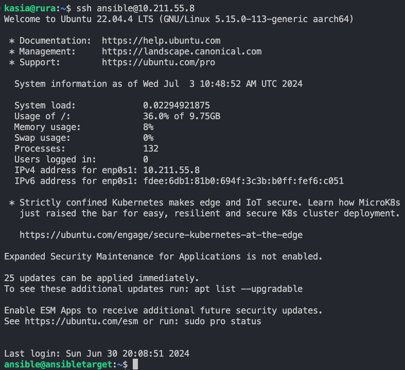
 
  Po zakończeniu wymiany w jedną stronę, powtórzono powyższe czynności zamieniając maszyny rolami.

### Inwentaryzacja
* Dokonano inwentaryzacji systemów
  * Obie maszyny posiadają przewidywalne nazwy komputerów:
  
  
  
  
  
  * Wprowadzono nazwy DNS dla maszyn wirtualnych za pomocą edycji plików `/etc/hosts`:
  
  
  
  
  
  * Aby zweryfikować łączność można: 
    * Podjąć próbę połączenia się po nazwach:
    
    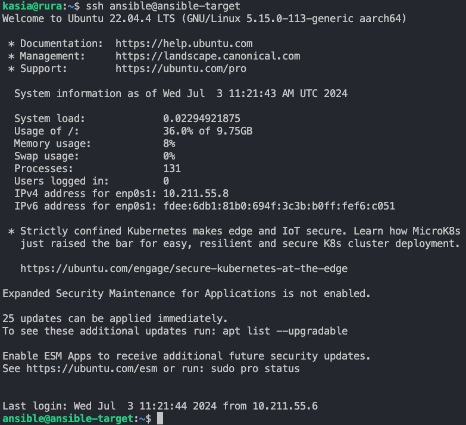
    
    * Użyć komendy 'ping'
    
    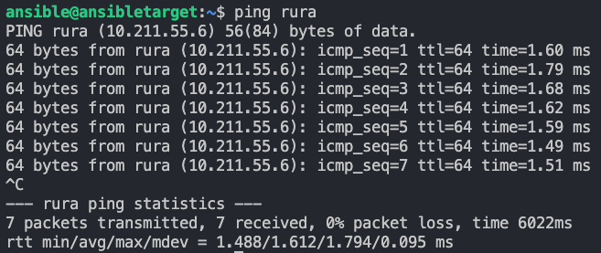
  
  * Stworzono [plik inwentaryzacji](https://docs.ansible.com/ansible/latest/getting_started/get_started_inventory.html), umieszczono w nim sekcje `Orchestrators` oraz `Endpoints`, a także nazwy maszyn wirtualnych w odpowiednich sekcjach:
  ```yaml
  all:
  children:
    Orchestrators:
      hosts:
        orchestrator:
          ansible_host: rura
          ansible_user: kasia

    Endpoints:
      hosts:
        ep-01:
          ansible_host: ansible-target
          ansible_user: ansible
  ```
  * Wysłano żądanie `ping` do wszystkich maszyn, jednak za pierwszym razem pojawił się błąd:
  
  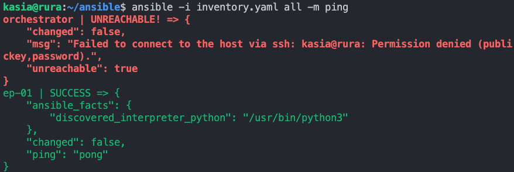
  
  Rozwiązaniem okazało się być dodanie klucza publicznego do `authorized_keys` na `rura`:
  ```bash
  ssh-copy-id -i ~/.ssh/id_rsa.pub kasia@rura
  ```
  Pozwoliło to Ansible na uwierzytelnianie się automatycznie za pomocą klucza prywatnego użytkownika maszyny `rura`. Po rozwiązaniu powyższego problemu efekt był następujący: 
  
  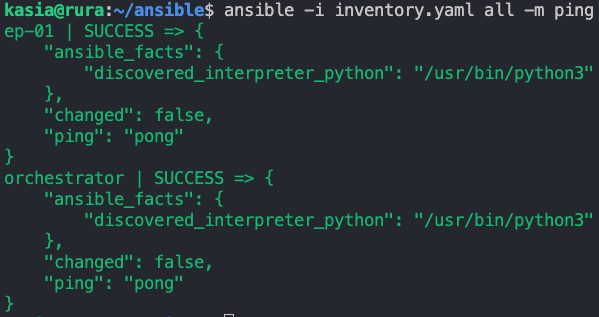
  
### Zdalne wywoływanie procedur
Za pomocą [*playbooka*](https://docs.ansible.com/ansible/latest/getting_started/get_started_playbook.html) Ansible:
  * Wysłano żądanie `ping` do wszystkich maszyn:
  Plik playbook.yaml:
  ```yaml
  - name: Ping all hosts
  hosts: all
  become: false
  tasks:
    - name: Ping all hosts
      ping:
  ```
  Uruchomienie `playbooka` nastąpiło przy użyciu instrukcji: 
  ```bash
  ansible-playbook -i inventory.yaml playbook.yaml 
  ```
  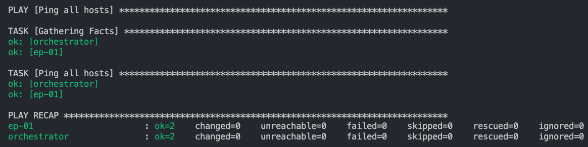
  
  * Skopiowano plik inwentaryzacji na maszynę `Endpoints`:
  
    Zmodyfikowano plik playbook.yaml:
  ```yml
  - name: Ping all hosts and manage inventory
  hosts: all
  become: false
  tasks:
    - name: Ping all hosts
      ping:

    - name: Copy inventory file to Endpoints
      copy:
        src: inventory.yaml
        dest: ~/ansible/inventory.yaml
  ```
  

  

  * Ponowiono operację:

  
  
  W przeciwieństwie do pierwszego podejścia, tym razem nie pojawiła się żadna zmiana (`changed=0`), jest to spowodowane tym, że plik `inventory.yaml` został podczas wcześniejszego wykonania playbooka skopiowany, przez co podczas kolejnych wykonań nie ma potrzeby ponownie przesyłać go do Endpointa.
  * Zaktualizowano pakiety w systemie, zrestartowano usługi `sshd` i `rngd`:
  Uzupełniono plik `playbook.yaml`:
  ```yml
  - name: Update packages and restart services
  hosts: Endpoints
  become: true
  tasks:
    - name: Update package repositories
      apt:
        update_cache: yes
      register: update_output

    - name: Display update output
      debug:
        msg: "{{ update_output }}"

    - name: Restart sshd service using systemd
      systemd:
        name: sshd
        state: restarted

    - name: Restart rngd service
      service:
        name: rng-tools
        state: restarted
  ```
  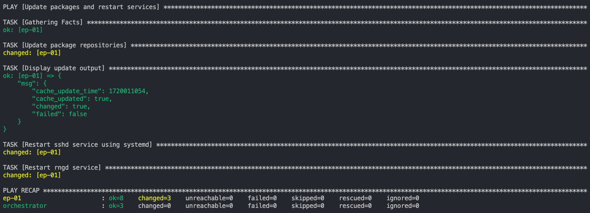

  * Podjęto próbę uruchomienia playbooka z wyłączeniem sshd:
    
    ```bash
    sudo systemctl stop ssh
    ```

    
    
Ze względu na specyfikę używanego narzędzia do wirtualizacji (UTM) - nie było możliwości wykonania powyższego kroku z odpiętą kartą sieciową.
  
### Zarządzanie kontenerem
* Zalogowano się do Docker Hub:
```bash
docker login -u [login]
```
* Pobrano obraz oraz uruchomiono kontener Docker za pomocą `Playbooka`:

```yaml
- name: Pull Docker image and run container
  hosts: Endpoints
  become: yes
  tasks:
    - name: Pull the image
      community.docker.docker_image:
        name: katrura/rurapp:1.0
        source: pull

    - name: Run the container
      community.docker.docker_container:
        name: rurapp
        image: katrura/rurapp:1.0
        state: started
        interactive: yes
        tty: yes

```

Napotkano się z problemem podczas uruchamiania playbooka: `fatal: [ep-01]: FAILED! => {"changed": false, "msg": "Error connecting: Error while fetching server API version: ('Connection aborted.', FileNotFoundError(2, 'No such file or directory'))"}`, było to spowodowane brakiem zainstalowanego Dockera na endpoincie, po instalacji proces uruchomienia playbooka przebiegł prawidłowo:

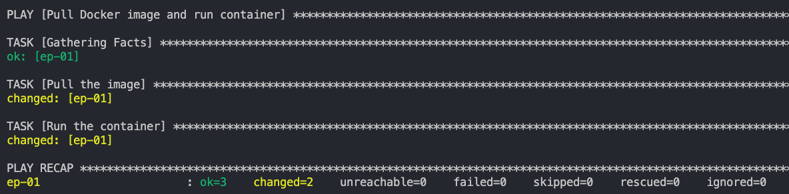

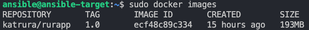

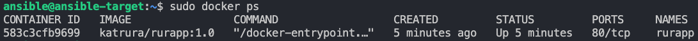

* Dodano do playbooka podłączanie storage'a oraz wyprowadzanie portu:

W sekcji `- name: Run the container` dodano:
```yaml
volumes:
  - ~/nginx:/rurapp
ports:
  - "9090:80"
```

Jak można zauważyć po `docker ps` zmiany zostały wprowadzone prawidłowo:

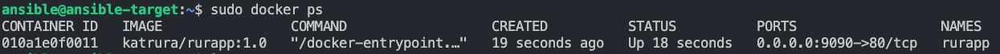

* Zatrzymano i usunięto kontener:

Uzupełniono plik playbooka:
```yaml
    - name: Stop Docker container
      community.docker.docker_container:
        name: rurapp
        state: stopped

    - name: Remove Docker container
      community.docker.docker_container:
        name: rurapp
        state: absent
```

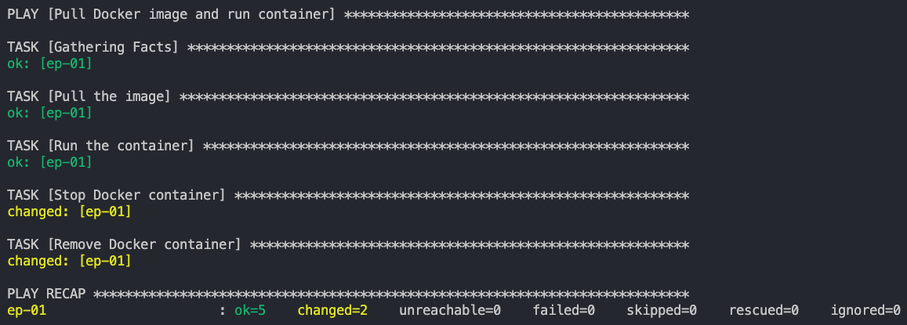


  


# Pliki odpowiedzi dla wdrożeń nienadzorowanych

* Zainstalowano [system Fedora](https://download.fedoraproject.org/pub/fedora/linux/releases/), stosując instalator sieciowy (*netinst*)
* Pobrano plik odpowiedzi `/root/anaconda-ks.cfg` za pomocą instrukcji:
```bash
sudo nano root/anaconda-ks.cfg
```
* Zmodyfikowano powyższy plik:
```cfg
#version=DEVEL
# Partition clearing information
clearpart --all --initlabel

# Use graphical install
graphical

# Use text mode install
#text

# System timezone
timezone Europe/Warsaw --utc

# Repositories
url --mirrorlist=http://mirrors.fedoraproject.org/mirrorlist?repo=fedora-40&arch=aarch64
repo --name=updates --mirrorlist=http://mirrors.fedoraproject.org/mirrorlist?repo=updates-released-f40&arch=aarch64

# Reboot after installation
reboot

# Run the Setup Agent on first boot
firstboot --enable

# Packages to install
%packages
@^minimal-environment
docker
%end

# Post-installation script
%post
# Set hostname
hostnamectl set-hostname rura-fedora

# Enable and start Docker service
systemctl enable docker
systemctl start docker

# Download and run Docker container

docker pull katrura/rurapp:1.0
docker run -d -p 9090:80 katrura/rurapp:1.0
%end
```
Uzupełniono go o:
- Potrzebne repozytoria dla Fedora 40
- Formatowanie całości dysku (`clearpart --all`)
- Ustawienie hostname na `rura-fedora`
- Pobranie z Docker Hub obrazu projektu
- Uruchomienie kontenera z projektem

Warto zaznaczyć, że trzy ostatnie uzupełnienia zostały dodane do sekcji `%post`, co oznacza, że komendy te zostaną uruchomione na już działającym systemie.

* Po uruchomieniu `GRUB` należy wcisnąć klawisz 'e', aby uruchomić edytor linii poleceń. W tym miejscu należy podać skąd przekazuje się plik `anaconda-ks.cfg`, w tym przypadku przekazywano go z dysku zewnętrznego:

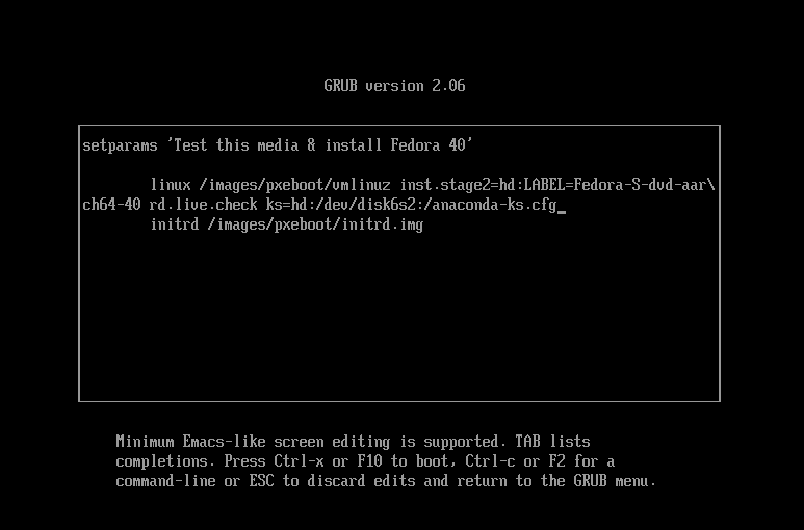

Po wciśnięciu `ctrl+x` nastąpiła automatyczna instalacja pakietów:

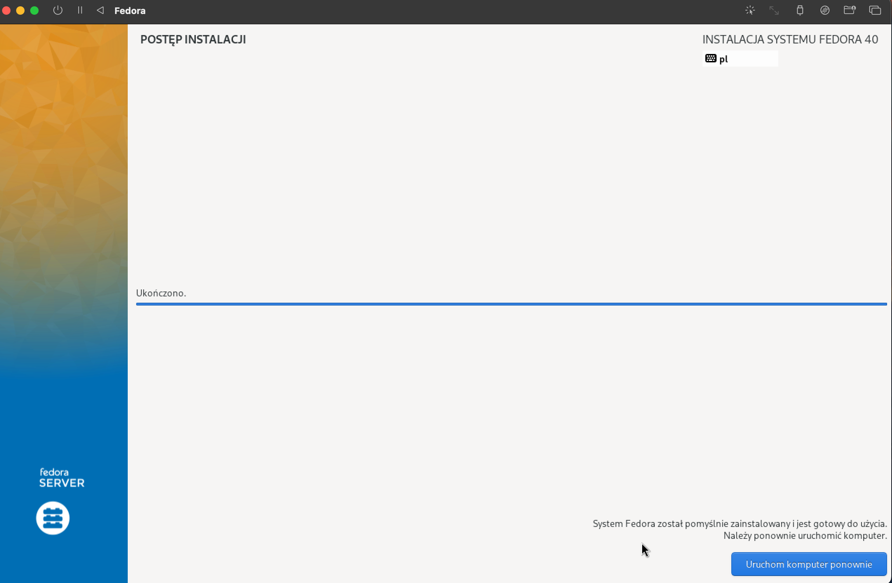

