# Katarzyna Rura - sprawozdanie z laboratoriów 10 i 11

# Wdrażanie na zarządzalne kontenery: Kubernetes

## Wykonane zadania
### Instalacja klastra Kubernetes
* Pobrano oraz zainstalowano `minikube` za pomocą instrukcji:
```bash
curl -LO https://storage.googleapis.com/minikube/releases/latest/minikube_latest_arm64.deb
sudo dpkg -i minikube_latest_arm64.deb
```
* Zainstalowano `kubectl`:
```bash
sudo snap install kubectl --classic
```
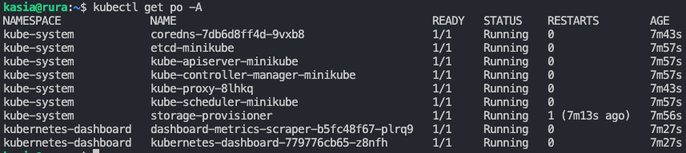
* Uruchomiono `minikube` oraz `Dashboarda`:

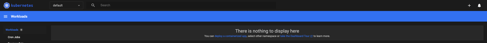
 
### Analiza posiadanego kontenera
Ze względu na specyfikę projektu z poprzednich sprawozdań, wybrano przeprowadzenie poniższych kroków na `Nginx`:
* Utworzenie konfiguracji w pliku `nginx.conf`:
```conf
events {}

http {
    server {
        listen 80;
        server_name localhost;

        location / {
            return 200 'Rurapp';
            add_header Content-Type text/plain;
        }
    }
}
```
* Utworzenie `Dockerfile`
```Dockerfile
FROM nginx:latest

COPY nginx.conf /etc/nginx/nginx.conf

EXPOSE 80
```
* Zbudowanie obrazu oraz uruchomienie kontenera:
```bash
docker build -t rurapp .
docker run -d -p 9090:80 rurapp
```
Efekt po wejściu na `localhost:9090`:
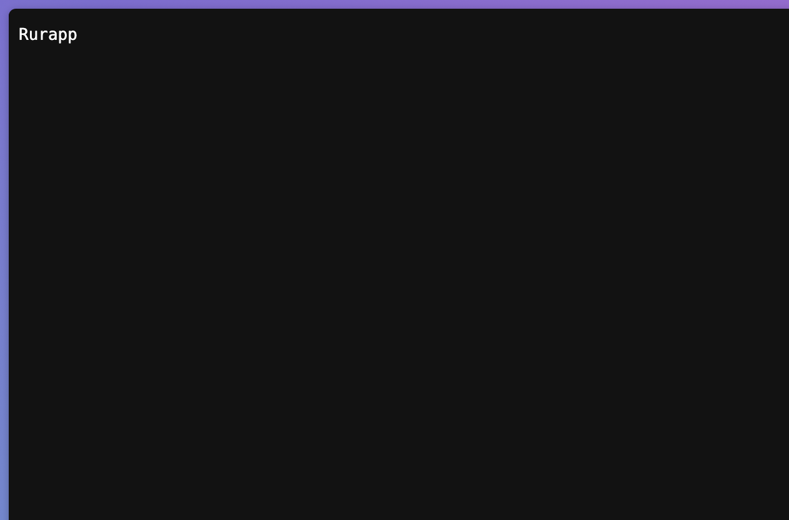

### Uruchamianie oprogramowania
* Uruchomiono kontener na stosie k8s
```bash
minikube kubectl -- run rurapp  --image=katrura/rurapp:latest --port=80 --labels app=rurapp
```
* Efekty:
  * Dashboard 
    
* Wyprowadzono port za pomocą komend::
```bash
kubectl expose pod rurapp --port=80 --target-port=80 --name=rurapp-service
kubectl port-forward pod/rurapp :80
```

Jak można zauważyć - "wylosowany" port to `39201`, aby można było odwoływać się do niego poprzez `localhost` dodano go w zakładce `ports` w VSCode. Po wykonaniu tych czynności efekt był następujący: 


### Konwersja wdrożenia ręcznego na wdrożenie deklaratywne YAML
* Utworzono plik .yaml dla wdrożenia, z czterema replikami:
```yaml
apiVersion: apps/v1
kind: Deployment
metadata:
  name: rurapp-deployment
spec:
  replicas: 4
  selector:
    matchLabels:
      app: rurapp
  template:
    metadata:
      labels:
        app: rurapp
    spec:
      containers:
      - name: rurapp
        image: katrura/rurapp:latest
        ports:
        - containerPort: 39201
```
* Rozpoczęto wdrożenie za pomocą:
```bash
kubectl apply -f rurapp-deployment.yaml
```
* Zbadano stan za pomocą ```kubectl rollout status```:
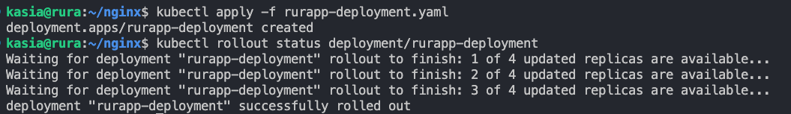
Efekt na Dashboardzie:
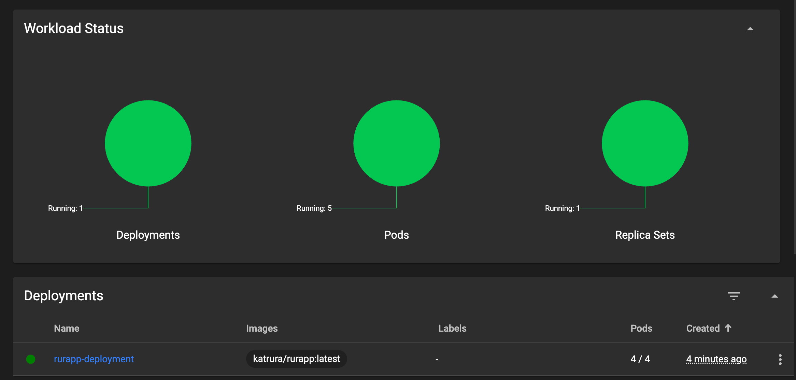


### Przygotowanie nowego obrazu
* Zarejestrowano nową wersję swojego obrazu `Deploy` w DockerHub za pomocą instrukcji:
```bash
docker tag rurapp:latest katrura/rurapp:2.0
docker push katrura/rurapp:2.0
```
* Zmieniono w pliku `rurapp-deployment.yaml` wersję obrazu na najstarszą, po wdrożeniu można zauważyć że zmiana wersji nastąpiła prawidłowo po wpisaniu komendy `kubectl describe deployment rurapp-deployment`:
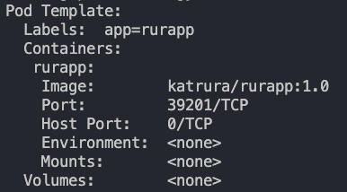
Aby wrócić do wcześniejszego deploymentu wykorzystano instrukcję:
```bash
kubectl rollout undo deployment rurapp-deployment
```
  
### Zmiany w deploymencie
* Kilkukrotnie aktualizowano plik YAML z wdrożeniem oraz przeprowadzano je ponownie po zastosowaniu następujących zmian:
  * zwiększenie replik do 8 oraz zastosowanie starszej wersji obrazu:

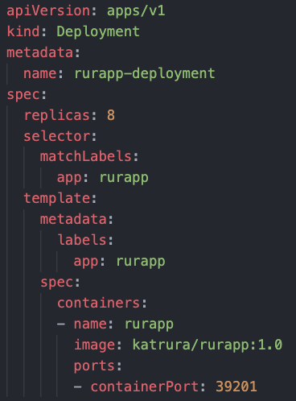

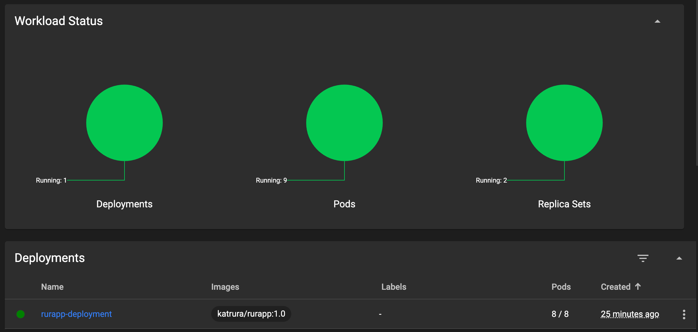

  * zmniejszenie liczby replik do 1 oraz zastosowanie nowszej wersji obrazu:


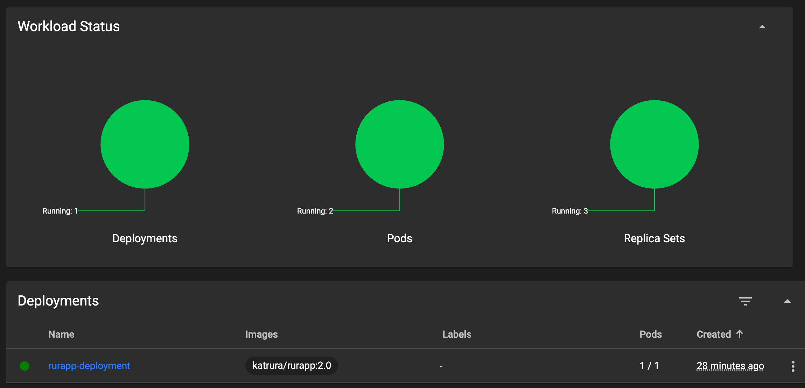

  * zmniejszenie liczby replik do 0

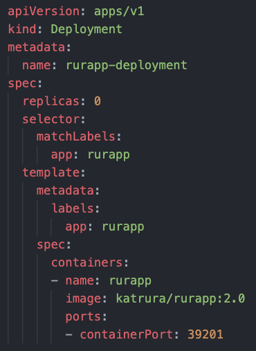

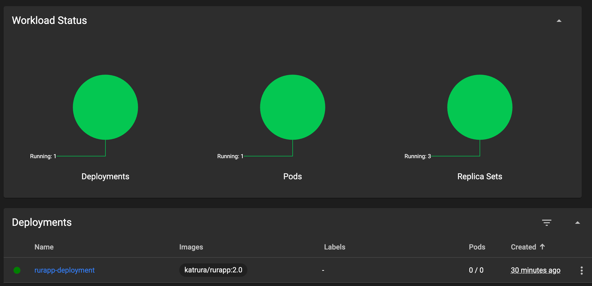

### Kontrola wdrożenia
* Stworzono skrypt weryfikujący, czy wdrożenie "zdążyło" się wdrożyć:
```bash
#!/bin/bash

DEPLOYMENT_NAME="rurapp-deployment"
NAMESPACE="default"
TIMEOUT=60
INTERVAL=5

kubectl get deployment $DEPLOYMENT_NAME -n $NAMESPACE > /dev/null 2>&1
if [ $? -ne 0 ]; then
    echo "Deployment $DEPLOYMENT_NAME not found in namespace $NAMESPACE"
    exit 3
fi

end=$((SECONDS+TIMEOUT))

while [ $SECONDS -lt $end ]; do
    kubectl rollout status deployment/$DEPLOYMENT_NAME -n $NAMESPACE
    status=$?
    if [ $status -eq 0 ]; then
        echo "Deployment succeeded"
        exit 0
    elif [ $status -ne 0 ]; then
        echo "Waiting for deployment to complete..."
        replicas=$(kubectl get deployment $DEPLOYMENT_NAME -n $NAMESPACE -o jsonpath='{.status.replicas}')
        updated_replicas=$(kubectl get deployment $DEPLOYMENT_NAME -n $NAMESPACE -o jsonpath='{.status.updatedReplicas}')
        available_replicas=$(kubectl get deployment $DEPLOYMENT_NAME -n $NAMESPACE -o jsonpath='{.status.availableReplicas}')
        unavailable_replicas=$(kubectl get deployment $DEPLOYMENT_NAME -n $NAMESPACE -o jsonpath='{.status.unavailableReplicas}')
        echo "Replicas: $replicas, Updated: $updated_replicas, Available: $available_replicas, Unavailable: $unavailable_replicas"
    fi
    sleep $INTERVAL
done

echo "Deployment did not complete within the timeout period"
echo "Fetching details for debugging..."
kubectl describe deployment $DEPLOYMENT_NAME -n $NAMESPACE

echo "Initiating rollback to the previous version"
kubectl rollout undo deployment/$DEPLOYMENT_NAME -n $NAMESPACE
if [ $? -eq 0 ]; then
    echo "Rollback succeeded"
    exit 1
else
    echo "Rollback failed"
    exit 2
fi
```
Powyższy skrypt wykonuje pętlę while, wewnątrz której na bierząco sprawdzany jest czas od rozpoczęcia skryptu. Podczas wykonywania pętli sprawdzany jest także status wdrożenia (co 10 sekund). Jeżeli w momencie upłynięcia 60 sekund wdrożenie nie zostało zakończone kodem 0 (nie powiodło się) - skrypt informuje o tym, a następnie wykonuje `rollback` do poprzedniej wersji. 

Efekt uruchomienia:

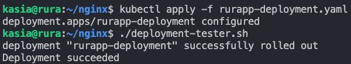


### Strategie wdrożenia
* Przygotowano wersje [wdrożeń](https://kubernetes.io/docs/concepts/workloads/controllers/deployment/) stosujące następujące strategie:
  * Recreate - istniejące pody zostają usunięte przed utworzeniem nowych

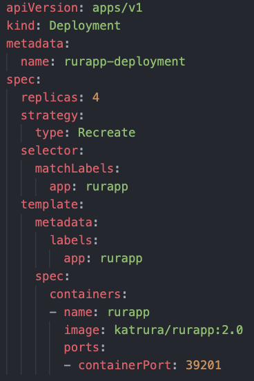

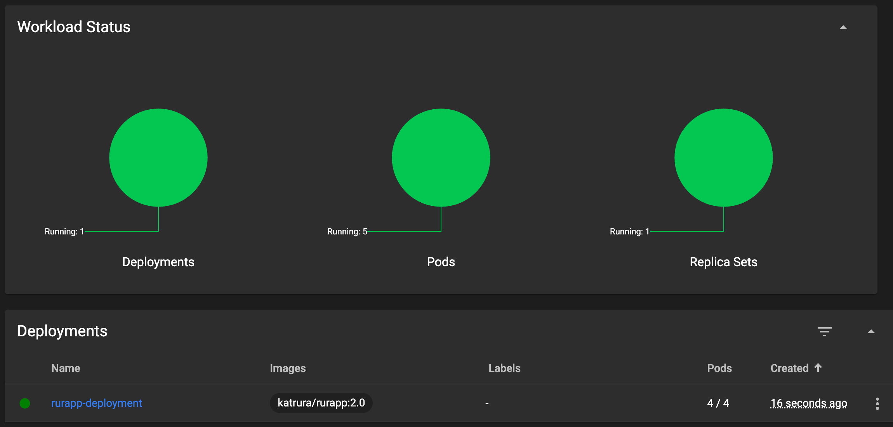

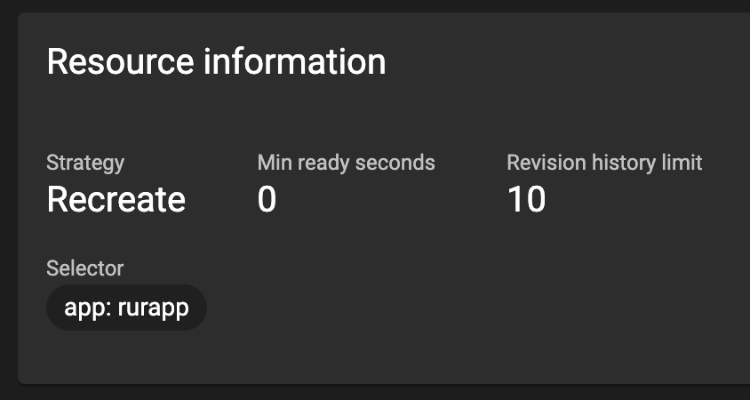

  * Rolling Update (z parametrami `maxUnavailable` > 1, `maxSurge` > 20%) - podobnie, jak w przypadku recreate - istniejące pody są usuwane, jednak w tej strategii - stopniowo. Dodatkowo w tym przypadku można dostosowywać parametry `maxUnavailable` oraz `maxSurge` - pozwala to na kontrolę ilości niedostępnych oraz dodatkowych podczas aktualizacji podów
  


  
  * Canary Deployment workload - nowa wersja aplikacji wdrażana jest tylko na *część instancji*. Dzieje się tak, aby przed pełnym wdrożeniem sprawdzić czy działa poprawnie. Tworzenie `canary deploymenty` sprowadza się do dodania nowej wersji aplikacji, w momencie istnienia starszej, z tego powodu stworzono dodatkowy plik .yaml - dla nowej wersji, natomiast uprzednio wykorzystywany plik "cofnięto" do starszej wersji aplikacji:

rurapp-deployment-v1.yaml:

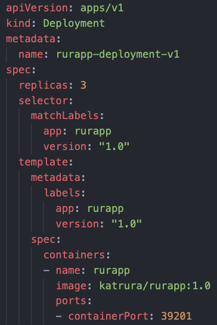

rurapp-deployment-v2.yaml:

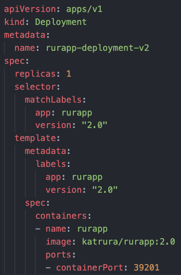

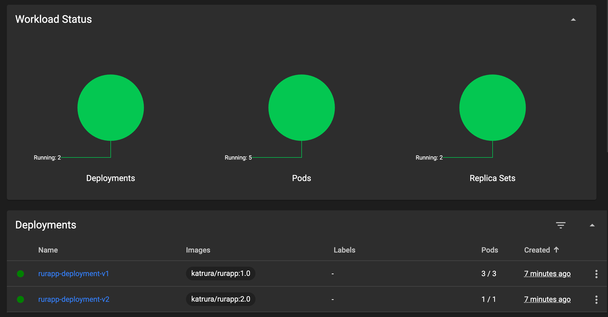
