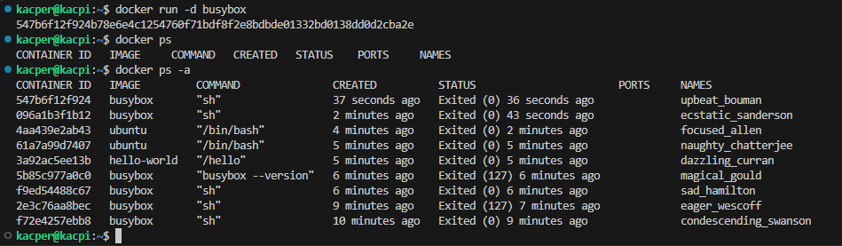
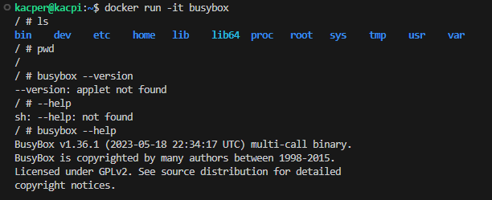
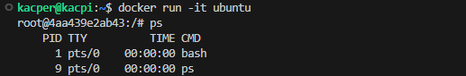
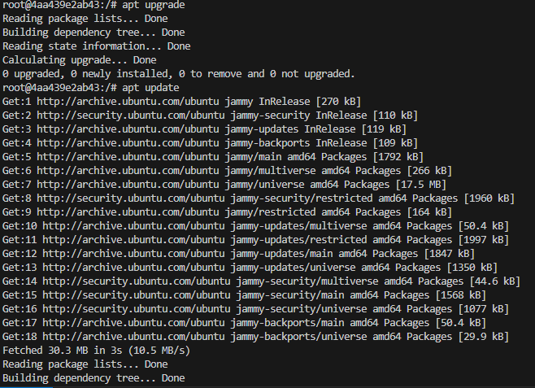
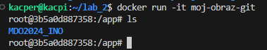
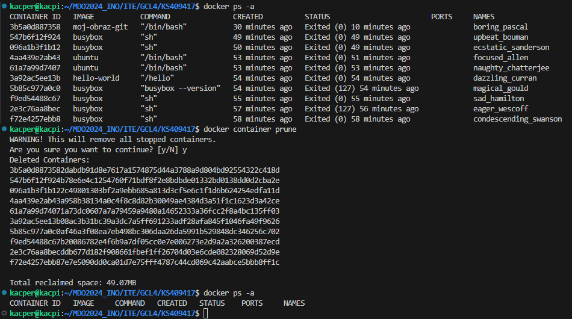
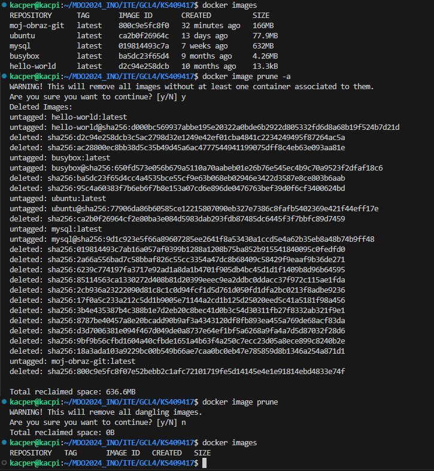

# Sprawozdanie 1
Najpierw postawiliśmy maszynę wirtualną. Ubuntu Server na VirtualBox. Następnie pobrano klienta git - **sudo apt install git**. 
Następnie wygenerowałem parę kluczy SSH by móc połączyć się z GitHub'em.
 Klucz publiczny wrzuciłem w ustawieniach SSH na portalu i zestawiłem połączenie.
Z wykorzystaniem SSH skonowałem repozytorium na naszą maszynę wirtualną.
Przełączyłem się na gałąź GCL4 - **git checkout GCL4** - a następnie stworzyłem własną gałąź KS409417 i się na nią przełączyłem za pomocą komendy - **git checkout -b KS409417**
Po zmianie gałęzi stworzyłem własny folder KS409417 i utworzyłem katalog KS409417 i w nim katalog Sprawozdanie1
Stworzyłem plik README.md w którym umieściłem początkowy napis i dokonałem pierwszego commita - **git commit -m "Initial commit"**
Następnie komendą git push wrzuciłem moją pracę na serwer i utworzyłem pull request do gałęzi GCL4

# Zajęcia drugie
Zacząłem od instalacji Dockera na naszych maszynach wirtualnych - **sudo snap install Docker**
Następnie pobrałem obrazy *hello-world*, *busybox*, *ubuntu*, *mysql*
## Uruchomiłem kontener busybox

Screen z uruchomienia kontenera busybox:



Screen z uruchomienia kontenera busybox w trybie interaktywnym i sprawdzenie wersji:



## Następnie uruchomiłem "system w kontenerze" - w moim przypadku ubuntu:

Screen pokazujący PID1:



Screen z aktualizacji pakietów:



## Dockerfile

Stworzyłem dockerfile, który bazując na wybranym systemie - w moim przypadku ubuntu - sklonuje nasze repo za pomocą metody HTTPS

Screen:



```Dockerfile
FROM ubuntu:22.04

ENV DEBIAN_FRONTEND=noninteractive

RUN apt-get update && \
    apt-get install -y git && \
    rm -rf /var/lib/apt/lists/*

WORKDIR /app

RUN git clone https://github.com/InzynieriaOprogramowaniaAGH/MDO2024_INO.git

CMD ["/bin/bash"]
```

**FROM ubuntu:22.04** - określamy obraz bazowy, którego użyjemy do zbudowania nowego obrazu - tutaj ubuntu w wersji 22.04

**ENV DEBIAN_FRONTEND=noninteractive** - wyłączamy tryb interaktywny podczas konfiguracji pakietów

**RUN** - wykonujemy komendy wewnątrz kontenera w celu aktualizacji listy pakietów oraz usunięcia niepotrzebnych plików tymczasowych

**WORKDIR /app** - ustawiamy katalog roboczy na /app

**RUN git clone** - klonujemy repozytorium za pomocą metody HTTPS

**CMD ["/bin/bash"]** - definiujemy komende, która zostanie domyślnie uruchomiona podczas uruchamiania kontenera. 

## Uruchomione kontenery

Uruchomione przez nas kontenery można sprawdzić za pomocą komendy **docker -ps a**
Następnie można je wyczyścić za pomocą **docker container prune**

Screen:



## Wyczyszczenie obrazów

Obrazy można sprawdzić przy pomocy **docker images**
Czyszczenie obrazów - **docker image prune -a**


Screen:


