## Sprawozdanie 2
# Dockerfiles, kontener jako definicja etapu

Wraz z rozwojem technologii, nieustannie starmy się znaleźć metody, które pomogą nam usprawnić, przyspieszyć wdrażanie aplikacji
W tym zakresie, docker od kilku lat sprawdza się świetnie i jest jednym z najczęściej używanych narzędzi.
Dockerfile jest to plik tekstowy, który zawiera zestaw instrukcji służących, do zautomatyzowanego tworzenia obrazu kontenerów.
Jest to skrypt, który definiuje kroki potrzebne do zbudowania kontenera, wraz z konfigurają i zależnościami aplikacji.

Główne cele używania dockerfile'i to:
- **Automatyzacja budowania obrazów**: Dockerfile pozwala na zdefiniowanie wszystkich niezbędnych kroków do utworzenia obrazu kontenera.
Dzięki temu proces budowy może być zautomatyzowany i może być powtarzalny w różnych środowiksach bez konieczności ręcznej konfiguracji
każdego kontenera.
- **Reprodukcja środowiska**: Umożliwia łatwą reprodukcję środowiska aplikacji na różnych maszynach
- **Zarządzanie zależnościami**: Poprzez zdefiniowanie zależności i konfiguracji w dockerfile'u, można zarządzać wersjami oprogramowania
i bibliotek używanych przez aplikację. Unikamy dzięki temu problemów z niekompatybilnością wersji
- **Zwiększenie skalowalności**: Ułatwia proces skalowania, ponieważ możemy szybko tworzyć nowe instancje kontenerów na podstawie tego samego obrazu.

# Znajdź repozytorium z kodem dowolnego oprogramowania

- **node-js-dummy-test**: https://github.com/devenes/node-js-dummy-test

Najpierw tworzymy dockerfile do budowania aplikacji:

```Dockerfile
FROM node

RUN git clone https://github.com/devenes/node-js-dummy-test
WORKDIR /node-js-dummy-test

RUN npm install
```

**FROM node** - określami obraz bazowy, który zostanie użyty do budowy nowego obrazu. W tym przypadku obraz node.js
**RUN git clone** - klonujemy repozytorium zawierające aplikację z githuba. 
**WORKDIR /...** - ustawiamy katalog roboczy
**RUN npm install** - instalujemy zależności aplikacji nodowej wewnątrz kontenera

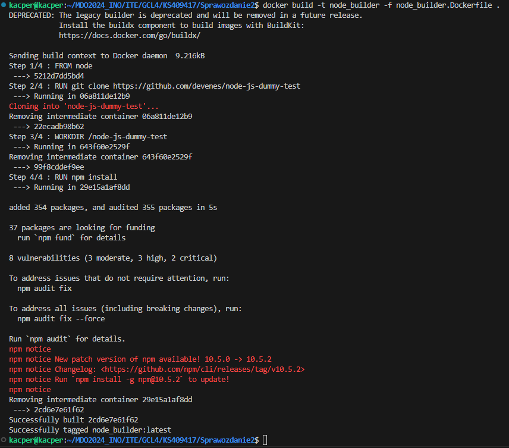

Następnie budujemy obraz do testowania aplikacji:

```Dockerfile
FROM node_builder
RUN npm test
```

**FROM node_builder** - określamy obraz bazowy - node_builder, który przed chwilą zbudowaliśmy
**RUN npm test** - uruchamiamy skrypt testowy aplikacji

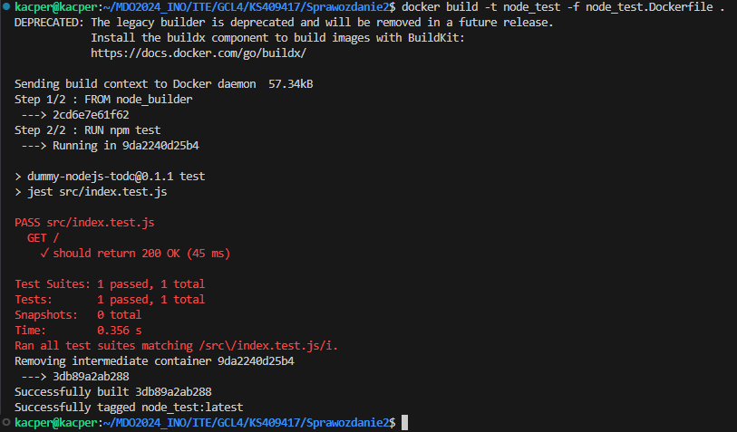

Następnie budujemy kontener node deploy

```Dockerfile
FROM node_builder
CMD ["npm", "start"]
```
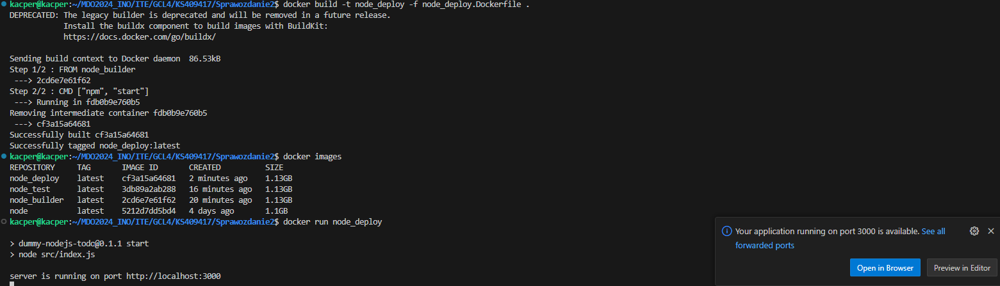

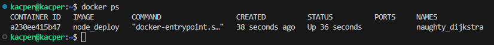

Następnie dodałem plik docker compose, by jeszcze bardziej zautomatyzować cały proces:

```yaml
version: '3.8'

services:
  node_builder:
    build:
      context: .
      dockerfile: ./node_builder.Dockerfile
    image: node_builder

  node_test:
    build:
      context: .
      dockerfile: ./node_test.Dockerfile
    image: node_test
    depends_on:
      - node_builder

  node_depoy:
    build:
      context: .
      dockerfile: ./node_deploy.Dockerfile
    image: node_deploy
    depends_on:
      - node_builder
```

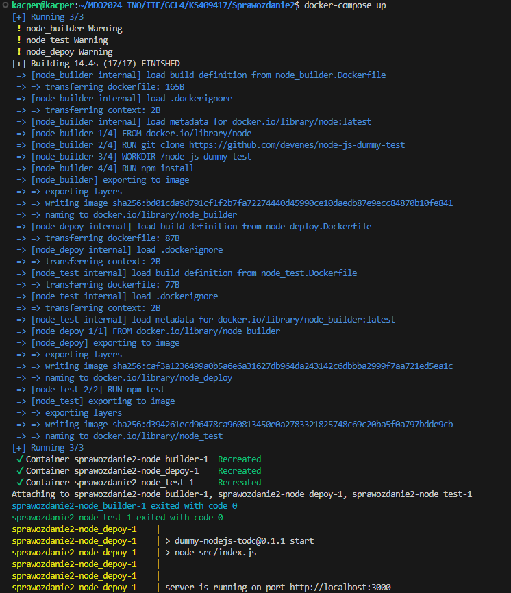

Docker compose jest to narzędzie do uruchamiania wielu kontenerów w jednym środowisku za pomocą prostego pliku YAML. 
Pozwala na łatwe zarządzanie aplikacjami.

## Zajęcia 4

Naszym zadaniem było przygotowanie woluminów: wejściowego i wyjściowego oraz podłączenie ich do kontenera z którego zaczynaliśmy ostatnio pracę

Stworzyłem woluminy: v_in oraz v_out:

```bash
docker volume create v_in/v_out
```

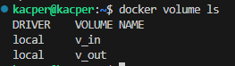

Następnie stworzyłem kontener pomocniczny, do którego podłączyłem wolumin v_in, i na nim sklonowałem repozytorium

```bash
docker run -it --name temp --mount source=v_in,destination=/input fedora bash
```

Wtedy mogłem już odpaliś kontener podłączając dwa woluminy:

```bash
docker run -it --name node_container -v v_in:/input -v v_out:/output node bash
```

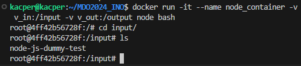

Następnie przeszedłem do budowy programu za pomocą *npm install* oraz uruchomienia programu za pomocą *npm start*

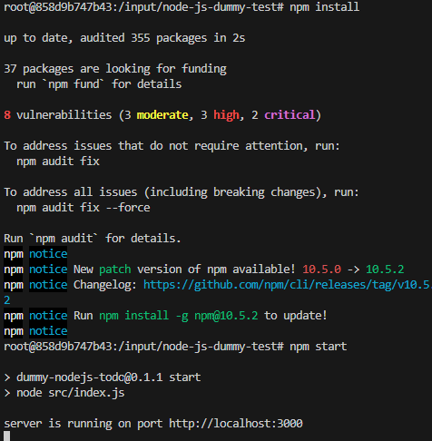

Przekopiowałem aplikację na wolumin wyjściowy, by zachować wyniki po wyjściu z kontenera

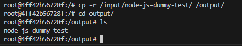

Następnie musieliśmy stworzyć sieć docker (docker network). Sieci w dockerze pozwalają na komunikację pomiędzy kontenerami oraz z siecią hosta.
Korzystaliśmy z Mostkowanej sieci, która izoluje kontenery od sieci hosta. Każdy kontener otrzymuje adres IP w tej sieci, lecz spoza niej nie są widoczne.
Kontenery mają możliwość komunikacji ze sobą za pomocą nazw kontenerów

Stworzyłem sieć o nazwe my_network za pomocą komendy

```bash
docker network create my_network
```

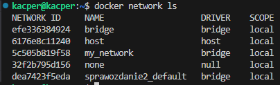

Utworzyłem kontener z serwerem iperf3, który służył do pomiaru przepustowości sieci poprzez generowanie ruchu między dwoma hostami w sieci

```bash
docker run -it --rm--name iperf-server -p 5201:5201 networkstatic/iperf3 -s
```

oraz kontener klienta, z którego łączymy się do serwera

```bash
docker run -it --rm--name iperf-client fedora bash
```
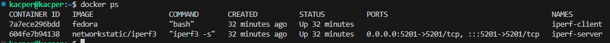

Następnie za pomocą adresu IP servera, połączyliśmy się do niego z klienta.

docker inspect:

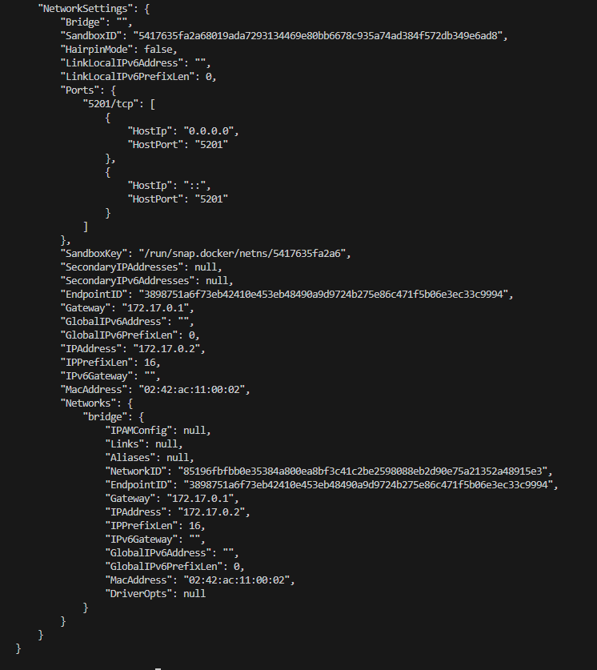

Tutaj ruch ze strony klienta i serwera: 

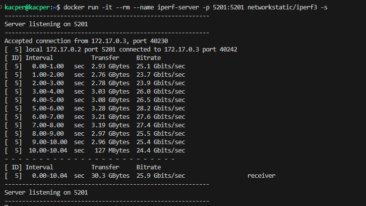 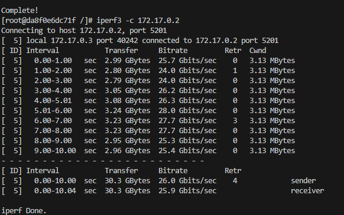

Jak widać, prędkości klienta oraz hosta były bardzo zbliżone

Następnie hosta oraz klienta podłączę do tej samej sieci, którą stworzyłem wcześniej: my_network

```bash
docker run -it --rm --network my_network --name iperf-server -p 5201:5201 networkstatic/iperf3 -s
docker run -it --rm  --name iperf-client fedora bash
```

tutaj wyniki:

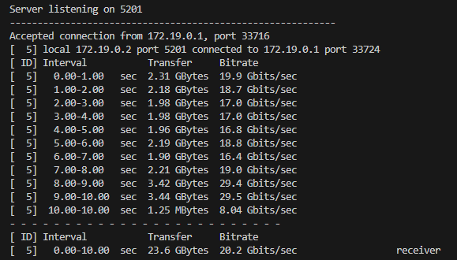 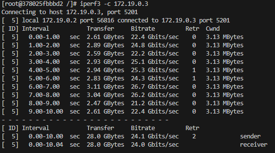

Za pomocą komendy

```bash
docker inspect my_network
```

Można sprawdzić, jakie kontenery znajdują się w mojej sieci

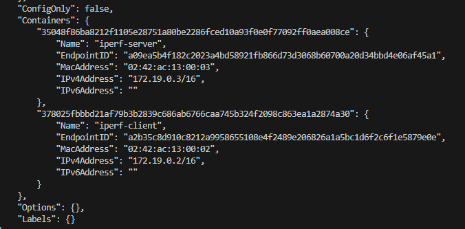

Następnie łączyliśmy się do serwera z poziomu hosta

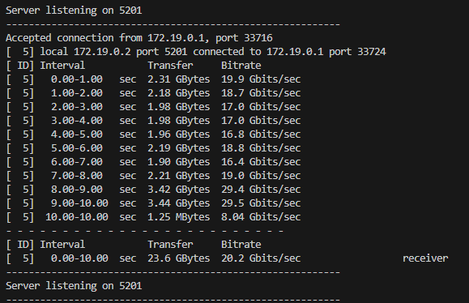 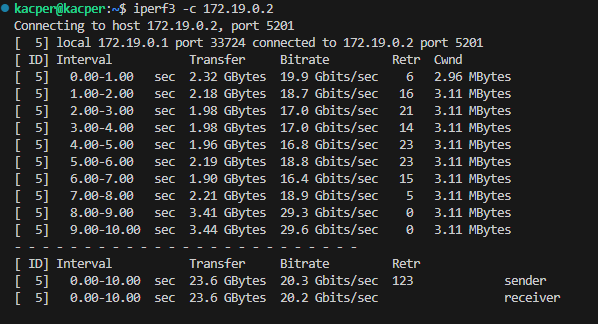

Oraz spoza hosta:

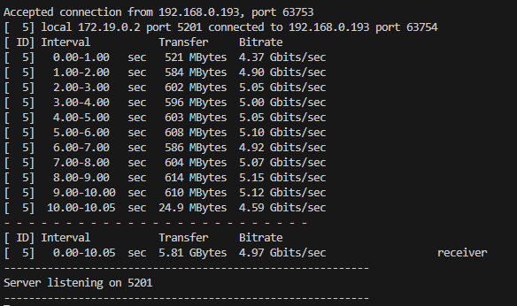 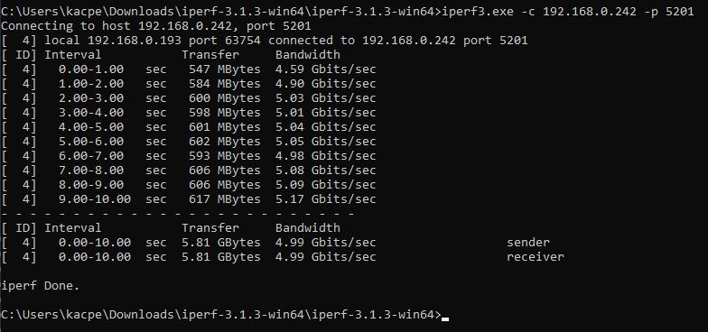

