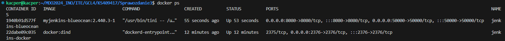
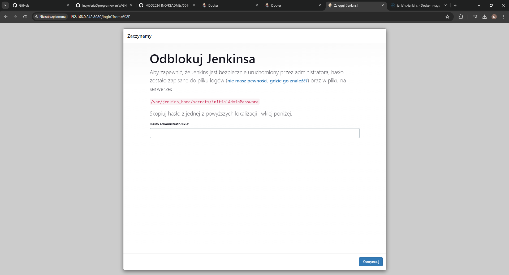
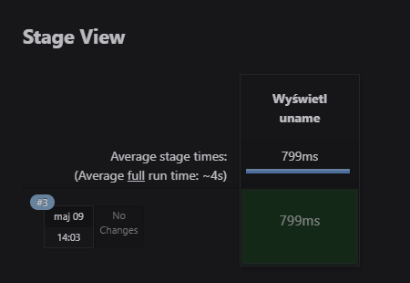
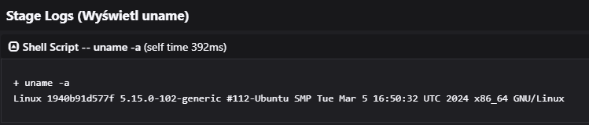
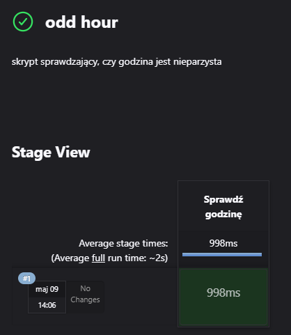
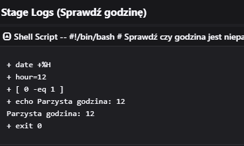
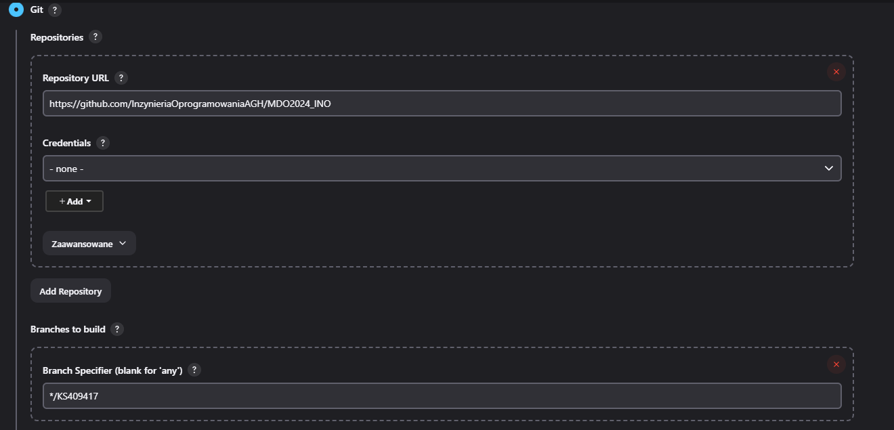
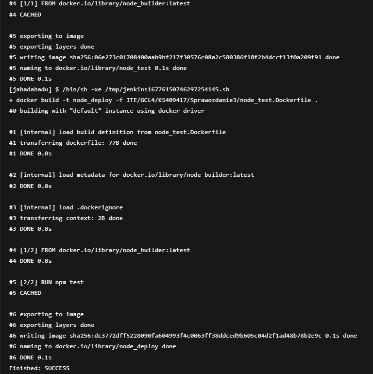
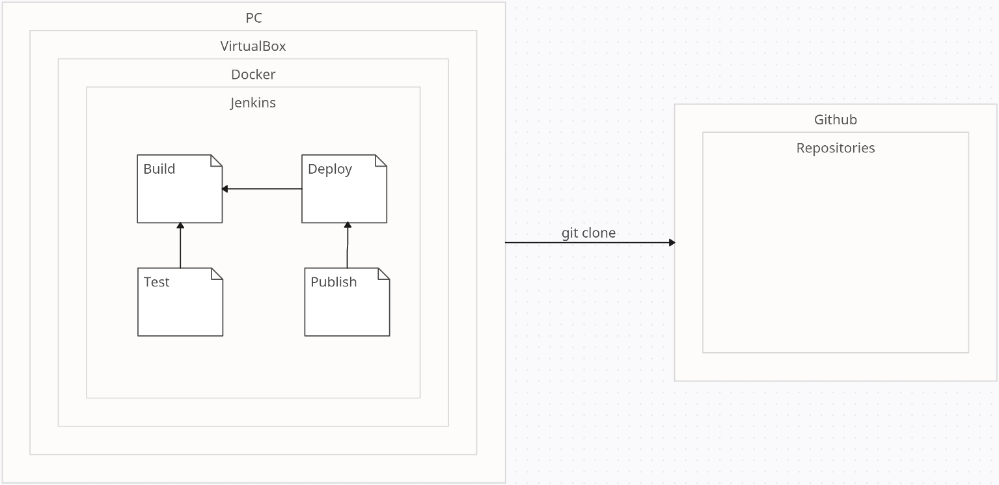

## Sprawozdanie 3

# Jenkins
Jenkins to popularne, otwartoźródłowe narzędzie do automatyzacji procesów wytwarzania oprogramowania. Służy do ciągłej integracji (Continuous Integration/CI) oraz ciągłego wdrażania (Cintinuous Delivery/CD), umożliwiając programistom automatyzację budowy, testowania i wdrażania aplikacji. 
W jenkinsie używamy Pipeline'ow do procesów CI/CD
Pipeline stanowi sekwencję kroków, które są wykonywane automatycznie, w określonej kolejności. Każdy krok w pipeline'ie może zawierać działania takie jak pobieranie kodu źródłowego, budowa aplikacji, uruchomienie testów etc. Pozwalają programistom na zdefiniowanie i kontrolę wszystkich etapów procesu, co zwiększa spójność i niezawodność dostarczanego oprogramowania.

## Instancja Jenkins

Przeszedłem do instalacji skonteneryzowanej instancji Jenkinsa
Najpierw zapoznałem się z dokumentacją https://www.jenkins.io/doc/book/installing/docker/
Następnie zainicjalizowałem instancję





## Pierwsze projekty

Stworzyłem projekt, który wywołuje komendę *uname*

```groovy
pipeline {
    agent any

    stages {
        stage('Show uname') {
            steps {
                script {
                    sh 'uname -a'
                }
            }
        }
    }
}
```




Następnie, stworzyliśmy pipeline, który zwraca błąd, gdy godzina jest nieparzysta

```groovy
pipeline {
    agent any

    stages {
        stage('Check if odd hour') {
            steps {
                script {
                    sh '''
                    #!/bin/bash

                    hour=$(date +%H)
                    if [ $((hour % 2)) -eq 1 ]; then
                        echo "Odd hour: $hour"
                        exit 1 
                    else
                        echo "Even hour: $hour"
                        exit 0 
                    fi
                    '''
                }
            }
        }
    }
}
```





Teraz, naszym zadaniem było stworzyć "prawdziwy projekt", który:
- Sklonuje nasz repozytorium
- Przejdzie na osobistą gałąź
- Zbuduje obrazy z dockerfile'i






## Diagram

Przedstawiam diagram opisujący wymagania wstępne środowiska i wdrożenie:



Na PC odpalony jest virtualbox z Linuxem (w moim przypadku jest to Ubuntu). Następnie potrzeba nam skonteneryzowanej instacji Jenkinsa, odpalonej poprzez kontener Dockerowy.

