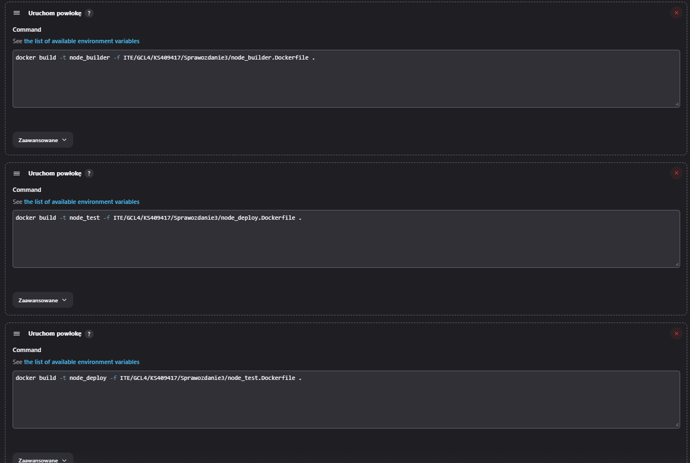

## Sprawozdanie 3

# Jenkins
Jenkins to popularne, otwartoźródłowe narzędzie do automatyzacji procesów wytwarzania oprogramowania. Służy do ciągłej integracji (Continuous Integration/CI) oraz ciągłego wdrażania (Cintinuous Delivery/CD), umożliwiając programistom automatyzację budowy, testowania i wdrażania aplikacji. 
W jenkinsie używamy Pipeline'ow do procesów CI/CD
Pipeline stanowi sekwencję kroków, które są wykonywane automatycznie, w określonej kolejności. Każdy krok w pipeline'ie może zawierać działania takie jak pobieranie kodu źródłowego, budowa aplikacji, uruchomienie testów etc. Pozwalają programistom na zdefiniowanie i kontrolę wszystkich etapów procesu, co zwiększa spójność i niezawodność dostarczanego oprogramowania.

## Instancja Jenkins

Przeszedłem do instalacji skonteneryzowanej instancji Jenkinsa
Najpierw zapoznałem się z dokumentacją https://www.jenkins.io/doc/book/installing/docker/
Następnie zainicjalizowałem instancję


## Pierwsze projekty

Stworzyłem projekt, który wywołuje komendę *uname*

```groovy
pipeline {
    agent any

    stages {
        stage('Show uname') {
            steps {
                script {
                    sh 'uname -a'
                }
            }
        }
    }
}
```


Następnie, stworzyliśmy pipeline, który zwraca błąd, gdy godzina jest nieparzysta

```groovy
pipeline {
    agent any

    stages {
        stage('Check if odd hour') {
            steps {
                script {
                    sh '''
                    #!/bin/bash

                    hour=$(date +%H)
                    if [ $((hour % 2)) -eq 1 ]; then
                        echo "Odd hour: $hour"
                        exit 1 
                    else
                        echo "Even hour: $hour"
                        exit 0 
                    fi
                    '''
                }
            }
        }
    }
}
```


Teraz, naszym zadaniem było stworzyć "prawdziwy projekt", który:
- Sklonuje nasz repozytorium
- Przejdzie na osobistą gałąź
- Zbuduje obrazy z dockerfile'i





## Diagram

Przedstawiam diagram opisujący wymagania wstępne środowiska i wdrożenie:


Na PC odpalony jest virtualbox z Linuxem (w moim przypadku jest to Ubuntu). Następnie potrzeba nam skonteneryzowanej instacji Jenkinsa, odpalonej poprzez kontener Dockerowy.

Następnie zrobiliśmy nasz projekt:
Utworzyłem pipeline, który służy do budowania, testowania, wdrażania i publikowania obrazu Dockera. 
Pierwszym etapem jest czyszczenie. Czyścimy obszar roboczy poprzez usunięcie katalogu MDO, czyścimy system Docker, klonujemy repozytorium oraz zmieniamy na nasz branch.
Drugim etapem jest budowanie. Budujemy obraz Dockera, do którego używany jest dockerfile. Wyjście z procesu rejestrujemy w pliku z logami
Nastepnie proces testowania. Budujemy obraz dockera do testów.
Kolejnie proces wdrożenia oraz usunięcia wcześniejszych obrazów, by zaoszczędzić miejsce
Następnie uruchamiamy najnowszy obraz
I na koniec publikujemy naszą aplikację w DockerHubie.

```groovy
pipeline {
    agent any
    
    
    
    stages {
        stage('Clean') {
            steps {
                echo 'Cleaning workspace'
                sh "rm -rf MDO2024_INO"
                sh 'docker system prune -f'
                sh "git clone https://github.com/InzynieriaOprogramowaniaAGH/MDO2024_INO.git"
                dir('MDO2024_INO') {
                    sh "git checkout KS409417"
                }
            }
        }
        
        stage('Build') {
            steps {
                echo 'Building project'
                dir('MDO2024_INO/ITE/GCL4/KS409417/Sprawozdanie3') {
                    sh "docker build --no-cache -t node_builder:latest -f node_builder.Dockerfile . | tee -a ./build.log"

                }
            }
        }
        
        stage('Test') {
            steps {
                echo 'Building Test Docker image'
                dir('MDO2024_INO/ITE/GCL4/KS409417/Sprawozdanie3') {
                    sh "docker build --no-cache -t node_test:latest -f node_test.Dockerfile . | tee -a ./test.log"
                }
            }
        }
        
        stage('Deploy') {
            steps {
                echo 'Deploying node'
                dir('MDO2024_INO/ITE/GCL4/KS409417/Sprawozdanie3') {
                    sh "docker build --no-cache -t node_deploy -f node_deploy.Dockerfile . | tee -a ./deploy.log"
                    sh "docker rmi node_builder:latest"
                    sh "docker rmi node_test:latest"
                }
            }
        }
        
        stage('Run') {
            steps {
                echo 'Running container'
                sh "docker images"
                sh "docker run -d node_deploy:latest"
            }
        }
        
        stage('Publish') {
            steps {
                echo "Publishing node to DockerHub"
                withCredentials([usernamePassword(credentialsId: '285bc673-b865-42d0-a921-fc013f4d4cf0', usernameVariable: 'USERNAME', passwordVariable: 'PASSWORD')]) {
                    sh "docker login -u $USERNAME -p $PASSWORD"
                    sh "docker tag node_deploy:latest ksagan23/node_deploy:latest"
                    sh "docker push ksagan23/node_deploy:latest"
                    echo 'Published!'
                }

            }
            post {
                always {
                    sh 'docker logout'
                }
            }
        }
    }
}
```


Tutaj screen z opublikowanej aplikacji w dockerhubie


Dzięki temu jesteśmy w stanie pobrać naszą aplikację z dockerhuba za pomocą komendy docker pull

