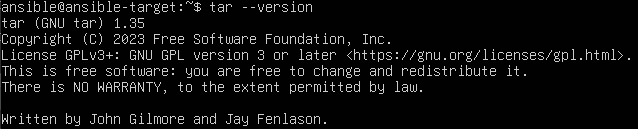

# Sprawozdanie 4

## Ansible
Ansible to popularne narzędzie open source do automatyzacji zarządzania konfiguracją, wdrażania aplikacji oraz orkiestracji procesów w środowiskach IT. Zapewnia prosty sposób na zarządzanie wieloma serwerami i urządzeniami z jednego punktu, używając prostych(albo i nie) plików konfiguracyjnych. Głównymi cechami Ansible jest bezagentowa architektura - wykorzystuje protokół SSH do komunikacji, nie wymaga instalacji oprogramowania na zarządzanych hostach.

## Instalacja ansible
Postawiłem drugą maszyne, której hostname to ansible-target. Tą maszynę wykorzystamy do testowania naszych playbooków.
Wymieniłem klucze ssh, by móc łączyć się z maszyną bez podawania hasła, zainstalowałem openssh i tar




Dodałem maszynę do znanych hostów, bym mógł pingować ją czy łączyć się do niej za pomocą nazwy, a nie IP


# Inwentaryzacja


Stworzyłem plik inwentaryzacji, w którym umieściłem sekcje Orchestrators oraz Endpoints


I następnie wysłałem ansible ping do wszystkich


Kolejnym krokiem było utworzenie playbooka w którym wysyłam ping do wszystkich maszyn, kopiuje plik inwentaryzacji na maszynę wirtualną, aktualizuję pakiety w systemie, restartuję usługę sshd i rngd

```yaml
---
- name: Ping
  hosts: all
  tasks:
    - name: ping
      ping:

- name: Copy
  hosts: Endpoints
  tasks:
    - name: Copy
      copy:
        src: ./inventory.ini
        dest: ~/

- name: Update package
  hosts: Endpoints
  vars:
    ansible_become_pass: <passwd>
  tasks:
  - name: update
    become: yes
    apt:
      name: "*"
      state: latest
      
- name: Restart sshd & rngd
  hosts: Endpoints
  vars:
    ansible_become_pass: <passwd>
  tasks:
    - name: Restart sshd
      become: yes
      service:
        name: ssh
        state: restarted

    - name: Restard rngd
      become: yes
      service:
        name: rng-tools
        state: restarted
```

Napotkałem problem z hasłem - otórz udało mi się na mojej maszynie za pomocą *sudo visudo* ustawić, bym nie musiał podawać hasła przy korzystaniu z komend sudo, natomiast na drugiej maszynie z jakiegoś powodu nie chciało to działać - więc dodałem plain text w playbooku - wiem, niezbyt dobra taktyka, ale jedyne inne rozwiązanie które przychodziło mi do głowy to podanie tego jako argumentu przy odpalaniu playbooka - co trochę zabiera mu automatyczności - na potrzeby opublikowania tego w sprawozdaniu hasła zamieniłem na "<passwd>"


Tutaj z wyłączonym SSH


A tutaj z wyłączoną kartą sieciową


Następnie utworzyłem playbook, w którym pobieramy z DockerHuba "opublikowaną" aplikację oraz odpalamy ją na maszynie ansible-target, następnie zatrzymujemy i usuwamy kontener

```yaml
---
- name: Run docker image
  hosts: Endpoints
  vars:
    ansible_become_pass: <passwd>
  become: yes
  tasks:
    - name: Download project from DockerHub
      docker_image:
        name: ksagan23/node_deploy:latest
        source: pull

    - name: Run app
      docker_container:
        name: node
        image: ksagan23/node_deploy:latest
        state: started
        ports:
        - "80:3000"
    
    - name: Stop the container
      docker_container:
        name: node
        state: stopped

    - name: Remove the container
      docker_container:
        name: node
        state: absent
```


Te kroki ubrałem w rolę za pomocą ansible-galaxy. *ansible-galaxy init deploy* co utworzyło taką strukturę plików:


Musiałem zmodyfikować kilka plików

np vars/main.yaml

```yaml
---
docker_image_name: ksagan23/node_deploy
docker_image_tag: latest
container_name: node
host_port: 80
container_port: 3000
```

tasks/main.yaml

```yaml
---
- name: Download project from DockerHub
  docker_image:
    name: "{{ docker_image_name }}:{{ docker_image_tag }}"
    source: pull

- name: Run app
  docker_container:
    name: "{{ container_name }}"
    image: "{{ docker_image_name }}:{{ docker_image_tag }}"
    state: started
    ports:
      - "{{ host_port }}:{{ container_port }}"

- name: Stop the container
  docker_container:
    name: "{{ container_name }}"
    state: stopped

- name: Remove the container
  docker_container:
    name: "{{ container_name }}"
    state: absent
```

oraz utworzyłem nowy playbook

```yaml
---
- name: Deploy Docker Container
  hosts: Endpoints
  vars:
    ansible_become_pass: <passwd>
  become: yes
  roles:
    - role: deploy
```


I również sukces!